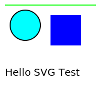

# About HTML
- **HTML stands for HyperText Markup Language**.
- It is the standard language used to create and design web pages on the internet.
- It was introduced by Tim Berners-Lee in 1991 at CERN as a simple markup language. Since then, it has evolved through versions from HTML 2.0 to HTML5 (the latest 2024 version).
- HTML is required because it forms the structure of web pages. Just like how a building needs a blueprint to be constructed, web pages need HTML to be displayed correctly on the internet.

## Why HTML is used in every browser?
- Hypertext Markup Language (HTML) is a standard language that all web browsers understand and use to structure and display content on web pages.
- HTML is universally supported by all web browsers, making it the go-to language for web content.
- HTML is a set of markup symbols or codes that tell browsers how to display text, images, and other multimedia.
- It's the foundation for all the content and design elements on a web page, including headings, paragraphs, and links.
- **Standardizes web pages**: Ensures that web pages look consistent across different browsers, which improves the user experience.
- **Simplifies development**: Makes it easier to develop web pages.
- **Guarantees accessibility**: Ensures that web pages are accessible to all users, regardless of their preferred browser.

## Is HTML a programming language or a scripting language?
- HTML is neither a programming language nor a scripting language. Instead, it is a markup language. Here’s what that means:
  - **1. Markup Language**: HTML uses **tags** to mark up the content of a document, indicating what each part of the document is (headings, paragraphs, links, images, etc.). It describes the structure and layout of a web page without containing any logic or behavior.
  - **2. No Logic or Algorithms**: Unlike programming languages (like Python, Java, C++), HTML doesn’t perform calculations, control flow (like loops and conditionals), or handle user interactions. It simply defines the structure and content of the web page.
  - **3. No Scripting**: Scripting languages (like JavaScript) are used to create dynamic and interactive web content. While HTML structures the content, scripting languages add behavior and interactivity.

## Purpose of HTML 
- The main purpose of HTML is to structure content on the web. It allows you to:
  - Organize text into headings, paragraphs, lists, etc.
  - Embed images, videos, and other multimedia.
  - Create links to navigate between pages.
  - Formulate tables and forms for data entry.

## How HTML works with browser?
- HTML uses **tags**, which are words surrounded by angle brackets (< >). These tags tell the browser what kind of content to display. For example, the tag `<h1>` defines a heading, and `<strong>` makes text bold.

### Tags and Elements
- HTML uses tags to create elements. Tags are enclosed in angle brackets like `<tagname>`. An element usually consists of an opening tag `<tagname>`, content, and a closing tag `</tagname>`. Some tags, like ``, are self-closing and don’t need a closing tag.
- The file extension for HTML files is .html. Sometimes you might also see the .htm extension, but .html is more commonly used today.
- A simple example of HTML
``` 
<!DOCTYPE html>
<html>
<head>
    <title>My First Web Page</title>
</head>
<body>
    <h1>Welcome to My Website</h1>
    <p>This is my first paragraph.</p>
    <a href="https://www.example.com">Click here to visit Example.com</a>
</body>
</html>
```
- Click [here](https://htmlpreview.github.io/?https://github.com/codophilic/Learn-HTML-And-CSS/blob/main/HTML/simple.html) to preview this sample html content.

## How HTML Works with Other Technologies
- While HTML is used for structure, it often works in combination with other technologies.

### CSS (Cascading Style Sheets):
- Used alongside HTML to style and layout web pages. CSS controls the visual appearance, including colors, fonts, and spacing.

### JavaScript:
- A scripting language used to make web pages interactive. JavaScript can manipulate the HTML structure dynamically, handle events, and create animations.

### Backend Languages: 
- Languages like PHP, Python, Ruby, and Java run on the server to handle the logic, data processing, and database interactions, then output HTML to be sent to the browser.

## Analogy with Real time examples
- HTML forms the skeleton of your web page, just like the framework of a building. It defines the structure and content.
- Each HTML element (like headings, paragraphs, images, links) is like a room or wall, giving shape and layout to your content.
- CSS is responsible for the look and feel of your web page, much like paint, wallpaper, and decorations in a building.
- CSS also controls the layout, such as where each room (HTML element) is placed, similar to how furniture and decor are arranged in a building.
- CSS defines fonts, text sizes, and other visual aesthetics, akin to the textures and finishes in interior design.
- JavaScript adds interactive features to your web page, just like lifts, alarms, and security systems in a building.
- JavaScript can change the HTML and CSS dynamically, updating the content and style in real time, much like smart home systems adjust lighting or temperature based on certain conditions.
- HTML structures the content, CSS styles and beautifies it, and JavaScript adds interactivity and functionality, creating a complete, user-friendly web experience.

## Contents of the HTML document
- **`<!DOCTYPE html>`**: This is a document type declaration. It tells the web browser what version of HTML the document is written in.Declaring **`<!DOCTYPE html>`** ensures that the browser will render the page in standards mode, which helps ensure that the page is displayed consistently across different browsers.
- **`<html>`**:This is the root element of an HTML document. It wraps all the content on the web page.It indicates the beginning and end of the HTML document.
- **`<head>`**: This element contains meta-information about the HTML document. This includes the title, links to stylesheets, metadata, scripts, and more.The information inside the **`<head>`** is not displayed directly on the web page, but it is crucial for rendering the page correctly and for SEO (Search Engine Optimization), accessibility, and performance.
- **`<title>`**: This element sets the title of the HTML document.The content of the **`<title>`** tag is displayed on the browser's title bar or tab. It is also used by search engines to identify the page, and it's what is displayed as the clickable headline in search engine results.
- **`<body>`**: This element contains all the content that is displayed to the user on the web page. This includes text, images, links, videos, etc. Everything inside the **`<body>`** tag is rendered by the browser and shown on the web page. This is where you place all the visible content of your web page.
- **`<h1>`**: This is a heading tag. It represents the main heading of the page. It is typically used for the most important heading. There are six levels of headings (**`<h1> to <h6>`**), with **`<h1>`** being the most important and **`<h6>`** the least.
- **`<p>`**: This is a paragraph tag. The **`<p>`** tag is used to define a block of text as a paragraph. It adds a space above and below the text, creating a clear separation between different blocks of content.
- Learn different types of HTML.


```
<!DOCTYPE html>
<html>
<head>
    <title>This is a page title</title> <!-- Page Title -->
        <style>
        table {
            width: 100%;
            border-collapse: collapse;
        }
        th, td {
            border: 1px solid #ddd;
            padding: 8px;
            text-align: left;
        }
        th {
            background-color: #f2f2f2;
        }
    </style>
</head>
<br>
<!-- To identify every element we have an attributed id -->
    <h1 id="h1Id">H1</h1> <!-- Heading 1 or main heading -->
    <h2>H2</h2> <!-- Heading 2 -->
    <h3>H3</h3> <!-- Heading 3 -->
    <h4>H4</h4> <!-- Heading 4 -->
    <h5>H5</h5> <!-- Heading 5 -->
    <h6>H6</h6> <!-- Heading 6 -->
    <h7>H7</h7> <!-- Invalid tag , but HTML will render the content inside of this invalid tag, 
    but they will not apply any specific styling or semantics associated with valid heading tags. -->
    <p>This is my first paragraph.</p>
    <p>This is my second paragraph. This is how the words are made <b>bold</b> and <i>italic</i>. <br/> break the line within the same paragraph</p>
<pre><!--Preformatted tag: It is used to display text exactly as it is written in the HTML code, preserving all spaces and line breaks. This is especially useful for displaying code, ASCII art, or any text where the formatting (spaces, tabs, line breaks) needs to be maintained.-->
This is an example of
preformatted text.
        Notice how spaces and line breaks
        are preserved.
</pre>

<!-- Adding Images in web page 
Attributes of the  Tag - self closing tag
src (source): Specifies the path to the image file. This can be a relative path, an absolute path, or a URL to an external image.
alt (alternative text): Provides alternative text for the image if it cannot be displayed. This is important for accessibility and for search engines to understand the content of the image.
width: Specifies the width of the image (in pixels or as a percentage).
height: Specifies the height of the image (in pixels or as a percentage).
title: Provides additional information about the image, typically displayed as a tooltip when the user hovers over the image.
loading: Indicates how the browser should load the image (lazy for lazy loading, eager for loading immediately). 
-->


<br/> <!-- Break tag -->
<!-- Ordered List : An ordered list is used to create a list of items that are in a specific sequence. Items in an ordered list are typically displayed with numbers or in alphabets-->
Ordered List examples:
<ol>
    <li>First item</li>
    <li>Second item</li>
    <li>Third item</li>
</ol>
Ordered List examples starting with Roman numbers:
<ol type="I">
    <li>First item</li>
    <li>Second item</li>
    <li>Third item</li>
</ol>
<ol type="i">
    <li>First item</li>
    <li>Second item</li>
    <li>Third item</li>
</ol>
Ordered List starting with 5:
<ol start="5">
    <li>Fifth item</li>
    <li>Sixth item</li>
    <li>Seventh item</li>
</ol>
Ordered List starting with Alphabets:
<ol type="A">
    <li>1</li>
    <li>2</li>
    <li>3</li>
</ol>
<ol type="a">
    <li>1</li>
    <li>2</li>
    <li>3</li>
</ol>
Ordered List Reversed:
<ol reversed>
    <li>Third item</li>
    <li>Second item</li>
    <li>First item</li>
</ol>

<!-- Unordered List: An unordered list is used to create a list of items that do not have a specific sequence. Items in an unordered list are typically displayed with bullet points.-->
Unordered List:
<ul>
    <li>Item 1</li>
    <li>Item 2</li>
    <li>Item 3</li>
</ul>
Unordered List with list as square :
<ul type="square">
    <li>Item 1</li>
    <li>Item 2</li>
    <li>Item 3</li>
</ul>
Unordered List with list as circle :
<ul type="circle">
    <li>Item 1</li>
    <li>Item 2</li>
    <li>Item 3</li>
</ul>

Nested Ordered and Unordered list example:
<h1 id="myschedule">My Weekly Schedule</h1>
    <ol>
        <li>Monday
            <ul>
                <li>Morning: Jogging</li>
                <li>Afternoon: Work</li>
                <li>Evening: Reading</li>
            </ul>
        </li>
        <li>Tuesday
            <ul>
                <li>Morning: Yoga</li>
                <li>Afternoon: Work</li>
                <li>Evening: Cooking Class</li>
            </ul>
        </li>
        <li>Wednesday
            <ul>
                <li>Morning: Gym</li>
                <li>Afternoon: Work</li>
                <li>Evening: Movie Night</li>
            </ul>
        </li>
        <li>Thursday
            <ul>
                <li>Morning: Swimming</li>
                <li>Afternoon: Work</li>
                <li>Evening: Dinner with Friends</li>
            </ul>
        </li>
        <li>Friday
            <ul>
                <li>Morning: Meditation</li>
                <li>Afternoon: Work</li>
                <li>Evening: Game Night</li>
            </ul>
        </li>
        <li>Saturday
            <ul>
                <li>Morning: Hiking</li>
                <li>Afternoon: Relaxation</li>
                <li>Evening: Family Time</li>
            </ul>
        </li>
        <li>Sunday
            <ul>
                <li>Morning: Church</li>
                <li>Afternoon: Brunch</li>
                <li>Evening: Planning for Next Week</li>
            </ul>
        </li>
    </ol>

<!-- Block and Inline Elements
Block Elements: 
- Block-level elements typically start on a new line and occupy the full width available to them. They create "blocks" of content on a web page. 
- Some common block-level elements include <div>, <p>, <h1> to <h6>, <ul>, <ol>, <li>, <table>, <form>, and more. 

Key Characteristics of Block-Level Elements:
- They typically start on a new line.
- They occupy the full width available to them by default (unless specified otherwise).
- You can set the width, height, margin, and padding properties.
- They can contain other block-level and inline elements.

Inline Elements:
- Inline elements do not start on a new line and only occupy as much width as necessary. 
- They flow alongside adjacent elements (if there's space) and do not disrupt the flow of the surrounding content. Examples of inline elements include <span>, <a>, <strong>, <em>, , <input>, <button>, and more.

Key Characteristics of Inline Elements:
- They do not start on a new line; they flow inline with the rest of the content.
- They occupy only as much width as necessary.
- You can't set the width and height properties (though you can set padding and margin on some).
- They can contain other inline elements and text.

When to use?
Block-Level Elements: 
- Use block-level elements when you want to create distinct sections or blocks of content that start on new lines and typically occupy the full width available.

Inline Elements: 
- Use inline elements when you want to style smaller parts of text or elements that should flow inline with surrounding content, like links (<a>), emphasis (<em>), or spans of text with specific styles.

-->

Block Elements
<p style="background-color: aqua;">Took whole width</p>
<div style="background-color: bisque;"> Took whole width </div>
<h2 style="background-color: bisque;"> Took whole width </h2>

Inline Elements
<span style="background-color: blue;">Hello</span><span style="background-color: blueviolet;">World</span>


<!-- Adding Hyperlink in web page
- Adding hyperlinks (or links) to a web page in HTML is done using the <a> (anchor) element. 
- To create a basic hyperlink that directs users to another web page or resource, use the <a> element with the href attribute:
- To open a link in a new browser tab or window, use the target="_blank" attribute
- You can also create links that navigate to different sections of the same web page using the id attribute
- You can also redirect to a url by clicking on image
- Using anchor tag we can redirect to our own html files
-->
<ul>
    <li><a href="https://www.example.com" target="_blank">Example Website</a></li>
    <li><a href="https://www.wikipedia.org" target="_blank">Wikipedia</a></li>
    <li><a href="https://www.github.com" target="_blank">GitHub</a></li>
</ul>
<a href="#myschedule">Redirect to my schedule details</a>
<a href="https://example.com">
    
</a>
<br/>
<a href="simple.html" target="_blank"> my simple html</a>
<br/>

<!-- 
Semantic Tags
- Semantic tags in HTML are elements that clearly describe their meaning in a human- and machine-readable way. They provide context to the content they enclose. Some common semantic tags include:
<header>: Represents introductory content at the beginning of a section or webpage. Typically contains headings, logos, navigation menus, etc.
<nav>: Defines a section of navigation links. Used for menus, tables of contents, etc.
<main>: Specifies the main content of the document. Should not be nested within <article>, <aside>, <footer>, <header>, or <nav>.
<section>: Represents a thematic grouping of content, typically with a heading. Used to divide content into sections that can be styled or manipulated as a unit.
<article>: Represents a complete, or self-contained, piece of content that could stand independently. Examples include blog posts, news articles, comments, etc.
<aside>: Defines content aside from the content it is placed in. Often used for sidebars or tangentially related content.
<footer>: Represents a footer for its nearest section or the document. Typically contains information about the author, copyright data, contact information, etc.
<figure> and <figcaption>: Used together to mark up self-contained content, such as images, diagrams, illustrations, etc., with a caption.

Structural Elements
- Structural elements in HTML are non-semantic elements that help organize the layout and structure of a web page. They include:
<div>: A generic container for grouping elements. Used for styling purposes and to group elements for styling or scripting.
<span>: A generic inline container for grouping inline elements. Similar to <div>, but for inline content.
<section>, <article>, <aside>, <header>, <footer>, <nav>, <main>: These are both semantic and structural elements, as they provide structure to the document while also conveying their specific meaning.

Structural Elements just define the structure of HTML page but it does not help browsers to render what kind of the data is present.
Semantic tags not only define the structure of HTML page but it also help browsers to understand of kind of data is to be presented, how importance the data is, which is navigation and which are main contents etc.

While there is overlap between semantic tags and structure elements, the distinct advantages of semantic HTML—improved accessibility, SEO (Search Engine Optimization) benefits, clearer code structure, and adherence to best practices—justify their use and separate existence. By leveraging semantic tags appropriately, you enhance the usability and maintainability of your web pages while ensuring they are accessible to all users and well-understood by search engines.
    -->

<header>
    <h1>Website Header</h1>
    <p>Welcome to our website!</p>
</header>

<nav>
    <ul>
        <li><a href="#">Home</a></li>
        <li><a href="#">About Us</a></li>
        <li><a href="#">Services</a></li>
        <li><a href="#">Contact</a></li>
    </ul>
</nav>

<main>
    <section>
        <h2>Section 1</h2>
        <p>This is the content of section 1.</p>
    </section>
    
    <section>
        <h2>Section 2</h2>
        <article>
            <h3>Article Title</h3>
            <p>Content of the article.</p>
        </article>
        
        <aside>
            <h3>Aside Content</h3>
            <p>Additional information related to the main content.</p>
        </aside>
    </section>
</main>

<footer>
    <p>&copy; 2024 My Website. All rights reserved.</p>
</footer>

<br/>
<!--
Collapse Content using Details and Summary tag
- The <summary> and <details> tags in HTML are used together to create a collapsible and expandable section of content, often referred to as an "accordion" or "collapsible panel". 
- This feature allows you to hide content behind a summary or heading, revealing it only when the user chooses to interact with it.

<details> Tag
- The <details> tag is used to specify a disclosure widget or a nested set of disclosure widgets. 
- It represents a disclosure widget from which the user can obtain additional information or controls. The content of the <details> element is initially hidden and can be shown or hidden by the user.

-->

<details>
    <summary>Click to expand</summary>
    <p>Additional content goes here...</p>
</details>

<!-- Create Table 
HTML Table Tags
<table>: This tag defines a table container that holds all the table elements.

<caption>: Optional. Provides a title or caption for the table.

<thead>, <tbody>, <tfoot>: These tags group the table rows (<tr>) into three main sections:

<thead>: Contains the header rows of the table.
<tbody>: Contains the main content rows of the table.
<tfoot>: Contains the footer rows of the table.
<tr>: Defines a table row. It contains one or more <th> or <td> elements.

<th>: Defines a header cell in a table. It's typically used within <thead> but can also be used within <tbody> or <tfoot> for special headers.

<td>: Defines a standard data cell in a table. It represents each individual cell of data in the table.

When we include styles we get proper border line and padding details just like a table structure

    -->

<h2>Employee Information</h2>

<table>
    <caption>Employee List</caption>
    <thead>
        <tr>
            <th>ID</th>
            <th>Name</th>
            <th>Department</th>
            <th>Position</th>
        </tr>
    </thead>
    <tbody>
        <tr>
            <td>001</td>
            <td>John Doe</td>
            <td>Marketing</td>
            <td>Manager</td>
        </tr>
        <tr>
            <td>002</td>
            <td>Jane Smith</td>
            <td>Human Resources</td>
            <td>HR Specialist</td>
        </tr>
        <tr>
            <td>003</td>
            <td>Michael Johnson</td>
            <td>Finance</td>
            <td>Financial Analyst</td>
        </tr>
    </tbody>
    <tfoot>
        <tr>
            <td colspan="4">Total Employees: 3</td>
        </tr>
    </tfoot>

</table>


<table>
    <caption>Employee List</caption>
    <thead>
        <tr>
            <th>ID</th>
            <th>Name</th>
            <th>Department</th>
            <th>Position</th>
        </tr>
    </thead>
    <tbody>
        <tr>
            <td>001</td>
            <td>John Doe</td>
            <td rowspan="2">Marketing</td>
            <td>Manager</td>
        </tr>
        <tr>
            <td>002</td>
            <td>Jane Smith</td>
            <td>HR Specialist</td>
        </tr>
        <tr>
            <td>003</td>
            <td>Michael Johnson</td>
            <td>Finance</td>
            <td>Financial Analyst</td>
        </tr>
    </tbody>
    <tfoot>
        <tr>
            <td colspan="4">Total Employees: 3</td>
        </tr>
    </tfoot>
</table>

<h2>Products Information</h2>

<table>
    <caption>Product Catalog</caption>
    <thead>
        <tr>
            <th>Image</th>
            <th>Product Name</th>
            <th>Description</th>
            <th>Price</th>
        </tr>
    </thead>
    <tbody>
        <tr>
            <td></td>
            <td class="title">Product 1</td>
            <td>Lorem ipsum dolor sit amet, consectetur adipiscing elit. Sed non urna ut erat pretium aliquet.</td>
            <td>$19.99</td>
        </tr>
        <tr>
            <td></td>
            <td class="title">Product 2</td>
            <td>Nulla facilisi. Mauris sed velit eget purus iaculis posuere.</td>
            <td>$29.99</td>
        </tr>
        <tr>
            <td></td>
            <td class="title">Product 3</td>
            <td>Etiam eu lectus nec leo porttitor vehicula. In non velit ac libero commodo efficitur.</td>
            <td>$24.99</td>
        </tr>
    </tbody>
    <tfoot>
        <tr>
            <td colspan="4">Total Products: 3</td>
        </tr>
    </tfoot>
</table>

<table>
    <caption>Images Catalog</caption>

    <tbody>
        <tr>
            <div>
                
            </div>
        </tr>
        <tr>
            <div>
                
            </div>
        </tr>
        <tr>
            <div>
                
            </div>
        </tr>
    </tbody>

</table>

<!-- Forms in HTML
An HTML form is used to collect user input, such as text input, checkboxes, radio buttons, and submit buttons, which can then be sent to a server for processing. Here’s an overview of HTML form tags and their usage, along with an example of a login page:

HTML Form Tags
<form>: Defines the beginning and end of an HTML form.
<input>: Represents an interactive control in an HTML form, such as text input, checkboxes, radio buttons, etc.
<label>: Defines a label for an <input> element.
<button>: Defines a clickable button, typically used to submit the form data to the server.
<select>: Creates a dropdown list.
<option>: Defines an option in a dropdown list (<select>).
<textarea>: Defines a multiline input control (text area) for text input.
<fieldset>: Groups related elements in a form and provides a border and optional legend.
<legend>: Defines a caption for the <fieldset> element.

HTTP (Hypertext Transfer Protocol) supports several methods for communicating between a client (such as a web browser) and a server. Two common methods used in web development are GET and POST. These methods differ in how they handle and transmit data, and they can affect the structure of the URL.

GET Method
Usage: The GET method is used to request data from a specified resource.
Data Transmission: Data is appended to the URL as parameters (key=value pairs) in the query string.
Visible: Parameters are visible to everyone in the URL.
Security: Not suitable for sensitive data (like passwords), as they are visible in the URL.
Idempotent: Operations are idempotent, meaning multiple identical requests should have the same effect as a single request.
Cacheable: Responses can be cached by browsers and intermediaries.

POST Method
Usage: The POST method is used to submit data to be processed to a specified resource.
Data Transmission: Data is sent in the body of the HTTP request, not visible in the URL.
Security: Suitable for sensitive data, as it does not appear in the URL.
Not Idempotent: Operations are not idempotent; repeating the same request may have different effects.
Not Cacheable: Responses are typically not cached, although caching is possible with proper headers.

When to Use Each Method
GET:
Use GET when the request is safe and idempotent (repeating the request has no additional effect).
Use for retrieving data from the server.
Use for requests that can be cached.
Use when parameters can be added to the URL for bookmarking or sharing.
POST:
Use POST when the request has side effects (such as updating data).
Use for submitting forms with sensitive data (like passwords).
Use when the amount of data is large (since there are no size limitations on POST data).

URL Impact
GET: Parameters are visible in the URL's query string, affecting readability and potentially bookmarking.
POST: Parameters are not visible in the URL, which can enhance security for sensitive data.

The action attribute usually specifies a URL where the form data is submitted. 
This URL can point to a server-side script written in languages like PHP, Python, Ruby, Node.js, etc., 
or it can be an API endpoint that processes the submitted data or html file like success or failure
-->

<form action="simple.html" method="post">
    <div>
        <label for="username">Username:</label>
        <input type="text" placeholder="full name" autofocus id="username" name="username" required>
    </div>
    <div>
        <label for="password">Password:</label>
        <input type="password" id="password" name="password" required>
    </div>
    <div>
        <label for="age">Age:</label>
        <input type="number" max="36" min="20" id="age" name="age" required>
    </div>
    <div>
        <label>Gender:</label>
        <input type="radio" id="male" name="gender" value="male" checked>
        <label for="male">Male</label>
        <input type="radio" id="female" name="gender" value="female">
        <label for="female">Female</label>
    </div>
    <div>
        <label for="browser">Choose a browser:</label>
        <input list="browsers" id="browser" name="browser" placeholder="Choose or enter a browser...">
        <datalist id="browsers">
            <option value="Chrome">
            <option value="Firefox">
            <option value="Safari">
            <option value="Edge">
            <option value="Opera">
        </datalist>
    </div>
    <div>
        <label for="date">Select a date:</label>
        <input type="date" id="date" name="date">
    </div>
    <div>
        <label for="interests">Interests:</label><br>
        <input type="checkbox" id="music" name="interests" value="music">
        <label for="music"> Music</label><br>
        <input type="checkbox" id="sports" name="interests" value="sports">
        <label for="sports"> Sports</label><br>
        <input type="checkbox" id="movies" name="interests" value="movies">
        <label for="movies"> Movies</label><br>
    </div>
    <div>
        <label for="country">Country:</label>
        <select id="country" name="country">
            <option value="usa">USA</option>
            <option value="canada">Canada</option>
            <option value="uk">UK</option>
            <option value="australia">Australia</option>
            <option value="japan">Japan</option>
        </select>
    </div>
    <div>
        <label for="description">Description:</label><br>
        <textarea id="description" name="description" rows="4" cols="30" placeholder="Enter your description"></textarea>
    </div>
    <div>
        <input type="submit" value="Submit">
        <input type="reset" value="Reset">
    </div>
</form>

<!-- Add video/audio in HTML
Adding Video with Sound
HTML <video> Element:

Use the <video> element to embed a video file. Specify the source (src) of the video using the src attribute.
Include controls (controls) attribute to show playback controls (play, pause, volume, etc.).
If you want sound to play along with the video, ensure the video file has an audio track.
autoplay: Automatically starts playback of the video when the page loads.
Other attributes like loop, muted, preload can be used to control loop playback, mute audio, and preload behavior.
-->
<video controls autoplay="false" muted height="200"  width="400">
    <source src="MarshMallowFly.mp4" type="video/mp4" height="200" width="200">
    Your browser does not support the video tag or the file format of this video.
</video>

Play Youtube Video
<iframe src="https://www.youtube.com/embed/ALZHF5UqnU4" ></iframe>

<!--Inserting SVG Files-->

</br>

<svg width="2000" height="300">
<circle cx="100" cy="70" r="90" stroke="black"  stroke-width="2" fill="#ffe0bd" />
<circle cx="50" cy="80" r="30" stroke="black" stroke-width="20" fill="rgb(0,255,255)" /> Sorry your browser does not support SVG
<circle cx="150" cy="80" r="30" stroke="black" stroke-width="20" fill="rgb(0,255,255)" /> Sorry your browser does not support SVG
<ellipse cx="100" cy="30" rx="90" ry="50" stroke="black" stroke-width="2" fill="yellow" />
<text x="10" y="150" font-family="Verdana" font-size="20" fill="black">Embeded SVG Contents in HTML, Power Puff girl</text>

</svg>

</body>
</html>
```

# SVG (Scalable Vector Graphics)
- SVG defines vector-based graphics in XML format.
- SVG stands for Scalable Vector Graphics. It is a markup language for describing two-dimensional vector graphics. Unlike raster graphics formats like JPEG or PNG, which store images as a grid of pixels, SVG uses mathematical descriptions to define shapes, paths, and colors. This allows SVG images to be scaled to any size without losing quality, making them ideal for responsive web design and high-resolution displays.
- SVG is supported by all major browsers.
- There are several reasons why you might want to use SVG:
  - Scalability: As the name suggests, SVG graphics are scalable without losing quality. This means they look crisp and clear at any size, making them perfect for responsive web design where images need to adapt to different screen sizes and resolutions.
  - Small file size: SVG files are typically smaller in size compared to raster image formats like JPEG or PNG, especially for simple graphics. This can lead to faster loading times for web pages, which is crucial for improving user experience and SEO.
  - Editability: SVG files are text-based and can be easily edited with a text editor or graphic design software. This makes it simple to customize and manipulate SVG images, such as changing colors, shapes, or adding animations.
  - Accessibility: SVG images can be made accessible to users with disabilities by adding descriptive text or metadata. This is important for ensuring that all users can access and understand the content of your website.
  - Interactivity: SVG supports interactivity through JavaScript, allowing you to create dynamic and engaging graphics. You can add animations, hover effects, and interactive elements to SVG images to enhance user engagement.
- SVG is a W3C (The World Wide Web Consortium (W3C) develops standards and guidelines to help everyone build a web based on the principles of accessibility, internationalization, privacy and security.) standard, ensuring that it is consistently supported across all modern web browsers.
- A Scalable Vector Graphic (SVG) is a unique type of image format. Unlike other varieties, SVGs don’t rely on unique pixels to make up the images you see. Instead, they use ‘vector’ data. By using SVGs, you get images that can scale up to any resolution, which comes in handy for web design among plenty of other use cases.
- SVG is a vector-based format, meaning it uses geometrical primitives such as points, lines, curves, and shapes (polygons) to represent images. Whereas JPEG and PNG are raster-based formats, meaning they use a grid of individual pixels to represent images.

| Feature                     | SVG (Scalable Vector Graphics)                                         | JPEG (.jpg)                                                   | PNG (.png)                                                             |
| --------------------------- | ---------------------------------------------------------------------- | ------------------------------------------------------------- | ---------------------------------------------------------------------- |
| Format Type                 | Vector-based                                                           | Raster-based                                                  | Raster-based                                                           |
| Scalability                 | Infinite scalability without loss of quality                           | Limited scalability; can become pixelated                     | Limited scalability; can become pixelated                              |
| File Size                   | Typically small for simple images; can increase with complexity        | Compressed, generally smaller size but with lossy compression | Larger due to lossless compression                                     |
| Editability                 | Editable with text editors and graphic software                        | Requires graphic software; edits involve pixels               | Requires graphic software; edits involve pixels                        |
| Interactivity and Animation | Supports interactivity and animation through CSS, JavaScript, and SMIL | Does not support interactivity or animation natively          | Does not support interactivity or animation natively                   |
| Transparency                | Fully supports transparency                                            | Does not support transparency                                 | Fully supports transparency                                            |
| Color Support               | Unlimited colors                                                       | Limited to 16.7 million colors (24-bit)                       | Unlimited colors (supports 24-bit and 32-bit color)                    |
| Use Cases                   | Icons, logos, charts, maps, illustrations                              | Photographic images, web images where compression is key      | Web graphics, images requiring transparency and detailed illustrations |
| Compression                 | Can be compressed with gzip                                            | Lossy compression                                             | Lossless compression                                                   |
| Search Engine Friendly      | Text-based and searchable                                              | Not searchable                                                | Not searchable                                                         |
| Resolution Independence     | Yes                                                                    | No                                                            | No                                                                     |
| Accessibility               | Can be made accessible with attributes and descriptions                | Limited accessibility                                         | Limited accessibility                                                  |
| Browser Compatibility       | Supported by all modern browsers                                       | Supported by all modern browsers                              | Supported by all modern browsers                                       |


- Lets learn about [CSS](https://github.com/codophilic/Learn-HTML-CSS-JS/blob/main/CSS/Theory.md)