# JavaScript (JS)


- Let take a simple analogy.
- HTML forms the skeleton of your web page, just like the framework of a building. It defines the structure and content. Each HTML element (like headings, paragraphs, images, links) is like a room or wall, giving shape and layout to your content.
- CSS is responsible for the look and feel of your web page, much like paint, wallpaper, and decorations in a building. CSS also controls the layout, such as where each room (HTML element) is placed, similar to how furniture and decor are arranged in a building. CSS defines fonts, text sizes, and other visual aesthetics, akin to the textures and finishes in interior design.
- JavaScript adds interactive features to your web page, just like lifts, alarms, and security systems in a building. JavaScript can change the HTML and CSS dynamically, updating the content and style in real time, much like smart home systems adjust lighting or temperature based on certain conditions.
- **HTML structures the content, CSS styles and beautifies it, and JavaScript adds interactivity and functionality, creating a complete, user-friendly web experience**.
- When you see buttons, animations, or pop-up messages on a website, that’s likely JavaScript at work. It allows web developers to add behaviors to web pages, making them more than just static content like text and images.
- **JavaScript is both a scripting and programming language**.

## What does Scripting language means?

- A scripting language is a type of programming language that is usually used to write short programs (called scripts) that control the behavior of another software program. Instead of building standalone applications, scripting languages are often used to make things happen inside an existing environment, like a web browser or a server.

<details> 

<summary> What does interpreted means? </summary>

- An interpreted language means the code is read and executed line-by-line by another program called an interpreter, instead of being fully converted into machine code (compiled) before it runs.
- In contrast, a compiled language (like C or Java) requires the entire program to be translated into machine code (the language the computer understands) all at once before it can run. Interpreted languages are usually faster to test and run in small pieces, but may be slower in performance than compiled languages for large, complex tasks.

</details><br>


- JavaScript is a scripting language because it's interpreted, meaning it can run as is without any extra steps. Scripting languages are often easier to learn and write than programming languages.
- JavaScript is called a scripting language because it is designed to be run directly by another program (like a web browser), rather than needing to be compiled into a separate executable file first. In simple terms, a scripting language lets you write small programs (scripts) that are quickly and easily executed to perform tasks, often automating things. For example, in a browser, JavaScript scripts tell the browser how to behave—like responding to button clicks, updating content on the page, or showing animations—without the need for complex compilation steps.

## How is JS executed on browser?

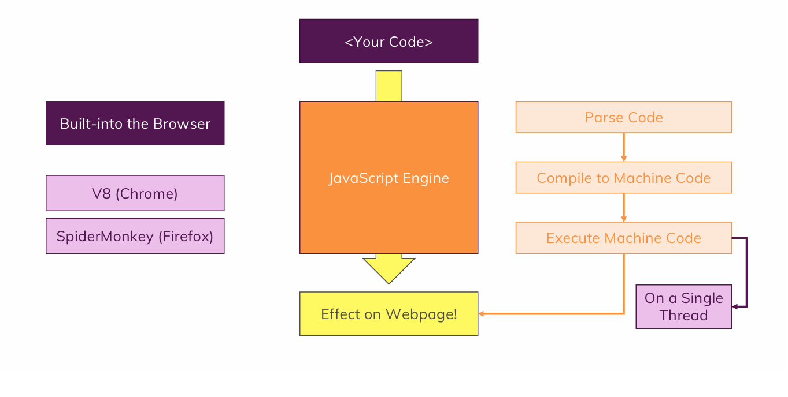

- Let's say you write your Javascript code and you want it to have some effect on the web page, if we talk about the browser as the environment where we run our script. Then you have one important thing built into any environment where you want to run Javascript code and that's a **Javascript engine**.
- The Chrome browser has V8 as its JS engine, in Firefox the name would be SpiderMonkey, Safari uses JavaScriptCore and of course other browsers also either reuse these engines or have their own engines. Now the job of the engine is to parse code or read the code and understand your JS code, then on the fly compile it to machine code because machine code executes faster, so it reads your code but it does not necessarily execute it like that but instead, it now takes that code and compiles it to code which is faster to execute by the machine and then it executes that machine code.
- This all happens in the browser with the help of the Javascript engine and then when that code is executed, we have that effect on our web page. All of these happens on a single thread.
- The Javascript code execution runs on one single thread.
- Hold on, we had **Javascript** is a scripting language where it only require interpreter. **Then why does Javascript engine compiles it?**
- **In Interpreted language, code is run line by line directly by another program (called an interpreter) without turning it into machine code**. Classic JavaScript runs directly in the browser, no need to compile it. 
- **In Compiled language the entire code is translated into machine code before it's run, making it faster during execution**. C and Java code must be fully compiled into machine language before the program can run.
- A scripting language (like JavaScript) was originally seen as "interpreted" because it, runs inside another program (the browser). Doesn't need to be compiled like traditional compiled languages.
- **In older browsers, JavaScript was fully interpreted—meaning, the browser executed it line by line without compiling it first.**
- **Modern browsers (like Chrome or Firefox) want JavaScript to run faster**. Interpreting code line by line is slow for big, complex websites. To improve performance, they now use Just-In-Time (JIT) compilation, which means:
    - The browser starts interpreting JavaScript as it always did.
    - But as it runs, the browser compiles some parts of the code into machine code (behind the scenes) to speed things up.
    - So, it starts out interpreted but uses on-the-fly compilation to make the code run faster.
- **It’s still called an interpreted scripting language because**:
    - You write the code, and it runs immediately (no manual compilation).
    - But to make it faster, browsers now secretly compile parts of the code while it's running.
- It's also important to note that the browser also gives you a couple of features, so-called **Browser APIs** which are built in, which you can use into from your Javascript code. This are some in-built APIs provided by browser for example for getting the user's location. These browser APIs are part of the browser, depending on the browser like Google Chrome which uses v8 as its JS Engine as this api written in C++ but again that depends on the browser you're using. 
- The browser gives you communication bridges via functions or object to call these in-built api in your JS code.


## Dynamic Interpreted and Weekly Typed Programming language


### Dynamic Interpreted

- To be more specific **Javascript is dynamic interpreted** , which means that it's not pre-compiled, other languages like C++ are compiled during or after development, so before you share them with the end users. Javascript is on-the-fly compiled and that means that the code is evaluated and executed at runtime, the code can change at runtime.

### Weekly Typed

- In Javascript you are allowed to dynamically switch the type of data there. In a variable, you might start by storing some text and suddenly at a later point of time, you store a number in there instead, in the same variable. Now switching the data of a variable other programming languages are not allowed to do like in Java or C++ but you can do that in Javascript,
- When we work with data in Javascript, for example text data or numbers, you don't have to tell Javascript that you're going to work with a text now or you're going to work with a number now, instead data types are assumed, are inferred automatically so to say, that's also related to this dynamic nature where data types can also change from one line to another. In other programming languages like Java or C++, you have to tell the language that you're variable will be a string or text or a number.

## Different Host Environments

- Javascript engine can be part or can be executed in different environments. The most well known environment is the browser, modern browsers have Javascript engines built in and they're therefore capable of executing Javascript code but you also can run Javascript in other environments, for example on the server side, so right on a computer without having a browser in between, so not inside of a browser but simply execute code on your machine.
- Now Javascript was invented to run in the browser, to make web sites more dynamic, to be able to change things on a web site without loading a new page you could say because Javascript is able to closely work together with the loaded HTML code, with CSS.
- You can also use Javascript to send background HTTP requests, so to send some behind the scenes requests and fetch data without reloading the page and much more.
- Now there also are certain things Javascript can't do when it runs in the browser environment though, for example it can't access your local file system for security reasons because otherwise every web page you visit would be able to read your file system, maybe delete files on your computer and so on
- JS does not interact with your operating system and so on, the browser gives you certain things you can do in its own environment and doesn't allow other things.
- **To run JavaScript, browser has JavaScript Engine, so to  to run Javascript anywhere we must have this JavaScript Engine. So if  we take it out of the browser and then make it available as a standalone tool which you can use to execute Javascript anywhere else directly on your machine and this tool is in the end called Node.js**.
- **Node.js** can be executed on any machine and therefore it's also often used to build web back-ends, to build web servers, server side

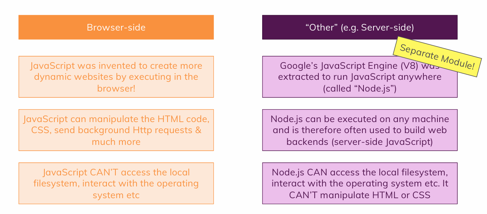

- There are two main environments where you can run JavaScript locally on your own machine:
    - Inside a Web Browser (like Chrome).
    - Using Node.js.

### Running JavaScript in a Browser (JavaScript Engine)

- When you run JavaScript inside a web browser (like Chrome, Firefox, or Safari). The JavaScript code runs on the JavaScript engine that is built into the browser.
    - Chrome uses the V8 engine.
    - Firefox uses the SpiderMonkey engine.
    - Safari uses the JavaScriptCore engine.
- These JavaScript engines are responsible for compiling and executing the JavaScript code directly in the browser. So, if you're running JS code locally in your browser (like via the developer console or in an HTML file), **it is executed by the browser's JavaScript engine, not Node.js.**

### Running JavaScript in Node.js

- **Node.js is a JavaScript runtime environment built on top of Chrome's V8 engine**. It's designed to allow JavaScript to run outside the browser, usually for building back-end services, servers, or running scripts.
- When you run JavaScript using Node.js on your computer, it still uses the V8 engine to execute the JavaScript code. However, Node.js provides extra features like access to the file system, network, and other system resources that browsers don't allow (since browsers are sandboxed for security).

<details> 

<summary> Whats sandboxed? </summary>

- Sandboxing means that web browsers keep the websites you visit in a safe, restricted area on your computer. This is done to protect your system from any harmful actions that the website's code (like JavaScript) might try to do. 
- Sandboxing means the browser isolates websites to keep them from doing harmful things to your computer. It’s a security feature that limits what websites can access on your system.

</details><br>

- So, if you're running JS code using Node.js, it uses the V8 engine, but it's not the same as running code inside a browser—Node.js provides more functionality for server-side applications.

## JavaScript vs Java

- There is nothing relationship between JavaScript and Java. In initial days when javascript was developed, Java was popular languages, so JavaScript was prefixed with Java just to make it sound cooler.

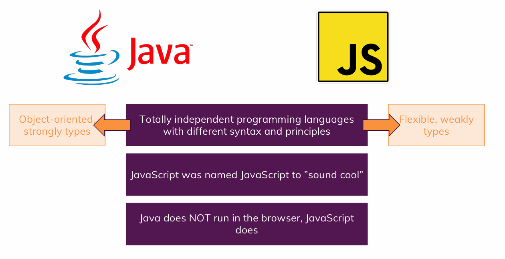


## History


- In 1995, Netscape introduces **LiveScript** which thereafter was renamed to Javascript. Now in 1996, Microsoft also released its own version of Javascript in Internet Explorer. Back then Javascript also wasn't able to do a lot of things, it was mainly used for a spam things, for annoying overlays and pop-ups but another problem was that you had to write very different scripts for different browsers.
- In late 1996, people saw that this fragmentation could be a problem and therefore, Javascript the language was submitted to the **ECMA committee to start standardization**. ECMA stands for European Computer Manufacturers Association. This simply is an organization which will stand responsible for standardizing Javascript so that you have one standard which then could be implemented by multiple browsers. So then we had ongoing standardization efforts until 2005 roughly and Microsoft did really join the party, well we know how Microsoft was in the late 90s, early 2000s, ultimately they supported the standardized Javascript version.  Now the efforts of standardization continue and we had huge progress until 2011. It's evolving, new features are getting added, it's getting a better and better programming language 
- We now have a standardized language which is really great to use and we have that thanks to this ECMA international organization. Now this organization in the end manages a language called **ECMAScript** 
- **ECMAScript provides the rules, guidelines, and standards for scripting languages like JavaScript, whereas JavaScript is the most well-known implementation of those rules**.
- It's like a blueprint or specification that describes how a scripting language should work. This standard ensures that different implementations (like JavaScript) follow the same set of rules, making them behave consistently across different platforms (browsers, servers, etc.).
- ECMAScript is the standard that defines how the core features of the language should work. JavaScript is a language that follows the ECMAScript standard but also has its own additional features.
- Other implementation are ActionScript or Jscript.
- Having a standard (ECMAScript) allows different browsers (like Chrome, Firefox, Safari) and environments (like Node.js) to run JavaScript consistently. So, whether you're running JavaScript in a browser or on a server, it follows the same basic rules.


**Lets Code**

- Here we will be running our code on chrome browser as it provides **developer tools** for debugging and many more using VSCode editor.
- Lets first create a **index.html** file and css file(**app.css**). This page is a simple calculator page.

```
<!DOCTYPE html>
<html lang="en">
  <head>
    <meta charset="UTF-8" />
    <meta name="viewport" content="width=device-width, initial-scale=1.0" />
    <meta http-equiv="X-UA-Compatible" content="ie=edge" />
    <title>Basics</title>
    <link
      href="https://fonts.googleapis.com/css?family=Roboto:400,700&display=swap"
      rel="stylesheet"
    />
    <link rel="stylesheet" href="assets/styles/app.css" />
  </head>
  <body>
    <header>
      <h1>The Unconventional Calculator</h1>
    </header>

    <section id="calculator">
      <input type="number" id="input-number" />
      <div id="calc-actions">
        <button type="button" id="btn-add">+</button>
        <button type="button" id="btn-subtract">-</button>
        <button type="button" id="btn-multiply">*</button>
        <button type="button" id="btn-divide">/</button>
      </div>
    </section>
    <section id="results">
      <h2 id="current-calculation">0</h2>
      <h2>Result: <span id="current-result">0</span></h2>
    </section>
  </body>
</html>
```

- The above code, is basically simple HTML with CSS we have not added JS over here.


- The css file is under **assets/styles** (following a standard convection where all the static contents like video, images, pdf, css files are kept under **assets** folder).
- Lets add some JavaScript code into our **index.html** file. So to add that we need to specify JS contents under script tag `<scripts></scripts>`.

```
<!DOCTYPE html>
<html lang="en">
  <head>
    <meta charset="UTF-8" />
    <meta name="viewport" content="width=device-width, initial-scale=1.0" />
    <meta http-equiv="X-UA-Compatible" content="ie=edge" />
    <title>Basics</title>
    <link
      href="https://fonts.googleapis.com/css?family=Roboto:400,700&display=swap"
      rel="stylesheet"
    />
    <link rel="stylesheet" href="assets/styles/app.css" />

    <!-- JavaScript code -->
    <script>
      alert("Hello!!!");
    </script>
  </head>
  <body>
    <header>
      <h1>The Unconventional Calculator</h1>
    </header>

    <section id="calculator">
      <input type="number" id="input-number" />
      <div id="calc-actions">
        <button type="button" id="btn-add">+</button>
        <button type="button" id="btn-subtract">-</button>
        <button type="button" id="btn-multiply">*</button>
        <button type="button" id="btn-divide">/</button>
      </div>
    </section>
    <section id="results">
      <h2 id="current-calculation">0</h2>
      <h2>Result: <span id="current-result">0</span></h2>
    </section>
  </body>
</html>
```

- Lets drag and drop our **index.html** file under chrome browser.

<video controls src="Images/basicofjs/20241001-1122-41.9592692.mp4" title="Title"></video>

- If you see we got a pop-up which says **Hello!!**. The `alert()` function gives a pop-up. If you see the rendering of the page, the JS feature `alert()` got loaded first then the HTML & CSS content got loaded later. What if you wanna render your HTML & CSS content first then your JS features? , do can add the `script` tag before the end of the body `</body>`.

```
<!DOCTYPE html>
<html lang="en">
  <head>
    <meta charset="UTF-8" />
    <meta name="viewport" content="width=device-width, initial-scale=1.0" />
    <meta http-equiv="X-UA-Compatible" content="ie=edge" />
    <title>Basics</title>
    <link
      href="https://fonts.googleapis.com/css?family=Roboto:400,700&display=swap"
      rel="stylesheet"
    />
    <link rel="stylesheet" href="assets/styles/app.css" />

  </head>
  <body>
    <header>
      <h1>The Unconventional Calculator</h1>
    </header>

    <section id="calculator">
      <input type="number" id="input-number" />
      <div id="calc-actions">
        <button type="button" id="btn-add">+</button>
        <button type="button" id="btn-subtract">-</button>
        <button type="button" id="btn-multiply">*</button>
        <button type="button" id="btn-divide">/</button>
      </div>
    </section>
    <section id="results">
      <h2 id="current-calculation">0</h2>
      <h2>Result: <span id="current-result">0</span></h2>
    </section>

    <!-- JavaScript code -->
    <script>
      alert("Sum is 660");
    </script>
  </body>
</html>
```

- This will load the HTML & CSS contents first then the JS features.

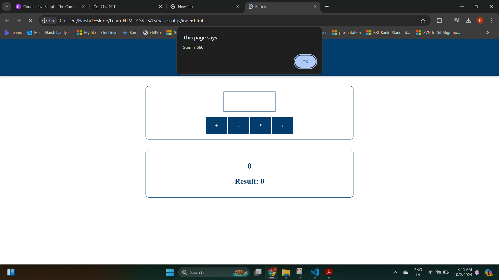

## Import JavaScript Files

Lets say you wanna add multiple JS feature, its a good practice to define all the JS related functionalities into a script file with an extension **.js** because when you develop a multiple page you may write several JS features so placing them into a single folder makes the code more readable. Since JS are static files we create a new folder with name as **scripts** under **assets**. Lets create a file name **app.js**.

```
app.js

alert('Hello!!!');
```

- Now we need to import this JS file into our `<script>` tag, since this is a source code for JS there is a attribute name `src` with import the file for the given path.

```
<!DOCTYPE html>
<html lang="en">
  <head>
    <meta charset="UTF-8" />
    <meta name="viewport" content="width=device-width, initial-scale=1.0" />
    <meta http-equiv="X-UA-Compatible" content="ie=edge" />
    <title>Basics</title>
    <link
      href="https://fonts.googleapis.com/css?family=Roboto:400,700&display=swap"
      rel="stylesheet"
    />
    <link rel="stylesheet" href="assets/styles/app.css" />

  </head>
  <body>
    <header>
      <h1>The Unconventional Calculator</h1>
    </header>

    <section id="calculator">
      <input type="number" id="input-number" />
      <div id="calc-actions">
        <button type="button" id="btn-add">+</button>
        <button type="button" id="btn-subtract">-</button>
        <button type="button" id="btn-multiply">*</button>
        <button type="button" id="btn-divide">/</button>
      </div>
    </section>
    <section id="results">
      <h2 id="current-calculation">0</h2>
      <h2>Result: <span id="current-result">0</span></h2>
    </section>
    <script src="assets/scripts/app.js"></script>

  </body>
</html>
```


- Lets create a another **app1.js**.

```
alert('Hi!!!');
```

- Lets import the **app1.js** script into our HTML file.

```
<!DOCTYPE html>
<html lang="en">
  <head>
    <meta charset="UTF-8" />
    <meta name="viewport" content="width=device-width, initial-scale=1.0" />
    <meta http-equiv="X-UA-Compatible" content="ie=edge" />
    <title>Basics</title>
    <link
      href="https://fonts.googleapis.com/css?family=Roboto:400,700&display=swap"
      rel="stylesheet"
    />
    <link rel="stylesheet" href="assets/styles/app.css" />

  </head>
  <body>
    <header>
      <h1>The Unconventional Calculator</h1>
    </header>

    <section id="calculator">
      <input type="number" id="input-number" />
      <div id="calc-actions">
        <button type="button" id="btn-add">+</button>
        <button type="button" id="btn-subtract">-</button>
        <button type="button" id="btn-multiply">*</button>
        <button type="button" id="btn-divide">/</button>
      </div>
    </section>
    <section id="results">
      <h2 id="current-calculation">0</h2>
      <h2>Result: <span id="current-result">0</span></h2>
    </section>
    <script src="assets/scripts/app.js"></script>
    <script src="assets/scripts/app1.js"></script>

  </body>
</html>
```

- When we reload our browser, both of our scripts gets executed.

<video controls src="Images/basicofjs/20241001-1206-54.7084265.mp4" title="Title"></video>

- Lets say change the order of script execution like below, first we will execute **app1.js** then **app.js**.

<video controls src="Images/basicofjs/20241001-1209-02.5438431.mp4" title="Title"></video>

- So the placing **order of script file matters**. Script will execute in the given sequential order.


>[!NOTE]
> - `<script/>` self closing tag will not work in case of JavaScript, you need to always define `<script></script>`.
> - Writing semi-colon(`;`) is optional in JavaScript. `alert("Hello!!")` will also work for getting up the pop-up.


## Variable & Constants

- So a variable is a data container which holds some data and in Javascript, we create a variable by using the **`let`** keyword followed by variable name and a initial value.

```
let username='Rahul';
username='Akshay';
```

- You can change the variable values during in your code or in your execution flow.
- Lets you wanna define a constant value, you can define that using **`const`** keyword in JS.

```
const pie=3.14;
```

- Constant is a data container but instead of with the **`let`** keyword, you create it with the **`const`** keyword.
- You cannot change the value of constant value

```
Error
pie=3.1;
```


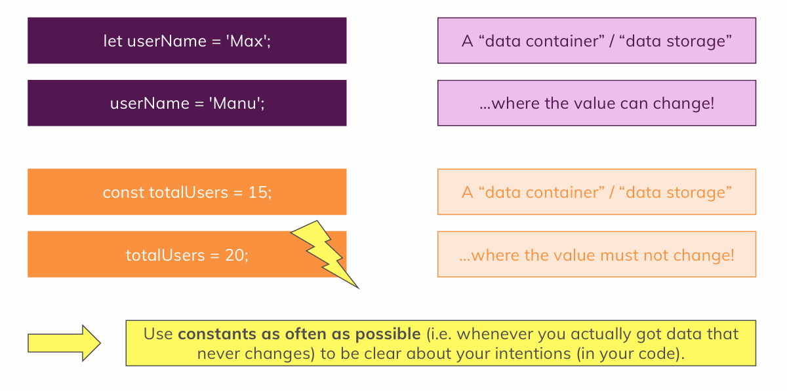


- You can simple just declare the variable and then later you can initialize it.

```
let VarName
VarName="later"
```

- For constant , you need to declare and initialize it. Below code will give error.

```
const AConstVar;
//Error - 'const' declarations must be initialized
```

## Variable Naming Convection

- JavaScript is case-sensitive in terms of variable name. If you create a variable name `username` and wanted to use this variable in your you cannot use it as `Username` or `userName` etc.. it must be exact `username`.

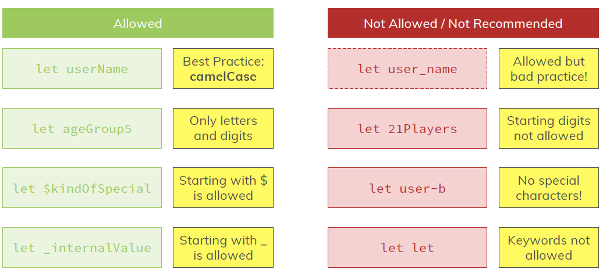


## Operators

- Operators are similar to performing mathematical operations on number. So using it, JavaScript provides us to manipulate the values of variables.


- Lets modify our **app1.js**


```
let alertVariable="Hi!!!!"
alert(alertVariable);
```

- We still get the same output.

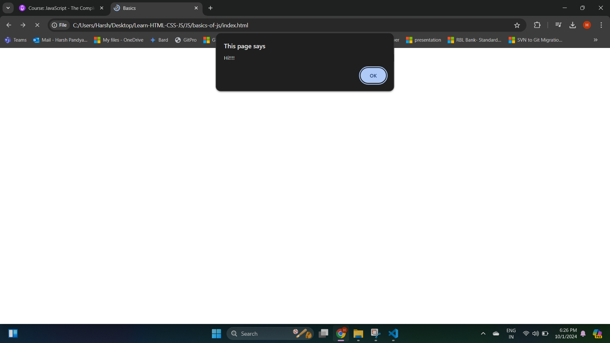


- In JavaScript , string value can be written in using single quote (**`''`**), double quote (**`""`**) and using backtick (**``**). Whatever you use ensure that you maintain the same string quote throughout your code.
- When we use the `+` operator with string value, it concatenates.


- Lets modify our **app1.js**


```
let alertVariable="Hi"
let alterVariable2='!!!!'
alert(alertVariable+alterVariable2);
```

- We still get the same output.


- JavaScript execute the code from top-bottom. It follows top-bottom approach. Below is valid string variable example.

```
let someLongString = 'Hi, this is going to be a bit longer, ' +
                     'so maybe split it across multiple lines by ' +
                     'concatenating multiple strings!';
```

- Below is invalid string variable example

```
let someLongString = 'Hi, this is going to be a bit longer, 
                      so maybe split it across multiple lines by 
                      concatenating multiple strings!';
```


- Consider below code in **app1.js**

```
let num1=10
let num2=20
let num3=num1+num2 //Adding numbers
let finalAns="Value - "+num3 //Concatenate String with Number
alert(finalAns)
```

- When we refresh the page.

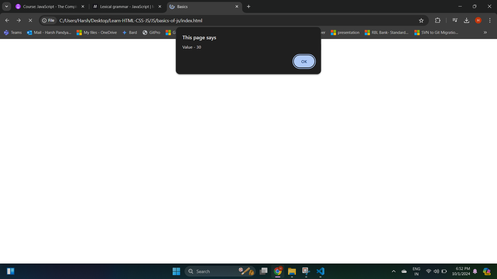

- JavaScript also supports pre/post increment and pre/post decrement operator.

```
let num1=1
num1++ //post increment operator
num1-- //post decrement operator
++num1 //pre increment operator
--num1 //pre decrement operator
```

- Pre-increment operator and post-increment operator difference

```
let num1=1
let num2=num1++ // num2=1, so post increment first assign the value to num2 then increments the value of num1
let num3=++num1 // num3=3, so pre increment first increments the value of num1 and then assign the value to num3
```

- Similarly pre/post decrement operator works.


- Lets use a constant.

```
let num1=10
let num2=20
let num3=num1+num2 //Adding numbers
const constantVar=1
num3+=constantVar //addition assignment operator , Same as num3=num3+constantVar
let finalAns="Value - "+num3 //Concatenate String with Number
alert(finalAns)
```


- Lets try to modify the constant value.

```
let num1=10
let num2=20
let num3=num1+num2 //Adding numbers
const constantVar=1
num3+=constantVar //addition assignment operator , Same as num3=num3+constantVar
constantVar=num3
let finalAns="Value - "+num3 //Concatenate String with Number
alert(finalAns)
```

- The alert pop-up won't appear from **app1.js**.

<video controls src="Images/basicofjs/20241001-1326-40.0273084.mp4" title="Title"></video>

- Since we are modified our **Constant variable**, the JS code did not executed on the browser, it has thrown some error. But where is the error?

<video controls src="Images/basicofjs/20241001-1327-53.7260785.mp4" title="Title"></video>

- Lets use backtick instead of double quotes.

```
let num1=10
let num2=20
let num3=num1+num2 //Adding numbers
const constantVar=1
num3+=constantVar //addition assignment operator , Same as num3=num3+constantVar
let finalAns=`Value - ${num3}` //Concatenate String with Number
alert(finalAns)
```

- We get still get the same output. How come? `${num3}` tells JavaScript that `${....}` is an placeholder , so printout the content inside the placeholder, so here the placeholder consist of variable name. The placeholder can be expresssion like `${1+1}` which will give 2 as output as `1+1` will be treated as expression by JavaScript. These placeholders are called as Template literals. Template literals are sometimes informally called template strings only works with backtick.
- We can give line break as well using `\n`.

```
let num1=10
let num2=20
let num3=num1+num2 //Adding numbers
const constantVar=1
num3+=constantVar //addition assignment operator , Same as num3=num3+constantVar
let finalAns=`Value - \n ${num3}` //Concatenate String with Number
alert(finalAns)
```

- On browser we can see the `31` value got printed onto the next line.

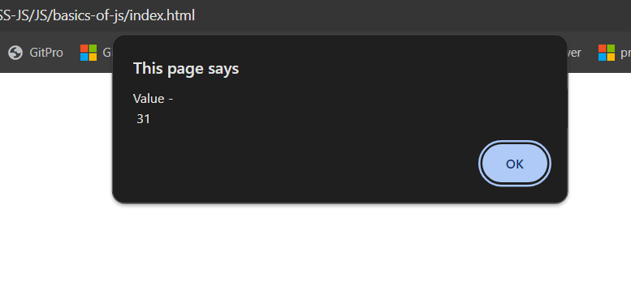


## Function


- A JavaScript function is a block of code designed to perform a particular task. A JavaScript function is executed when "something" invokes it (calls it).
- A JavaScript function is defined with the function keyword, followed by a name, followed by parentheses `()`. Function names can contain letters, digits, underscores, and dollar signs (same rules as variables).
- Syntax

```
function name(parameter1, parameter2, parameter3) {
  // code to be executed
}
```

- Lets see an example, inside the **app1.js**.

```
function additionOfNumbers(num1,num2){
    const result=num1+num2
    alert('Sum is '+result)
}

additionOfNumbers(10,30)
```

- When we reload the browser.

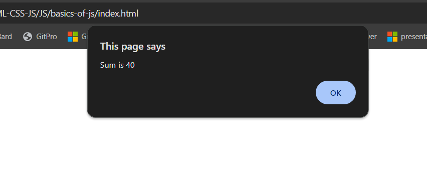

- If we call the function twice, we will get 3 alerts in total.

```
function additionOfNumbers(num1,num2){
    const result=num1+num2
    alert('Sum is '+result)
}

additionOfNumbers(10,30)
additionOfNumbers(40,40)
```

- Reloading browser

<video controls src="Images/basicofjs/20241001-1423-15.1087384.mp4" title="Title"></video>

- If your function wanna return something, we can use **return** keyword.

```
function additionOfNumbers(num1,num2){
    const result=num1+num2
    return result
}

let functionResult=additionOfNumbers(10,30)
alert('Sum is '+functionResult)
functionResult=additionOfNumbers(40,40)
alert('Sum is '+functionResult)
```

- We get the same 3 alerts as output. Here we have made our own function, in JavaScript there are some in-built functions as well like `alert("Any Alert Message")`. The `alert()` function displays an alert box with a message and an `OK` button. The `alert() ` function is used when you want information to come through to the user.

## Global & Local Scope

- Consider below code

```
let GlobalVariable; // Global Variable, Scope is within the program is executed completely

function additionOfNumbers(num1,num2){
    /* 
    Local Variable, the scope is within the function, 
    the result variable cannot be accessed outside the 
    function
    */
    const result=num1+num2
    GlobalVariable=result;
    return result
}

let functionResult=additionOfNumbers(10,30)
alert('Sum is '+(functionResult+GlobalVariable))
functionResult=additionOfNumbers(40,40)
alert('Sum is '+(functionResult+GlobalVariable))
```

- **Global Scope**: Variables defined outside any function (like `GlobalVariable`) have global scope. They can be accessed and modified anywhere in the program, as long as the script is running.
- **Local Scope**: Variables defined inside a function (like `result`) have local scope. They can only be accessed within that function and cannot be used outside of it.

<video controls src="Images/basicofjs/20241001-1450-48.4995500.mp4" title="Title"></video>


## Shadowing Variables

- Consider below code

```
let userName = 'Max';
function greetUser(name) {
  let userName = name;
  alert(userName);
}
userName = 'Manu';
greetUser('Max');
```

- What do you think, will be the output?


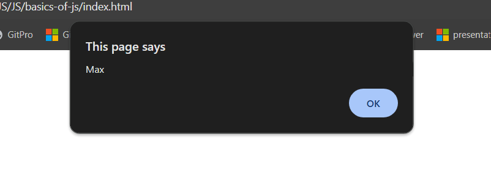

- Because the local variable scope is within the function and if the variable name is same it will hide the outer or global variable data and uses the data defined for local variable.
- In JavaScript, shadowing happens when a variable in a local scope (like inside a function) has the same name as a variable in an outer or global scope. The local variable "shadows" or hides the outer variable within that local scope.

## Indirect vs Direct Invocation of Function

- Until now we were directly calling the functuion. When you directly call a function by its name and pass arguments, this is a direct invocation. It’s the most common way to call a function.
- Now consider below code.

```
let GlobalVariable; // Global Variable, Scope is within the program is executed completely
function additionOfNumbers(num1,num2){
    /* 
    Local Variable, the scope is within the function, 
    the result variable cannot be accessed outside the 
    function
    */
    const result=num1+num2
    GlobalVariable=result;
    return result
}

let addOfNums=additionOfNumbers
functionResult=addOfNums(30,300)
alert('Sum is '+(functionResult+GlobalVariable))
```


- Here the function is called through a reference, rather than its original name. This is a indirect invocation via reference.
- Sometimes however, you don't want to execute the function immediately. You rather want to "tell JavaScript" that it should execute a certain function at some point in the future (e.g. when some event occurs). That's when you don't directly call the function but when you instead just provide JavaScript with the name of the function. `someButton.addEventListener('click', additionOfNumbers)`. This snippet would tell JavaScript: "Hey, when the button is clicked, go ahead and execute add.".
- Consider the snip `someButton.addEventListener('click', additionOfNumbers())` will execute the functions before the event of click occurs. JavaScript would encounter that line when it parses/ executes your script and register the event listener AND immediately execute add - because you added parentheses `()` => That means, "Please execute that function!".
- Consider below code

```
let someVar = 5;
additionOfNumbers
alert('Do something else...');
```

- Here we have simply specified the function name, but JavaScript does not knows what do to with that function? "Should I run that when a click occurs? After a certain amount of time? I don't know...", and hence JavaScript kind of ignores this statement.
- Consider below code, here we are passing the function `double` in arguments name, and inside the `transform` function we are calling the `double` function.

```
// Online Javascript Editor for free
// Write, Edit and Run your Javascript code using JS Online Compiler
function double(num1){
    return num1*2
}

function transform(num1,functionName){
    return functionName(num1)
}


console.log(transform(10,double)); // Prints 20
```

- `console.log` print the data into the developer tools console.

<video controls src="Images/basicofjs/20241001-1629-48.7065927.mp4" title="Title"></video>

## Converting Data Types

- Lets say you have a string or text value which consist of an numerical data. You can convert it by following ways.

```
let str = "42";
let num = Number(str);   // Converts string "42" to number 42
console.log(num);        // Output: 42

let decimal = parseFloat("42.5");
console.log(decimal);     // Output: 42.5
```

- Converting number to string

```
let num = 42;
let str = String(num);   // Converts number 42 to string "42"
console.log(str);        // Output: "42"

let str2 = num.toString();
console.log(str2);       // Output: "42"
```

- Converting 0's or 1's to Boolean value

```
let val = 1;
let bool = Boolean(val);   // Converts number 1 to true
console.log(bool);         // Output: true
bool=Boolean(0)
console.log(bool) // Output: false
```

## Coercion

- Now consider below code

```
let result = 3 + "3";
console.log(result);  // Output: "33"
console.log("5"-2) //Prints 3
console.log("5"-2+"3") //Prints 33
console.log(3 * '3') //Prints 9
```

- Something weird right? the data type is getting automatically converted it seems, this process is called **Coercion or Type Coercion**.
- When you perform operations on values of different data types (like adding a number and a string), JavaScript automatically tries to convert the values to a compatible type through a process called type coercion.
- Type coercion is the process where JavaScript automatically converts a value from one data type to another when necessary during an operation. JavaScript is a loosely or weekly typed language, meaning variables don't have strict types, and the language tries to handle conversions for you when different types are used in the same expression.

### Types of Coercion
- There are two main types of type coercion in JavaScript:

    **1. Implicit Coercion (Automatic)**: This happens automatically when you perform operations between values of different types, and JavaScript tries to convert one type to another to make the operation work.


    **2. Explicit Coercion (Manual) or Type Conversion**: This happens when you intentionally convert a value from one type to another using functions or constructors like `Number()`, `String()`, etc.
- **Explicit coercion** is synonymous with **type conversion**, while **implicit coercion** refers to **automatic type conversion** that JavaScript handles on its own

#### Implicit Coercion

- String Coercion, the number 3 is implicitly coerced to the string `"3"`, and then concatenation happens. **String Coercion happens with the `+` operator if one of the values is a string**

```
let result = 3 + "3";
console.log(result); // Output: "33"
```

- Number Coercion, JavaScript sees the `-` operator and expects both values to be numbers, so it converts the string `"5"` to the number `5`. **Number Coercion happens with arithmetic operators like `-`, `*`, `/`, and `%`.**

```
let result = "5" - 2;
console.log(result); // Output: 3
```

- Boolean Coercion, any non-zero number, non-empty string, object are considered as `true` whereas 0, `""`(empty string), `null`, `undefined`, `NaN` are considered as `false`.


```
let truthy = "Hello";
let falsy = 0;

console.log(Boolean(truthy)); // Output: true (non-empty string is truthy)
console.log(Boolean(falsy));  // Output: false (0 is falsy)
```

- Consider below codes

```
let result = "" - 1;
console.log(result); // Output: -1 ("" is treated as 0)

console.log(null + 1);      // Output: 1
console.log(undefined + 1); // Output: NaN
```

- Empty string behaves like 0 in numerical operations. `null` is coerced to **0** in number operations, but remains `null` in other cases. `undefined` becomes `NaN` (Not-a-Number) in number operations.


## Undefined, null and NaN

### undefined

- A variable that has been declared but not assigned a value will have a default value called as `undefined`. It is the default value of variables that have been declared but not initialized.

```
//When you declare a variable without assigning a value
let a;
console.log(a); // undefined
```

- If a function doesn’t return any value, it returns `undefined` value by default.

```
function test(){

}
console.log(test()) //Output: undefined
```

- It's generally used by JavaScript itself, and you don't need to explicitly assign `undefined` to variables.

### null

- It represents the intentional absence of any object value. It's often used to indicate that a variable should have no value.

```
let a = null; // Variable explicitly holds "nothing"
```

-  Use `null` when you want to explicitly indicate that a variable has no value or is empty (especially for objects). It’s commonly used in programming to reset an object or reference.

### NaN (Not-a-Number)

- It indicates that a value is not a valid number, usually as a result of an invalid mathematical operation. **`NaN` is of type 'number'**, which is ironic given that it means "Not-a-Number".

```
let a = "abc" / 2;
console.log(a); // NaN

let num = parseInt("abc"); 
console.log(num); // NaN
```

- `NaN` typically comes up automatically when there is an invalid number operation, so you don’t usually assign it directly. You can check for `NaN` using `isNaN()`

```
let c="abc"/2
console.log(isNaN(c)) //Output: true
```

#### Miscellaneous 

##### Adding Numbers to undefined, null and NaN

- Consider below codes

```
a=undefined+1+1
console.log(a) //Output: NaN

let b = null
console.log(b+1) //Output:1 

let c=NaN
console.log(c+1) //Output:NaN
```

- Here, 
  - Since `undefined` cannot be coerced into a number, the result is `NaN` (Not-a-Number). 
  - `null` is coerced into **0** when performing arithmetic, so the result is 1. 
  - Any arithmetic operation involving `NaN` results in `NaN`.

##### Concatenating String to undefined, null and NaN

- Consider below code

```
let resultString = undefined + 'string';
console.log(resultString); // "undefinedstring"

let resultString1 = null + 'string';
console.log(resultString1); // "nullstring"

let resultString2 = NaN + 'string';
console.log(resultString2); // "NaNstring"
```

- Simple concatenates. JavaScript turns them to string value and performs concatenation

##### Operations between undefined, null and NaN

- Consider below code

```
let resultCombo = undefined + null;
console.log(resultCombo); // NaN

let resultCombo1 = undefined + NaN;
console.log(resultCombo1); // NaN

let resultCombo2 = null + NaN;
console.log(resultCombo2); // NaN

let resultCombo3 = undefined + null + NaN;
console.log(resultCombo3); // NaN
```

- Here,
  - `undefined` cannot be coerced into a number, but `null` is coerced into **0**. The result is `NaN` because any operation with `undefined` results in `NaN`.
  - Any operation with `NaN` results in `NaN`.
  - `null` is coerced into **0**, but since `NaN` is involved, the result is `NaN`.
  - `undefined + null + NaN` follows left-to-right evaluation. First, `undefined + null` results in `NaN`, then `NaN` + `NaN` results in `NaN`.


## Completing Calculator Page

- Until we have some basic knowledge of JS, now using this lets try to accept data from html page and display value. How to do this then? using `document.getElementById()`. `document.getElementById()` method is a way for JavaScript to interact with the **DOM (Document Object Model)**, which represents the structure of your HTML page.
- `document.getElementById()` is used to select an HTML element based on its **id attribute**. When JavaScript selects an element, it can read or modify its properties (like text, values, or style). This is how JavaScript interacts with the browser to fetch or display values. 


*We will explore more about DOM later*

- Lets see our **index.html** file.

```
<!DOCTYPE html>
<html lang="en">
  <head>
    <meta charset="UTF-8" />
    <meta name="viewport" content="width=device-width, initial-scale=1.0" />
    <meta http-equiv="X-UA-Compatible" content="ie=edge" />
    <title>Basics</title>
    <link
      href="https://fonts.googleapis.com/css?family=Roboto:400,700&display=swap"
      rel="stylesheet"
    />
    <link rel="stylesheet" href="assets/styles/app.css" />

  </head>
  <body>
    <header>
      <h1>The Unconventional Calculator</h1>
    </header>

    <section id="calculator">
      <input type="number" id="input-number" />
      <div id="calc-actions">
        <button type="button" id="btn-add">+</button>
        <button type="button" id="btn-subtract">-</button>
        <button type="button" id="btn-multiply">*</button>
        <button type="button" id="btn-divide">/</button>
      </div>
    </section>
    <section id="results">
      <h2 id="current-calculation">0</h2>
      <h2>Result: <span id="current-result">0</span></h2>
    </section>
    <script src="assets/scripts/app1.js"></script>
    <script src="assets/scripts/app.js"></script>
  </body>
</html>
```

- There are several **id attributes** like `btn-add`, `btn-subtract`, `btn-multiply`, `btn-divide`, `current-calculation` etc.. Lets create a new script (**acceptDisplay.js**).

```
//Accepting input from browser via constant name
const userInput = document.getElementById('input-number');
const addBtn = document.getElementById('btn-add');
const subtractBtn = document.getElementById('btn-subtract');
const multiplyBtn = document.getElementById('btn-multiply');
const divideBtn = document.getElementById('btn-divide');

//Displaying output on browser via constant name
const currentResultOutput = document.getElementById('current-result');
const currentCalculationOutput = document.getElementById('current-calculation');
```

- Lets create a function `outputResult()` which will set the values within these variables (`currentResultOutput` and `currentCalculationOutput`)

```
//Accepting input from browser
const userInput = document.getElementById('input-number');
const addBtn = document.getElementById('btn-add');
const subtractBtn = document.getElementById('btn-subtract');
const multiplyBtn = document.getElementById('btn-multiply');
const divideBtn = document.getElementById('btn-divide');

//Displaying output on browser
const currentResultOutput = document.getElementById('current-result');
const currentCalculationOutput = document.getElementById('current-calculation');


function outputResult(mathematicalresult, mathematicalExpression) {
  currentResultOutput.textContent = mathematicalresult;
  currentCalculationOutput.textContent = mathematicalExpression;
}
```

- **The Unconventional Calculator** will accept number and based on that number it gonna perform arithmetic operations. So lets create different functions for it.

```
//Accepting input from browser
const userInput = document.getElementById('input-number');
const addBtn = document.getElementById('btn-add');
const subtractBtn = document.getElementById('btn-subtract');
const multiplyBtn = document.getElementById('btn-multiply');
const divideBtn = document.getElementById('btn-divide');

//Displaying output on browser
const currentResultOutput = document.getElementById('current-result');
const currentCalculationOutput = document.getElementById('current-calculation');

function outputResult(mathematicalresult, mathematicalExpression) {
  currentResultOutput.textContent = mathematicalresult;
  currentCalculationOutput.textContent = mathematicalExpression;
}

function add(){

}

function subtract(){

}

function multiply(){

}

function division(){
  
}
```

- But how will this function compute operations? it would require input right? for that we have variable `userInput`. Now this `userInput` is in String format, we need to manually perform type conversion. Lets use `parseFloat()`.

```
const userInput = parseFloat(document.getElementById('input-number'));
```

- But operations is performed between two inputs, lets create a variable second input. The answer needs to be stored itself in the `secondInput`.

```
// Second Input
let secondInput=0;
```

- Lets complete the empty functions.

```
//Accepting input from browser
const userInput = document.getElementById('input-number');
const addBtn = document.getElementById('btn-add');
const subtractBtn = document.getElementById('btn-subtract');
const multiplyBtn = document.getElementById('btn-multiply');
const divideBtn = document.getElementById('btn-divide');

//Displaying output on browser
const currentResultOutput = document.getElementById('current-result');
const currentCalculationOutput = document.getElementById('current-calculation');

function outputResult(mathematicalresult, mathematicalExpression) {
  currentResultOutput.textContent = mathematicalresult;
  currentCalculationOutput.textContent = mathematicalExpression;
}

// Second Input
let secondInput=0;

function add(){
  let Expression=`${secondInput} + ${userInput}`
  secondInput+=userInput
  outputResult(secondInput,Expression) // Calling outputResult() function
}

function subtract(){
  let Expression=`${secondInput} - ${userInput}`
  secondInput-=userInput
  outputResult(secondInput,Expression) // Calling outputResult() function
}

function multiply(){
  let Expression=`${secondInput} * ${userInput}`
  secondInput*=userInput
  outputResult(secondInput,Expression) // Calling outputResult() function
}

function division(){
  let Expression=`${secondInput} / ${userInput}`
  secondInput/=userInput
  outputResult(secondInput,Expression) // Calling outputResult() function
}
```

- These `add()`, `subtract()`, `multiply()` and `division()` function must be called when users clicks on button (`addBtn`, `subtractBtn`, `multiplyBtn` and `divideBtn`)
- So to achieve this we will use `addEventListener`.

*We will explore more about `addEventListener`*

```
// Indirect calling methods
addBtn.addEventListener('click', add);
subtractBtn.addEventListener('click', subtract);
multiplyBtn.addEventListener('click', multiply);
divideBtn.addEventListener('click', division);
```

- When we go to the browser and run we get something like below

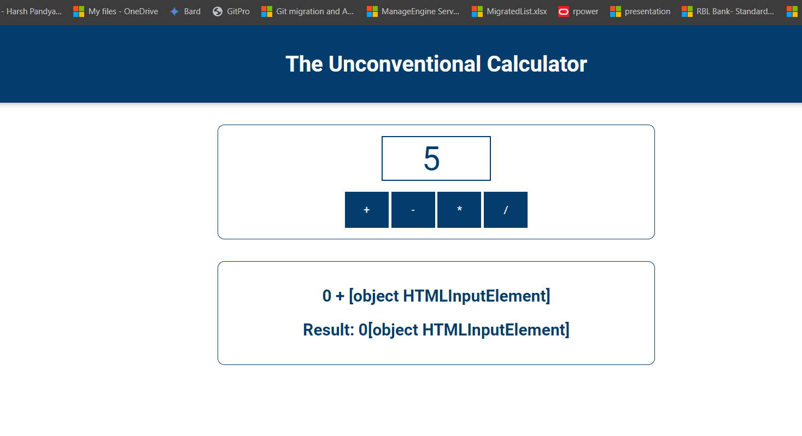

- This is because our input is not accepting proper numeric value. So we need to convert the `userInput` to `value` and parse it using `parseFloat` to accept floating numbers.

```
function getNumberValue(){
  return parseFloat(userInput.value)
}


function add(){
  const fetchInputNumber=getNumberValue()
  let Expression=`${secondInput} + ${fetchInputNumber}`
  secondInput+=fetchInputNumber
  outputResult(secondInput,Expression) // Calling outputResult() function
}

function subtract(){
  const fetchInputNumber=getNumberValue()
  let Expression=`${secondInput} - ${fetchInputNumber}`
  secondInput-=fetchInputNumber
  outputResult(secondInput,Expression) // Calling outputResult() function
}

function multiply(){
  const fetchInputNumber=getNumberValue()
  let Expression=`${secondInput} * ${fetchInputNumber}`
  secondInput*=fetchInputNumber
  outputResult(secondInput,Expression) // Calling outputResult() function
}

function division(){
  const fetchInputNumber=getNumberValue()
  let Expression=`${secondInput} / ${fetchInputNumber}`
  secondInput/=fetchInputNumber
  outputResult(secondInput,Expression) // Calling outputResult() function
}
```

- Other code details remains the same, now we need to link the new script file into the HTML.

```
<!DOCTYPE html>
<html lang="en">
  <head>
    <meta charset="UTF-8" />
    <meta name="viewport" content="width=device-width, initial-scale=1.0" />
    <meta http-equiv="X-UA-Compatible" content="ie=edge" />
    <title>Basics</title>
    <link
      href="https://fonts.googleapis.com/css?family=Roboto:400,700&display=swap"
      rel="stylesheet"
    />
    <link rel="stylesheet" href="assets/styles/app.css" />

  </head>
  <body>
    <header>
      <h1>The Unconventional Calculator</h1>
    </header>

    <section id="calculator">
      <input type="number" id="input-number" />
      <div id="calc-actions">
        <button type="button" id="btn-add">+</button>
        <button type="button" id="btn-subtract">-</button>
        <button type="button" id="btn-multiply">*</button>
        <button type="button" id="btn-divide">/</button>
      </div>
    </section>
    <section id="results">
      <h2 id="current-calculation">0</h2>
      <h2>Result: <span id="current-result">0</span></h2>
    </section>
    <!-- <script src="assets/scripts/app1.js"></script>
    <script src="assets/scripts/app.js"></script> -->
    <script src="assets/scripts/acceptDisplay.js"></script>
  </body>
</html>
```


- Lets checkout

<video controls src="Images/basicofjs/20241001-1819-50.3317326.mp4" title="Title"></video>

## Numbers

-  In JavaScript, all numbers are indeed **represented as 64-bit floating-point values**. This means every number, whether it's an integer or a decimal, is stored in the same 64-bit floating-point format, which uses binary under the hood.
- **64-Bit Floating-Point Representation**: JavaScript uses a 64-bit format to represent numbers, which is divided as:
  - 1 bit for the sign (positive or negative),
  - 11 bits for the exponent,
  - 52 bits for the fraction, also known as the significant or mantissa.
- This format allows JavaScript to represent both very large and very small numbers with high precision, but it has limitations due to binary representation.
- So the max value and min value in JS is

```
Number.MAX_SAFE_INTEGER
=> 9007199254740991
Number.MIN_SAFE_INTEGER
=> -9007199254740991
Number.MAX_VALUE
=> 1.7976931348623157e+308
Number.MIN_VALUE
=> 5e-324
Number.POSITIVE_INFINITY
=> Infinity
Number.NEGATIVE_INFINITY
=> -Infinity
Number.MAX_SAFE_INTEGER+1
=> 9007199254740991 (gives same value when added more numbers)
```

- You can convert numbers to different bases using toString. For example:
  - `toString(2)` converts the number to binary.
  - `toString(10)` converts it to decimal (though decimal is the default if no argument is provided).
  - `toString(16)` converts it to hexadecimal.

- Examples

```
(4).toString(2)
=> '100'
(15).toString(16)
=> 'f'
```

- Consider below code

```
console.log(0.2 + 0.4 === 0.6); // Output: false
```

- The result is `false` why so? internally, JavaScript uses binary for calculations. This is why some decimal numbers, like `0.2` and `0.4`, cannot be represented exactly in binary. For instance, `0.2 + 0.4` does not exactly equal `0.6` because `0.2` and `0.4` cannot be represented precisely in binary, resulting in tiny rounding errors.

```
0.2+0.4
=> 0.6000000000000001
```

- When we convert `0.2` and `0.4` to binary (as JS perform calculation by converting decimal to binary) you get

```
0.2.toString(2)
=> '0.001100110011001100110011001100110011001100110011001101'
0.4.toString(2)
=> '0.01100110011001100110011001100110011001100110011001101'
```

- Now when you convert these binary output value back into decimal using online tool you get values as 

```
0.001100110011001100110011001100110011001100110011001101 ===> 0.2000000000000000111
0.01100110011001100110011001100110011001100110011001101 ===> 0.4000000000000000222
```

- Thats why we compare and we get `false` value.
- To handle floating-point precision errors, JavaScript provides the `toFixed` method, which allows you to format a number to a fixed number of decimal places

```
// Using toFixed to round to two decimal places
(0.2+0.4).toFixed(2)===0.6.toFixed(2) //true
```

- Consider below code

```
20.2.toString(2)
=> '10100.001100110011001100110011001100110011001100110011' (decimal value is 20.19999999999999928946)
20.2.toFixed(20)
=> '20.19999999999999928946'
```

- When you call `.toFixed(20)`, JavaScript attempts to display `20.2` to `20` decimal places. However, it’s using the approximate value stored in memory, not the exact `20.2` as we would write it in decimal. This results in the actual value being output, which is `20.19999999999999928946`.

### BigInt

- `BigInt` is a special numeric data type that allows you to work with integers of arbitrary size. Unlike regular Number type values, which are limited to 64-bit floating-point precision, `BigInt` can represent whole numbers much larger than the safe integer limit (`Number.MAX_SAFE_INTEGER => 9007199254740991`).

```
console.log(Number.MAX_SAFE_INTEGER); // Output: 9007199254740991

// Beyond this limit, JavaScript may not handle large numbers accurately
console.log(9007199254740991 + 1); // Output: 9007199254740992
console.log(9007199254740991 + 2); // Output: 9007199254740992 (Incorrect!)
```
- To handle such large integers precisely, JavaScript introduced `BigInt`.
- There are two ways to create a BigInt in JavaScript:
  - Appending `n` to the end of an integer literal or using `BigInt` function

```
const bigIntNum = 1234567890123456789012345678901234567890n;
console.log(bigIntNum); // Output: 1234567890123456789012345678901234567890n

const bigIntFromStr = BigInt("1234567890123456789012345678901234567890");
console.log(bigIntFromStr); // Output: 1234567890123456789012345678901234567890n
```

- BigInt can represent very large integers without losing precision, which is useful in situations like cryptography, high-precision calculations, or financial applications.
- **BigInt can only represent whole numbers. If you try to create a BigInt with a decimal, JavaScript will throw an error.**

```
const decimalBigInt = 1.5n; // Throws SyntaxError: Invalid or unexpected token
```

- You cannot mix BigInt with regular Number types in operations directly. For example, the following will throw an error

```
const bigIntNum = 10n;
const regularNum = 5;
console.log(bigIntNum + regularNum); // Throws TypeError, Cannot mix BigInt and other types, use explicit conversions
```

- However, you can explicitly convert `Number` to `BigInt` or vice versa if needed:

```
console.log(bigIntNum + BigInt(regularNum)); // Works
console.log(Number(bigIntNum) + regularNum); // Works, but may lose precision
```

- You can use the standard arithmetic operators with BigInt (`+, -, *, /, %`), but **remember that division with BigInt will truncate (not round) to the nearest integer**

```
console.log(10n / 3n); // Output: 3n (no decimal part, truncated)
```

### Math

- `Math` object includes many useful methods for performing mathematical operations, from simple rounding to complex trigonometric calculations. Here’s an overview of commonly used `Math` methods with examples.

```
// Rounds x to the nearest integer
Math.round(4.7); // 5
Math.round(4.4); // 4

Math.floor(4.9); // 4
Math.floor(-4.1); // -5

Math.ceil(4.1); // 5
Math.ceil(-4.9); // -4

// Removes the decimal part, leaving only the integer part.
Math.trunc(4.9); // 4
Math.trunc(-4.9); // -4

// Returns base raised to the power of exponent.
Math.pow(2, 3); // 8 (2^3)
Math.pow(5, 2); // 25 (5^2)

Math.sqrt(25); // 5
Math.sqrt(2);  // 1.4142135623730951

// Returns the cube root of x
Math.cbrt(27); // 3
Math.cbrt(8);  // 2

// Absolute
Math.abs(-5) //5

// Trignometery
Math.sin(Math.PI / 2); // 1
Math.sin(0); // 0

Math.cos(0); // 1
Math.cos(Math.PI); // -1

Math.min(10, -5, 3, 7); // -5

Math.max(10, -5, 3, 7); // 10

Math.random(); // Example output: 0.726353276123

Math.floor(Math.random() * 10) + 1; // Random number between 1 and 10

// Returns the sign of x as -1 (negative), 1 (positive), or 0.
Math.sign(-10); // -1
Math.sign(0);   // 0
Math.sign(10);  // 1

Math.PI; // 3.141592653589793
```

## Tagged Template (String)

- Below is an example of template literal

```
let name="ABC"
console.log(`My name is ${name}`)
```

- Template literals are a way to work with strings that include placeholders (expressions) and multiline content more conveniently.
- Tagged templates in JavaScript allow you to process template literals (i.e., template strings) with a custom function, called a "tag function." This lets you manipulate or format the content of the template literal before it's used.
- Lets take a simple example

```
// Tagged Template
function highLight(string, inputfruitName,inputprice){
  return "This fruit is expensive if its price is greater than $200"
}

let fruitName="Dragon"
let price="$300"
let output=highLight`${fruitName} fruit price is ${price}`
console.log(output)

Output:
This fruit is expensive if its price is greater than $200
```

- Lets print the arguments.

```
// Tagged Template
function highLight(string, inputfruitName,inputprice){
    console.log(string)
    console.log(inputfruitName)
    console.log(inputprice)
    return "This fruit is expensive if its price is greater than $200"
}

let fruitName="Dragon"
let price="$300"
let output=highLight`${fruitName} fruit price is ${price}`
console.log(output)

Output:
[ '', ' fruit price is ', '' ]
Dragon
$300
This fruit is expensive if its price is greater than $200
```

- When you print `string` you get a list of array which is split of template literal. The split is applied on the dynamic placeholders (`${fruitName}`,`${price}`). Resulting an array of static string contents. Whereas the input `inputfruitName` and `inputprice` represent your placeholder in the template literal `${fruitName}` and `${price}` respectively. The input arguments (`inputfruitName` and `inputprice`) are also called as **interpolated values**.
- Basic syntax of tagged function

```
function tagFunction(strings, ...values) {
  // Manipulate the strings and values as needed
  // Return the final processed string
}
const result = tagFunction`template ${expression} string`;
```

- `strings`: An array of strings that represent the non-expression parts of the template literal.
- `...values`: The evaluated values of the expressions within the template literal.

### Why Tagged Template are required?

- Now consider a scenario where your template literal represents the string content which will be displayed on HTML page.

```
function highLightNames(string,inputfruitName,inputprice){

  if(inputprice>300){
    inputfruitName=`<strong>${inputfruitName}</strong>` //Making the words strong
    inputprice=`<strong>${inputprice}</strong>`
  }

  return `${string[0]}${inputfruitName}${string[1]}${inputprice}${string[2]}`
}
fruitName="Dragon"
price="$300"
console.log(highLightNames`${fruitName} fruit total price is ${price}.`)

Output:
Dragon fruit total price is $300.
```

- Now even if the **template literal static contents are changed** like ``${fruitName} fruit total price is ${price}. Thankyou for shopping``. Our code output will automatically get changed as per the static content.

```
New Output as per static content:
Dragon total price is $300. Thankyou for Shopping
```

- Tagged templates are useful for cases where you need to:
  - Process and format strings dynamically, like for localization or formatting.
  - Escape or sanitize values to prevent security issues (e.g., in SQL queries or HTML strings).
  - Add custom logic for interpreting template literals beyond simple string interpolation.
- Below is an example of HTML escaping

```
function escapeHTML(strings, ...values) {
    // Helper function to escape HTML characters
    const escape = str => str.replace(/&/g, "&amp;")
                             .replace(/</g, "&lt;")
                             .replace(/>/g, "&gt;")
                             .replace(/"/g, "&quot;")
                             .replace(/'/g, "&#39;");

    return strings.reduce((result, string, i) => 
        result + string + (values[i] ? escape(String(values[i])) : ''), '');
}

const userInput = "<script>alert('Hacked!')</script>";
const safeHTML = escapeHTML`User comment: ${userInput}`;
console.log(safeHTML); // "User comment: &lt;script&gt;alert('Hacked!')&lt;/script&gt;"
```

## Regex

- Regular expressions are patterns used to match character combinations in text. 
- There are two ways to defined a regex
- Using regex literals

```
const regex = /[a-z]/; // Matches any lowercase letter
const str = "Hello, world!";
const matches = str.match(regex); // ["H", "e", "l", "l", "o", "w", "o", "r", "l", "d"]
console.log(matches)
console.log(regex.test(str)) //true

const regex1 = /\d{3}-\d{2}-\d{4}/; // Matches a phone number like 123-45-6789
const str1 = "My phone number is 123-45-6789.";
console.log(regex1.test(str1)) // true

const regex2 = /\bcat\b/; // Matches the word "cat" but not "catnip" or "tomcat"
const str2 = "The cat sat on the mat.";
console.log(regex2.test(str2)) // true

const regex3 = /colou?r/; // Matches both "color" and "colour"
const str3 = "color";
const str4 = "colour";
console.log(regex3.test(str3)); // true
console.log(regex3.test(str4)); // true
```

- Another way to define regex is by creating Regex Object

```
const emailPattern = new RegExp('^[\\w-]+@[\\w-]+\\.[\\w-]{2,}$', 'i');

const email1 = 'johndoe@example.com';
const email2 = 'jane.doe@example.co.uk';
const invalidEmail = 'invalid_email';

console.log(emailPattern.test(email1)); // Output: true
console.log(emailPattern.test(email2)); // Output: true
console.log(emailPattern.test(invalidEmail)); // Output: false
```

## Data Types

- Up till now we have seen Number, String and Boolean datatype and saw some of the example. Lets see **Object** data type in JavaScript.

### Object

- Consider below code

```
let obj={
    "name":"Rahul",
    "age": 25,
    "Male": true
}
console.log(obj)
```

- When we see the console, we get below output

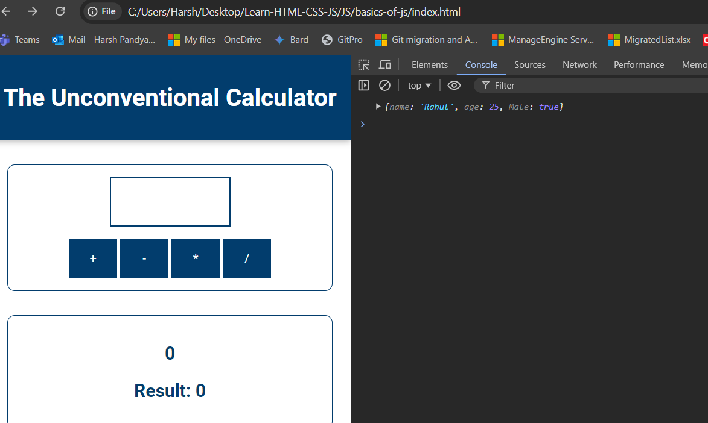


- An object is a data structure that can hold multiple values in the form of key-value pairs. Each key (also known as a property) is a string (or Symbol), and each value can be of any data type. Object allow you to group related data and functionalities together.
- We can change the object properties

```
//Changing value
obj.age=24
console.log(obj) //Output: {name: 'Rahul', age: 24, Male: true}

//Deleting a property
delete obj.name
console.log(obj) //Output: {age: 24, Male: true}
```

- We can also define nested objects

```
let employee = {
  name: "Bob",
  position: "Developer",
  contact: {
    email: "bob@example.com",
    phone: "123-456-7890"
  }
};
```

- On console


- We can also defined functions inside the object

```
let calculator = {
    add: function(x, y) {
      return x + y;
    },
    subtract: function(x, y) {
      return x - y;
    }
  };
  console.log(calculator.add(5, 3)); // Outputs: 8
```

- Lets declare a constant object

```
const person = { name: "Alice", age: 30 };
console.log(person)
person.age=31
console.log(person)
```

- If you see defining key with double quote or single quote is optional, but if you carefully observe `person` is a constant but still we are able to modify the object data (`person.age=31`).
- Why so? **When you declare an object with `const`, you are not allowed to reassign the object itself (i.e., you can't point the variable to a new object). However, the properties of the object can still be modified. This is because const ensures that the reference to the object remains the same, but the contents inside the object (the properties) can be changed.**

```
const person = { name: "Alice", age: 30 };
person = { name: "Bob", age: 40 }; // Error: Assignment to constant variable
```

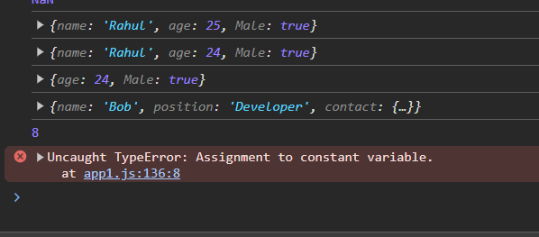

- You cannot change the reference to point to a different object once the object is defined with `const`. You can change, add, or delete properties inside the object, because the reference to the object (the memory location where the object is stored) is still the same.
- The object itself is stored in memory, and the reference to that object is constant, but the content of the object is mutable. You can think of it like this: the "container" (object) is fixed in place, but what you put inside the container can change.

```
const car = {
  brand: "Toyota",
  model: "Corolla"
};

// Allowed: modifying properties
car.model = "Camry";
console.log(car.model); // Outputs: "Camry"

// Not allowed: reassigning the object
car = { brand: "Honda", model: "Civic" }; // Error: Assignment to constant variable
```

- If you want to make sure that the object and its properties cannot be changed, you can use `Object.freeze()`.

```
const car = Object.freeze({
  brand: "Toyota",
  model: "Corolla"
});

car.model = "Camry"; // This will not change the object
console.log(car.model); // Still "Corolla"
```

#### Array

- **An array is a special type of object** used to store multiple values in a single variable. Arrays can hold various types of data, including numbers, strings, and even other arrays. Each value in an array is stored at a specific index, starting from `0`.
- Elements in an array are stored in a specific order, starting with index `0`. You can access elements using their index (position) in the array. Arrays can grow or shrink dynamically in size, meaning you can add or remove elements as needed.
- Array is declare using `[]`. Elements are comma separated.
- Lets see example

```
const fruits = ["apple", "banana", "orange"];
  console.log(fruits[0]); // Outputs: "apple"
  console.log(fruits[1]); // Outputs: "banana"
  
  // Changing an element
  fruits[1] = "mango"; 
  console.log(fruits); // Outputs: ["apple", "mango", "orange"]
  
  // Adding a new element
  fruits.push("grape");
  console.log(fruits); // Outputs: ["apple", "mango", "orange", "grape"]
  
  // Removing the last element
  fruits.pop();
  console.log(fruits); // Outputs: ["apple", "mango", "orange"]
  
  fruits.shift(); //Removes first element
  console.log(fruits)

  fruits.unshift("pineapple"); // Adds "pineapple" to the beginning
  console.log(fruits)

  console.log(fruits.length); // Outputs: 3 Number of elements
```

- On browser console

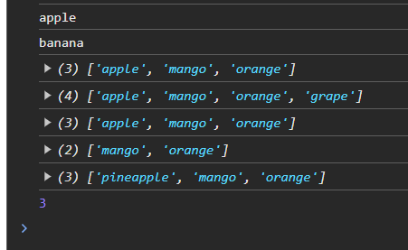

- Arrays allow you to store and work with multiple values at once. Array can store different data type elements

```
const car = Object.freeze({
    brand: "Toyota",
    model: "Corolla"
  });
  
const fruits = ["apple", "banana", "orange"];
  // Removing the last element
  fruits.pop();
  console.log(fruits); // Outputs: ["apple", "mango", "orange"]
  
  fruits.shift(); //Removes first element
  console.log(fruits)

  fruits.unshift("pineapple"); // Adds "pineapple" to the beginning
  console.log(fruits)

const MultipleDifferentElements=["Rahul",2,3.45,true,car,fruits]
console.log(MultipleDifferentElements) 
```

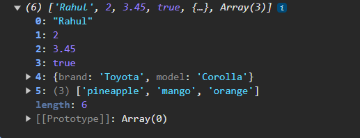


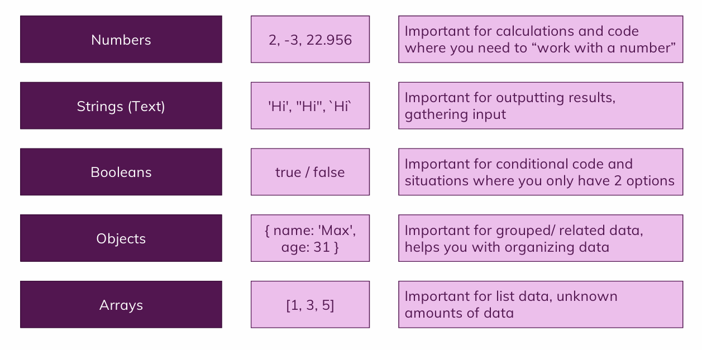

## typeof

- In JavaScript, **typeof is an operator (not a function)** that returns a string indicating the type of the operand (the value you pass to it). The operand can be any value, variable, or expression.
- The output of `typeof` will be a string. Lets see some example

```
console.log(typeof "Hi") //String
let test1="Hello"
console.log(typeof test1) //String

console.log(typeof 123) //number
test1=123
console.log(typeof test1) //number

test1=true 
console.log(typeof test1) //boolean

test1=NaN
console.log(typeof test1) //number

test1=null //null is an Object
console.log(typeof test1) //Object

let t;
console.log(typeof t) //undefined

t=[1,2,3]
console.log(typeof t) //object (since array is special type of object)
```

- On browser console


- You can also execute your JS code on browser console.

<video controls src="Images/basicofjs/20241002-0646-46.7216350.mp4" title="Title"></video>

- You can also access your JS scripts variable on the console.

<video controls src="Images/basicofjs/20241002-0648-12.3114200.mp4" title="Title"></video>

- What will be `typeof` function?

```
function tester(){

}
console.log(typeof tester) //function
```


## Functions vs Methods

- Consider below code.

```
// Function Declaration
function greet() {
  console.log("Hello!");
}

greet() //Hello!
```

- **A function is an independent block of code that can be called anywhere in your program.**

- Now consider below code.

```
const p= {
  name: "Alice",
  greet: function() {
    console.log("Hello, " + this.name + "!");
  }
};

// Calling the method
p.greet();  // Output: Hello, Alice!
```

- **A method is a function that is defined as a property of an object. It is essentially a function that is attached to an object and is invoked in the context of that object. Methods are called using the object's name, followed by a dot (`.`), and then the method name.**
- In the `The Unconventional Calculator` page we have used event listeners

```
addBtn.addEventListener('click', add);
subtractBtn.addEventListener('click', subtract);
multiplyBtn.addEventListener('click', multiply);
divideBtn.addEventListener('click', division);
```

- So **addEventListener()** is a method whereas the `addBtn`, `subtractBtn`, `multiplyBtn` and `divideBtn` are objects.

>[!IMPORTANT]
> - A function is standalone, while a method is associated with an object. Inside a method, the this keyword refers to the object to which the method belongs, allowing methods to access and modify object properties.
> - A function is called directly by its name (`greet()`), while a method is called through an object (`p.greet()`).

- Consider below code.

```
// Function Declaration
function greet() {
  console.log("Hello!");
}

console.log(typeof greet) //function
```

- When we check the type of `greet()` it returns function. Lets say we print the function name only

```
console.dir(greet)
```

- We get below output


- Now it looks similar to object, **functions are indeed objects!** In fact, almost everything in JavaScript is an object, including functions.

>![NOTE]
> - `console.dir()` is a method that allows you to display an interactive list of an object's properties in the browser's console.

- We can add properties to the function like below

```
function greet() {
  console.log("Hello!");
}

// Adding a property to the function
greet.language = "English";

console.log(greet.language);  // Output: English
console.dir(greet)
```

- On browser console

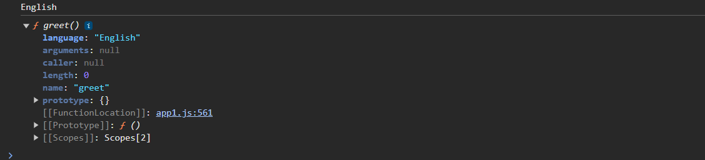

- We can also store function in a variable or constants and call it using that variable name.

```
let funt=function greet() {
  console.log("Hello!");
}

// Adding a property to the function
funt.language = "English";
funt() //  calling the variable name instead of function name because we cannot directly access the function name and call it
console.log(funt.language);  // Output: English
console.dir(funt)
```

- Here the function is an expression instead of as a declaration. The variable becomes the global scope which can be access throughout the code.
- On browser console we get below output for the above code.

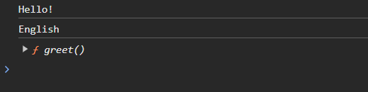

- **The difference between function declaration and function expression is that the function expression returns an object (even though it does not have `return` keyword) which needs to be stored using variable or constants.**

- You can assign functions to variables, store them in arrays, objects, etc.

```
const greet = function() {
  console.log("Hello!");
};

const actions = [greet, anotherFunction];
actions[0]();  // Calls greet function
```

- Functions can be passed as arguments to other functions. Since functions are objects, you can pass them around like variables and even pass them as arguments to other functions (also called higher-order functions). This is also called as **Callbacks functions**

```
function testfunct1() {
  console.log("test1");
}

function testfunct2() {
  console.log("test2");
}

// Passing greet function as an argument
executeFunction(testfunct1);  // Output: test1
executeFunction(testfunct2);  // Output: test2
```

## Default Argument Function

- Consider below code

```
function addNumbers(num1,num2){
  console.log("Num1 - "+num1) 
  console.log("Num2 - "+num2) 
  console.log(num1+num2)
}

addNumbers(0)

Output:
Num1 - 0 
Num2 - undefined
NaN
```

- Here we passed only 1 parameter into the argument for `num1` the other parameter `num2` was not passed so JS considered it as `undefined` and we got `NaN`. In such case you can define some default value for your parameter if the caller does not provides arguments. Like below

```
function addNumbers(num1,num2=0){
  console.log("Num1 - "+num1)  
  console.log("Num2 - "+num2)
  console.log(num1+num2)
}

addNumbers(0)
Num1 - 0 
Num2 - 0
0
```

- Default arguments in JavaScript are a powerful feature that allows you to define default values for function parameters. Default parameters make it clear what the expected behavior is when certain arguments are not provided.

## Anonymous Function

- In `The Unconventional Calculator` we had `addEventListener` method which works on click event. So the `add` function get executed when the user clicks on add button. Below is the short snip of it.

```
function add(){
  const fetchInputNumber=getNumberValue()
  let Expression=`${secondInput} + ${fetchInputNumber}`
  secondInput+=fetchInputNumber
  outputResult(secondInput,Expression) // Calling outputResult() method
}

//Subtract , multiply and division functions

// Indirect calling methods
addBtn.addEventListener('click', add);
subtractBtn.addEventListener('click', subtract);
multiplyBtn.addEventListener('click', multiply);
divideBtn.addEventListener('click', division);
```

- Lets add a random variable which is not initialize or declare under `add()` function, this will lead to error on browser console.

```
function add(){
  console.log(dummyVariableWhichNotExists) // Not initialized
  const fetchInputNumber=getNumberValue()
  let Expression=`${secondInput} + ${fetchInputNumber}`
  secondInput+=fetchInputNumber
  outputResult(secondInput,Expression) // Calling outputResult() method
}
```

- On console the error details are precisely mentioned, which function is giving out the error and what is the error.


- Now consider below code where the actual `add()` function is commented out and the function details are written directly like below

```
// function add(){
//   console.log(dummyVariableWhichNotExists)
//   const fetchInputNumber=getNumberValue()
//   let Expression=`${secondInput} + ${fetchInputNumber}`
//   secondInput+=fetchInputNumber
//   outputResult(secondInput,Expression) // Calling outputResult() method
// }

//Subtract , multiply and division functions

// Indirect calling methods
// addBtn.addEventListener('click', add);
addBtn.addEventListener('click', function (){
  const fetchInputNumber=getNumberValue()
  let Expression=`${secondInput} + ${fetchInputNumber}`
  secondInput+=fetchInputNumber
  outputResult(secondInput,Expression) // Calling outputResult() method
});
subtractBtn.addEventListener('click', subtract);
multiplyBtn.addEventListener('click', multiply);
divideBtn.addEventListener('click', division);
```

- We still get proper output.

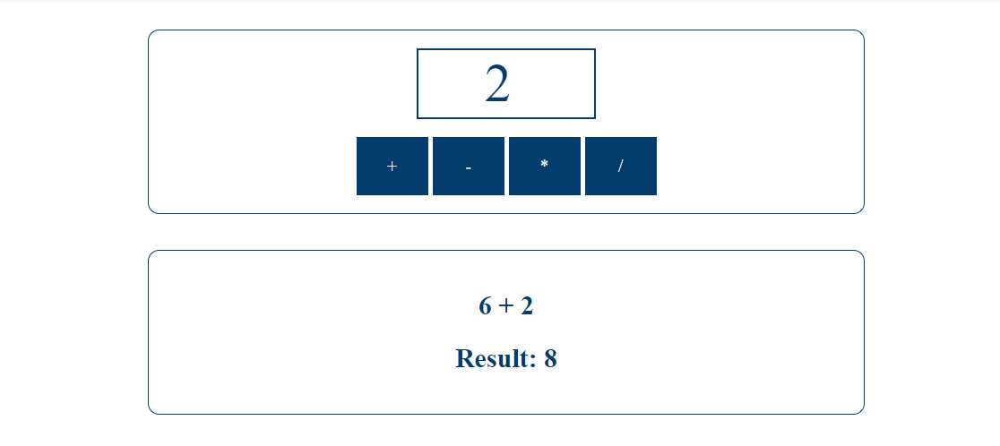

- Now lets add a dummy variable just like previously we did for `add()` function.

```
addBtn.addEventListener('click', function (){
  console.log(dummyVariableWhichNotExists)
  const fetchInputNumber=getNumberValue()
  let Expression=`${secondInput} + ${fetchInputNumber}`
  secondInput+=fetchInputNumber
  outputResult(secondInput,Expression) // Calling outputResult() method
});
```

- We are still expecting error, but since here we have not specified any function name , what will the browser console give in the error for such undefined named function? **anonymous**.

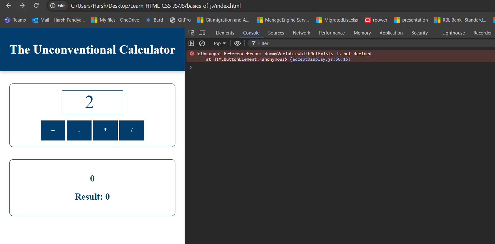

- **An anonymous function in JavaScript is simply a function without a name. It's often used when you need a function temporarily and don’t plan to reuse it elsewhere.**

```
// Anonymous function assigned to a variable
const g = function() {
  console.log("Hello!");
};

g();  // Output: Hello!
```

- If the function is only needed once or in a limited context, you don’t need to name it you can use anonymous function.
- Consider below code.

```
(function() {
	// IIFE code block
	var localVar = 'This is a local variable';
	console.log(localVar); // Output: This is a local variable
})();
```

- Sometimes, you might need a function to execute immediately. Anonymous functions are often used in this case. This is called **Immediately Invoked Function Expressions (IIFE)**. They are typically used to create a local scope for variables to prevent them from polluting the global scope.

## Arrow Function

- An arrow function in JavaScript is a shorter and more concise way to write anonymous functions. It provides a simpler syntax compared to regular function expressions.

```
// Regular function expression
const greet = function() {
  console.log("Hello!");
};

// Arrow function equivalent
const greet1=()=>console.log("Hi")
greet1()

greet1();  // Output: Hi
```

- Arrow functions are more concise and easier to write, especially for shorter functions.

```
// Regular anonymous function
const add = function(a, b) {
  return a + b;
};

// Arrow function equivalent
const add = (a, b) => a + b;

console.log(add(2, 3));  // Output: 5
```

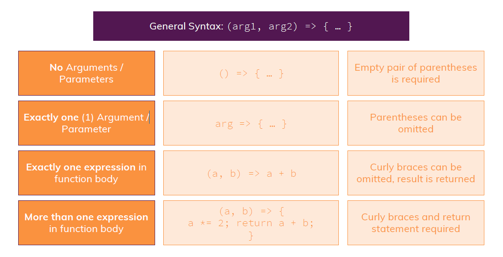

- **Use regular anonymous functions if you need to create methods for an object or else for simpler code prefer arrow function.**

## Rest Operator (...)

- In JavaScript, the rest operator (...) allows you to represent an indefinite number of arguments as an array for a function.
- Consider below code.

```
function sumOfNumbers(...AllArguments){
  let sum=0
  for(const i of AllArguments){
    sum+=i
  }
  console.log(sum)
}

sumOfNumbers(1,2,3,4,5,6)

Output:
21
```

- `...AllArguments` collects all the arguments passed to the `sumOfNumbers` function into an array called `AllArguments`.
- Consider below code

```
function display(firstElement,secondElement, ...restElements) {
  console.log(firstElement);  // Output: 1
  console.log(secondElement) // Output: 2
  console.log(restElements);   // Output: [3, 4, 5]
}

display(1, 2, 3, 4, 5);
```

- Here, the elements `1` and `2` goes into argument `firstElement` and `secondElement` respectively , rest all elements are taken up by the rest operator (`...`) into array `restElements`.
- **In a function definition, the rest operator must be the last parameter because it gathers the remaining arguments.**
- Below code will give your error because the rest operator is at the first in argument.

```
function display(...restElements, firstElement,secondElement) {
  console.log(firstElement);  // Output: 1
  console.log(secondElement) // Output: 2
  console.log(restElements);   // Output: [3, 4, 5]
}

display(1, 2, 3, 4, 5);
```

- On browser console


- **We cannot define multiple rest operators**.

```
Not allowed
function display(...restElements, ...restElements1) {

}

display(1, 2, 3, 4, 5);
```

- Example of Arrow function with rest operator.

```
let sumofnumbers=(...restElements)=>{
  let sum=0
  for(const i of restElements){
    sum+=i
  }
  return sum
}

console.log(sumofnumbers(1,2,3,4))

Output:
10
```

- Now the function has will consume only one argument, you don't need to declare parameter for it because JS provides `arguments` keyword.

```
let sumofnumbers=function (){
  let sum=0
  for(const i of arguments){ // don't use this.
    sum+=i
  }
  return sum
}

console.log(sumofnumbers(1,2,3,4))
```

- Before the rest operator, JavaScript functions had the arguments object, which gives you access to all the arguments passed to a function. The `arguments` keyword won't work with arrow function and **it is not highly recommended to use it**.

## Nested Function

- Nested functions means you can define one or more functions inside another function. The inner functions have access to the variables and parameters of the outer function.
- Lets see some example

```
function outerFunction(outerParam) {
  console.log("Outer parameter: " + outerParam);

  // Inner function
  function innerFunction(innerParam) {
    console.log("Inner parameter: " + innerParam);
  }

  innerFunction("Hello from inner function!");  // Calling inner function
}

outerFunction("Hello from outer function!");

Output:
Outer parameter: Hello from outer function!
Inner parameter: Hello from inner function!
```

- The inner function can access variables and parameters of the outer function, but the outer function cannot access variables of the inner function. Below is an example

```
function outerFunction(outerParam) {
  console.log("Outer parameter: " + outerParam);
  const outerVariable="I am outer function variable"

  // Inner function
  function innerFunction(innerParam) {
    console.log("Inner parameter: " + innerParam);
    console.log(outerVariable)
  }

  innerFunction("Hello from inner function!");  // Calling inner function
}

outerFunction("Hello from outer function!");

Output:
Outer parameter: Hello from outer function!
Inner parameter: Hello from inner function!
I am outer function variable
```

### Closure

- When the inner function retains access to the variables of the outer function even after the outer function has executed, it's called a **closure**. Lets see below example

```
function outerFunction(outerParam) {
  // Outer variable
  const outerVar = "I'm from outer scope!";
  
  // Inner function (closure)
  function innerFunction() {
    console.log(outerVar);  // Have kept the outerVar from outer function
  }

  return innerFunction;  // Return inner function
}

const inner = outerFunction();  // Call outer function and taking its inner method as in return, outer function execution got finished
inner();  // Calling inner method Output: I'm from outer scope!

Output:
I'm from outer scope!
```

- In this example, even though `outerFunction` has finished executing, the `innerFunction` still has access to `outerVar` because of the **closure**. This is a powerful concept in JavaScript.


## Defer Attribute

- Consider below code of **index.html** file and **app1.js**, **acceptDisplay.js** remains the same.

```
html file

<!DOCTYPE html>
<html lang="en">
  <head>
    <meta charset="UTF-8" />
    <meta name="viewport" content="width=device-width, initial-scale=1.0" />
    <meta http-equiv="X-UA-Compatible" content="ie=edge" />
    <title>Basics</title>
    <!-- <link
      href="https://fonts.googleapis.com/css?family=Roboto:400,700&display=swap"
      rel="stylesheet"
    /> -->
    <link rel="stylesheet" href="assets/styles/app.css" />

  </head>
  <body>
    <header>
      <h1>The Unconventional Calculator</h1>
    </header>

    <section id="calculator">
      <input type="number" id="input-number" />
      <div id="calc-actions">
        <button type="button" id="btn-add">+</button>
        <button type="button" id="btn-subtract">-</button>
        <button type="button" id="btn-multiply">*</button>
        <button type="button" id="btn-divide">/</button>
      </div>
    </section>

    <section id="results">
      <h2 id="current-calculation">0</h2>
      <h2>Result: <span id="current-result">0</span></h2>
    </section>

    
    <script src="assets/scripts/app1.js"></script>
    <!-- <script src="assets/scripts/app.js"></script> -->
    <script src="assets/scripts/acceptDisplay.js"></script>

  </body>
</html>


app1.js
alert("Hi")
console.log("Hi")
```

- Lets open **Performance** window using developer tools of chrome (open the chrome tab in incognito mode)


- Click on **Record and Reload** button.

<video controls src="Images/basicofjs/20241002-0823-36.6870588.mp4" title="Title"></video>

- You will get some time frame statistics which shows how much your web page took time to load the details. The performance tab allows us to get an idea of what the browser does in detail when it renders the pages.
- Lets carefully observer these stats.

<video controls src="Images/basicofjs/20241002-0828-03.6197769.mp4" title="Title"></video>

- Initially the network request was sent to load html file and it receive the response.


- Since our HTML files consist of external files like CSS and JS, those request was also sent by network.


- Moving further, the parsing of HTML code got started from line (0-34)


- Also the parsing of css got started.
- The browser stopped the parsing of HTML code and started compilation of JS file **app1.js**

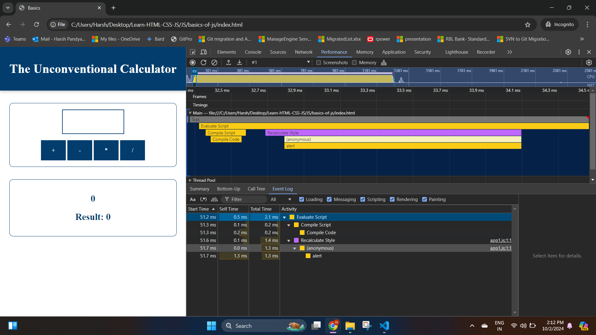

- Moving further, the browser executed **app1.js**, now again started parsing HTML file and **acceptDisplay.js**.

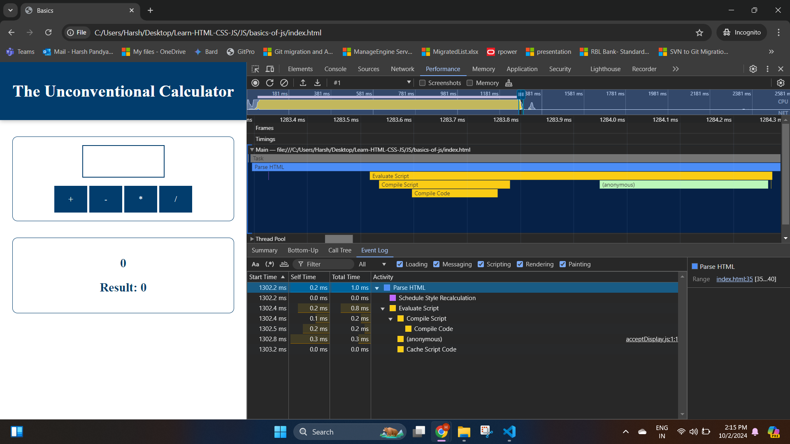

- Since there's not much time difference between but still we request the Javascript files only after the parsing is done or when it's almost done entirely because we do that at the bottom of the HTML file. So that's why we only request the files once we're almost done parsing the HTML document.
- Now what we effectively see that the **acceptDisplay.js** script evaluation was started around `1302.4ms` whereas those evaluation could be done earlier when the parsing of HTML was happening. Post evaluation we can execute the JS scripts.
- We don't want to execute the scripts earlier but loading them earlier, downloading them from the server earlier, so there is no latency. (Here the time frame is much in smaller scale but it could be larger when you built enterprise web applications)
- The solution is an extra attribute `defer` in the script.

```
<!DOCTYPE html>
<html lang="en">
  <head>
    <meta charset="UTF-8" />
    <meta name="viewport" content="width=device-width, initial-scale=1.0" />
    <meta http-equiv="X-UA-Compatible" content="ie=edge" />
    <title>Basics</title>
    <!-- <link
      href="https://fonts.googleapis.com/css?family=Roboto:400,700&display=swap"
      rel="stylesheet"
    /> -->
    <link rel="stylesheet" href="assets/styles/app.css" />

    <script src="assets/scripts/app1.js" defer></script>
    <!-- <script src="assets/scripts/app.js"></script> -->
    <script src="assets/scripts/acceptDisplay.js" defer></script>

  </head>
  <body>
    <header>
      <h1>The Unconventional Calculator</h1>
    </header>

    <section id="calculator">
      <input type="number" id="input-number" />
      <div id="calc-actions">
        <button type="button" id="btn-add">+</button>
        <button type="button" id="btn-subtract">-</button>
        <button type="button" id="btn-multiply">*</button>
        <button type="button" id="btn-divide">/</button>
      </div>
    </section>

    <section id="results">
      <h2 id="current-calculation">0</h2>
      <h2>Result: <span id="current-result">0</span></h2>
    </section>

    

  </body>
</html>
```

- **When you use `defer`, the browser downloads the script as soon as possible (in parallel with HTML parsing) but waits to execute it until the HTML document is completely parsed. This way, the script is ready to execute as soon as the HTML is fully loaded, but it doesn't block the rendering or parsing of the page**
- If you see the parsing is done and post that the script got executed

<video controls src="Images/basicofjs/20241002-0901-38.3162379.mp4" title="Title"></video>

## Async Attribute

- The `async` attribute in JavaScript is used in `<script>` tags to load and execute a script asynchronously, meaning the script is downloaded and executed independently of the HTML parsing.

```
<!DOCTYPE html>
<html lang="en">
  <head>
    <meta charset="UTF-8" />
    <meta name="viewport" content="width=device-width, initial-scale=1.0" />
    <meta http-equiv="X-UA-Compatible" content="ie=edge" />
    <title>Basics</title>
    <!-- <link
      href="https://fonts.googleapis.com/css?family=Roboto:400,700&display=swap"
      rel="stylesheet"
    /> -->
    <link rel="stylesheet" href="assets/styles/app.css" />

    <script src="assets/scripts/app1.js" async></script>
    <!-- <script src="assets/scripts/app.js"></script> -->
    <script src="assets/scripts/acceptDisplay.js" defer></script>

  </head>
  <body>
    <header>
      <h1>The Unconventional Calculator</h1>
    </header>

    <section id="calculator">
      <input type="number" id="input-number" />
      <div id="calc-actions">
        <button type="button" id="btn-add">+</button>
        <button type="button" id="btn-subtract">-</button>
        <button type="button" id="btn-multiply">*</button>
        <button type="button" id="btn-divide">/</button>
      </div>
    </section>

    <section id="results">
      <h2 id="current-calculation">0</h2>
      <h2>Result: <span id="current-result">0</span></h2>
    </section>

    

  </body>
</html>
```

- In performance tool, we can see the **app1.js** got executed before the parsing of CSS stylesheet.

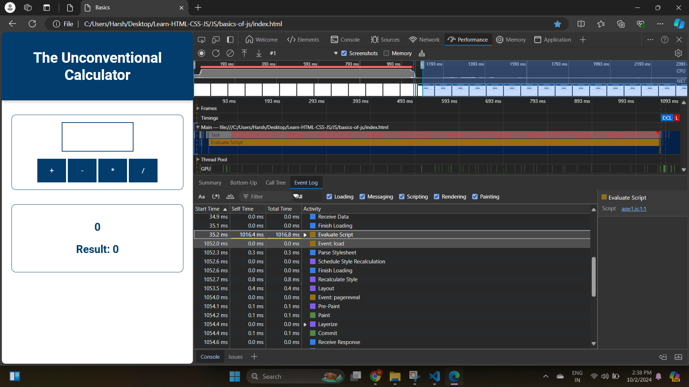

- `defer`: Scripts are executed after the HTML is fully parsed.
- `async`: Scripts are executed as soon as they are downloaded, which might happen before or after the HTML is parsed, depending on the download speed.


## Debugging using Developer Tools

- Lets say there is some syntax error in your JS code. You forgot `{` after your function like below.

```
function double(num1)
    return num1*2
}
```

- This can be caught within the editor, but this can be also caught on the developer tool of chrome.


- So under `Sources` go to the file **app1.js** which is throwing the error.


- So after fixing **app1.js**, lets open **acceptDisplay.js** file and perform some debugging on it.

<video controls src="Images/basicofjs/20241002-0953-18.3016412.mp4" title="Title"></video>

- Using **Watch Expression**, we can access variables name and its value and perform any required expression.
- Here we have button click event, we can also debug based on events


<video controls src="Images/basicofjs/20241002-1004-10.3502495.mp4" title="Title"></video>

- We can control the debugging by using the `Step in function` or `Step to next break point` any many more.
- We can also see the local and global scope of the variable even the Call Stack (show which function is calling other function)

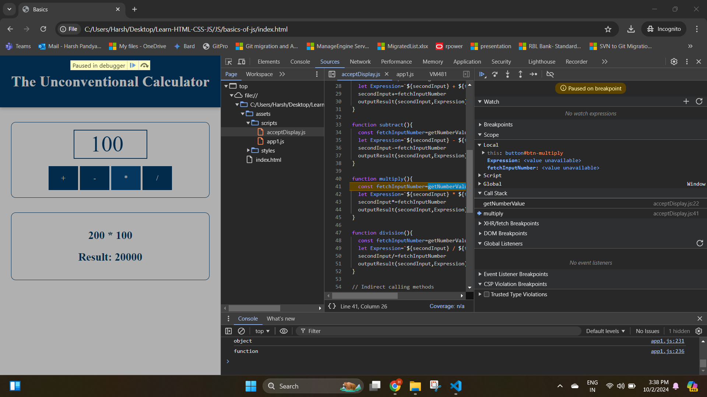

## Boolean Operator

- Lets say you wanna compare two value, you can do it using below, it will return `true` or `false`.

```
console.log(2==2) //true
console.log(2!=2) //false
```

- The `==` and `!=` (Not equals) operators are loosely comparator operators, what does this mean? now lets see below example

```
console.log(2=="2") //true
```

- So here on right hand side the data type is number whereas on left hand side the data type is string, the comparison is comparing the content and not the data type. Compares values after performing type coercion. It tries to convert both values to the same type before comparing.

```
5 == '5'  // true (type coercion: '5' is converted to 5)
null == undefined  // true (both are considered "empty" values)

5 != '5'  // false (type coercion makes '5' become 5)
null != undefined  // false (they are considered "equivalent empty" values)
```

- Now consider below code

```
console.log(2==="2") //false
```

- The operator `===` and `!==` compares content as well as data type strictly.

```
5 === 5  // true (same value, same type)
5 === '5'  // false (same value, different types)

5 !== 5  // false (same value, same type)
5 !== '5'  // true (same value, different types)
```

- Strict equality (`===`) and inequality (`!==`) are usually preferred for clarity and to avoid unexpected type coercion.
- Below are other operators 

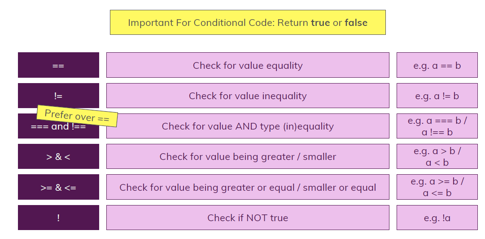

- Lets compare two arrays and two objects

```
//Arrays
let arr1 = [1, 2, 3];
let arr2 = [1, 2, 3];

console.log(arr1 === arr2);  // false (different memory locations)
console.log(arr1 == arr2);   // false (different memory locations)

let arr3 = arr1;
console.log(arr1 === arr3);  // true (same memory reference)

//Object
let obj1 = { name: 'John' };
let obj2 = { name: 'John' };

console.log(obj1 === obj2);  // false (different memory locations)
console.log(obj1 == obj2);   // false (different memory locations)

let obj3 = obj1;
console.log(obj1 === obj3);  // true (same memory reference)
```

- Even though `arr1` and `arr2` or `obj1` and `obj2` have identical content, they are different objects in memory. JavaScript treats each instance as unique unless they are explicitly assigned to the same reference, like `arr3 = arr1`.

- To compare arrays or objects by their contents, you need to manually iterate through the properties or use utility functions like `JSON.stringify()`

```
console.log(JSON.stringify(arr1) === JSON.stringify(arr2));  // true (compares their content)
```

## If-else Statement

- When we want to execute some block of statements based on a true condition, we can use `if-else` statement
- Lets see an example

```
if(3>2){
  console.log("3 is greater than 2") //This gets printed in the console.
}
else{
  console.log("2 is not greater than 3")
}
```

- So the `if(condition True)` checks if the condition is true then only executes the statement related to it `{...}`. 

```
if(2>3){
  console.log("3 is greater than 2") 
}
else{
  console.log("2 is not greater than 3") //This gets printed in the console.
}
```

- Lets say you wanna also check whether `2===2`? you can do it using `else if` and pass this condition.

```
if(2>3){
  console.log("3 is greater than 2") 
}
else if(2==2){
  console.log("2 is equal to 2") //This gets printed in the console.
}
else{
  console.log("2 is not greater than 3")
}
```

- You can also have multiple `else if` blocks, nested `if-else`, something like below

```
if(){
  if(){

  }
  else{

  }
}
else{
  if(){

  }else if(){


  }
  else{

  }
}
```


## Logical Operators

- Lets say you wanna combine multiple conditions you can use `&&` (AND) operator or `||` (OR) operator.

```
let age = 25;
let hasID = true;

if (age >= 18 && hasID) {
  console.log("Allowed to enter."); // This gets printed as both condition is satisfied
} else {
  console.log("Not allowed to enter.");
}

let age = 16;
let hasPermission = true;

if (age >= 18 || hasPermission) {
  console.log("Allowed to enter."); //This gets printed since hasPermission condition value is true
} else {
  console.log("Not allowed to enter.");
}
```

## Truthy and Falsy

- `true` and `false` are the actual Boolean values in JavaScript. They are of the Boolean data type and can only be one of the two: `true` or `false`. These are the exact representations of truth and falsehood in logical expressions.

```
let isTrue = true;  // This is literally true
let isFalse = false; // This is literally false
```

- Consider below code

```
let aString="Hi"
if(aString){
  //Block executes
}
else{

}
```

- Here in the `if()` block we are not performing any logical comparision which gonna return true or false. We are just passing a variable now since `if()` block requires boolean data type value in its `()` condition, JavaScript performs **type coercion** and evaluates the `aString` variable in form of boolean.


- **Truthy and falsy values are non-Boolean values that JavaScript treats as true or false when evaluated in a Boolean context (such as in an if statement or logical operations).**

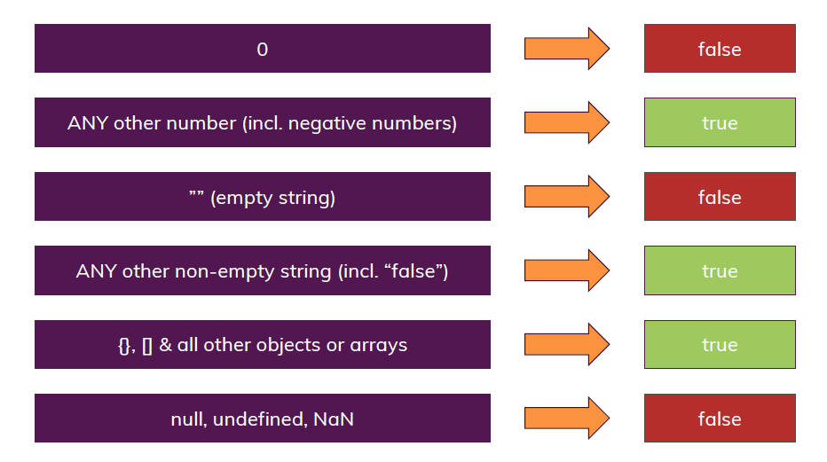

- Consider below code


```
let age=0;
if (age) {

}else {
  //Block executes
}
```

- Here age is **0** which is consider as `false` or evaluated as **falsy** by JavaScript using **type coercion**.
- In JavaScript, `null`, `undefined`, and `NaN` are all falsy values. This means they are treated as false when evaluated in a Boolean context.
- Consider below code

```
console.log(!""); 
// Explanation: The `!` (NOT) operator flips the truthiness of the value.
// An empty string `""` is falsy, so `!""` becomes true.
 
console.log(!!""); 
// Explanation: The `!!` is like a double negation.
// First, `!""` is `true` because `""` is falsy.
// Then `!true` becomes `false`, so `!!""` results in `false`.

console.log(!!!"");
// Explanation: Triple negation. 
// First, `!""` is `true` (because `""` is falsy).
// Then `!!""` is `false` (double negation).
// Finally, `!!!""` is `true` (because `!false` is `true`).

// Using OR (`||`)

console.log("first" || "second");
// Explanation: The `||` (OR) operator returns the first truthy value it encounters.
// "first" is truthy, so it stops evaluating and returns "first".

console.log("first" || "second" || "third");
// Explanation: Similar to the previous example, "first" is truthy.
// It returns "first" without evaluating the other values.

console.log("" || "second");
// Explanation: The first value `""` is falsy, so it moves to the next value.
// "second" is truthy, so it returns "second".

// Using AND (`&&`)

console.log("first" && "second");
// Explanation: The `&&` (AND) operator returns the first falsy value or the last truthy value.
// "first" is truthy, so it evaluates "second", which is also truthy, so it returns "second".

console.log("first" && "second" && "third"); 
// Explanation: All values are truthy, so `&&` evaluates all of them and returns the last value.
// It returns "third" because both "first" and "second" are truthy and there’s no falsy value.
```

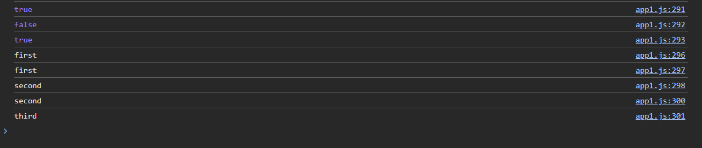


- **||** (OR) logical operator when evalutes multiple falsy/truthy value it returns **first** truthy value within the evaluated expression (if there is no truthy value in the expression then it returns the **last falsy** value), whereas **&&** returns the **last** truthy value when all values are truthy, **else any falsy value is found it will return first falsy value**.
- Consider below example

```
OR Operator
const enteredValue = ''; // let's assume this is set based on some input provided by the user, therefore it might be an empty string
 
const userName = enteredValue || 'PLACEHOLDER'; // will assign 'PLACEHOLDER' if enteredValue is an empty string
              // False || True ----> || operator returns the first truthy value which is 'PLACEHOLDER'

const enteredValue = '';
const userName = undefined || NaN || null || enteredValue; // Assigns ''
            // False || False || False || False ----> || operator returns last falsy which is '' because there is not truthy value found

AND Operator
const AndOperator= "Hello" && "Hi" && null // null gets assigned
                  // True && True && False -----> && operator return falsy which is null
const AndOperator1 = null && NaN && undefined // null gets assigned
                  // False && False && False ------> && operator return first falsy which is null
```


## Operator Precedence

- Consider below code.

```
console.log((3+3)*3) // Prints 18
```

- Here the preference is first given to `()` for computing and then `*`.

```
console.log(3+2 < 9-3) //Prints 6 (5<6)
console.log(5 + 2 === 7 && 4 > 5 || 'Hi' === 'Hi') //Prints true (7==7-> true AND 4>5-> false OR "Hi"="Hi" -> true)
```

- Each operator has a precedence you can find out [here](https://developer.mozilla.org/en-US/docs/Web/JavaScript/Reference/Operators/Operator_precedence#table)

## prompt()

- In JavaScript, the `prompt()` function is used to display a dialog box that prompts the user to input some text. It pauses the execution of the script until the user enters a value or cancels the input.
- Consider below code

```
let UserName = prompt("What is your name?", "defaultUserName because name not given");
console.log("User's name is: " + UserName);

//If user enters name as Rahul -> User's name is: Rahul -> Gets print out on console
```

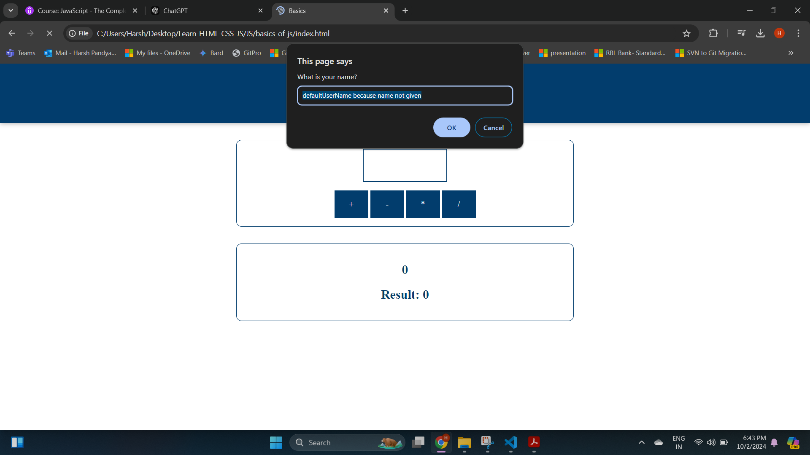

## Ternary Operator

- Consider below code.

```
function vote(age){
  if(age<18){
    return "You cannot vote"
  }
  return "You can vote"
}

console.log(vote(19)) //Prints "You can vote"
```

- We can simplify the code using **ternary operator** like below

```
let age = 18;
let canIVote = (age >= 18) ? "You can vote" : "You cannot vote";
console.log(canIVote); // Output: You can vote
```

- In JavaScript, the conditional (ternary) operator is a shorthand for the `if...else` statement. It allows you to perform conditional logic in a more concise manner, typically in a single line of code.
- Syntax is

```
condition ? expressionIfTrue : expressionIfFalse;
```

- If the `condition` is true, the first expression (`expressionIfTrue`) is executed. If the `condition` is false, the second expression (`expressionIfFalse`) is executed.

## Switch-Case

- The switch statement is a control flow statement that allows you to evaluate an expression against multiple possible cases. It can be used as an alternative to multiple `if...else` statements when you have a variable that you want to compare against several different values.
- Syntax

```
switch (expression) {
  case value1:
    // Code to execute if expression === value1
    break; // Optional
  case value2:
    // Code to execute if expression === value2
    break; // Optional
  // Add more cases as needed
  default:
    // Code to execute if none of the cases match
}
```

- Here the expression is matched based on content as well as data type (`===`)
- Lets see an example

```
let fruit = "apple";

switch (fruit) {
  case "banana":
    console.log("Banana is yellow.");
    break;
  case "apple":
    console.log("Apple is red or green."); //Prints out
    break;
  case "orange":
    console.log("Orange is orange.");
    break;
  default:
    console.log("Unknown fruit.");
}
```

- The switch statement evaluates the expression once and compares its value to each case clause. Each case represents a potential match for the value of the expression. If a match is found, the corresponding block of code executes. The **`break`** statement exits the switch block. If removed, the program will continue executing the next case (this is called "fall-through").

```
If break keyword is removed , all the cases (which don't matched) below the case which got matched will be executed
Apple is red or green.
Orange is orange.
Unknown fruit.
```

- Consider below code

```
let fruit = "appe";

switch (fruit) {
  case "banana":
    console.log("Banana is yellow.");
    break;
  case "apple":
    console.log("Apple is red or green.");
    break;
  case "orange":
    console.log("Orange is orange.");
    break;
  default:
    console.log("Unknown fruit."); //Prints out
}
```
- The default case is optional and executes if none of the cases match.

## Loops

- Loops are used to execute a block of code repeatedly as long as a specified condition is true. There are several types of loops in JavaScript, each serving different use cases.

### For Loop

- The for loop is used when you know in advance how many times you want to execute a statement or a block of statements.

```
for (let i = 0; i < 5; i++) {
    console.log(i); 
}

Outputs:
0
1
2
3
4
```

### While Loop

- The while loop executes a block of code as long as the specified condition is `true`. It checks the condition before executing the loop body.

```
let i = 0;
while (i < 5) {
    console.log(i); 
    i++;
}

Outputs:
0
1
2
3
4
```

### Do While Loop

- The `do...while` loop is similar to the `while` loop, but it guarantees that the loop body will execute at least once since it checks the condition after the loop body.

```
let i = 0;
do {
    console.log(i); 
    i++;
} while (i < 5);


Outputs:
0
1
2
3
4
```

### For of Loop

- The `for...of` loop is used to iterate over iterable objects, such as arrays, strings, or other collections.


```
const Allfruits = ["apple", "banana", "orange"];
for (const i of Allfruits) {
    console.log(i); 
}

Output:
apple
banana
orange
```

### For in Loop

- The `for...in` loop is used to iterate over the enumerable properties of an object. It is primarily used with objects, but it can also iterate over array indices.

```
Objects
const person1 = { name: "Alice", age: 25, city: "Wonderland" };
for (const key in person1) {
    console.log(key + ": " + person1[key]);
}

// Outputs:
// name: Alice
// age: 25
// city: Wonderland

Arrays
for(const k in Allfruits){
  console.log("Index - "+k+" , fruit name - "+Allfruits[k])+
}

Output:
Index - 0 , fruit name - apple
Index - 1 , fruit name - banana
Index - 2 , fruit name - orange
```

>[!NOTE]
> - The difference between `for..of` and `for..in` is, the iterator variable holds the actual value of the elements in the iterable incase of `for..of` whereas in `for..in`, the iterator variable holds the property names (keys) or indexes of the enumerable properties of the object (for arrays, it will be the index).
> - `for..of` is used when you want to work directly with the values in an array or other iterable. `for..in` used for objects where you want to access the keys and their corresponding values.


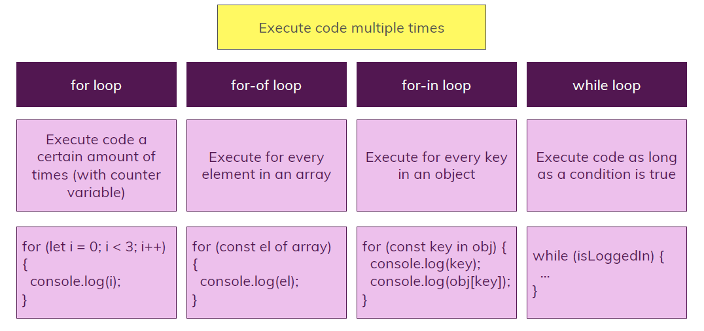


## Break & Continue Keyword

- You can use the `break` statement to exit a loop before it has completed all its iterations.

```
for (let i = 0; i < 10; i++) {
    if (i === 5) {
        break; // Exit the loop when i is 5
    }
    console.log(i); // Outputs: 0, 1, 2, 3, 4
}
```

- You can also use the `continue` statement to skip the current iteration and continue with the next one.

```
for (let i = 0; i < 10; i++) {
    if (i % 2 === 0) {
        continue; // Skip even numbers
    }
    console.log(i); // Outputs: 1, 3, 5, 7, 9
}
```

## Label Statement

- Label statement is used to label a block of code. A labeled statement can be used with loops and control flow statements to provide a target for the break and continue statements. You can use labels with loops to control the flow of your program more precisely.
- Lets see an example

```
outerLoop: // This is the label
for (let i = 0; i < 3; i++) {
    console.log("Outer loop iteration: " + i);
    
    innerLoop: // Another label
    for (let j = 0; j < 3; j++) {
        if (j === 1) {
            break outerLoop; // Breaks out of the outer loop
        }
        console.log("  Inner loop iteration: " + j);
    }
}
console.log("Program Executed")


Output:
Outer loop iteration: 0
  Inner loop iteration: 0
Program Executed
```

- Labels are optional and should be used sparingly, as they can make code harder to read. Labels can help you manage complex nested loops where you need to control which loop to break out of or continue.

## Error Handling

- Error handling in JavaScript allows you to manage exceptions (errors) that occur during code execution. Instead of the script stopping abruptly when an error occurs, you can catch and handle the error gracefully. This helps ensure that your code behaves more predictably, even in the presence of errors.
- Some Error can be handle by showing some alert or executing other block whereas some erros can't be handle like connectivity erros etc..

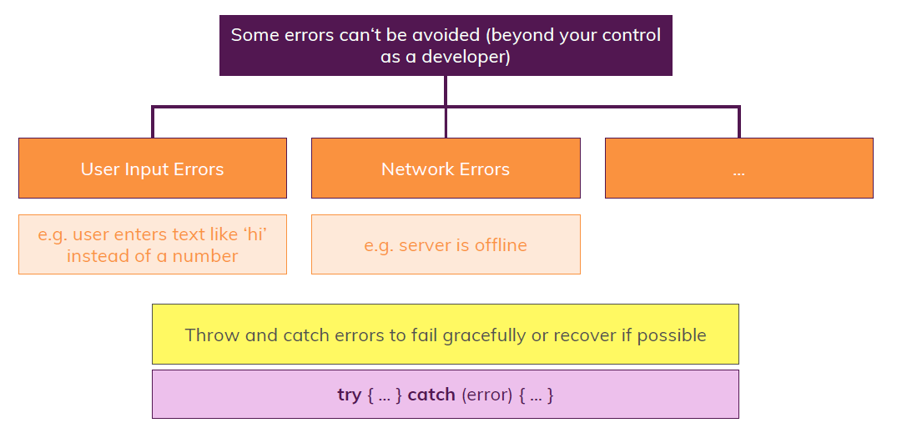

### try-catch

- The `try...catch` block is the most common way to handle errors in JavaScript. It allows you to "try" to execute some code and "catch" any errors that occur during the execution.

```
try {
  myFunctionWhichIsNotDefined() // No such function is defined
} catch (catchError) {
  console.log("An error occurred: " + catchError.message);
}
```


### Finally

- The `finally` block is an optional block that can be added after `catch`. It is executed regardless of whether an error occurred in the `try` block or not. It’s often used for cleanup tasks, like closing resources (e.g., closing files or connections).

```
try {
    let result = JSON.parse('{"key": "value"}');
    console.log(result);
} catch (error) {
    console.log("An error occurred: " + error.message);
} finally {
    console.log("This block always runs, error or not.");
}
```


### Throw

- Consider below code

```
let numerator=10
let denominator=0
try{
  console.log("Division Result - " +numerator/denominator)
}catch(e){
  console.log("Error Caught "+e.message)
}
```

- The output is `Infinity`


- In such case you need to indicate your program or if the end user (incase of accepting input) that the `denominator` must not be 0. You can `throw` your own custom `Error`.

```
let numerator=10
let denominator=0
try{
  if(denominator===0)
    throw new Error("Denominator cannot be 0 Exception")
  console.log("Division Result - " +numerator/denominator)
}catch(e){
  console.log("Error Caught "+e.message)
}
```

- On console.


- JavaScript provides a built-in `Error` object, which you can use to throw standard errors with custom messages.

## ES5 (ECMAScript 5) vs ES6 (ECMAScript 6)

- ECMAScript is a standard specification which is used by JavaScript. So over time, ECMAScript and therefore Javascript evolved, it had a slow evolvement and it became more and more important and one major version that was released in the past was basically **ECMAScript version 5**, you could say, this is just a term that was assigned to one specific version of that standard that was released and that was agreed by all browser.
- Now ECMAScript 5 included some important improvements and most importantly, standardization back then because before that, a lot of browsers basically did what they wanted like implement their own type of JavaScript and ECMAScript 5 was the first real big standard. We then had one common ground for browsers to implement features, so that was very important.
- **After ECMAScript 5, the next major milestone was ECMAScript 6 (ES6), also known as ECMAScript 2015**, which was a huge leap forward for the language. ES6 introduced many modern features and improvements that addressed several limitations of ES5. It was a pivotal update that made JavaScript more powerful, expressive, and better suited for building large-scale applications.
- ES6 brought features like `let` and `const` for block-scoped variables, classes for better object-oriented programming, arrow functions for concise function syntax, promises for easier handling of asynchronous operations, and modules for organizing code. These additions significantly improved developer productivity and made JavaScript more manageable for complex projects.
- One key motivation for ES6 was to help JavaScript catch up with the evolving needs of web development. JavaScript had become a crucial language for both client-side and server-side programming, and with this, developers demanded more structured, maintainable, and performant code.
- ES6 also introduced features like the `for-of` loop, default parameters, template literals, and the spread and rest operators, making the language more flexible and modern. These improvements not only enhanced the way developers wrote code but also increased compatibility across different browsers due to the standardized specification.
- ES5 is compatible with all browsers, including old ones, but lacks modern syntax and features. ES6 introduces powerful new features. **Modern browsers fully support ES6**. Now in ES6 , the features of ES5 won't be remove as it would lead to issue supported by old browser who is using ES5 standards.
- All the above learnings are based on ES6.

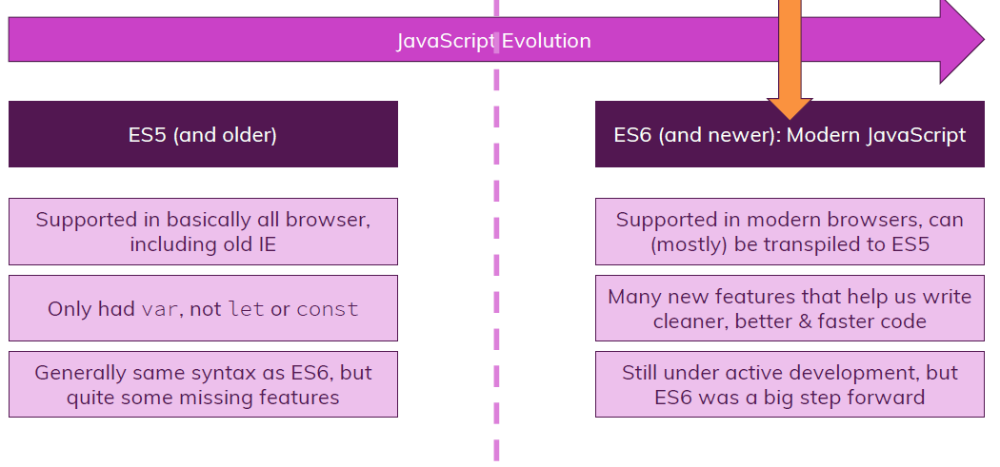

### var

- `var` (from ES5) is similarly like `let` (from ES6) which are used to initialize or declare variables. But there are major difference.

#### Scope

- Consider below code which has usage of `var`.

```
if(true){
  var AvarVariable1=10;
}

console.log(AvarVariable1) // Accessible outside the if block (global scope)

function AvarFunc(){
  if(true){
    var AvarVariable=20;
  }
  
  console.log(AvarVariable) // Accessible outside the if block (local scope)
  console.log(AvarVariable1)
}

AvarFunc()

Output:
10
20
10
```

- `var` has function scope, meaning it is accessible throughout the entire function where it's defined. If defined outside of a function, it's globally scoped.

- Consider below code which has usage of `let`. (Completely same as above)

```
if(true){
  let AvarVariable1=10;
}

console.log(AvarVariable1) // Not accessible

function AvarFunc(){
  if(true){
    let AvarVariable=20;
  }
  
  console.log(AvarVariable) // Not accessible
  console.log(AvarVariable1) // Not accessible
}

AvarFunc()

Output:
app1.js:446 Uncaught ReferenceError: AvarVariable1 is not defined
    at app1.js:446:13
```

- `let` has block scope, meaning it is only accessible within the block `{}` in which it is defined (such as an `if` or `for` block or functions etc..).

```
function example() {
  if (true) {
    let y = 5; // let is block-scoped
  }
  console.log(y); // ReferenceError: y is not defined
}
example();
```

- **`var` can lead to unexpected behavior because it's accessible outside the block, while `let` is confined to the block, making it more predictable and less error-prone.**

- Consider below code.

```
// Below is a block
{
  let v1=10
  var v2=20
}

console.log(v2)
console.log(v1) // Not accessible , because let has a Block scope {..}

Output:
20
app1.js:466 Uncaught ReferenceError: v1 is not defined
    at app1.js:466:13
```
- Consider below code for `const` both variables has different scope but names are same.

```
// global scope
const bar = 41;
console.log(bar); // 41

if (true) { // block scope
 const bar = 42; // Looks like re-initialize but it is not, the scopes are different thats why
 console.log(bar); // 42
}

console.log(bar); // 41
```

#### Re-declaration

- Consider below code which uses `var`.

```
var a = 5;
var a = 10; // No error
```

- Using `var` you can redeclare the same variable in the same scope.

- Consider below code which uses `let`.

```
let b = 5;
let b = 10; // SyntaxError: Identifier 'b' has already been declared
```

- Using `let` you cannot redeclare a variable in the same scope.
- The re-declaration of using `var` will create confusion for developers whether the variable was already declare or not , so the existing variable which was used for different functionality purpose will won't work if re-declared.

#### Global Object Property

- In JavaScript, the global object is an object that represents the global environment in which your code runs. In browsers, this global object is called `window`.
- Consider below code which uses `var`.

```
var x = 10;
console.log(window.x); // 10
```

- In this example, the variable `x` becomes a property of window. So, you can access `x` using `window.x`. This means the global var-declared variable and `window.x` refer to the same value.
- Consider below code which uses `let`.

```
let y = 10;
console.log(window.y); // undefined
```

- `let` variables are not added as properties of the global object.

>[!NOTE]
> - The `window` object holds all the global variables and functions in a browser. When you use `var`, you unintentionally add properties to this global object, which can cause conflicts if different parts of your code (or third-party scripts) use the same variable names. This is called **global scope pollution** and is one of the reasons why `let` is preferred, as it does not add variables to the global object.


#### Hoisting

- Consider below code which uses `var`.

```
console.log(a); // undefined (because of hoisting)
var a = 10;
```

- Consider below code which uses `let`.

```
console.log(b); // ReferenceError (cannot access 'b' before initialization)
let b = 20;
```

- **Javascript has a special feature called hoisting** which in the end means that the Javascript engine, the browser, when it loads your script goes over your entire script and it does things like look for functions which it then automatically loads and registers so that you can write functions below your logic or above your logic as position does not matters for it, it does the same for variables and for variables created with `var`, it actually pulls this variable declaration to the beginning of your file. The browser moves function and variable declarations to the top of their respective scope before executing the code but it just declare them it does not initialize them.
- In JavaScript hoisting is done for `var` as well as for `let` and `const`.
- For `var` the variables are moved up and are declared and assign with `undefined` as its value. So that you get no error message.
- **Hoisting means that JavaScript moves variable declarations to the top of their scope, but `var` gets initialized to undefined, while `let` remains uninitialized until it is encountered in the code**.
- Hoisting is the process of the JavaScript compiler reading variable declarations first to create space in memory for them. Variables declared with `let` and `const` are hoisted to the top of their scope, but they are not initialized. **This means that the block of code is aware of the variable, but it cannot be used until it has been declared because those variable are in TDZ (temporal dead zone) meaning that any attempt to access them will result in a reference error (`ReferenceError`).**
- Consider below code for `const` both variables has different scope but names are same.

```
// global scope
const bar = 41;
console.log(bar); // 41

if (true) { // block scope
 console.log(bar); // ReferenceError (not 41) <-- PROOF OF THE HOISTING / TDZ , consist of the `block scope` bar constant and not the global scope bar constant
 const bar = 42; // Looks like re-initialize but it is not, the scopes are different thats why
 console.log(bar); // 42
}

console.log(bar); // 41
```

- Inside the if block, a new block-scoped variable `bar` is declared using `const`. This creates a new variable within the block that shadows the **global** `bar`.
- When the first `console.log(bar)` is encountered before the block-scoped `bar` is declared, JavaScript is aware of the block-scoped `bar`, but since it hasn’t been initialized yet (**because of hoisting and the temporal dead zone**), it throws a `ReferenceError`.
- Once you declare and initialize `const bar = 42`;, the next `console.log(bar)` will outputs `42` as it refers to the block-scoped `bar`.

>[!NOTE]
> - Since there are so many issues with `var` it can be removed right in ES6 ? No, because many other browser uses `var` variables, removing it will make the browser unstable and error prone.

### Strict Mode

- Consider below code.

```
function setName() {
  userName = "ABC"; // Implicit global variable!
}

setName();
console.log(userName); // ABC (global scope)

Output:
ABC
```

- Here if you see we have not define `var`, `let` or `const` against our variable name `userName`, still it got printed why so? JavaScript will automatically treat this as `var userName = "ABC"` and will be placed in the **global scope**, even if it's inside a function. Such mode of declaring variables is called as **non-strict or default mode**.
- This can lead to bugs because if you forget to declare a variable with `var`, `let`, or `const`, it can unintentionally leak into the global scope.
- Now consider below code

```
"use strict";

function setName() {
  userName = "ABC"; // Implicit global variable!
}

setName();
console.log(userName); // ABC (global scope)

Output:
Uncaught ReferenceError: userName is not defined
    at setName (app1.js:6:12)
    at app1.js:9:1
```

- In strict mode, this behavior changes. JavaScript will not allow you to declare a variable without `var`, `let`, or `const`. If you try to assign a value to an undeclared variable, it will throw a `ReferenceError`.
- **In non-strict mode, JavaScript implicitly treats the undeclared variable as a global variable (like a `var` in global scope), but it's not recommended. In strict mode, assigning to an undeclared variable throws an error. You must explicitly declare variables using `var`, `let`, or `const` to avoid issues**.
- You can also enable strict mode inside a specific function.

```
function myFunction() {
  "use strict";
  var y = 3.14;
}
```

- Consider below code without strict mode

```
function setName(a,a) {

  console.log(a+a)
}

setName(1,1);

Output:
2
```

- Now consider below code with strict mode

```
"use strict";

function setName(a,a) {

  console.log(a+a)
}

setName(1,1);
```

- On browser console

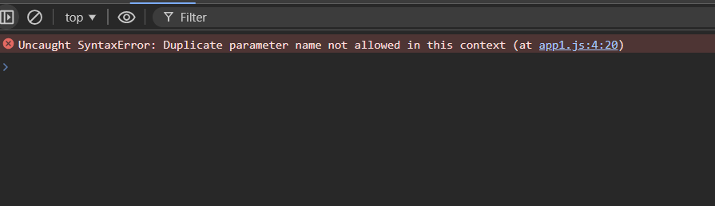

- **In strict mode, functions can’t have duplicate parameter names.**
- There are several other things which are disallowed or disabled in [strict mode](https://developer.mozilla.org/en-US/docs/Web/JavaScript/Reference/Strict_mode#changes_in_strict_mode)

## Primitive vs Reference Values

- In JavaScript, values are categorized into two types: primitive values and reference values.

### Primitive value

- Primitive values are the most basic types of data in JavaScript, and t**hey are stored directly on the stack** (Memory management). When you work with a primitive value, you are dealing with the actual value itself.
- Primitive types in JavaScript, number, string, boolean, undefined, null etc..
- They are immutable (cannot be changed). They are **copied by value**, meaning if you assign a primitive value to another variable, the new variable gets a copy of the original value, not a reference to it.

```
let a = 10;  // Primitive value (number)
let b = a;   // Copy of the value of 'a'

console.log(a); // 10
console.log(b); // 10

b = 20; // Changing 'b' doesn't affect 'a'

console.log(a); // 10 (a remains the same)
console.log(b); // 20 (b is now updated)
```

### Reference value

- Reference values in JavaScript are objects. They include:  object, array, function.
- Unlike primitive values, reference values are stored in the heap, and the variable holds a reference (or memory address) to where the object is stored in memory. When you work with reference values, you’re dealing with references (or pointers) to the objects, **not the objects themselves**.
- They are mutable (can be changed). They are **copied by reference**, meaning when you assign a reference value to another variable, both variables point to the same object in memory.

```
let person1 = { name: "John", age: 30 }; // Reference value (object)
let person2 = person1; // Copy the reference, not the object itself

console.log(person1.name); // John
console.log(person2.name); // John

person2.name = "Jane"; // Changing 'person2' affects 'person1'

console.log(person1.name); // Jane (person1 is also changed)
console.log(person2.name); // Jane
```

| **Primitive Values**              | **Reference Values**                           |
|-----------------------------------|------------------------------------------------|
| Stored on the stack               | Stored in the heap                             |
| Copied by value                   | Copied by reference                            |
| Immutable (cannot be changed)     | Mutable (can be changed)                       |
| Each variable holds its own value | Variables share a reference to the same object |
| Examples: number, string, boolean | Examples: object, array, function              |


- Primitive values are simple data types (like numbers or strings) that are copied by value. Changing one copy does not affect the other. Reference values are objects or arrays, and they are copied by reference, meaning changes to one variable will affect the other because they both point to the same object in memory.

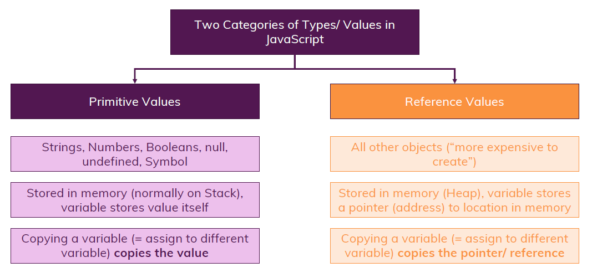


## Memory Management

- The memory life cycle defines a JavaScript variable or object’s journey from initialization to removal.


- **Initialization** is the creation of the variable. In JavaScript, we do this using the `let`, `const`, or `var` keywords. During this stage, the JavaScript Engine reserves memory for the variables and stores the values inside the allocated memory space.

```
let name = 'dummy';
```

- **Accessing** is using the variable of the object inside the code. Many times, we’ll also be modifying the values of these variables or objects during this stage.

```
if (name === 'dummy') {
  // Changing the value
  name = 'DUMMY!';
}
```

- Removal is the deallocation of the reserved memory taken up by the variables. After deallocation, we won’t be able to access the variable from our JavaScript code. For example, we cannot access the variables created inside a function.

```
function sum() {
  let x = 10;
  let y = 20;
  let sum = x + y;
}

console.log(x); // This will throw and error!
```

- The 3 phases or parts of the memory life cycle which are the same for all programming languages are;
  - **Allocation** when we declare a variable, we need to allocate the memory. In JavaScript, this is handled automatically.
  - **Using** the allocated memory.
  - **Releasing** the memory when not in use anymore. In JavaScript, this is handled automatically (it is called **JavaScript garbage collection**).

- We talked about allocation and deallocation, but the question is that where do these allocations and deallocation happen?
- JavaScript consists of two types of memory spaces, i.e., Stack and Heap, to store variables. The difference between them is what variables get stored in which type of storage. Let’s take a closer look at stacks and heaps.


### Stack

- Stack is kind of the short term memory. It manages our program flow and mainly that means that the stack keeps control over which function is currently executing.
- Let’s say you have some variables that you add one by one to the stack. The last variable pushed is at the top, which means it will be the first to get removed when the memory gets de-allocated.
- JavaScript uses the stack data structure to **store static or fixed-size data**. This includes all numbers, strings, booleans, and other primitive data types. **These data types have a fixed size known at compile time**. Variables such as objects, arrays, etc., are not stored in the stack as their size varies during run time.

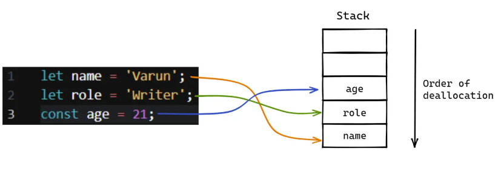

### Heap

- Since Stack can only store fixed-size or static data, where does JavaScript store dynamic data? The answer is Heap. The heap memory, unlike stack memory, doesn’t have a fixed-size limitation, i.e., **the memory gets allocated dynamically**.
- JavaScript uses a heap for storing variables whose size is unknown at compile time or may vary at the run time, such as objects, arrays, functions, etc.
- The JavaScript Engine dynamically allocates memory to the heap. Initially, the heap size depends on available system memory, and it can be dynamically increased/decreased based on the need.
- Accessing data in the heap is slower compared to the stack.


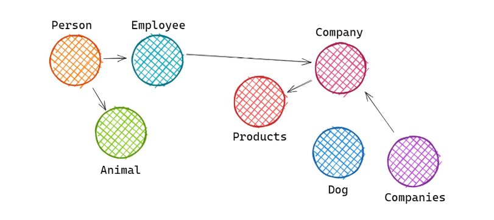

>[!NOTE]
> - You can check the current memory usage of your **Node.js** application using the `process.memoryUsage()` method.
> - You may manually adjust the heap size of your **Node.js** process by simply passing the **`--max_old_space_size`** flag using the command line.

- JavaScript allocates memory for objects within the heap, but we must have a reference to that memory location to access the value. The reference to the memory location resides in the stack memory.


- Below is an example how the code is represented in stack and heap

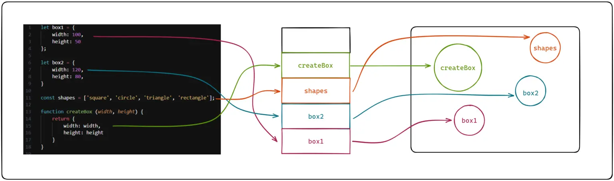

- Consider below example where two variable have same value , this means they are reference the same object but as different reference values which are stored inside the stack. **The stack consist of reference values to objects and not object**.


- From the picture we can see how different values are stored, both the `“person”` and `“newPerson”` objects are stored in the heap and they point to the same object (our object also means object in JS and functions). But a reference to it is stored in the stack.
- We can see the how stack works using developer tools on chrome. Consider below code.

```


function function1(){
  let a=100
  let b=1001
  console.log(a+b)
}
function function2(){
  function1()
  console.log(2)
}
function function3(){
  function2()
  console.log(3)
}
function function4(){
  function3()
  console.log(4)
}

function4()
```

- Lets open the browser and add debugger and watch how the **Call Stack** works.

<video controls src="Images/basicofjs/20241003-1133-57.3815335.mp4" title="Title"></video>


- If you see initially `function4()` was in the stack, since `function4()` called `function3()` , so the `function3()` also got into the stack at the top. Same way when `function3()` called `function2()`, even the `function2()` got stacked, Similarly `function1()` got stacked at the top.
- Now as soon as `function1()` execution got finished it was removed from the stack, when `function2()` execution got finished it got removed from the stack and so on `function3()` and `function4()` following LIFO (Last-In-First-Out) order.
- If you notice there is something called **anonymous** in the call stack video. What is it?
- Now in the stack, it all starts with some **anonymous** code execution which basically is the script file itself, it doesn't have a name. **For JavaScript your JS file is itself a function without any name thats why you can see it is called anonymous**. It is basically your script getting executed.


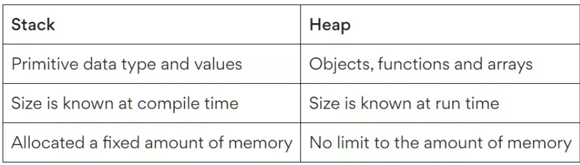


### Garbage Collector

- In the memory life cycle which we discussed previously, shows that there is one last step; releasing the memory when not in use. This process is handled automatically by JavaScript i.e the JavaScript garbage collector takes care of this.
- When an object in the heap is no longer referenced by any variable (i.e.,those variables in stack which has no references pointing to it ), it becomes eligible for garbage collection. The JavaScript engine’s garbage collector will automatically reclaim that memory, preventing memory leaks.
- Consider below code

```
let vari={name:"ABC",age:12}
vari=null
```

- `vari` is the reference variable which points the object `{name:"ABC",age:12}`. So making `vari=null` we tell JS that the object `{name:"ABC",age:12}` is eligible for garbage collection.
- In the V8 engine, the Garbage Collector (GC) runs periodically to automatically manage memory by identifying and reclaiming memory that is no longer in use. This process helps prevent memory leaks and ensures that memory is efficiently reused during program execution.
- The garbage collector runs automatically and periodically without developer intervention. The timing depends on the V8 engine’s internal logic, which checks for memory pressure, the number of unreachable objects, to trigger a garbage collection cycle.

```
function createObject() {
    let obj = { name: "Object1" };
    // The object is used here
    console.log(obj.name); // Output: Object1
}

// After createObject() is done, 'obj' is no longer referenced
createObject(); 

// 'obj' becomes unreachable and eligible for GC after the function execution ends
```

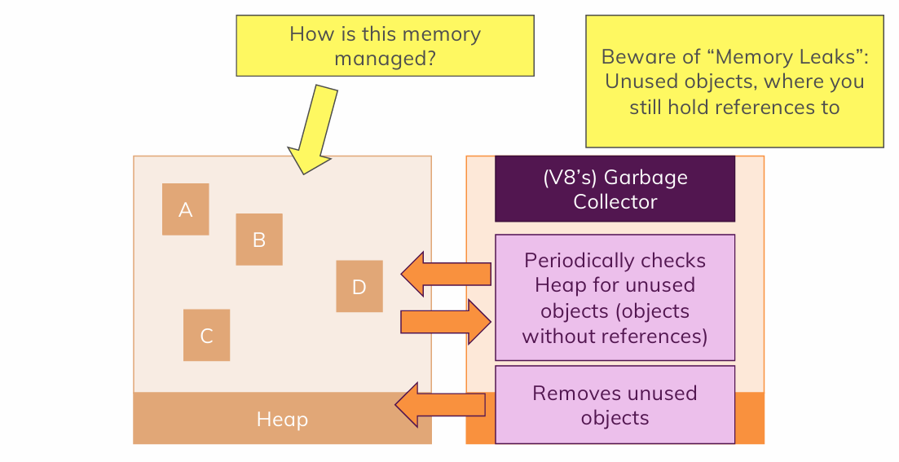

- Now consider below HTML and JS code.

```
HTML Code
<!DOCTYPE html>
<html lang="en">
<head>
  <meta charset="UTF-8">
  <meta name="viewport" content="width=device-width, initial-scale=1.0">
  <meta http-equiv="X-UA-Compatible" content="ie=edge">
  <title>Behind the Scenes</title>
  <script src="assets/scripts/memoryleakexampleJS.js" defer></script>
</head>
<body>
  <input type="text" id="click-message-input">
  <button id="add-listener-btn">Add a listener to the other button</button>
  <button id="clickable-btn">Click me</button>
</body>
</html>


JS Code
const addListenerBtn = document.getElementById('add-listener-btn');
const clickableBtn = document.getElementById('clickable-btn');
const messageInput = document.getElementById('click-message-input');

function printMessage() {
  const value = messageInput.value;
  console.log(value || 'Clicked me!');
}

function addListener() {
  clickableBtn.addEventListener('click', printMessage);
}

addListenerBtn.addEventListener('click', addListener);
```

- As JS code, the button `Click me` will get trigger when the user clicks on `Add a listener to the other button` button. Post the trigger happens , and then the user clicks on `Click me` button , the `console.log` will print the value entered by user. So whenever a new clicks on the `addListenerBtn` button for a new text, a new event listener will be added.

<video controls src="Images/basicofjs/20241003-1304-20.7644236.mp4" title="Title"></video>

- Now what if , the user clicks on `Add a listener to the other button` button multiple times? for the same input? will it create multiple new event listener for the same input? lets find out


<video controls src="Images/basicofjs/20241003-1314-35.9892014.mp4" title="Title"></video>

- **Nope, it does not add a new event listener when clicked multiple time to add new event listener for the same input** why so?. The `btnName.addEventListener()` method in JavaScript does not add duplicate listeners if the same function is already attached to the same event on the same element. This means:
  - Even if you click the `addListenerBtn` multiple times, the same `printMessage` function is being added as the event listener to `clickableBtn`.
  - JavaScript is smart, it detects that the same function is already attached to the click event on `clickableBtn`, so it doesn’t add the new listener again and again.
- This behavior is why you only see one event being logged when `clickableBtn` is clicked, no matter how many times you add the listener.
- **JavaScript prevents the addition of duplicate listeners by checking if the exact same function (`printMessage`) is already attached to `clickableBtn`. As a result, no unnecessary listeners are created, which helps prevent memory leaks. JavaScript is smart about reusing the same listener function, avoiding unnecessary memory consumption.**

### Browser Engine

- **Where do this memory management happens and do does it? its your browser engine uses your device hardware**. When you run a browser like Google Chrome (which uses the V8 JavaScript engine), the browser allocates memory from the operating system to execute JavaScript code.
- The V8 engine creates and manages the heap and stack for JavaScript memory management. This memory comes from the system's RAM (system memory), and the browser application (like Chrome) requests memory from the OS for the engine to use
- The browser (like Chrome) acts as a container for running web applications, and part of this process involves the V8 engine requesting and managing memory from the OS.
Heap and stack memory are internal to the V8 engine, but the V8 engine taps into system memory (i.e., the physical RAM on your computer) to allocate space for these structures. This interaction with the operating system is how the engine stores and manages data.
- JavaScript execution involves RAM (system memory) for heap and stack management, not disk space. Browsers may use disk storage for things like caching, local storage, or cookies, but that's separate from the in-memory heap and stack used for code execution.
- Online reference for [memory management](https://www.turing.com/kb/handling-memory-management-in-javascript#javascript-engine-storages-(stack-and-heap-memory))


- Learn more about [JS concepts](JS-I.md)

