# JavaScript Concepts

## DOM (Document Object Model)

- Lets understand DOM via an analogy.
- Imagine, the DOM is like a blueprint of the house. It represents the layout of the house showing where the different rooms are located like hall, bedrooms (1/2/3 BHK), kitchen area, washrooms, guest rooms, walls, doors etc...
- HTML is your concrete implementation of this blue print (DOM). HTML has tags and elements which represents your rooms inside the house. HTML is the structure of the web page, just like walls, rooms, and doors in a house.
- CSS is the paint, furniture, and decor that makes the house look beautiful. CSS adds visual styling to the structure, just like paint, furniture, and decorations make a house look nicer.
- JavaScript is like the electrical system, but also the controls. It can turn things on or off (like lights or fans)

### DOM Definition

- **The DOM is the browser’s way of turning the text-based HTML code (the tags and elements in the HTML) into a system of objects (things that JavaScript can understand and manipulate).**
- The DOM is what's responsible for converting this textual markup into a system of objects that we can easily work with in a programming language, most commonly JavaScript.
- **The DOM views an HTML document as a tree of nodes.** A node represents an HTML element. Let's take a look at this HTML code to better understand the DOM tree structure.

```
<!DOCTYPE html>
<html lang="en">
  <head>
    <meta charset="UTF-8">
    <meta name="viewport" content="width=device-width, initial-scale=1.0">
    <meta http-equiv="X-UA-Compatible" content="ie=edge">
    <title>DOM tree structure</title>
  </head>
  <body>
    <h1>DOM tree structure</h1>
    <h2>Learn about the DOM</h2>
  </body>
</html>
```

- The above code is like a document is called the **root node** and contains one child node which is the `<html>` element. The `<html>` element is also called as **Element node**. The `<html>` element contains two children which are the `<head>` and `<body>` elements. Both the `<head>` and `<body>` elements have children of their own.


- This way using the tree-representational the browser keeps track off the parent child relations between different HTML elements.
- We can access these elements in the document and make changes to them using JavaScript. If you remember we have used `document.getElementById(idName)` in our `The Unconventional Calculator` page, we were accessing the HTML tags which are converted into methods (`getElementById`) into the object (`document`) by DOM.
- **The `document` represents the DOM object for your entire web page. `getElementById(idName)` is a method provided by the DOM API that allows you to access an HTML element with a specific `id` from the DOM.**
- In other words, the DOM has already converted your HTML structure (tags and elements) into an object (`document`). When you use `getElementById()`, you’re using one of the DOM's built-in methods to access a specific element (e.g., a `<div>`, `<input>`, etc.) by its `id` attribute.

```
HTML Snip Code
      <input type="number" id="input-number" />

JS Code
const userInput = document.getElementById('input-number');
```

- You're telling JavaScript to look at the DOM's representation of the HTML and retrieve the element with the `id` of `input-number`. This allows you to interact with that element (like getting its value, changing its text, or styling it dynamically).
- Using DOM objects you can create, modify and delete elements from the document. Example, `document.createElement()` adds a new elements to the DOM tree.
- The browser parses or reads the HTML and converts it into the DOM (a tree of objects representing the elements on the page).
The DOM is essentially a representation of the HTML document in the browser that JavaScript can interact with.
- **HTML is managed by the DOM in the sense that the DOM is a live representation of the HTML structure that JavaScript can modify**
- The browser applies the styles (CSS rules) to the elements represented in the DOM. While CSS is not managed by the DOM, the DOM elements are styled according to the CSS rules, and the browser applies these styles.
- JavaScript can interact with the DOM to modify the structure and content of the webpage (e.g., changing text, adding new elements, hiding/showing elements). It can also handle events (like clicks, hovers, form submissions), allowing you to make your page dynamic. JavaScript doesn't manage the DOM itself but uses the DOM API (a set of methods and properties) to modify or interact with the page’s elements.
- In short, HTML is converted into the DOM by the browser, which represents the page as a tree of objects. CSS is applied to the DOM elements to style them. The browser handles how CSS affects the DOM objects' appearance. JavaScript interacts with the DOM, using it to dynamically change the structure, content, or style of the page. JavaScript also listens for events (like clicks) and performs actions when those events occur.
- **JavaScript is a hosted language, because the browser provides environment to execute JS code.**
- If you remember, we had saw that **`the browser also gives you a couple of features, so-called Browser APIs which are built in, which you can use into from your Javascript code`**. 


- **DOM API are one of those Browser APIs**, the DOM API is one of the most important Browser APIs. It allows JavaScript to interact with the structure of a web page (HTML) by representing it as a set of objects. This lets you access, modify, add, or remove elements from the page dynamically. For example, methods like `document.getElementById()` or `document.createElement()` are part of the DOM API.
- DOM is one of the built-in Browser APIs that JavaScript can use, just like these other APIs! The DOM API specifically handles interaction with the web page’s structure and content.


- Consider below **index.html** file.

```
<!DOCTYPE html>
<html lang="en">
  <head>
    <meta charset="UTF-8" />
    <meta name="viewport" content="width=device-width, initial-scale=1.0" />
    <meta http-equiv="X-UA-Compatible" content="ie=edge" />
    <title>DOM</title>
  </head>
  <body>
    <h1> DOM Header</h1>    

  </body>
</html>
```

- Lets open developer tool console on chrome browser and type `console.dir(document)`

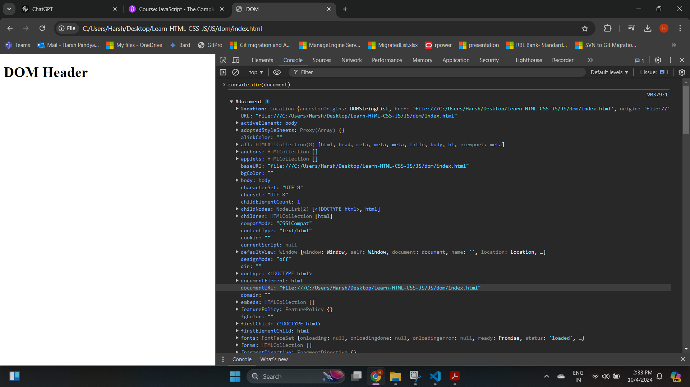

- If you see , the document object has list of different properties.

### Window Object

- **The window object is the global object that represents the current window or tab of your browser where your webpage is displayed.**
- Everything that runs in your webpage, including JavaScript, exists inside the window.
- It contains properties, methods, and objects that you can use to control aspects of the webpage, like opening new tabs, displaying alerts, and even working with the DOM (your HTML).
- On the browser console, type `window`.


- You can different properties under it. If you go down a little you will find one property call `document`.


- The `document` property is your DOM object. So window is your global object which consist of all other object. The `document` object represents the DOM (Document Object Model), which is the structure of your web page (HTML). The `document` object is part of the `window` object.
- The `document` object is a property of the `window` object. When a web page loads, the browser creates the `window` object, and inside it, you also have access to the `document` object. This means you can access `document` like this: `window.document` (but most of the time, we just write `document` directly).
- If you remember we use `alert()` function, even that is part of `window` global object.

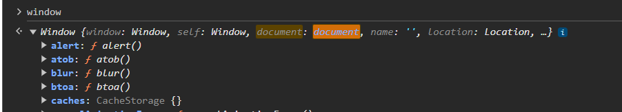

- In your JS file when you write `alert()` function, the browser loads and parses it with `window` like `window.alert()` and executes it. There are other couple of functions like `open()` which opens new tab.

<video controls src="Images/js1/20241004-0921-03.6754013.mp4" title="Title"></video>

>[!IMPORTANT]
> - The scope of `window` object is global but it is restricted to the current tab. If there are multiple tab open in your browser, you cannot access other tab using current tab `window` object.


### Nodes vs Elements

- In JavaScript, when working with the DOM (Document Object Model), you often come across terms like nodes and elements. Though they seem similar, there is a difference between the two.

#### What is a Node?

- In the DOM, everything is a node. A node is a basic unit in the DOM tree. It can represent different things in the document, including:
  - HTML elements (like `<div>`, `<p>`, etc.)
  - Text content inside elements
  - Attributes on HTML elements
  - Comments in the HTML
- So, the term "node" is a generic term for anything in the DOM tree.

##### Types of Nodes:

- Element nodes: These represent HTML elements, like `<div>`, `<h1>`, `<p>`.
- Text nodes: These represent the text inside an element. For example, in `<p>Hello</p>`, the text "Hello" is a text node.
- Comment nodes: Represent HTML comments, like `<!-- This is a comment -->`.
- Attribute nodes: Represent attributes of elements, like `class="header"` in `<div class="header">`.

##### nodeType

- The `nodeType` property in JavaScript tells you what kind of node you're dealing with in the DOM. Remember, in the DOM, everything (HTML tags, text, comments, etc.) is a node. Each type of node has a different `nodeType` value, which is a number that helps us identify the type of node.
- Consider below html file

```
<!DOCTYPE html>
<html lang="en">
  <head>
    <meta charset="UTF-8" />
    <meta name="viewport" content="width=device-width, initial-scale=1.0" />
    <meta http-equiv="X-UA-Compatible" content="ie=edge" />
    <title>DOM</title>
  </head>
  <body>
    <h1 id="header1id"> DOM Header</h1>    
    <div id="myDiv">
        Hello, World!
        <!-- This is a comment -->
    </div>
    <script src="app.js"></script>
  </body>
</html>
```

- Consider below JS code.

```
const h1ElementNode=document.getElementById("header1id")
const divElementNode=document.getElementById("myDiv")

console.log(h1ElementNode.nodeName)
console.log(divElementNode.nodeName)

console.log(h1ElementNode.nodeType)
console.log(divElementNode.nodeType)

const childElementsOfDiv=divElementNode.childNodes

childElementsOfDiv.forEach(i=>{
    console.log(i.nodeName+" "+i.nodeType+" "+i.nodeValue)
}
)
```

- On browser console. 


- The `text` nodes have a node type number of 3 whereas node type number for `comment` is 8

- Different [nodeType](https://developer.mozilla.org/en-US/docs/Web/API/Node/nodeType)


#### What is an Element?

- An element is a specific type of node that represents an HTML element (like `<div>`, `<h1>`, ``, etc.). In the DOM, elements are more specific than nodes because they always correspond to HTML tags.
- **Node is the broader term: everything (HTML elements, text, comments, attributes) is a node in the DOM. Element is a specific type of node that represents HTML elements.**


### Query Selectors

- When we learned CSS, there is a concept called CSS Selectors.
<br>
<details>

<summary> Recap of CSS Selectors </summary>

- CSS selectors target the HTML elements on your pages, allowing you to add styles based on their ID, class, type, attribute, and more.
- CSS (Cascading Style Sheets) selectors are patterns used to select and style elements on a web page. They tell the browser which HTML elements to apply the CSS rules to. Think of selectors as a way to target specific parts of a web page to change their appearance or layout.
- Types of selectors
    1. Simple Selector (Element , Class and ID selector)
    2. Universal Selector
    3. Group Selector
    4. Attribute Selector
    5. Pseudo Class Selector
    6. Pseudo Element Selector
    7. Combinators

</details>
<br>
<br>

- In JavaScript, there will be times when you need to access an HTML element. The DOM provides **Query Selectors**. Query Selectors are methods in JavaScript that allow you to select HTML elements from the DOM (Document Object Model) based on CSS-style selectors. This means you can use the same selectors that you would use in CSS to target and manipulate elements in your HTML.
- Types of Query Selectors

**1. `document.querySelector()`:**
  - This method **returns the first element that matches** the specified CSS selector.
  - If no elements match, it returns `null`.


**2. `document.querySelectorAll()`:**
  - This method **returns a NodeList (similar to an array) of all elements that match** the specified CSS selector.
  - If no elements match, it returns an **empty NodeList**.

- Lets see some example, below is the HTML,CSS and JS code within the **querySelectors.html** file.

```
<!DOCTYPE html>
<html lang="en">
<head>
    <meta charset="UTF-8">
    <meta name="viewport" content="width=device-width, initial-scale=1.0">
    <title>CSS Selectors Example</title>
    <style>
        /* CSS Styles */
        .highlight { /* Class Selector */
            background-color: yellow;
        }
        .title {
            color: blue;
            font-size: 24px;
        }
        .description {
            font-size: 18px;
        }
        #uniqueElement { /* ID Selector */
            color: green;
        }
        /* Styling for nested elements */
        .container p {
            font-weight: bold;
        }
    </style>
</head>
<body>
    <h1 class="title">CSS Selectors and Query Selectors</h1>
    
    <p class="description">This is a description paragraph.</p>
    <p class="description">This is another description paragraph.</p>
    
    <div id="uniqueElement">This is a unique element.</div>
    
    <div class="container">
        <p>Nested paragraph inside a container.</p>
        <span class="inner">Inner Span</span>
    </div>

    <button class="btn">Click Me</button>

    <script>
        // Using querySelector() to select different types of elements
        
        // 1. Selecting an element by class, why `.title`? because in CSS Selector we define class selector by `.title{ CSS Styles }`
        /**
         * .title {
            color: blue;
            font-size: 24px;
            }
         */
        let titleElement = document.querySelector('.title'); // Selects the first element with class "title"
        console.log(titleElement.textContent); // Outputs: CSS Selectors and Query Selectors

        // 2. Selecting an element by ID, why `#uniqueElement` because its an ID selector , same definition given during CSS Styling
        /*
        #uniqueElement {
            color: green;
        }
        */
        let uniqueElement = document.querySelector('#uniqueElement'); // Selects the element with ID "uniqueElement"
        console.log(uniqueElement.textContent); // Outputs: This is a unique element.

        // 3. Selecting the first description paragraph (matches the whatever the first description is found)
        let firstDescription = document.querySelector('.description'); // Selects the first element with class "description"
        firstDescription.classList.add('highlight'); // Adds highlight class to change background color
        
        // 4. Selecting nested elements
        let nestedParagraph = document.querySelector('.container p'); // Selects the first <p> inside the container class
        console.log(nestedParagraph.textContent); // Outputs: Nested paragraph inside a container.

        // Using querySelectorAll() to select multiple elements
        
        // 5. Selecting all description paragraphs
        let descriptionElements = document.querySelectorAll('.description'); // Selects all elements with class "description"
        descriptionElements.forEach((el) => {
            console.log(el.textContent); // Outputs each description paragraph
        });

        // 6. Selecting all buttons
        let buttons = document.querySelectorAll('.btn'); // Selects all buttons with class "btn"
        buttons.forEach((btn) => {
            btn.addEventListener('click', () => {
                alert('Button clicked!'); // Alerts when the button is clicked
            });
        });

        // 7. Selecting all spans in the container
        let innerSpans = document.querySelectorAll('.container span'); // Selects all <span> elements inside the container
        innerSpans.forEach((span) => {
            console.log(span.textContent); // Outputs: Inner Span
        });

        // 8. Selecting all <p> elements
        let allParagraphs = document.querySelectorAll('p'); // Selects all <p> elements in the document
        allParagraphs.forEach((p) => {
            p.style.color = 'purple'; // Changes the color of all paragraphs to purple
        });
    </script>
</body>
</html>
```

- On browser console.


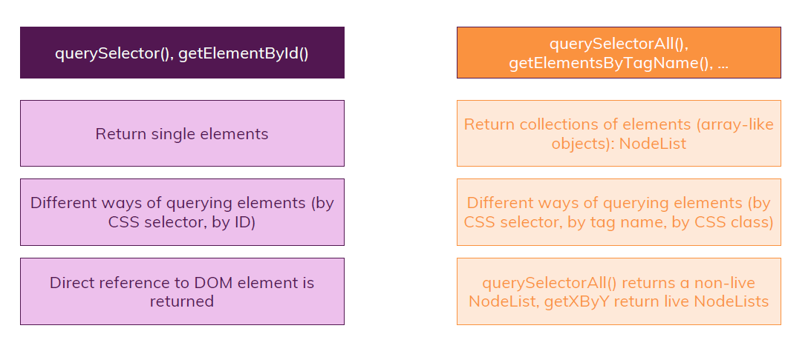

- We can run query selector on browser console as well.


- Consider another example

```
<!DOCTYPE HTML>
<html>
    <head>
        <title>Exercise time!</title>
    </head>
    <body>
        <main>
            <div id="overview">
                <h1>HTML & JavaScript are crucial technologies</h1>
                <p>The web would not work without them...</p>
            </div>
            <div id="advantages">
                <ul>
                    <li>Flexible</li>
                    <li>Available</li>
                    <li>Magical</li>
                </ul>
            </div>
        </main>
        <script>
            const mainHeading = document.querySelector("h1");
            console.log(mainHeading);
            const secondAdvantage = document.querySelectorAll("li")[1];
            console.log(secondAdvantage);
            const advDiv = document.querySelector("#advantages");
            console.log(advDiv);
        </script>        
    </body>
</html>
```

- On browser console


- You can also access the complete head and body using `document` object


### Attribute vs Property

- Attributes are defined in the HTML itself. They are part of the HTML tag and are used for initial values.
- Properties are part of the DOM (Document Object Model). Once the HTML is loaded into the browser, elements become objects with properties. Properties can change over time and may not always match the attribute values from the HTML. Properties are accessed directly on the element object in JavaScript.
- Lets understand via example, consider below HTML code.

```
<input type="text" value="initial value" />
```

- Attributes are defined in the HTML markup and provide initial values for elements. They are static and do not change once the page is loaded unless explicitly modified using JavaScript. In this example, `value="initial value"` is an attribute.
- When modified using JS

```
const inputElement = document.querySelector('input');
console.log(inputElement.value); // Logs the current value of the input element
inputElement.value = 'new value'; // Changes the current value of the input element
```

- In this example, `value` is a property of the `inputElement` object which got modified by JS. Now the current value is `new value` for the **property `value`**. Properties are part of the DOM and represent the current state of an element. They are dynamic and can change as the user interacts with the page or through JavaScript.
- In the creation, HTML attributes will determine the initial qualities of the object. With the help of the DOM API and javascript, the HTML is parsed in turned into an object that we can work with. Objects have properties that we can manipulate to change the look, feel, and behavior of our applications.
- **Attributes initialize DOM properties. Attributes are static, while properties are dynamic. Attributes are the initial setup, while properties reflect the live state of elements in JavaScript.**
- Attributes can be accessed using `getAttribute` and `setAttribute` methods, while properties can be accessed directly on the DOM object.

```
const inputElement = document.getElementById('myInput');

// Accessing attribute
console.log(inputElement.getAttribute('value')); // "initial value"

// Accessing property
console.log(inputElement.value); // "initial value"

// Changing property
inputElement.value = 'new value';
console.log(inputElement.value); // "new value"
console.log(inputElement.getAttribute('value')); // "initial value"
```

- **Attributes and Properties may or may not have same name and it may or may not be live synchronization**. Lets understand this via example. Consider below HTML code.

```
<!DOCTYPE html>
<html lang="en">
  <head>
    <meta charset="UTF-8" />
    <meta name="viewport" content="width=device-width, initial-scale=1.0" />
    <meta http-equiv="X-UA-Compatible" content="ie=edge" />
    <title>DOM</title>
  </head>
  <body>
    <h1 id="header1id" class="domheader"> DOM Header</h1>    
    <div id="myDiv">
        Hello, World!
        <!-- This is a comment -->

        <input id="inputid" value="a default input msg">
    </div>
    <script src="app.js"></script>
  </body>
</html>
```

- On browser console, the `Element` tab represent HTML tags and attributes.


- Whereas in the console we have `document` and its object.

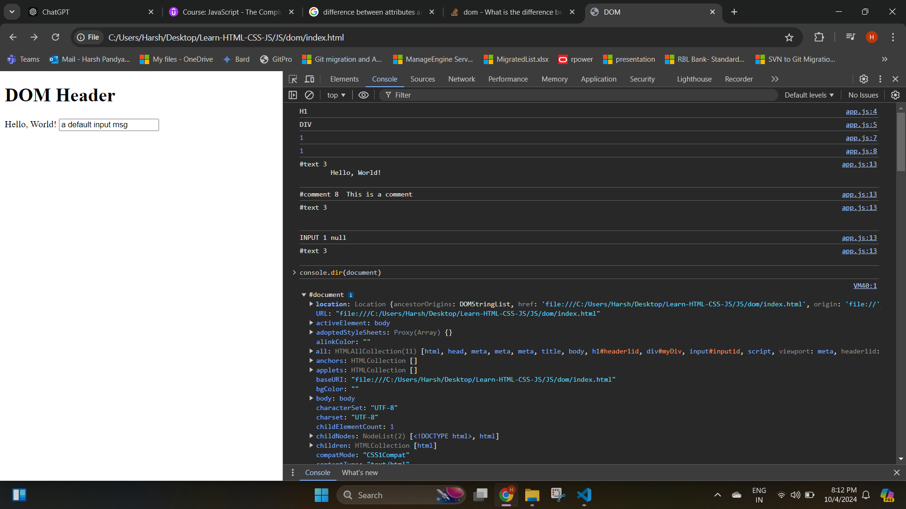

- Lets clear the console, lets update the header content (`DOM Header`) to a new content (`My Header`). So this can be done by fetching the header id. Now using developer console, we will get object and object has properties. So using the property we will change it and check whether it reflects in the `Element` tab.

<video controls src="Images/js1/20241004-1446-03.1161567.mp4" title="Title"></video>

- Now if you see , to fetch the `id` attribute, there is a property name `h1var.`**`id`**, so here the property name is same as attribute name (**1 (`id`):1 (variblename.`id`) name mapping**), now what happens if we change the **id value (`header1id`)**?

<video controls src="Images/js1/20241004-1451-52.5361818.mp4" title="Title"></video>

- When we change the id value to a new value (`mynewheaderid`), it got reflected in the `Element` tab of developer tools. This states that **id attribute and id property are in live synchronization**.
- Now similarly can we did for `id` can we do it for the class value (`domheader`)? lets see

<video controls src="Images/js1/20241004-1500-40.0695842.mp4" title="Title"></video>

- If you see **there is live synchronization between class attribute and class property** by their name differ, for attribute we have `class="domheader"`, whereas for property we need to fetch using `classHeaderVar.header1id.`**`className`**. So the names are little bit different.
- Now for `input` element we have a tag `value`, is there live synchronization for it as well? lets check

<video controls src="Images/js1/20241004-1510-25.5601076.mp4" title="Title"></video>

- The element attribute and property names are same **but they are not synchronize**, it makes sense because suppose this html is exposed to user and user enters a value in the input, this would override the existing default value (`value="a default input msg"`). So whenever a user again open that same html file it would see the previous input entered by him/her instead of default value.
- Hence, **Attributes and Properties may or may not have same name and it may or may not be live synchronization**.


- You can also access HTML elements tag using property `getElementsByTagName`.


### Parent, Child, Descendent and Ancestor

- Think of HTML elements like members of a family tree:
    - Parent: This is like a parent in a family. It’s the direct element that holds or wraps other elements inside it.
    - Child: This is like a child in the family. It is directly inside a parent element.
    - Ancestor: This refers to any element above the current element in the hierarchy (like parents, grandparents, great-grandparents, etc.).
    - Descendant: This refers to any element that is inside another element, no matter how many levels deep (like children, grandchildren, great-grandchildren, etc.).
- Consider below HTML

```
<div id="grandParent">
  <div id="parent">
    <p id="child">This is a paragraph.
      <a id="descendant" href="#">This is a link</a>
    </p>
  </div>
</div>
```

- a `<div>` is the parent, and inside that, there's a `<p>` (paragraph) which is the child. If the `<p>` has an `<a>` (link) inside it, then the `<a>` is a descendant of both the `<p>` and `<div>`. Meanwhile, the `<div>` is an ancestor of both the `<p>` and `<a>`.
- Below is the JS code

```
let divGrandParentvar = document.getElementById('grandParent');
let divParentvar = document.getElementById('parent');
let Pchildvar = document.getElementById('child');
let aDescendantvar = document.getElementById('descendant');

// Parent-Child relationship
console.log(divParentvar.parentElement); // Outputs: <div id="grandParent">
console.log(Pchildvar.parentElement);  // Outputs: <div id="parent">

// Descendant and Ancestor
console.log(aDescendantvar.closest('div')); // Outputs: <div id="parent"> (first matching ancestor)
console.log(divGrandParentvar.contains(aDescendantvar)); // Outputs: true (because descendant is inside grandParent)

// Direct child access
console.log(divParentvar.children); // Outputs: [<p id="child">This is a paragraph...</p>]

// Navigating ancestors and descendants
console.log(Pchildvar.parentElement); // Outputs: <div id="parent"> (child's direct parent)
console.log(divParentvar.children[0]);  // Outputs: <p id="child"> (parent's direct child)

// Check if the parent is an ancestor of the link
console.log(divParentvar.contains(aDescendantvar)); // Outputs: true
```

- On browser console


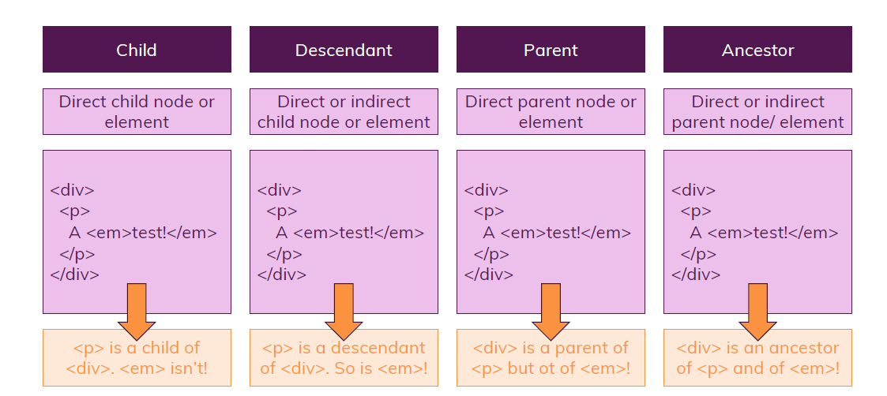


### DOM Traversal

- Traversing the DOM in JavaScript refers to navigating between nodes in the DOM tree. You can traverse from a specific node to its parent, siblings, and child nodes. The DOM provides various properties for these traversals, and each has specific differences.

#### 1. Traversing to Child Elements/nodes

- Consider below HTML snippet

```
    <div id="parentDiv">
      <p id="first-child">First Child</p>
      <!-- This is my Comment -->
      <span id="second-child">Second Child</span>
      <ul>
        <li class="list-item"> Item 1 </li>
        <li class="list-item"> Item 2 </li>
        <li class="list-item">                        Item 3 </li>
      </ul>
  </div>
```

- Consider below JS code

```
//Traversing in DOM

let parentDiv = document.getElementById("parentDiv");
console.log(parentDiv)
console.log(parentDiv.childNodes);   // NodeList(9) [text, p#first-child, text, comment, text, span#second-child, text, ul, text]
console.log(parentDiv.childNodes.length);   // 9
console.log(parentDiv.childNodes[3]);   // <!-- This is my Comment --> (Accessing 4th element in the list , it is 0 based index)
console.log(parentDiv.children);     // HTMLCollection(3) [p#first-child, span#second-child, ul]
console.log(parentDiv.children.length);     // 3
console.log(parentDiv.children[2]);     // <ul>...</ul> (Accessing 3th element in the list , it is 0 based index)
console.log(parentDiv.children[2].children[2]);     
console.log(parentDiv.children[2].children[2].textContent);     //              item3
console.log(parentDiv.firstChild);        // #text
console.log(parentDiv.firstElementChild); // <p id="first-child">
console.log(parentDiv.lastChild);         // #text
console.log(parentDiv.lastElementChild);  // <ul>...</ul>
```

- On browser console.


- `childNodes`: Returns a `NodeList` of all child nodes (including elements, text nodes, and comments).
- `children`: Returns an `HTMLCollection` of only the child element nodes (ignores text nodes or comments).
- `firstChild`: Returns the first child node (could be an element, text, or comment).
- `firstElementChild`: Returns the first element child.
- `lastChild`: Returns the last child node (could be an element, text, or comment).
- `lastElementChild`: Returns the last element child.

- If you see the output of `console.log(parentDiv.childNodes);` , you can see some `text` nodes inside the list. What are the?

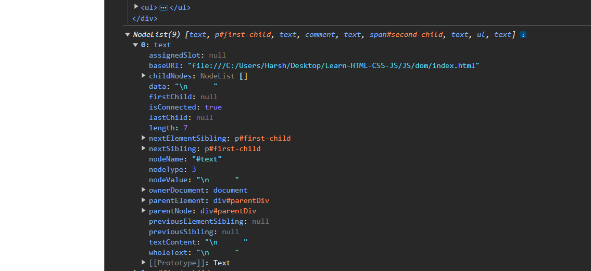

- Those are white-spaces of your html

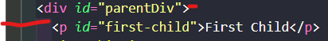

- When you see the content `data: "\n      "` , these contents are next line and white spaces mention in the red color on the image. These white spaces are automatically gets hide by the browser. These white spaces are still there in the DOM structure representing as text nodes.
- In the HTML code for the list element `<li>`, we have added `              Item3`, now there are so many white spaces before the word `Item3` but on the page it is not visible to us. Because it gets hide by the browser.


- Under the `Element` tab of browser console, when you type `white-space:pre` under the `Style` tab of `Element` you can see the whitespaces


- The reason the browser automatically omits whitespace (such as spaces, tabs, and newlines) inside text nodes is that by default, the browser treats HTML in a way that normalizes or collapses whitespace. This behavior is part of the HTML/CSS rendering engine, which is designed to simplify and improve the layout of web pages.
- In HTML, any sequence of whitespace characters (spaces, tabs, newlines) is collapsed into a single space when rendered in a browser. This means that no matter how many spaces you add between words or elements in the HTML, only one space will appear in the output.

```
<p>    This    is    a    test.   </p>
```

- On browser

```
This is a test.
```

- Text nodes in the DOM may still preserve the exact whitespace that you wrote in the HTML. When you access these nodes in JavaScript, you'll see the full whitespace, but the browser doesn’t display it unless explicitly told to. This is why text nodes retain the spaces, but the browser’s visual output collapses them.
- When you apply the CSS style

```
<p style="white-space: pre;">
    This    is    a    test.
</p>
```

- The browser will display

```
    This    is    a    test.
```


#### 2. Traversing to Parent Elements/nodes

- Consider below code for the same above HTML

```
let childList=document.getElementsByTagName("li")[0]
console.log(childList)
console.log(childList.parentElement)
let childList1=document.getElementById("second-child")
console.log(childList1.parentNode)
```

- On browser console


- `parentElement`: Returns the parent element of the current node, but it excludes non-element nodes like text or comment nodes.
- `parentNode`: Returns the parent node, which could be an element or a document node (for example, document itself can be a parent).
- The above output will mostly give you element tag, because an element tag can have child element or nodes thats why that element tag becomes the parent of that child element or nodes. Then why the need of `parentNode`? consider below code


- The above is one the exception and it will be used in the rare case.

#### 3. Traversing to Ancestor

- Consider below HTML & JS Code

```
HTML Snip
      <div id="ancestor">
        <div class="middle">
            <p id="current">Current Node</p>
        </div>
    </div>

JS Snip
let currentNode = document.getElementById('current');
console.log(currentNode.closest('div')); // <div class="middle">
console.log(currentNode.closest('#ancestor')); // <div id="ancestor">
```

- On browser console.


- `closest()`: This method returns the closest ancestor of the current element (or the element itself) that matches the selector you pass in. It traverses upwards through the DOM hierarchy

#### 4. Traversing to Siblings

- In the below HTML snip, `<p>`, `<span>`, `<ul>` and `<div id="ancestor">` they all belong to same parent `<div id="parentDiv">` and thus becomes siblings.

```
  <div id="parentDiv">
      <p id="first-child">First Child</p>
      <!-- This is my Comment -->
      <span id="second-child">Second Child</span>
      <ul>
        <li class="list-item"> Item 1 </li>
        <li class="list-item"> Item 2 </li>
        <li class="list-item">                        Item 3 </li>
      </ul>
      <div id="ancestor">
        <div class="middle">
            <p id="current">Current Node</p>
        </div>
    </div>
  </div>
```

- Consider below JS code.

```
let secondChild = document.getElementById('second-child');

//Sibling below second child
console.log(secondChild.nextSibling);         // #text
console.log(secondChild.nextElementSibling);  // <ul>..<ul>

//Sibling above second child
console.log(secondChild.previousSibling);         // #text
console.log(secondChild.previousElementSibling);  // <p id="first-child">
```

- On browser console


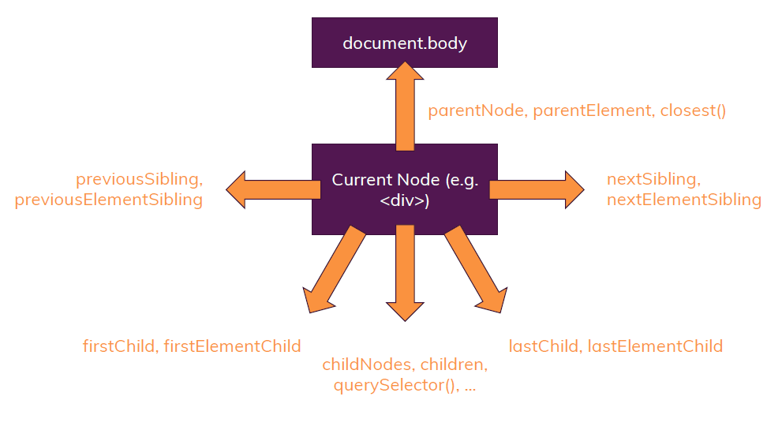

#### DOM Traversal vs Query Selectors

- When we have query selector which will share us the element when why the need of DOM traversal? **DOM traversal is useful when you already have a reference to a node and want to navigate relative to it (e.g., finding parent or sibling elements), which is efficient since you're moving through a small part of the DOM. In contrast, query selectors (`querySelector`, `querySelectorAll`) search the entire document, which can be slower, especially in large DOM trees. DOM traversal is often faster for local navigation, while query selectors are useful for finding elements globally but might impact performance if overused. Using DOM traversal methods can help optimize operations that involve nearby elements.**
- Consider below HTML snip and JS Code.

```
HTML Snip
 <body>
    <script src="app.js" defer></script>
</body>

JS Code
console.log(document.body.firstElementChild) // <script>..</script>
```

- Now lets say you are modifying your HTML code

```
HTML Snip
 <body>
    <header>DOM Traversal VS Query Selectors</header>
    <script src="app.js" defer></script>
</body>
```

- Now the same JS Code will give output as `<header>..</header>`. **So using DOM traversal is efficient but you need to ensure modifying your HTML elements does not affect your traversal logics.**

## Create/Append/Replace/Remove HTML Elements using JS

- Using DOM, JS can insert or append HTML elements inside the HTML page. There are two ways to achieve this

### HTML Methods

#### 1. innerHTML

- The `innerHTML` property can be used to write the dynamic html on the html document. The `innerHTML` property in JavaScript allows you to get or set the HTML content of an element as a string.
- Consider below HTML snip.

```
    <div id="parentDiv">
      <p id="first-child">First Child</p>
      <!-- This is my Comment -->
      <span id="second-child">Second Child</span>
      <ul>
        <li class="list-item"> Item 1 </li>
        <li class="list-item"> Item 2 </li>
        <li class="list-item">                        Item 3 </li>
      </ul>
      <div id="ancestor">
        <div class="middle">
            <p id="current">Current Node</p>
        </div>
    </div>
  </div>
```

- The below JS snip will replace the inner `div` contents by `h2`.

```
// InnerHTML
let divContent=document.querySelector("#parentDiv")
divContent.innerHTML="<h2> Hello </h2>"
```

- On web page and developer tools

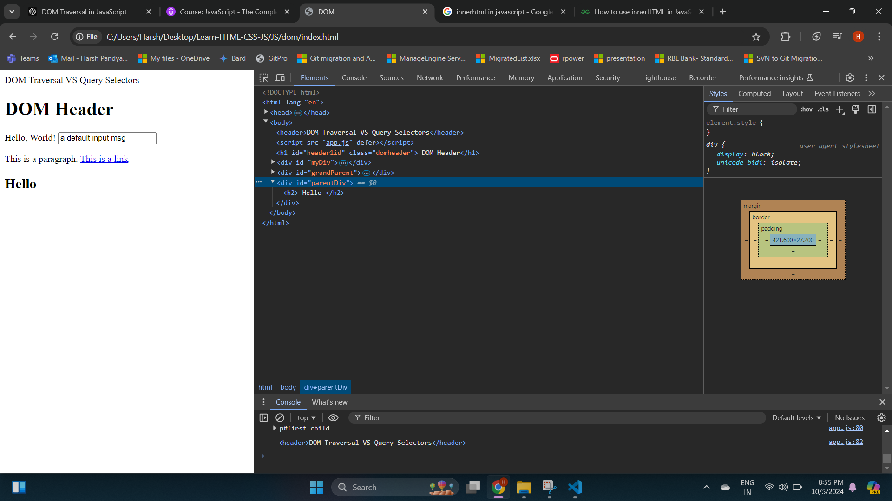

- The below JS snip will append the `h2` element with current inner `div` elements. (`innerHTML +=`)

```
// InnerHTML
let divContent=document.querySelector("#parentDiv")
divContent.innerHTML+="<h2> Hello </h2>"
```

- On web page and developer tools


- **The `innerHTML` method replaces or appends the entire `div` contents**. How so?, run the same append snip on the browser console.


<video controls src="Images/js1/20241005-1531-48.3138271.mp4" title="Title"></video>

- The flash indicates the entire inner elements are rendered.

##### innerHTML is not Recommended

- Re-rendering: The entire content of #content is replaced, which can lead to performance issues.
- Potential for Mistakes: If there's a typo or invalid HTML in the string, the entire structure can break.
-  Directly inserting user-provided content with innerHTML can expose your application to **Cross-Site Scripting (XSS) attacks** if the content isn't properly sanitized

#### insertAdjacentHTML

- The `insertAdjacentHTML()` method allows you to insert HTML directly into the DOM at a specific position relative to an existing element. It doesn't re-render the entire content, making it more efficient than using `innerHTML`.
- Consider below JS code for the same HTML code mentioned above.

```
let divContent=document.querySelector("#parentDiv")
// Insert HTML inside the div, before its first child
divContent.insertAdjacentHTML('afterbegin', '<p>New content at the beginning</p>');
    
// Insert HTML inside the div, after its last child
divContent.insertAdjacentHTML('beforeend', '<p>New content at the end</p>');

// Insert HTML before the div itself
divContent.insertAdjacentHTML('beforebegin', '<h3>Before the div</h3>');

// Insert HTML after the div itself
divContent.insertAdjacentHTML('afterend', '<h3>After the div</h3>');
```

- On browser console


- It doesn't replace or re-render the entire content, only inserts at the specified position. You can choose exactly where to insert the new content relative to the existing element.


<video controls src="Images/js1/20241005-1544-22.0294004.mp4" title="Title"></video>

>[!NOTE]
> - Even though insertAdjacentHTML() is more efficient than innerHTML, it still poses a security risk for Cross-Site Scripting (XSS) attacks if you're inserting unsanitized and typo mistake may still occur.

### createElement

- For the same HTML code, consider below JS snip

```
//createElement
let divContent=document.querySelector("#parentDiv")
let newPara=document.createElement("p")
newPara.textContent="This is a new para from createElement()"
divContent.appendChild(newPara)
```

- On browser console


- Now consider below JS code. (Just added 2 more lines to the above code)

```
//createElement
let newPara=document.querySelector("p") //getElementById()
newPara.textContent="This is a new para from createElement()"
divContent.appendChild(newPara)
newPara.textContent="This is a new para added before <div> by createElement()"
divContent.insertBefore(document.getElementById("ancestor"), newPara)
```

- On browser console

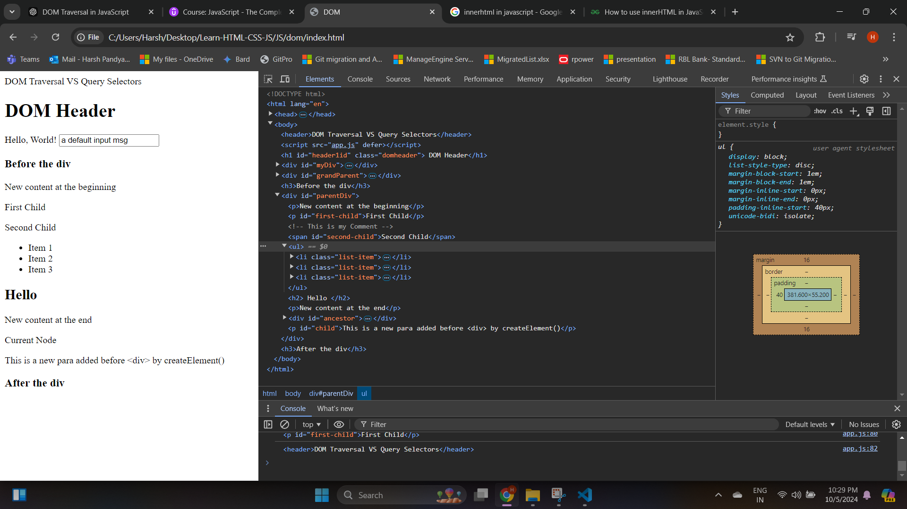

- If you notice, earlier the content for the paragraph tag was `This is a new para from createElement()` , post code changes that got replaced to `This is a new para added before <div> by createElement()` instead of getting a new para element. Why so?
  - In the first line, `document.querySelector("p")` selects an existing `<p>` element from the DOM. You are not creating a new element with `createElement();` you are referencing an existing one.
  - When you use `newPara.textContent = ...`, you're modifying the content of the same paragraph (`newPara`), not creating a new `<p>` element.
  - Since you're still dealing with the same element, `appendChild()` and `insertBefore()` are moving the same `<p>` element around the DOM.
  - If you want to create a new paragraph element instead of selecting an existing one, use `document.createElement()`

>[!NOTE]
> - Ensure the second argument of `insertBefore()` is a single element only and a valid DOM element otherwise it will throw error. It cannot accept `Nodelist` or arrays which is returned by `getElementsByTagName()`, `querySelectorAll()` etc... It works with `getElementById()` or `querySelector()`. 

- We can also perform replacement of contents using `replaceChild()` method.
- If you wanna add multiple elements or nodes instead of using `appendChild()` you can use `append()` method.

### Removing Elements

- Consider below JS code which remove unordered list element from HTML

```
//Remove Elements
const getULElement=document.querySelector("ul")
getULElement.remove()
```

- On page.


- There is another way to achieve removing of elements via parent tag.

```
const getULElement=document.querySelector("ul")
getULElement.parentElement.removeChild(getULElement)
```

- On page.


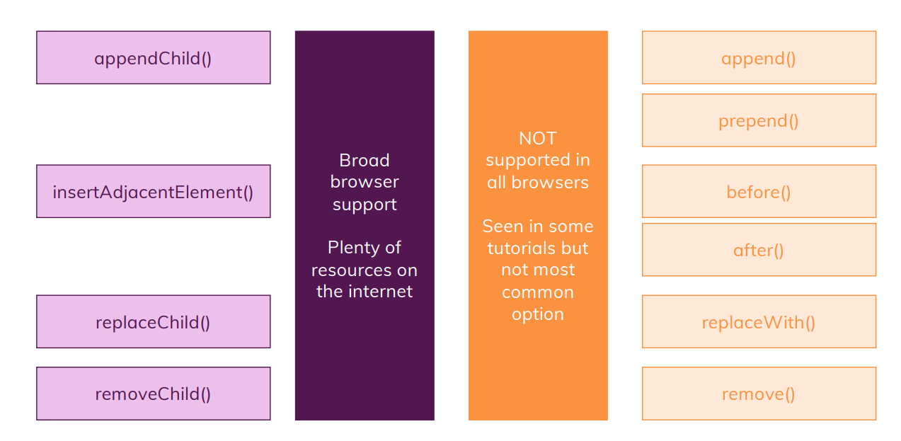


## Cloning DOM nodes

- Cloning DOM nodes is done using the `cloneNode()` method. This method creates a copy of the selected DOM node. It accepts a single argument `true` or `false` that determines whether the children of the node should also be cloned.
- Consider below HTML code and JS Code.

```
HTML Code
    <div id="parentDiv">
      <p id="first-child">First Child</p>
      <!-- This is my Comment -->
      <span id="second-child">Second Child</span>
      <ul>
        <li class="list-item"> Item 1 </li>
        <li class="list-item"> Item 2 </li>
        <li class="list-item">                        Item 3 </li>
      </ul>
      <div id="ancestor">
        <div class="middle">
            <p id="current">Current Node</p>
        </div>
    </div>


JS Code
let cloningNode=document.getElementById("parentDiv")
let deepClone=cloningNode.cloneNode(true) // Deep Cloning , copies all the descendent or child nodes
document.body.appendChild(deepClone)
```

- On browser console, all the child nodes got cloned when used `true` as arguments in `cloneNode()`

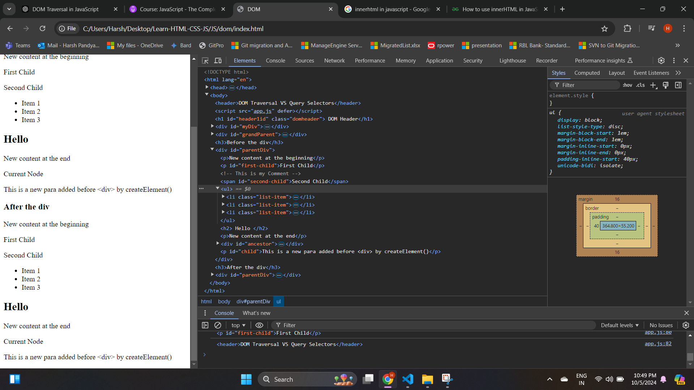

- If `false` (default argument) is used, we get below page, just the `<div>` element got created

<video controls src="Images/js1/20241005-1721-23.6581583.mp4" title="Title"></video>

## HTMLCollection vs NodeList

- `HTMLCollection`, only contains HTML elements. `NodeList` can contain any type of node (HTML elements, text nodes, comment nodes, etc.). It’s more generic.
- Consider below HTML Snip and JS Code

```
HTML Snip
    <div id="parentDiv">
      <p id="first-child">First Child</p>
      <!-- This is my Comment -->
      <span id="second-child">Second Child</span>
      <ul>
        <li class="list-item"> Item 1 </li>
        <li class="list-item"> Item 2 </li>
        <li class="list-item">                        Item 3 </li>
      </ul>
      <div id="ancestor">
        <div class="middle">
            <p id="current">Current Node</p>
        </div>
    </div>

JS Code
console.log(document.getElementById("parentDiv").childNodes) //NodeList(11) [text, p#first-child, text, comment, text, span#second-child, text, ul, text, div#ancestor, text]
console.log(document.getElementById("parentDiv").getElementsByTagName("p")) //HTMLCollection(2) [p#first-child, p#current]
```

- Methods like `getElementsByTagName` or `getElementsByClassName` return an `HTMLCollection`. Methods like `querySelectorAll` and `childNodes` return `NodeList` which consist of text, comments and element nodes.
- Both `HTMLCollection` and `NodeList` are array-like in that they can be accessed by index (e.g., `collection[0]`), **but they are not true arrays**. They don't have array methods like `forEach` (though `NodeList` does in modern browsers) or `map`.
- **`HTMLCollection` is typically live. This means if the DOM changes (e.g., elements are added or removed), the `HTMLCollection` is automatically updated to reflect those changes.**
- Consider below code.

```
let liveHTMLListCollection=document.getElementsByTagName("li")
console.log(liveHTMLListCollection) // HTMLCollection(3) [li.list-item, li.list-item, li.list-item]
let newLiElement=document.createElement("li")
newLiElement.textContent="Item 4"
document.querySelector("ul").appendChild(newLiElement)
console.log(liveHTMLListCollection) //HTMLCollection(4) [li.list-item, li.list-item, li.list-item, li]
```

- Whether you use `getElementsByTagName` or `getElementsByClassName` , the collection returned is always live, meaning it reflects changes to the DOM immediately without needing to re-query.
- **`NodeList` can be static or live**. In the case of `querySelectorAll`, it returns a static `NodeList`, meaning it does not automatically update when the DOM changes. In the case of `document.getElementsByName()` and `childNodes`. The `NodeList` is live.
- Below is example of static and live `NodeList`

```
//Static NodeList
let staticNodeList=document.querySelectorAll("li") // NodeList(3) [li.list-item, li.list-item, li.list-item]
console.log(staticNodeList)
let newLiElement=document.createElement("li")
newLiElement.textContent="Item 4"
document.querySelector("ul").appendChild(newLiElement)
console.log(staticNodeList) // NodeList(3) [li.list-item, li.list-item, li.list-item]

//Live NodeList
let liveNodeList=document.getElementsByName("lists")
console.log(liveNodeList) //NodeList(3) [li.list-item, li.list-item, li.list-item]
let newLiElement1=document.createElement("li")
newLiElement1.textContent="Item 5"
newLiElement1.setAttribute("name","lists")
newLiElement1.className="list-item"
document.querySelector("ul").appendChild(newLiElement1)
console.log(liveNodeList) //NodeList(4) [li.list-item, li.list-item, li.list-item, li.list-item]
```

- **The main difference between an `HTMLCollection` and a `NodeList` is that one is live and one is static or live. This means that when an element is appended to the DOM, a live node will recognize the new element while a static node will not.**
- Live collections (`HTMLCollection` or Live `NodeList`) can lead to higher memory consumption and performance issues due to constant DOM monitoring.
- Static collections (Static `NodeList`) are generally more efficient because they are snapshots and don’t track DOM changes.

## Iterables

- In JavaScript, an iterable is an object that can be looped over. It is a data type that can be iterated (looped) upon. For example, arrays and strings are iterables because they contain a collection of elements that can be looped over.
- An iterable is any object that can be iterated over with constructs like `for...of`
- Common iterables in JavaScript:
  - Arrays
  - Strings
  - Sets
  - Maps
  - Typed Arrays
  - Arguments object
  - NodeList (e.g., what `document.querySelectorAll()` returns)

### Array-Like Objects

- **An array-like object is an object which have a length property and uses indexes to access items inside it**
- **An array-like object is an object that looks like an array but doesn’t have all the built-in array methods** like `push()`, `pop()`. `NodeList` and `HTMLCollection` are array like object, they don't have built-in methods of array.

#### Arrays

- Earlier we have learned about basics of [array](https://github.com/codophilic/Learn-HTML-CSS-JS/blob/main/JS/BasicsOfJS.md#array)
- Lets look at some other methods commonly used and different ways in which we can create an array
- Different ways to create an array

```
const creation1=[1,2,3] //[1,2,3]
console.log(creation1)

//With new keyword (Constructor)
const creation2= new Array() // Empty Array- []
console.log(creation2)
const creation3= new Array("Hi","Hello") //["Hi","Hello"]
console.log(creation3)

//Without new keyword
const creation4= Array() //Empty Array- []
console.log(creation4)
const creation5=Array(1,2,3,4) //[1,2,3,4]
console.log(creation5)

//Size array
const creation6= Array(3) //[],  it creates an array with a length of 4, but the elements are not initialized (hence they appear as "empty" slots). It is still expandable
console.log(creation6) //(3) [empty × 3]
creation6.push("Hi")
console.log(creation6) //(4) [empty × 3, 'Hi']
creation6[20]="Hello"
console.log(creation6)

/**
 * When you assign a value to an index in a JavaScript array that is beyond its current length (`e.g., creation6[20] = "Hello"`), JavaScript will automatically expand the array to accommodate the new index. Any gaps between the existing elements and the new index will be filled with empty slots.
 * JavaScript arrays are dynamically sized, which means they can grow or shrink as needed. When you assign a value to an index that is greater than the current length of the array, the array will automatically expand to that size.
 * Why this behavior?
 * This is a performance optimization in JavaScript. Instead of pre-allocating memory for all indices up to 20 when you assign creation6[20] = "Hello", JavaScript only creates the necessary storage for the existing elements and keeps gaps as uninitialized.
 */

/* Similarly the above code will work with `new` keyword */

// Using Array.of
const creation7=Array.of(1,2,3,4,5)
console.log(creation7) //[1,2,3,4,5]

//Using Array.from
/**
 * Array.from() is a method in JavaScript that creates a new array from an array-like or iterable object. 
 * It’s useful when you need to work with objects that act like arrays but don’t have array methods.
 * */
const creation8 = Array.from("Hello")
console.log(creation8) //(5) ['H', 'e', 'l', 'l', 'o']
const creation9= Array.from(document.querySelectorAll("li")) //NodeList (array-like object)
console.log(creation9)
const creation10=Array.from(document.getElementsByTagName("li")) //HTMLCollection (array-like object)
console.log(creation10)
```

- On browser console

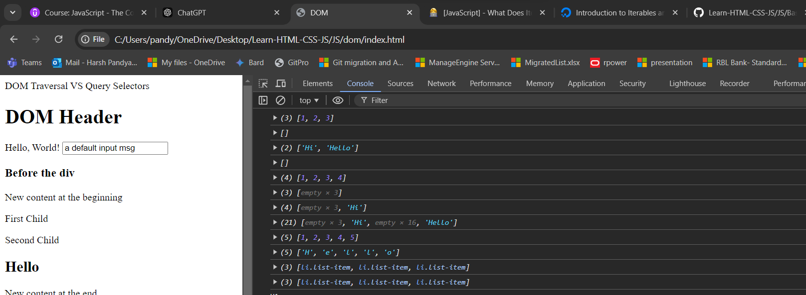

- Array can store different datatype values

```
const creation10=Array.from(document.getElementsByTagName("li")) //HTMLCollection (array-like object)
console.log(creation10)

const objectVariable={
    name: "Rahul",
    BMI:{
        height: "172cm",
        weight: "68kgs"
    }
}
const creation11=[1,"Hi",objectVariable,creation10]
console.log(creation11)
```

- On browser console

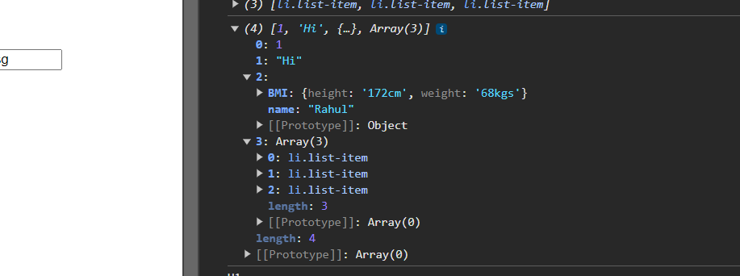

- Multi-dimensional array

```
const creation12=[[1,2,3],[3,4,5],[6,7,8]]
for(const i of creation12){
    let singleLine="";
    for(const j of i){
        singleLine+=j+" "
    }
    console.log(singleLine)
}

Output:
1 2 3
4 5 6
7 8 9
```

##### splice

- The `splice()` method in JavaScript is used to add, remove, or replace elements in an array by modifying the original array.
- Syntax

```
array.splice(start, deleteCount, item1, item2, ...);
```

- `start`: The index at which you want to start modifying the array.
- `deleteCount`: The number of elements to remove from the array, starting from the start index. If `deleteCount` is 0, no elements are removed.
- `item1, item2, ...`: (Optional) The elements to add to the array at the start index.

- Below are examples

```
//Removing Elements
let arr = ['a', 'b', 'c', 'd', 'e'];
let removed = arr.splice(1, 2);  // Start at index 1, remove 2 elements
console.log(arr);     // ['a', 'd', 'e']
console.log(removed); // ['b', 'c']

//Adding Elements
arr = ['a', 'b', 'c'];
arr.splice(1, 0, 'x', 'y');  // Start at index 1, remove 0, add 'x', 'y'
console.log(arr);  // ['a', 'x', 'y', 'b', 'c']

//Replacing Elements
arr = ['a', 'b', 'c', 'd'];
arr.splice(1, 2, 'x', 'y');  // Start at index 1, remove 2, add 'x', 'y'
console.log(arr);  // ['a', 'x', 'y', 'd']

//Negative Indexes
/** When using negative indexes with splice(), the start index is counted from the end of the array. A negative index means "start this many positions from the end." */
arr = ['a', 'b', 'c', 'd', 'e'];
arr.splice(-2, 1);  // Start from 2nd-to-last element, remove 1 element
console.log(arr);  // ['a', 'b', 'c', 'e']
arr = ['a', 'b', 'c', 'd'];
arr.splice(-1, 0, 'x');  // Start from last element, remove 0, add 'x'
console.log(arr);  // ['a', 'b', 'c', 'x', 'd']
```

##### slice

- The `slice()` method in JavaScript extracts a portion of an array and returns a new array without modifying the original array. It allows you to take a "slice" of the array based on the start and end positions you specify.
- Syntax

```
array.slice(start, end);
```

- `start` (optional): The index at which to start extraction (inclusive). If omitted, it starts at index 0.
- `end` (optional): The index at which to end extraction (exclusive). If omitted, it slices till the end of the array.

```
//Slice
let arr1 = ['a', 'b', 'c', 'd', 'e'];
let slicedArr = arr1.slice();  // Slices from index 1 to 3 (but excludes 3)
console.log(slicedArr);  // ['b', 'c']
console.log(arr1);        // ['a', 'b', 'c', 'd', 'e']  (Original array is unchanged)
console.log(arr1.slice(1)) // ['b', 'c', 'd', 'e']
console.log(arr1.slice(1, 3)) // ['b', 'c']
```

##### Merge Arrays

- Concatenate arrays or merge multiple arrays elements

```
//Merge Arrays
const creation13=[1,2,3]
console.log(...creation13) // 1 2 3
let creation14=[4,5,6]
creation14=[...creation13,...creation14] //[1,2,3,4,5,6]
console.log(creation14) //[1,2,3,4,5,6,1,2,3,4,5,6]
creation14.push(7,8,9,10)
console.log(creation14) //[1,2,3,4,5,6,1,2,3,4,5,6,7,8,9,10]
```

##### Index Of Element

- We can find index of an element using `indexOf()` and `lastIndexOf()`.

```
//index of element
const creation15=[100,200,300,400,500,600,700,100,400]
console.log(creation15.indexOf(500)) //4
console.log(creation15.lastIndexOf(700)) //6 (Searches from the end of the array and return indexes based non 0th position)
console.log(creation15.indexOf(400)) //3 (finds the first occurence from the starting point of the array)
console.log(creation15.lastIndexOf(100)) //6 (finds the first occurence from the end point of the array)

/** 
 * index of element does not work for object type element it only work for primitive elements
 * Even though an object with the same properties exists in the array, indexOf returns -1. This is because the comparison is done by reference, not by value. The object passed to indexOf is a new object, so it is not the same object as the one in the array
 * It uses strict equality (===) for comparison.
 */
const creation16=[{name:"ABC"},{name:"BCS"}] //Array of object
console.log(creation16.indexOf({name:"ABC"})) //-1 (not found)
```

>[!NOTE]
> - Both methods `indexOf()` and `lastIndexOf()` only works for primitive data type. For object data type we have `find()` method

##### find

- The `find()` method in JavaScript is used to search for the first element in an array that satisfies a provided a given function. It accepts a function. If no element matches the condition, `find()` returns `undefined`. The function which you will be defining must have boolean return type.

```
function checkElement8(i){
    return i==8;
}

let creation17 = [5, 12, 8, 130, 44];
let found = creation17.find(checkElement8);
console.log(found);  // 8


//Re-writing above code to below using arrow function
console.log(creation17.find((i)=>i==12)); // 12
console.log(creation17.find((i)=>i==20)); // undefined (not found)
```

- Another example

```
let creation17 = [5, 12, 8, 130, 44];
console.log(creation17.find(i=>i%2==0)); //12, return the first even number 
```

- You can find the object as well

```
let creation18=[{name:"ABC",age:19},{name:"ABC",age:20}]
console.log(creation18.find(i=>i.name=="ABC" && i.age==20)); //{name: 'ABC', age: 20}
```

- The `find()` method can take a function which can have upto 3 arguments.
  - element: The current element being processed in the array.
  - index (optional): The index of the current element being processed.
  - array (optional): The entire array on which find() was called.

```
//find() with 2 Parameters
console.log(creation17.find((element,i)=>{
    console.log("Element "+element+", index "+i);
}))
/**
 * Element 5, index 0
Element 12, index 1
Element 8, index 2
Element 130, index 3
Element 44, index 4
 */

//find() with 3 parameters
console.log(creation17.find((element,i,arr)=>{
    console.log(`Element: ${element}, Index: ${i}, Full Array: ${arr}`);
}));

/**
 * Element: 5, Index: 0, Full Array: 5,12,8,130,44
 Element: 12, Index: 1, Full Array: 5,12,8,130,44
 Element: 8, Index: 2, Full Array: 5,12,8,130,44
 Element: 130, Index: 3, Full Array: 5,12,8,130,44
 Element: 44, Index: 4, Full Array: 5,12,8,130,44
 */
```

- Typical use cases of 2 parameter and 3 parameter using `find()` function.


```
//2 Parameter
let testResults = [true, true, false, true];
let firstFail = testResults.find((result, index) => {
  if (!result) {
    console.log(`First failure found at index: ${index}`);
    return true;
  }
});

Output:
First failure found at index: 2

//3 Parameter
let numbers = [1, 2, 4, 8, 16];

let result = numbers.find((element, index, array) => {
  // Initialize sumOfPrevious
  let sumOfPrevious = 0;

  // Calculate the sum of all previous elements manually
  for (let i = 0; i < index; i++) {
    sumOfPrevious += array[i]; // Add the previous elements to the sum
  }

  console.log(`Current element: ${element}, Sum of previous elements: ${sumOfPrevious}`);

  // Return true if the current element is greater than the sum of previous elements
  return element > sumOfPrevious;
});

console.log(`The first element greater than the sum of previous elements is: ${result}`);

Output:
Current element: 1, Sum of previous elements: 0
Current element: 2, Sum of previous elements: 1
Current element: 4, Sum of previous elements: 3
Current element: 8, Sum of previous elements: 7
Current element: 16, Sum of previous elements: 15
The first element greater than the sum of previous elements is: 16
```

##### includes

- The `includes()` method checks if an array contains a specified element or not. It perform **case-sensitive** Search

```
let creation18=[1,2,3,4,5,6,1,2]
console.log(creation18.includes(4)) //true
console.log(creation18.includes(10)) //false
```

- You can specify the starting index or from index element to begin the searching for an element

```
creation18.includes(1,5) //true
creation18.includes(1,7) //false
```

- Lets add an object inside the array.

```
let obj={name:"ABC",age:21}
creation18.push(obj)
console.log(creation18.includes({name:"ABC",age:21})) //false
```

- So `includes()` method only works with primitive data types.

>[!NOTE]
> - `includes()` method also works with negative indexes (-1 starting from backwards)


##### forEach

- The `forEach()` method is an iterative method. The `forEach()` method of Array instances executes a provided function once for each array element. It does not affects the current array. The `forEach()` method is not executed for empty elements. The defined function may or may not have `return` keyword. `forEach()` always returns `undefined`. `forEach()` always returns undefined and is not chainable.

```
function squareNumbers(element){
    console.log(element*element);
}

let creation19=[1,2,3,4,5];
creation19.forEach(squareNumbers);

Output:
1
4
9
16
25
```

- Alternative is to use arrow function

```
let creation19=[1,2,3,4,5];
creation19.forEach(i=>console.log(i*i));

Output:
1
4
9
16
25
```

- Just like `find()` method, the `forEach()` method requires a **callback function**. Similarly like `find()` it can accept atmost 3 parameters
  - value: The value of the array element.
  - index (optional): The index of the array element.
  - array (optional): The array itself. 
- Consider below example

```
creation19.forEach((currentElement,idx,AnyArr)=>{
    console.log("Current Element: "+currentElement+", Index: "+idx+", Array: "+AnyArr)})

Output:
Current Element: 1, Index: 0, Array: 1,2,3,4,5
Current Element: 2, Index: 1, Array: 1,2,3,4,5
Current Element: 3, Index: 2, Array: 1,2,3,4,5
Current Element: 4, Index: 3, Array: 1,2,3,4,5
Current Element: 5, Index: 4, Array: 1,2,3,4,5
```

##### map

- The `map()` function in JS is used to create a new array by applying a **callback** function to each element of an existing array. It does not modify the original array but instead returns a transformed version of that array.

```
const creation20=[1,2,3,4,5]
const newCreation20=creation20.map(i=>i*i);
console.log(newCreation20) //[ 1, 4, 9, 16, 25 ]
```

- The function can transform each element and return values of that function is collected into the new array.
- Just like `find()` function it can accept 3 arguments, current value, index of that value and array on which map was called.

```
let creation21=creation20.map((element,index) => element*index)
console.log(creation21) //[ 0, 2, 6, 12, 20 ]
creation21=creation20.map((element,index,orgArr)=>element*index+orgArr.length);
console.log(creation21) //[ 5, 7, 11, 17, 25 ]
```

>[!NOTE]
> - `forEach()` is used to execute a function on each element of an array, it does not return and collect values , it returns `undefined`. `map()` is used to transform an array by applying a function to each element. It creates a **new array** with results of applying the provided function.

##### sorting and reversing

- Arrays can be sorted and reversed using `sort()` and `reverse()` method. The default sorting is string based.

```
let creation21=[1000,320,300,200]
console.log(creation21.sort()) //[ 1000, 200, 300, 320 ]
```

- By default, it sorts the elements in the array in ascending order based on their **string Unicode values**. The function takes the inputs, converts them to strings, and then sorts them using Unicode values.

```
const characters = [
  "Nebula",
  "Thanos",
  "Star Lord",
  "Groot",
  "Rocket",
  "Drax",
  "Gamora",
];

console.log(characters.sort())

Output:
[
  'Drax',
  'Gamora',
  'Groot',
  'Nebula',
  'Rocket',
  'Star Lord',
  'Thanos'
]
```

- Now lets say you wanna sort in a custom order, you need to provide a **Compare function** to the `sort()` method.

```
//Sorting using Compare Function (Sorting in Ascending Order)
let creation21=[1000,320,300,200]
console.log(creation21.sort((a,b)=>{
  if(a>b){
    return 1 //return positive value, the second element is placed before the first element
  }else if(a===b){
    return 0 // No change in position
  }
  return -1 //return negative value, the second element is placed after the first element
}));

Output:
[ 200, 300, 320, 1000 ]
```

- Another examples of sorting

```
let creation21=[1000,320,300,200]
console.log(creation21.sort((a,b)=>{
  if(a>b){
    return -1 //return positive value, the first element is placed before the second element
  }else if(a===b){
    return 0 // No change in position
  }
  return 1 //return negative value, the first element is placed after the second element
}));

Output:
[ 1000, 320, 300, 200 ]

const users = [
  { name: 'Alice', age: 25 },
  { name: 'Bob', age: 20 },
  { name: 'Charlie', age: 30 }
];
users.sort((a, b) => a.age - b.age);
console.log(users);
// Sorted by age:
// [{ name: 'Bob', age: 20 }, { name: 'Alice', age: 25 }, { name: 'Charlie', age: 30 }]


//Sorting based on user who are doctors 
const names = ["Mike Smith", "Dr. Johnson", "John Doe", "Dr. Williams"];
names.sort((a, b) => {
  if (a.startsWith("Dr.") && !b.startsWith("Dr.")) {
    return -1;
  } else if (!a.startsWith("Dr.") && b.startsWith("Dr.")) {
    return 1;
  } else {
    return a.localeCompare(b); // sort alphabetically
  }
});

console.log(names);

// Output:
//["Dr. Johnson", "Dr. Williams", "John Doe", "Mike Smith"];

const items = ["b", "3", "a", "2", "c", "1"];

items.sort((a, b) => {
  const aIsNumber = !isNaN(a); // isNaN = is Not a Number
  const bIsNumber = !isNaN(b);

  if (aIsNumber && !bIsNumber) {
    return -1; // numbers should be sorted before letters
  } else if (!aIsNumber && bIsNumber) {
    return 1; // letters should be sorted after numbers
  } else if (aIsNumber && bIsNumber) {
    return a - b; // sort numbers numerically
  } else {
    return a.localeCompare(b); // sort letters alphabetically
  }
});

console.log(items);

// Output
//["1", "2", "3", "a", "b", "c"];
```

- `reverse()` method reverses the order of elements in the array in place and returns the modified array.

```
let creation22=[1,2,3,4,5]
console.log(creation22.reverse()) //[5,4,3,2,1]
```

- Combine sorting and reversing

```
const numbers = [3, 1, 4, 2];
numbers.sort((a, b) => a*b).reverse();
console.log(numbers); // [ 2, 4, 1, 3 ]
```

>[!NOTE]
> - The `sort()` function sorts the array by applying a sorting algorithm. This could be the bubble sort, quick sort, heap sort, or mergesort algorithms, for example (there are more, too).
> - The choice of algorithm may depend on factors such as the size of the array, the data types being sorted, and the engine's optimisation strategies.

##### filter

- The `filter()` method creates a new array containing elements that satisfy a specified condition. The `filter()` method skips empty elements and **does not change the original array.** `filter()` method has similar arguments with `find()` method it accepts a callback function and other arguments like index and the current array.

```
let filtered = [24, 33, 16, 40].filter((i)=>i>18);
console.log(filtered); //[24,33,40]
```

- The `filter()` method includes the only elements in the result array if they satisfy the test in the callback function. 

##### reduce

- The `reduce()` method in JS is used to accumulate or reduce an array into a single value. It accepts a **callback funtion**, applies it to each element of the array and accepts a **initial value** as one of the parameter. Just like in `find()` method the **callback funtion**
- Syntax

```
array.reduce(callback(accumulator, currentValue, index, array), initialvalue)
```

- `callback` (required): A function that is executed on each element of the array. It has the following parameters:
  - `accumulator`: The accumulated result of previous iterations. This value is returned at the end. If `initialValue` is not provided, then the `accumulator` will have the first element.
  - `currentValue`: The current element being processed in the array.
  - `index` (optional): The index of the current element being processed. Starts from 0 if initialValue is provided, otherwise starts from 1.
  - `array` (optional): The array on which reduce() was called.
- `initialValue` (optional): The value to use as the first argument in the first call of the `callback`. If not provided, the first element of the array is used as the initial value, and `reduce()` starts at the second element.

```
let reduceArr=[1,2,3,4]
const reduceSum=reduceArr.reduce((acc,i)=>acc+i)
console.log(reduceSum) //10
console.log(reduceArr.reduce((acc,i)=>acc+i,1000)) //1010
console.log(reduceArr.reduce((maxi,i)=>(i>maxi?i:maxi),-Infinity)) //4 (Maximum Element)
```

- Another examples

```
const grades = [
  { grade: 90, weight: 0.5 },
  { grade: 80, weight: 0.3 },
  { grade: 85, weight: 0.2 },
];
const weightedAvg = grades.reduce((acc, curr) => acc + curr.grade * curr.weight, 0);
console.log(weightedAvg); // 86

const words = ['Reduce', 'is', 'powerful'];
const sentence = words.reduce((acc, curr) => acc + ' ' + curr);
console.log(sentence); // "Reduce is powerful"
```

##### split & join

- `split()` method: It is used to split a string into an array of substrings based on a specified delimiter (separator). You can specify any character or string as the delimiter, or you can split the string by each character if no delimiter is provided.

```
let strWord = "Hello, world!";
let stringSplitOfArrays = strWord.split(", ");
console.log(stringSplitOfArrays); // Output: ["Hello", "world!"]
console.log(strWord.split("")); // Output: ['H', 'e', 'l', 'l', 'o', ',', ' ', 'w', 'o', 'r', 'l', 'd', '!']
console.log(strWord.split()); // Output: ['Hello, world!']
```

- `join()` method: It is used to join all elements of an array into a single string. You can specify a separator that will be placed between the elements of the array in the resulting string. If no separator is provided, it defaults to a comma.

```
stringSplitOfArrays = ["Hello", "world!"];
strWord = stringSplitOfArrays.join(" ");
console.log(strWord); // Output: "Hello world!"
console.log(stringSplitOfArrays.join()) //Output: Hello,world!
```

##### Spread Operator (...)

- Earlier we had learned about `...` as **rest operator** which allows you to represent an indefinite number of arguments as an array for a function.
- The spread operator (`...`) in JavaScript allows you to spread out the elements of an array, object, or other iterable into individual elements.

```
let SpreadArr=[1,2,3]
console.log(...SpreadArr) // 1 2 3
```

- You can copy elements or merge multiple arrays.

```
let SpreadArr=[1,2,3]
console.log(...SpreadArr) // 1 2 3
let SpreadArr1 = [4,5,6,7];
let SpreadArr2 = [...SpreadArr,...SpreadArr1]; // Copying
console.log(SpreadArr2); // Output: [1,2,3,4,5,6,7]
```

- If you wanted to find a minimum or maximum number from the array, JS gives you a in-built library `Math.min` and `Math.max`. It accepts standlone elements. It cannot accept directly a array. So here we can use spread operator to give standlone elements to the method.

```
console.log(Math.min(1,2,3,4)) //1
console.log(Math.max(1,2,3,4)) //4
console.log(Math.min(...[1,2,3,4])) //1
console.log(Math.max(...[1,2,3,4])) //4
```

- Lets create an array with objects and copy those object using spread operator.

```
let ObjectSpreadArr1=[{name:"ABC",age:19},{name:"XYZ",age:20}]
let ObjectSpreadArr2=[...ObjectSpreadArr1]
console.log(ObjectSpreadArr2)
```

- On console


- Now if we modify the property of object, the changes property will be reflected in both the array.

```
let ObjectSpreadArr1=[{name:"ABC",age:19},{name:"XYZ",age:20}]
let ObjectSpreadArr2=[...ObjectSpreadArr1]
console.log(ObjectSpreadArr2)

ObjectSpreadArr1[0].age=91
console.log(ObjectSpreadArr1)
console.log(ObjectSpreadArr2)
```

- On console

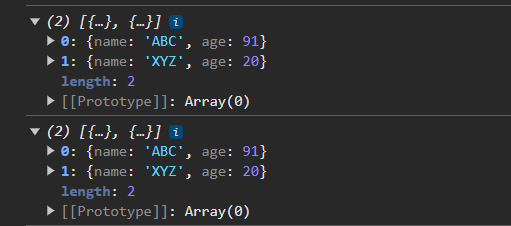

- This is because when we copied elements from one array to another array, we are not creating new objects instead we are copying the memory addresses of it. So the copied element into the new array is still point the same object's memory address. Now consider below code.

```
let ObjectSpreadArr3=[...ObjectSpreadArr1.map(i=>{

    return {name:i.name,
      age:i.age
    }

})]

ObjectSpreadArr1[0].age=991
console.log(ObjectSpreadArr1)
console.log(ObjectSpreadArr3)
```

- On browser console

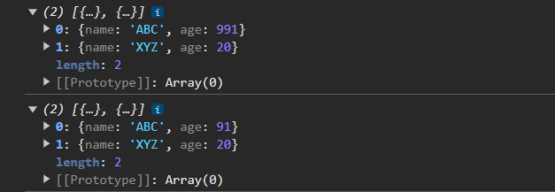

- Here using `map()` method we are creating new object which will have new memory address, so changing an object's property in one array will won't affect other array.
- Now consider below nested object code

```
let NestedSpreadObject={
  name: "ABC",
  hobbies:["Cycling","Dancing","Singing"],
  age:24
}

//Copying Objects
let NestedSpreadObject1=NestedSpreadObject

// Changing the age value in first object
NestedSpreadObject.age="42"

console.log(NestedSpreadObject1.age) //42 (Since sharing the same memory references for the same object)

let NestedSpreadObject2={...NestedSpreadObject}

// Changing the age value in first object
NestedSpreadObject.age="22"

console.log(NestedSpreadObject2.age) //42 (Since a new object is created and copied the existing object details with new memory references)
```

-  When you're using the assignment operator (`=`) to attempt to copy an object, what **you're actually copying is the memory address, not the object itself.**
-  But when we change the nested object value, it affects other variables. Incase of nested object , for them, no new objects are created they still refer the same memory address.

```
NestedSpreadObject.hobbies.push("Acting")
console.log(NestedSpreadObject2.hobbies) //[ 'Cycling', 'Dancing', 'Singing', 'Acting' ]
```

- In such case , to create a new array we can again use spread operator

```
let NestedSpreadObject3={...NestedSpreadObject,hobbies:[...NestedSpreadObject.hobbies]}
NestedSpreadObject.hobbies.push("Playing")
console.log(NestedSpreadObject.hobbies) //[ 'Cycling', 'Dancing', 'Singing', 'Acting', 'Playing' ]
console.log(NestedSpreadObject3.hobbies) //[ 'Cycling', 'Dancing', 'Singing', 'Acting' ]
```

##### Arrays Destructing

- Array destructuring allows you to unpack values from arrays (or objects) into individual variables. It provides a concise way to extract multiple values from an array at once.

```
//Array Destructing
let arrdes = [10, 20, 30];
let [x, y, z] = arrdes;

console.log(x); // Output: 10
console.log(y); // Output: 20
console.log(z); // Output: 30
```

- The array is unpacked from left to right. The first variable (e.g., `x`) gets the first element from the array. The second variable (e.g., `y`) gets the second element from the array. And so on...
- If you want to skip certain elements in the array, you can leave a blank space with a comma.

```
let [x1,,z1]=arrdes
console.log(x1)//10
console.log(z1)//30
```

- If the array doesn't have enough elements, you can assign default values to variables.

```
let [x2,y2=100]=arrdes
console.log(x2)//10
console.log(y2)//100
```

- You can also use the rest operator (`...`) to collect the remaining elements into a new array.

```
let [x3,...restElements]=arrdes
console.log(x3)//10
console.log(restElements)//[20,30]
```

- Array destructuring can be nested to extract values from arrays inside arrays.

```
let arrb = [10, [20, 30]];
let [a, [b, c]] = arrb;

console.log(a); // Output: 10
console.log(b); // Output: 20
console.log(c); // Output: 30
```

- You can further destructure the properties of each object directly.

```
const users = [
  { name: 'Alice', age: 25 },
  { name: 'Bob', age: 30 },
  { name: 'Charlie', age: 35 }
];

// Destructure to get specific properties
const [{ name: firstName }, { age: secondUserAge }] = users;

console.log(firstName);      // Output: Alice
console.log(secondUserAge);  // Output: 30
```

#### Map

- A Map is a collection of key-value pairs where both keys and values can be of any data type (objects, primitives, etc.). Unlike plain objects, Map maintains the insertion order of its elements and treats all keys as unique. It can we initialized by passing an array of key-pairs, so there will be multiple arrays for multiple key-pairs.

```
// Creating a map
let myMap = new Map();

// Or initializing with key-value pairs
let initializedMap = new Map([
  ['name', 'Alice'],
  ['age', 25],
  [{ city: 'NY' }, 'Object as key']
]);
console.log(initializedMap)
```

- On browser

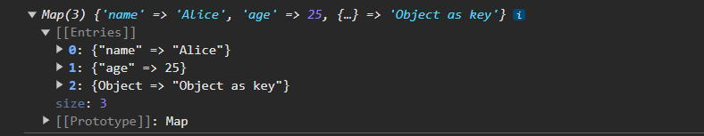

- You can add or update a key-value pair in the map using the `.set()` method.

```
myMap.set('name', 'ABC');
myMap.set('age', 24);
myMap.set({ city: 'NY' }, 'New York');
myMap.set("New Key","New Value")

console.log(myMap);// Output: Map { 'name' => 'ABC', 'age' => 25, { city: 'NY' } => 'New York','New Key' => 'New Value' }
```

- On browser console

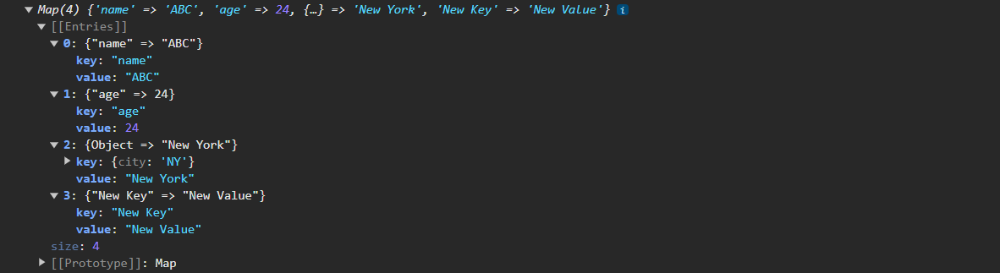

- Below are other operations which can be performed with Map

```
//Get value based on key name
console.log(myMap.get('name'));  // Output: ABC
console.log(myMap.get('age'));   // Output: 25
//If the key does not exist, get() will return undefined.
console.log(myMap.get('unknown'));  // Output: undefined

//Checking for Key Existence
console.log(myMap.has('name'));  // Output: true
console.log(myMap.has('gender'));  // Output: false

//Deleting Key
myMap.delete('age');
console.log(myMap);  // Output: Map { 'name' => 'ABC', { city: 'NY' } => 'New York', 'New Key' => 'New Value'}

//Size of Collection
console.log(myMap.size);  // Output: 3

//Clear Collection
myMap.clear();
console.log(myMap);  // Output: Map {}

myMap = new Map([
  ['name', 'Alice'],
  ['age', 25],
  ['country', 'USA']
]);
//Iterating over Map
myMap.forEach((value, key) => {
  console.log(`${key}: ${value}`);
});

// Output:
// name: Alice
// age: 25
// country: USA

for(const [key,value] of myMap.entries()){
  console.log(key,value)
}

//Output:
// name Alice
// age 25
// country USA

//Get Keys only
for(const key of myMap.keys()){
  console.log(key)
}

//Output:
// name
// age
// country

//Get Values only
for(const values of myMap.values()){
  console.log(values)
}

//Output:
// Alice
// 25
// USA
```


#### Set

- A Set is a collection of unique values, meaning it cannot contain duplicate elements. Sets are a part of the ES6 (ECMAScript 2015) standard, and they allow you to store any type of value (primitives or objects).

```
let mySet = new Set([1, 2, 3, 3, 4]);  // Duplicate '3' will be removed
console.log(mySet);  // Output: Set(4) {1, 2, 3, 4}
mySet.add(5) //Adding Element
mySet.add(6) //Adding Element
mySet.add(7) //Adding Element
mySet.add(1) //Adding Element
console.log(mySet) //Set(7) {1, 2, 3, 4, 5, 6, 7}
```

- We can check if a element exist or not in the set collection.

```
console.log(mySet.has(2));  // Output: true
console.log(mySet.has(50));  // Output: false
```

- There are other operations which can be used with Set

```
mySet.delete(2); //Deleting Element
console.log(mySet);  // Output: Set(6) {1, 3, 4, 5, 6, 7}

mySet.clear(); //Clearing Elements
console.log(mySet);  // Output: Set { }

mySet = new Set();
mySet.add(1);
mySet.add(2);
mySet.add(3);
mySet.add(4);
console.log(mySet.size);  // Output: 4 (Size of Set collection)

// Using forEach method
mySet.forEach(item => {
  console.log(item);  // Output: 1, 2, 3 (each on a new line)
});

console.log(mySet.values()) //SetIterator {1, 2, 3, 4}
```

- Now consider below code

```
for(const i of mySet.entries()){
  console.log(i)
}
```

- On browser we can see an array with same elements


- Why so?  internally, **the Set API is designed to be consistent with Map and Array iterators**, which return key-value pairs in array. The Set data structure only stores values (not key-value pairs like Map). So, when you use `.entries()` on a Set, it returns the value twice in each array element ([value, value])
- So, when iterating over the Set with `entries()`, you always get two identical values in each iteration because a Set does not have a separate key and value. Instead of `entries()` you can use `values()`

### Map vs Object

| **Feature/Aspect**    | **Map**                                                                                           | **Object**                                                                                                        |
|-----------------------|---------------------------------------------------------------------------------------------------|-------------------------------------------------------------------------------------------------------------------|
| **Key Types**         | Keys can be any data type (objects, functions, primitives).                                       | Keys are typically strings or symbols (although non-string keys are converted to strings).                        |
| **Order of Elements** | Preserves the insertion order of key-value pairs.                                                 | Does not guarantee the order of keys (although ES6+ tries to maintain insertion order in some cases).             |
| **Iteration**         | Direct methods (for...of, `.keys()`, `.values()`, `.entries()` for easy iteration).                     | Requires manual iteration using for...in (which may include prototype chain) or `Object.keys()`/`Object.values()`    |
| **Performance**       | Map is optimized for frequent additions, deletions, and retrievals, especially with many entries. | Slower for adding/removing properties as the size of the object grows (especially if not purely dictionary-like). |

### WeekSet and WeekMap

- WeakMap and WeakSet are specialized versions of Map and Set, but they work with "weak" references to objects. This means that if the object used as a key in a WeakMap or as a value in a WeakSet is no longer referenced anywhere else, it can be garbage-collected (automatically removed from memory), which helps with memory management.
- Example of WeakMap

```
let obj = { name: 'Alice' };
let weakMap = new WeakMap();

weakMap.set(obj, 'Employee');

console.log(weakMap.get(obj));  // Output: Employee

obj = null;  // Now there are no references to the object

// The object and its corresponding value will be garbage collected automatically
```

- In this case, once `obj` is set to `null` (or no longer referenced), the entry in WeakMap is removed automatically by the garbage collector.
- Like WeakMap, if the object added to the WeakSet is no longer referenced elsewhere in the program, it is automatically removed from the WeakSet.

```
let obj1 = { id: 1 };
let obj2 = { id: 2 };
let weakSet = new WeakSet();

weakSet.add(obj1);
weakSet.add(obj2);

console.log(weakSet.has(obj1));  // Output: true

obj1 = null;  // The object is no longer referenced

// obj1 will be automatically removed from the WeakSet by the garbage collector
```

- WeakMap and WeakSet automatically remove entries if the object is no longer referenced.

>[!NOTE]
> - **You cannot iterate** over WeakMap or WeakSet (no `.forEach()`, `.keys()`, or `.entries()`).
> - Unlike Map and Set, **they can only store objects (not strings or numbers)**.

### Summary

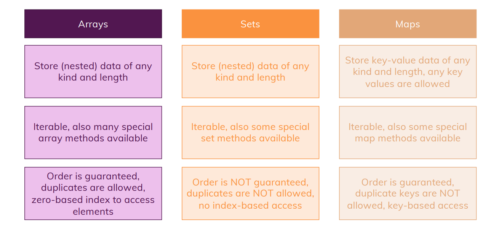


## OOP (Object-Oriented Programming)

### Object

- We learned earlier that **`an object is a data structure that can hold multiple values in the form of key-value pairs `**. Objects are a way to represent real-world entities or concepts. Think of them as a collection of properties (characteristics) and methods (actions) that define an object.
- Real-world examples:
  - A car:
    - Properties: `color`, `make`, `model`, `year`
    - Methods: `startEngine()`, `accelerate()`, `brake()`
  - A person:
    - Properties: `name`, `age`, `gender`, `occupation`
    - Methods: `greet()`, `walk()`, `talk()`


```
// Car object
let car = {
  color: "red",
  make: "Toyota",
  model: "Corolla",
  year: 2022,
  startEngine: function() {
    console.log("Engine started");
  },
  accelerate: function() {
    console.log("Car accelerating");
  },
  brake: function() {
    console.log("Car braking");
  }
};
```

- The DOM elements, nodes , collections like array , map and set all are **objects** in JS. Objects in JavaScript can have properties and methods. Arrays, Maps, Sets, DOM elements, and nodes all have properties and methods that are tied to their prototypes. These objects inherit from their respective prototypes (`Array.prototype`, `Map.prototype`, `Set.prototype`, `Node.prototype`, etc.), which in turn inherit from `Object.prototype`, making them all part of the object hierarchy.


*We will learn about prototype later*


- In JavaScript **except from primitive values everything is object**.


#### CRUD on Object

- Consider below code for creating a property and accessing it.

```
console.log(car.color) //red (Accessing property)
car.brand="TATA" // Adding a new Property
console.log(car)
```

- On browser console

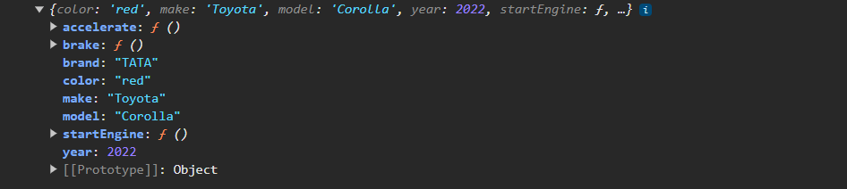

- Updating property

```
car.year=2024 //updating a property
console.log(car)
```

- On browser console

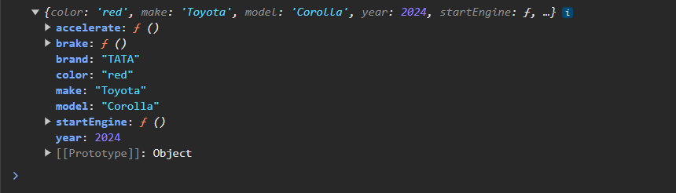

- Deleting property

```
car.startEngine=undefined //Deleting a property using undefined (null won't work)
delete car.model //Deleting a property
console.log(car)
```

- On browser console

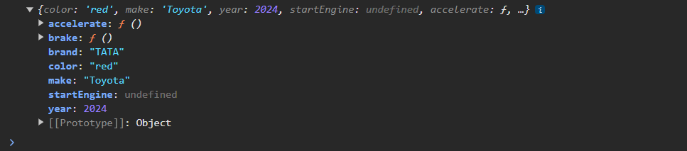

#### Type of Object keys

- In JS, you can make your key as a string and can access it just like an array index, but instead of specifying index number you need to specify the string key.

```
let StringKeys={
  "First name": "ABC",
  "Last name": "XYZ"
}
console.log(StringKeys["First name"]) //ABC
```

- Using this way you can introduce special characters in your object keys.
- Similarly your object keys can be **positive numbers either float or integers (including) but cannot be negative**. Behind the scene it will be coerced into String.

```
let NumberKyes={
  1.5: "Hi",
  0: "Hello"
}
console.log(NumberKyes[0]) //Hello
```

#### Order of Object Keys

- Consider below code

```
let OrderingOfKeys={
  2: "Hi",
  1: "Hello",
  "First": 1,
  greet: function(){
    console.log("Greetings!")
  },
  "a": "ABC"
}
console.log(OrderingOfKeys)
```

- On browser console, if you see the ordering of elements are not consistant.


- The ordering of object keys follows a specific pattern. When iterating over or accessing the keys of an object, JavaScript orders them in the following way:
  - Integer-like keys (numeric keys) are sorted in ascending order.
  - String keys are displayed in the order they were added (insertion order).
  - Symbol keys (if any) are iterated last, in the order of insertion.

#### Setting Keys Dynamically

- You can dynamically set keys and values in an object using bracket notation (`[]`)
- Consider below Code.

```
let first_name="A Person First Name"
let PersonObject={
  [first_name]: "ABC",
  lastName: "XYZ"
}
console.log(PersonObject)
console.log(PersonObject[first_name]) //ABC
```

- On browser console.


- This can be use full when you wanted to have a key based on user-defined input. It’s particularly useful when you don't know the property name ahead of time or when the key is generated dynamically, stored in a variable, or contains special characters.
- Dot notation (`object.key`) is used when you know the exact key name and it is a valid identifier (without spaces, starting with a letter, etc.).
- Bracket notation (`object[key]`) is useful when the key is dynamic (e.g., stored in a variable), or when it contains special characters or spaces.

#### Chaining Property or Method Chaining

- Method chaining is a technique where you combine individual methods in a single line of code to form a chain of actions. Each method in the chain performs a specific function, but when combined together, they create a powerful sequence of actions that can accomplish complex tasks with just one line of code.

```
let chainingObjects={
  name:{
    family_name:{
      first_name: "ABC",
      last_name: "XYZ"
    }
  }
}

//Chaining methods
console.log(chainingObjects.name.family_name.first_name) //ABC
```

- Another example

```
// Method chaining with string.
let myStr = ' - Hello-world. '

// Without method chaining:
myStr = myStr.toLowerCase()
myStr = myStr.replace(/-/g, ' ')
myStr = myStr.trim()

// With method chaining:
myStr = myStr.toLowerCase().replace(/-/g, ' ').trim()

// Alternative with method chaining and multiple lines:
myStr = myStr
  .toLowerCase()
  .replace(/-/g, ' ')
  .trim()

// Log the value of "myStr" variable.
console.log(myStr)
// Output:
// 'hello world.'
```

- Method chaining help you write more readable code by eliminating unnecessary variables and reducing the amount of code you have to write. Instead of storing each step value into variables, it perform execution sequentially and stores the value into one variable, thus improve performance by reducing the memory needed to run a code since it reduces the number of times you need to access an object.


#### Object Destructing

- Similarly like we have Array destructing property of array, where we fetch values from the array into variable, object destructing fetches the keys from the object name.
- Consider below code.

```

let objDes={
  name: "ABC",
  age: 20,
  info:{
    fname: "ABC",
    lname: "XYZ"
  }
}

const { name, age , ...remainingObjectDes} = objDes;
console.log(name); //ABC
console.log(age); //20
console.log(remainingObjectDes) // info:  {fname: 'ABC', lname: 'XYZ'}
```

- Here we need to specify the **key** name. If you wanna store your key's value into a different variable you can do it like below

```
let objDes={
  name: "ABC",
  age: 20,
  info:{
    fname: "ABC",
    lname: "XYZ"
  }
}

const { name: objName, age: objAge} = objDes;
console.log(objName); //ABC
console.log(objAge); //20
```

- This is how we give **alias name to your destructured variables**. You can use destructing variables into loops

```

const usersList = [
  { 
      'name': 'Alex',
      'address': '15th Park Avenue',
      'age': 43
  },
  { 
      'name': 'Bob',
      'address': 'Canada',
      'age': 53
  },
  { 
      'name': 'Carl',
      'address': 'Bangalore',
      'age': 26
  }
];

for(let { name, age } of usersList) {
  console.log(`${name} is ${age} years old!`);
}


Output:
Alex is 43 years old!
Bob is 53 years old!
Carl is 26 years old!
```

#### Checking Key in Object

- To check if a specify key property exists or not in the object

```
let chkObj={
  objectKey1: 1,
  objectKey2: 2
}

if('objectKey1' in chkObj){
  console.log("Property Exists") //Property Exists
}

if(chkObj.objectKey3 == undefined){
  console.log("Property does not Exists") //Property does not Exists
}
```

- If the property does not there and if you are trying to access it using the object name JS will give you `undefined`.

#### this 

- The `this` keyword in JavaScript refers to the object it belongs to. It has different values depending on where and how it is used.

##### In Global context

- When used in the global context, outside of any function or object, this refers to the global object. 

```
console.log(this)
```

- On browser console


- Here when we print `this` in console, it refers to the global `window` object.

##### In a Function Context in Non-Strict Mode

- In a regular function, this refers to the global object (window in a browser).

```
function show() {
    console.log(this);
}
show();
```

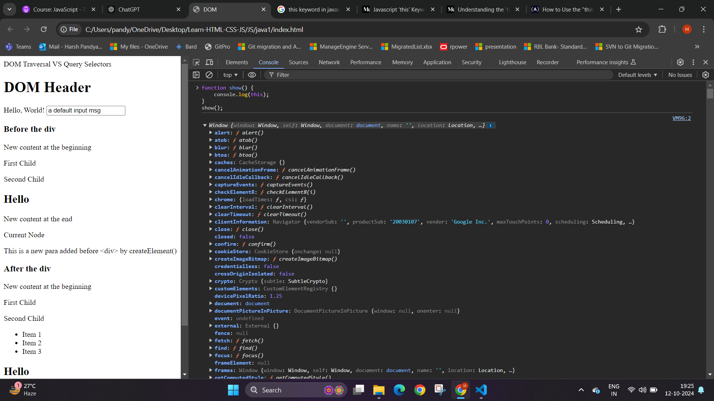

##### In a Function Context Using Strict Mode

- When we apply, strict mode using `use strict`, `this` keyword will be undefined.

```
"use strict";

function show(){
  console.log(this)
}

show(); //undefined
```

##### In Method Context

- When a function is part of an object, we call it a method. In methods, `this` refers to the object the method is called on.

```
const person = {
    name: 'Alice',
    greet: function() {
        console.log('Hello, ' + this.name);
    }
};
person.greet(); // Hello, Alice
```

- `person` is an object which is calling function `greet()`, so `this` refers `person`. So just like when we access object key `person.name`, inside the `greet` function we access it using `this.name`.
- The above function can be re-written as short hand by removing `function()` like below

```
const person = {
    name: 'Alice',
    greet() {
        console.log('Hello, ' + this.name);
    }
};
person.greet(); // Hello, Alice
```

- Now consider below code, here we are using object destructing

```
const person = {
  name: 'Alice',
  greet() {
      console.log('Hello, ' + this.name);
  }
};
person.greet(); // Hello, Alice
const {greet} = person
greet(); // Hello,
```

- Earlier `person` was the object because it was getting referred, now before the `greet()` function there is no reference (`undefined`) thats why , `this.name` is empty.
- Here the `person` is not used.

```
const person = {
  name: 'Alice',
  greet() {
      console.log('Hello, ' + this.name);
  }
};

let {greet:newGreet} = person
newGreet= newGreet.bind(person)
newGreet(); // Hello, Alice
greet(); // Hello,
```

- Here we have `bind` the object with the method, so whenever the method is called in future, the `person` object is associated it with or pre-configured with it.


##### call and apply

- The above code can be reduce using `call()` or `apply()`. `bind()` prepare the function with values for future execution whereas `call()` or `apply()` executes the function immediately with given value.

```
const person = {
  name: 'Alice',
  greet() {
      console.log('Hello, ' + this.name);
  }
};

greet.call(person); // Hello, Alice
greet.apply(person); //Hello, Alice
```

- The difference between `call()` and `apply()` lies in how arguments are passed to the function.
  - `call(thisArg, arg1, arg2, ...)`: You pass arguments individually.
  - `apply(thisArg, [argArray])`: You pass arguments as an array.
- See the below example

```
function introduce(greeting, punctuation) {
  console.log(greeting + ", I am " + this.name + punctuation);
}

const person1 = { name: "Alice" };
const person2 = { name: "Bob" };

// Using call (pass arguments separately)
introduce.call(person1, "Hello", "!");  // Output: Hello, I am Alice!
introduce.call(person2, "Hi", ".");     // Output: Hi, I am Bob.

// Using apply (pass arguments as an array)
introduce.apply(person1, ["Hello", "!"]);  // Output: Hello, I am Alice!
introduce.apply(person2, ["Hi", "."]);     // Output: Hi, I am Bob.
```

##### In Event Handler

- Consider below HTML and JS code

```
HTML Code Snip
  <button id="myButton">Click Me</button>


JS Code
const ButtonHandler=document.getElementById("myButton");

/**
 * Trigger function when clicked on Button
 */
ButtonHandler.addEventListener("click",function(){
  console.log(this)
})
```

- On browser console


- When you use a regular function as an event handler, `this` refers to the HTML element that received the event. When the button is clicked, `this` inside the regular function refers to the button element because that's where the event occurred.

##### In Arrow Function

- Consider the same above code for HTML and JS, instead of using regular function we will use arrow function

```
HTML Code Snip
  <button id="myButton">Click Me</button>


JS Code
const ButtonHandler=document.getElementById("myButton");

/**
 * Trigger function when clicked on Button
 */
ButtonHandler.addEventListener("click",()=>{
  console.log(this)
})
```

- On click, the browser console gives **window** object and not the button element


- Why so? **Arrow functions do not create their own `this` context**. **Instead, they inherit this from the surrounding scope where they are defined**.
- Every regular function created with the `function` keyword has its own `this` binding, so in the end it ensures that `this` inside of that function is bound to something, it's bound to whatever is responsible for executing the function. Now arrow functions don't bind `this` to anything.
- The arrow function inside `addEventListener` does not have its own `this`. It inherits `this` from the surrounding scope, which is the global scope (in a browser, that's the `Window` object).
- Consider below code

```
const outerObject = {
  name: "outer",
  logThis() {
    document.getElementById("myButton").addEventListener("click", () => {
      console.log(this);  // Refers to 'outerObject', not the button element
    });
  }
};
```

- On browser console we get


- In this code, the arrow function is written inside `logThis`. Therefore, `this` inside the arrow function refers to whatever `this` was when `logThis` was called. In `logThis`, this refers to `outerObject`, because that's the object that called the method (`outerObject.logThis()`).
- When the arrow function is triggered by clicking the button, it doesn't change `this` to the button element (as it would with a regular function). Instead, it sticks to what `this` was in the outer scope (which is `outerObject`).
- Since `logThis` is called by `outerObject.logThis()`, the value of `this` is `outerObject`.
-  The normal functions have their scope bound by default to the global one. The arrow functions, on the other hand, do not have their own `this` but instead inherit it from the parent scope. As a result, rather than binding their own `this`, the arrow functions inherit the `this` from the parent scope. **This process is called lexical scoping.**

>[!TIP]
> - Since `this` has multiple behaviors , to identify what does `this` is referencing we can do `console.log(this)`.

#### Getters and Setters

- Getters and setters in JavaScript are special methods that allow you to access and modify the properties of an object in a controlled way. They are part of object-oriented programming and help you define how object properties are accessed or updated without directly manipulating them.
  - Getters: Used to access (or `get`) the value of a property.
  - Setters: Used to modify (or `set`) the value of a property.

```
const personInfo = {
  firstName: "John",
  lastName: "Doe",
  
  // Getter to retrieve full name
  get fullName() {
    return this.firstName + " " + this.lastName;
  },
  
  // Setter to update first and last name together
  set fullName(name) {
    const parts = name.split(" ");
    this.firstName = parts[0];
    this.lastName = parts[1];
  }
};

// Accessing fullName using the getter
console.log(personInfo.fullName);  // Output: John Doe

// Updating fullName using the setter
personInfo.fullName = "Jane Smith";

// Accessing updated fullName
console.log(personInfo.fullName);  // Output: Jane Smith
console.log(personInfo.firstName);  // Output: Jane
console.log(personInfo.lastName);   // Output: Smith
```

- The getter computes the `fullName` whenever it's accessed (without needing a separate `fullName` property). The setter allows updating both `firstName` and `lastName` by assigning a new value to `fullName`.
- Getters are used for reading data. Setters are used for writing or modifying data. Getters and setters allow you to customize the behavior of object properties.
- With the help of getters and setters you can define validation in the method, like specific authorities must have access or specific condition should be met before updating value.

### What is OOP?

- So when a car was introduce, a blueprint of a car was prepared, like what could be requirements to built a car? , this included color, Engine, cylinder and etc..
- So imagine referring this blue print, there is a Ferrari car, so what could be its properties? color - red, Engine - 3902 cc, No. of cylinder - 4 and so on.. what could be his behavior? so the behaviors - Start engine, Accelerate, Brake, Turn, Park.
- **Class**: Is the blueprint to built a car.
- **Object**: Is Ferrari
- **Properties**: Is Ferrari properties
- **Method**: Is Ferrari behavior.
- So OOP basically organize your code structure by defining a class which acts as a blueprint. It consists a set of properties (data) and methods (behaviors). It provides a general template for what an object can be and do.
- To use the class, you create or instantiate an object. The object is a specific instance of the class, with its own customized properties using the properties of class (like a red Ferrari with a 3902 cc engine) and access to the methods defined in the class.

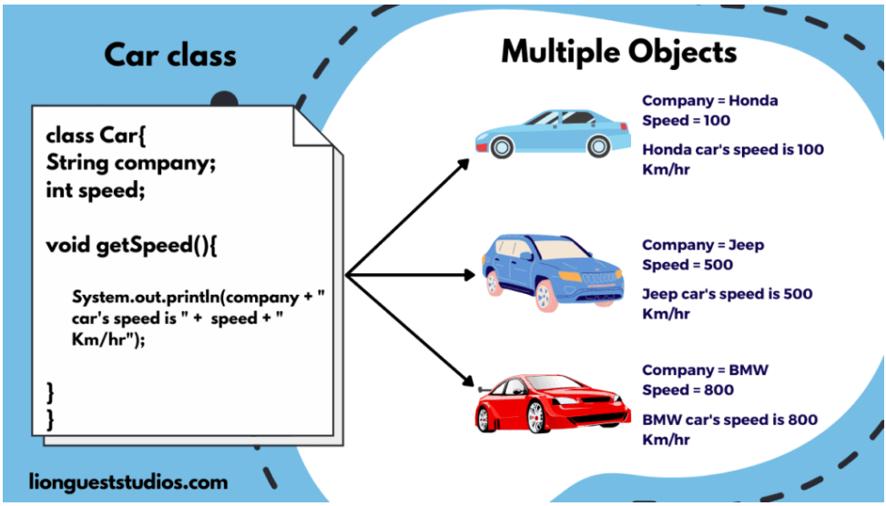

- OOP (Object-Oriented Programming) is a programming paradigm that organizes code by creating objects that represent real-world things, like cars, people. These objects have properties (attributes) and methods (behaviors or actions) that define what they are and what they can do.
- Consider below code

```
// Define a Car class (the blueprint)
class Car{


  //Properties of Car Class
  engine;
  NumberOfCylinders=4; //Default 4 cylinder.
  color;

  //Methods of Car Class
  // Method to display car details (behavior)
  CarDefinition(){
    console.log("Color - "+this.color+", Engine: "+this.engine+", Number Of Cylinders: "+this.NumberOfCylinders)
  }

  startEngine(){
    console.log("Starting Engine") //Starting Engine
  }

  ApplyingBreaks(){
    console.log("Applying Breaks")
  }

  Accelerating(){
    console.log("Accelerating car")
  }
}

// Create an instance (object) of the Car class
const Ferrari = new Car();
Ferrari.color="red"
Ferrari.NumberOfCylinders=6
Ferrari.engine="Super"
Ferrari.CarDefinition()
Ferrari.startEngine()
Ferrari.Accelerating()
Ferrari.ApplyingBreaks()
```

- On browser console


- If you see , the code looks readable. If you wanna create another instance of class or object you can similarly do it

```
const Lamborghini = new Car();
Lamborghini.color="yellow"
Lamborghini.NumberOfCylinders=5
Lamborghini.engine="Super"
```

- If we don’t use OOP, we might end up with repetitive code and less organized structures. Without classes and objects, every car, person, or idea would need its own separate functions and properties, even if they’re very similar.

```
const FerrariColor = "red";
const FerrariEngine = "Super";
const FerrariNoOfCylinders = 6;

const LamborghiniColor = "Yellow";
const LamborghiniEngine = "Super";
const LamborghiniNoOfCylinders = 5;

function CarDefinition(Color, Engine, NoOfCylinders) {
  return `${Color} ${Engine}, NoOfCylinders: ${NoOfCylinders}`;
}

console.log(CarDefinition(FerrariColor, FerrariEngine, FerrariNoOfCylinders));  //Output: red Super, NoOfCylinders: 6
console.log(CarDefinition(LamborghiniColor, LamborghiniEngine, LamborghiniNoOfCylinders)); //Output: Yellow Super, NoOfCylinders: 5
```

- **Without OOP**:
  - More Repetition: Every new car requires new variables for the color, Number of cylinder, and Engine. The code becomes more cluttered and harder to manage as more cars are added.
  - Lack of Structure: There’s no clear relationship between cars and their details.


#### Why Use OOP?

- Reusability: You can reuse the class blueprint to create as many objects as you need, without repeating code.
- Organization: Classes make your code more organized and easier to understand.
- Modularity: You can add new functionality to a class without affecting other parts of the program.
- Maintainability: If you need to change or update the logic for all car objects, you just update the class.


### Constructor

- A constructor is a special method in a class used to initialize objects when they are created. It sets up the initial values for the object's properties. The constructor is called automatically when you create a `new` instance of the class using the new keyword.

```
// Define a Car class (the blueprint)
class Car{

  //Properties of Car Class
  engine;
  NumberOfCylinders=4; //Default 4 cylinder.
  color;

  constructor(engine,NumberOfCylinders,color){
    //this references the class Properties
    this.engine=engine; 
    this.NumberOfCylinders=NumberOfCylinders
    this.color=color
  }

  //Methods of Car Class
  // Method to display car details (behavior)
  CarDefinition(){
    console.log("Color - "+this.color+", Engine: "+this.engine+", Number Of Cylinders: "+this.NumberOfCylinders)
  }

  startEngine(){
    console.log("Starting Engine") //Starting Engine
  }

  ApplyingBreaks(){
    console.log("Applying Breaks")
  }

  Accelerating(){
    console.log("Accelerating car")
  }
}

// Create an instance (object) of the Car class
const Ferrari = new Car("Super",6,"red");
Ferrari.CarDefinition()
Ferrari.startEngine()
Ferrari.Accelerating()
Ferrari.ApplyingBreaks()

Output:
Color - red, Engine: Super, Number Of Cylinders: 6
Starting Engine
Accelerating car
Applying Breaks
```

- Using constructor we initialize all the require class properties rather then setting one by one which is done in the previous code. The keyword `this` inside the constructor refers to the new object being created, allowing you to assign properties to it.
- When we add constructor the declaring **Property becomes optional**. The above `Car` class can be re-written as

```
// Define a Car class (the blueprint)
class Car{

  constructor(engine,NumberOfCylinders,color){
    //this references the class Properties
    this.engine=engine; 
    this.NumberOfCylinders=NumberOfCylinders
    this.color=color
  }

  //Methods of Car Class
  // Method to display car details (behavior)
  CarDefinition(){
    console.log("Color - "+this.color+", Engine: "+this.engine+", Number Of Cylinders: "+this.NumberOfCylinders)
  }

  startEngine(){
    console.log("Starting Engine") //Starting Engine
  }

  ApplyingBreaks(){
    console.log("Applying Breaks")
  }

  Accelerating(){
    console.log("Accelerating car")
  }
}
```

### Connecting Multiple Classes 

- Lets create a `Person` class.

```
// First Class: Person
class Person {
  constructor(name, age) {
      this.name = name; // 'this' refers to the current instance of Person being created
      this.age = age;
  }

  greet() {
      // 'this' here refers to the current instance of Person calling this method
      console.log(`Hello, my name is ${this.name} and I am ${this.age} years old.`);
  }
}
```

- The `Person` class has properties `name` and `age`, which are set using the `this` keyword. Here, `this` refers to the specific instance of `Person` being created.

```
// Example Usage:
// Create a person instance
const john = new Person("John Doe", 30);
```

- So here `john` becomes the `this`. The `this` keyword inside the Person class refers to the instance that is being created, which in this case is the object stored in the `john` variable. 
- A `new` instance of `Person` is created, and the `constructor` is called with the arguments `John Doe` and `30`. Inside the `constructor`, `this` refers to the instance that is being created (which is the object `john`). So, `this.name = name` sets `john.name` to `John Doe`, and `this.age = age` sets `john.age` to `30`.
- Each `Person` can have multiple Teachers, so lets create a class of `Teacher`.

```
// Second Class: Teacher (uses a Person object)
class Teacher {
  constructor(person, subject) {
      this.person = person; // 'this' refers to the current instance of Teacher being created
      this.subject = subject;
  }

  introductionOfTeacher() {
      console.log(`I teach ${this.subject}.`); // 'this' refers to the current Teacher object
      const PersonBtn=document.getElementById("personIntroduce");
      PersonBtn.addEventListener("click",this.person.greet)
  }
}

// Example Usage:
// Create a person instance
const john = new Person("John Doe", 30);

// Create a teacher instance, passing the person instance to the constructor
const mathTeacher = new Teacher(john, "Math");
mathTeacher.introductionOfTeacher()
```

- The `Teacher` class has a `person` property, which holds a reference to an instance of `Person` which are created. So here we have one instance `john`. The another property is `subject`.
- The `Teacher` class uses an instance of the `Person` class thus `Teacher` class and `Person` class are connected.
- Here, when the method `introductionOfTeacher()` teacher introduces herself, now there is an HTML button when click then only person introduces itself.


<video controls src="Images/js1/2024-1.mp4" title="title"></video>

- If you see, when we clicked on `Introduce Person` button, we did not details of `john` why so? when an event handler (like `addEventListener`) is triggered, the `this` context inside the handler refers **to the element that triggered the event** (in this case, `PersonBtn`). To ensure that the `greet()` method refers to the `person` object you **need to bind `this.person` explicitly** using `.bind(this.person)`.
- Updated `introductionOfTeacher()` method

```
  introductionOfTeacher() {
      console.log(`I teach ${this.subject}.`); // 'this' refers to the current Teacher object
      const PersonBtn=document.getElementById("personIntroduction");
      PersonBtn.addEventListener("click",this.person.greet.bind(this.person))
  }
```

- Now when we click on button `Introduce Person` we get the `person` details.


### Static Properties and Method

- Up till now all the Properties and Methods we saw were instance properties and method. These are dedicate to objects which are create using `new` keyword.
- Static properties, fields, and methods are associated with a class itself, not with instances of the class. This means you can access static members without creating an object (or instance) of the class.
- Lets see an example

```

class CountOfObjects{
 
  //Static Property
  static objectsGotCreated=0;

  //Instance Property
  name;
  constructor(name){
    this.name=name; // 'this' refers to the specific instance of Object name being created
    CountOfObjects.objectsGotCreated+=1;  // Accessing the static property using Class name (CountOfObjects) to track how many Object have been created
  }

  //Static method
  static classDisplay(){
    console.log("A Common Static Method") // Accesses the static property
  }

  //Instance method
  display(msg){
    console.log(`A Object (${this.name}) method displaying - ${msg}`); // Works on individual name of instances
  }
};

const Cob1= new CountOfObjects("Cob1");
Cob1.display("Message Given From Object 1")
CountOfObjects.classDisplay(); // Accesses the static method with class name
const Cob2= new CountOfObjects("Cob2");
Cob1.display("Message Given From Object 2")

// Both objects access the static property via the class
console.log("Objects Up till now created - "+CountOfObjects.objectsGotCreated); // Accesses the static property with class name


Output:
A Object (Cob1) method displaying - Message Given From Object 1
A Common Static Method
A Object (Cob1) method displaying - Message Given From Object 2
Objects Up till now created - 2
```

- Instance properties are specific to each object created from the class. Instance methods are functions that operate on individual instances of the class.
- Static properties are values attached to the class, not to the individual instances. Static methods are functions that are called on the class itself, not on instances of the class.
- Static Properties/Methods are accessed via `ClassName.propertyName` or `ClassName.methodName`. They do not require an instance of the class to be created or object to be created.


```
class CountOfObjects{
 
  //Static Property
  static objectsGotCreated=0;

  //Instance Property
  name;
  constructor(name){
    this.name=name; // 'this' refers to the specific instance of Object name being created
    CountOfObjects.objectsGotCreated+=1;  // Accessing the static property using Class name (CountOfObjects) to track how many Object have been created
  }

  //Static method
  static classDisplay(){
    console.log("A Common Static Method") // Accesses the static property
  }

  //Instance method
  display(msg){
    console.log(`A Object (${this.name}) method displaying - ${msg}`); // Works on individual name of instances
  }
};

CountOfObjects.classDisplay();
console.log("Objects Up till now created - "+CountOfObjects.objectsGotCreated);

Output:
A Common Static Method
Objects Up till now created - 0
```

- **Static properties and methods are shared across all objects of the class, but they are not actually attached to the objects themselves**. Instead, they belong to the class itself. When you define a static property or method, it’s accessible through the class, not through the individual instances (objects). All instances of the class can indirectly access the static properties or methods because those properties belong to the class.


### Inheritance

- Inheritance is a mechanism that allows one class to inherit properties and methods from another class creating a parent-child class relationship.

```
// Parent class: Animal
class Animal {

  // Instance method available to all animals
  walk() {
      console.log(`Animal walks`);
  }
}

// Child class: Dog
class Dog extends Animal {

  // Override the parent method
  bark() {
      console.log(`Dog barks.`);
  }
}

// Example usage:
const animal = new Animal();
animal.walk(); // Output: Animal Walks

const myDog = new Dog();
myDog.bark(); // Output: Dog barks.
myDog.walk(); // Output: Animal Walks
```

- Here the class `Dog` inherits all the properties and methods of class `Animal`. Thats why **if we create object of child class (`Dog`) we can access methods of parent class (`Animal`) using child class object**. To inherit the property the child class must use the **extends** keyword followed by parent class name.
- Inheritance allows you to create a new class that is based on an existing class. The new class (child) inherits properties and methods from the parent class, but can also have its own unique properties and methods.
- **Multiple inheritance (inheriting from more than one class or parent) is not directly supported. A class can only extend one parent class using the `extends` keyword**. 
- We can access static property and methods of **parent class** using **child class name**.

```
// Parent class: Animal
class Animal {

  static life=true;

  // Instance method available to all animals
  walk() {
      console.log(`Animal walks`);
  }

  static lives(){
    console.log("Animal is alive");
  }
}

// Child class: Dog
class Dog extends Animal {

  // Override the parent method
  bark() {
      console.log(`Dog barks.`);
  }
}

console.log(Dog.life); //Output: True
console.log(Dog.lives()) //Output: Animal is alive"
```

### Super 

- The `super()` keyword (or method) is used in class inheritance to call methods or constructors of the parent class. When a class extends another class (inheritance), `super()`allows you to access and use the properties and methods of the parent class within the child class.
- Calling parent constructor

```
// Parent class
class Animal {
    constructor(name) {
        this.name = name; // Instance property for the Animal class
    }

    // Method of the parent class
    speak() {
        console.log(`${this.name} makes a sound.`);
    }
}

// Child class (Dog) that extends Animal
class Dog extends Animal {
    constructor(name, breed) {
        // Call the parent class (Animal) constructor with super()
        super(name); // 'name' is passed to Animal's constructor
        this.breed = breed; // Additional property specific to Dog
    }

    // Override the speak method, but call parent method using super
    speak() {
        super.speak(); // Call the parent's speak method
        console.log(`${this.name} barks.`);
    }
}

// Example usage
const myDog = new Dog("Dog", "Golden Retriever");
myDog.speak(); 

Output: 
Dog makes a sound.
Dog barks.
```

- We use `super(name)` to call the constructor of the parent class (`Animal`), so **`this.name` is properly initialized in the parent class**. Without calling `super(name)`, the child class wouldn’t be able to initialize the properties of the parent class (`this.name` in parent class).
- Now since the name got initialize in parent class, when we call the method of parent class `super.speak();` , we get the output `Dog makes a sound`.
- `super()` can only be used in classes that extend another class. You cannot use `super()` in a class that doesn't have a parent.
- Another example

```
class Parent {
    constructor() {
        console.log("Parent constructor");
    }
}

class Child extends Parent {
    constructor() {
        // Must call super() before using 'this' in the child constructor
        super();
        console.log("Child constructor");
    }
}

const obj = new Child(); 

Output: 
Parent constructor
Child constructor
```

- If we can access methods of parent class using `super.methodName()`, similarly we can access parent class property right like `super.propertyName`? No, you need to refer `this.propertyName` of your parent class

```
// Parent class: Animal
class Animal {
    constructor(name) {
        this.name = name; // Property of the parent class
    }

    // Method of the parent class
    speak() {
        console.log(`${this.name} makes a sound.`);
    }
}

// Child class: Dog
class Dog extends Animal {
    constructor(name, breed) {
        // Call the parent class constructor
        super(name); // Passes 'name' to the Animal constructor
        this.breed = breed; // Additional property specific to Dog
    }

    // Accessing the parent class property using 'super'
    showDetails() {
        console.log(`Dog's name is ${super.name} and breed is ${this.breed}.`);
    }
}

// Create an instance of Dog
const myDog = new Dog("Buddy", "Golden Retriever");

myDog.showDetails(); 

Output:
Dog's name is undefined and breed is Golden Retriever.
```

- Consider below JS code

```
class Animal {
    constructor(name) {
        this.name = name;
    }
}

class Dog extends Animal {
    constructor(name, breed) {
        // Trying to use 'this' before calling super() will cause an error
        this.breed = breed; // ❌ This will throw a ReferenceError!
        super(name); // This should be called first to initialize the parent class
    }
}

const myDog = new Dog("Buddy", "Golden Retriever"); // ReferenceError

Output:
ReferenceError: Must call super constructor in derived class before accessing 'this' or returning from derived constructor
```

- Why so `super()` must be called before `this`? 
  - The `super()` function is used to call the parent class's constructor, which initializes the parent class's properties.
  - Only after calling `super()` does the `this` keyword become available and can be used to set up properties specific to the child class.
  - This is required because `this` refers to the current instance, and that **instance is not fully constructed until the parent class's constructor has been called**


### Method Overriding

- Method overriding in JavaScript occurs when a child class (subclass) defines a method with the same name as a method in its parent class (superclass). The method in the child class overrides or replaces the method from the parent class.

```
// Parent class: Animal
class Animal {
    constructor(name) {
        this.name = name;
    }

    // Method in the parent class
    speak() {
        console.log(`${this.name} makes a sound.`);
    }
}

// Child class: Dog
class Dog extends Animal {
    constructor(name, breed) {
        super(name); // Call parent constructor to initialize 'name'
        this.breed = breed;
    }

    // Overriding the parent class's speak method
    speak() {
        console.log(`${this.name} barks.`);
    }
}

// Example usage:
const myAnimal = new Animal("Some Animal");
myAnimal.speak(); 

const myDog = new Dog("Buddy", "Golden Retriever");
myDog.speak();    //Dog Speak methods override the Animal Speak method

Output:
Some Animal makes a sound.
Buddy barks.
```

### Method Overloading (Not Supported)

- **In JavaScript method overloading is not supported**. Why so? in a language like java, for instance, the compiler will check the number and types of parameters passed to a function and match it with the function signature. In JavaScript however, type checking of parameters doesn't happen at compile time. In fact, the parameters won't be type checked even at run time unless they are actually used, and even then the type checking is extremely relaxed.
- JavaScript intended to be used **only for adding some minimal interactivity to a page**, instead of the large complex apps we write with it today. 
- You can have some work rounds like using **rest operator** or like below

```
class Calculator {
    // Method with dynamic behavior based on arguments
    calculate(a, b, operation) {
        // Check if only two arguments are passed (overloaded method 1)
        if (arguments.length === 2) {
            return a + b; // Default to adding the two numbers
        }

        // If three arguments are passed (overloaded method 2)
        if (arguments.length === 3 && operation === "multiply") {
            return a * b; // Perform multiplication
        }

        // Handle unknown operations or cases
        return "Invalid operation or number of arguments!";
    }
}

// Example usage:
const calc = new Calculator();

// Calling calculate method with 2 arguments (addition)
console.log(calc.calculate(3, 4)); // Output: 7 (3 + 4)

// Calling calculate method with 3 arguments (multiplication)
console.log(calc.calculate(3, 4, "multiply")); // Output: 12 (3 * 4)

// Invalid case (unknown operation)
console.log(calc.calculate(3, 4, "subtract")); // Output: Invalid operation or number of arguments!
```


### Private Property and Methods

- Up till now we have worked with public property and methods which were accessible outside the class.
- Private properties and methods in a class are those that cannot be accessed or modified from outside the class. In JavaScript, you can declare private properties and methods in classes using the `#` (hash) symbol as a prefix.

```
class Person {
    // Private property
    #age = 30;

    constructor(name) {
        this.name = name; // Public property
    }

    // Private method
    #getAge() {
        return this.#age;
    }

    // Public method that uses the private method
    introduce() {
        console.log(`Hi, my name is ${this.name} and I am ${this.#getAge()} years old.`);
    }
}

// Create an instance of Person
const person = new Person("John");

person.introduce(); // Output: Hi, my name is John and I am 30 years old.

// Trying to access private properties or methods directly (this will cause an error)
console.log(person.#age);    // ❌ SyntaxError: Private field '#age' must be declared in an enclosing class
person.#getAge();            // ❌ SyntaxError: Private field '#getAge' must be declared in an enclosing class
```


- Private properties and methods are not accessible outside the class. Child classes cannot directly access private properties or methods of the parent class. **Private members help with encapsulation**, ensuring that certain parts of the class are hidden and not modified directly.
- Encapsulation ensures that certain functionality remains hidden, even from child classes, preserving the internal workings of the parent class.

>[!NOTE]
> - Private property and methods must be declare within a class, declaring any variable or function as private will give error (`Private field '#privateVar' must be declared in an enclosing class`)

### Pseudo-Private Property and Methods

- Pseudo-private properties and method in JavaScript are same private properties and methods but it does not follow strict enforcement of access. Pseudo-private property and method are false private and can be accessible within the class, outside the class even in child class.
- Pseudo-private properties are typically indicated by prefixing the property name with an underscore (`_`).

```
class Person {
    constructor(name, age) {
        this.name = name; // Public property
        this._age = age;  // Pseudo-private property
    }

    // Method to access the pseudo-private property
    getAge() {
        return this._age;
    }

    // Method to update the pseudo-private property
    setAge(newAge) {
        this._age = newAge;
    }

    _display(){
        console.log("Display")
    }
}

// Example usage
const john = new Person("John Doe", 30);

console.log(john.name);  // Output: John Doe
console.log(john._age);   // Output: 30 (but should be avoided!)

john.setAge(31);          // Update the age
console.log(john.getAge()); // Output: 31

john._display() //Display
```

- Then whats the use of it? when we have private and public? it's just a convention that should signal something! It does NOT technically prevent access. To make developer discipline while accessing property or method making them alert that it is a private. Pseudo-private properties use a naming convention (like prefixing with `_`) to indicate that a property is intended to be private, but this is not enforced by the language.
- Pseudo-privates are useful in scenarios where you want to signal to other developers that a property should be treated as private, while still allowing flexibility for direct access if necessary.

### instanceof

- The `instanceof` operator in JavaScript is used to check whether an object is an instance of a particular class. It returns a boolean value (`true` or `false`), indicating whether the object is an instance of the specified type.

```
// Define a class
class Animal {
    constructor(name) {
        this.name = name;
    }
}

// Create an instance of Animal
const dog = new Animal("Buddy");

// Check if 'dog' is an instance of Animal
console.log(dog instanceof Animal); // Output: true

// Check if 'dog' is an instance of Object
console.log(dog instanceof Object); // Output: true (Every thing is Object in JS)

// Check against an unrelated class
class Cat {}

const kitty = new Cat();
console.log(kitty instanceof Animal); // Output: false
```

### Object or Property Descriptor 

- In JavaScript, object descriptors (or property descriptors) provide a way to describe the characteristics of an object’s properties. They define how the properties behave, including their configurability, enumerability, writability, and value.
- On browser console we have create a simple object variable.

<video controls src="Images/js1/2024-2.mp4" title="title"></video>

- When we use `getOwnPropertyDescriptors()` we get the descriptors for a particular object. JavaScript uses object descriptors automatically when you create properties on objects, and they determine how those properties behave.
- When you create an object in JavaScript, each property of that object has a set of characteristics defined by an object descriptor. These characteristics include:
  - **Value**: The actual value stored in the property.
  - **Writable**: Determines whether the property’s value can be updated.
  - **Enumerable**: Determines whether the property will show up in loops (like `for...in`).
  - **Configurable**: Determines whether the property descriptor can be changed or the property can be deleted.
- Except for the value, default all other descriptor have `true` value. Lets say you wanna ensure that your property must not be edited by other developer , you can make `Writable=false`.

```
const obj = {};
Object.defineProperty(obj, 'key', {
    value: 42,
    writable: false // Making it non-writable
});
obj.key = 100; // Fails silently (or throws an error in strict mode)
console.log(obj.key); // Output: 42
```

- If `enumerable` is `true`, the property will show up in loops, like `for...in`. If `false`, it won't.

```
const obj = {
    name: "ABC"
};
Object.defineProperty(obj, 'key', {
    value: 42,
    enumerable: false // Making it non-enumerable
});
console.log(obj); // Output: { name: 'ABC' }
for (let prop in obj) {
    console.log(prop); // name, because 'key' is non-enumerable
}
```

- If `configurable` is `true`, you can delete the property or change its descriptor. If `false`, you cannot change the property descriptor or delete it.

```
const obj = {};
Object.defineProperty(obj, 'key', {
    value: 42,
    configurable: false // Making it non-configurable
});
delete obj.key; // Fails silently (or throws an error in strict mode)
console.log(obj.key); // Output: 42
```

- Object descriptors allow you to control how properties behave, providing better encapsulation and abstraction. You can hide internal details and expose only necessary interfaces to users of the object. You can prevent changes to properties that should remain constant, like constants or configuration settings. Each property can have characteristics like `value`, `writable`, `enumerable`, and `configurable`, which you can set manually using `Object.defineProperty()` to control the property's behavior

### Constructor Function

- In JavaScript, a constructor function is a regular function used to create and initialize objects. Consider below example

```
function PersonInfo(name, age) {
  this.name = name;
  this.age = age;
}

let person1 = new PersonInfo("Alice", 25);
console.log(person1.name); // Alice
```

- The key difference between a regular function and constructor function is that, constructor function is intended to be used with the `new` keyword. When used with `new`, it constructs an object and initializes it using the constructor code.
- When we create normal class in JS, behind the scenes, **classes utilize a concept of constructor functions**. In the past in Javascript and still today in many scripts you see out there, you will see constructor functions instead of classes being used. 
- Now constructor functions are a special type of function that acts as a blueprint for objects, same as class does, that can hold and set up properties and methods just like a class and that can then be created with the `new` keyword.
- Classes in JavaScript are a more modern way of creating objects, introduced in ES6. Behind the scenes, a class is essentially syntactic sugar over constructor functions. It provides a cleaner, more intuitive syntax to work with.
- Lets say if we execute constructor function without `new` keyword, it will execute just like a normal function

```
function PersonInfo(name, age) {
  this.name = name;
  this.age = age;
  this.greet=function(){
    console.log("Greetings!!")
  }
}

let person1 = PersonInfo("Alice", 25);
console.log(person1) //undefined
person1.greet() //Uncaught TypeError: PersonInfo.greet is not a function
```

- Why `undefined` ? because when we execute a normal function we expect something in return , since `PersonInfo` does not return anything we get `undefined` and on `undefined` we call are calling method `greet()`, we get an error.
- So basically the `new` keyword acts a return statement for the constructor function `PersonInfo`. Internally the `new` keyword is constructing `this` with empty object and return `this`.

```
function PersonInfo(name, age) {
  this={} //behind the scene it add all the method and properties into `this`
  this.name = name;
  this.age = age;
  this.greet=function(){
    console.log("Greetings!!")
  }
  return this;
}
```

- When you use the `new` keyword with a constructor function, a `new` empty object is created. The `this` keyword within the constructor function is bound to the newly created object. It uses `this` to add properties and methods to the new object. The constructor function implicitly returns the newly created object via `this`.
- The same process also occurs for a normal constructor function inside a class.

## Prototype

- When we create an object we always see something called prototype is always assigned to it right?

```
const anyObj={
  name: "ABC",
  age:21
}
console.log(anyObj)
```

- On browser console


- What is this prototype? in lame english definition a prototype is *`an original model on which something is patterned or a it is the original model, a sample which acts like base for future designs`*.
- In JavaScript, a prototype is a mechanism by which objects inherit properties and methods from other objects. Think of it as a blueprint or a template that defines the structure and behavior of a particular type of object.
- Okay, so as per it if we create two object like below, both can inherit each other property?

```
const anyObj={
  name: "ABC",
  age:21
}
console.log(anyObj)

const anyObj1={
  address:"ABCD",
  pin_code: 333
}

console.log(anyObj1.name); //Output: undefined
```

- When we say prototype inherit properties and method of other objects it does not mean **it inherit two separate objects. They do not share or inherit properties from each other**. **In JavaScript, a prototype is a mechanism by which objects inherit properties and methods from their respective prototype objects (for above code case `Object.prototype`)**.

```
const anyObj = {
  name: "ABC",
  age: 21
};

// The prototype of anyObj is Object.prototype
console.log(Object.getPrototypeOf(anyObj) === Object.prototype);  // true
```

- All regular objects (like `anyObj` and `anyObj1`) inherit from `Object.prototype`.
- Arrays in JavaScript inherit from `Array.prototype`, which provides array-specific methods like `push()`, `map()`, `filter()`, etc.

```
const ArrProp=[1,2,3]
console.log(Object.getPrototypeOf(ArrProp) === Array.prototype);  // true
ArrProp.push(4);  // function push() {...} (inherited from Array.prototype)
console.log(ArrProp) //Output: [1,2,3,4]
```

- The array `ArrProp` has access to methods like `push()` because it inherits from `Array.prototype`
- When you create a function, it inherits from `Function.prototype`.

```
function exampleFunction() {}
console.log(Object.getPrototypeOf(exampleFunction) === Function.prototype);  // true
```

- When you create an object using a constructor function, that object inherits from the constructor's prototype.

```
function PersonConstProp(name) {
  this.name = name;
}

const nameABC = new PersonConstProp("ABC");
console.log(Object.getPrototypeOf(nameABC) === PersonConstProp.prototype);  // true
```

- When you create an object using a constructor function or class, the newly created object automatically gets linked to the prototype of that constructor or class. For arrays and functions, JavaScript automatically associates them with `Array.prototype` or `Function.prototype`.
- **In JavaScript, every object has a prototype**.

### Why Prototype is required?

- Without a prototype, if you have multiple objects, each one would need its own copy of methods, which is inefficient. Using prototypes, all objects can share common methods from their prototype. Consider below code.

```
function constructorFun(name){
  this.name=name
}

constructorFun.prototype.greet=function(){
  console.log("Greetings!!! from "+this.name)
} // "greet" is attached to Person's prototype, shared by all instances

const c1=new constructorFun("ABC")
c1.greet() //Outputs: Greetings!! from ABC

const c2=new constructorFun("DEF")
c2.greet() //Outputs: Greetings!! from DEF

console.log(c1.greet === c2.greet ) //Output: true // (shared method from prototype)
```

- `c1.greet` and `c2.greet` are pointing to the same method because it's defined on the prototype. This avoids duplication.

```
// Check if the c1 object has its own greet property
console.log(c1.hasOwnProperty("greet")); // Outputs: false
```

- `c1` and `c2` object does not have its own property rather they inherit from their `constructorFun` prototype.
- **Prototypes help in sharing methods or properties among multiple objects without duplicating them. This saves memory and allows objects to use common functionality.  When you create multiple objects from the same constructor function, each object doesn't need to have its own copy of the shared properties and methods. Instead, they can access them through the prototype chain, which saves memory.**
- Now consider below code

```
function constructorFun1(name){
  this.name=name,
  this.greet=function(){
    console.log("Greetings!!! from "+this.name)
  }
}

const c3=new constructorFun1("XYZ")
c3.greet() //Outputs: Greetings!! from XYZ

const c4=new constructorFun1("UVW")
c4.greet() //Outputs: Greetings!! from UVW

console.log(c3.greet === c4.greet ) //Output: false // (not shared method from prototype)

// Check if the c4 object has its own greet property
console.log(c4.hasOwnProperty("greet")); // Outputs: true
```

- If you observe the above code, here the properties and method are not from prototype. Instead each object has this method. Why so? **when you create an object using an object literal (`{}`) or a constructor function, its properties and methods do not automatically become part of the prototype. Instead, these properties and methods are directly attached to the object itself, and they are not shared with other objects**.
- **When you define a method on the prototype of a constructor (e.g., `constructorFun.prototype.greet`), that method is shared by all objects created using that constructor. All instances of that constructor can access the same shared method via the prototype, which is memory-efficient**.
- By default, properties and methods of an object are not on the prototype: When you create an object using a constructor or literal, its properties (like `name` in the example) are directly attached to the object itself, not the prototype. Each object has its own copy of these properties.

```
Prototype Example

// Method defined on the prototype (shared by all instances)
function Dog(breed) {
  this.breed = breed;
}

// Shared method on Dog's prototype
Dog.prototype.bark = function() {
  console.log(`${this.breed} barks!`);
};

let husky = new Dog("Husky");
let labrador = new Dog("Labrador");

console.log(husky.bark === labrador.bark);  // true (shared method)


Object Example
function Cat(name) {
  this.name = name;
  this.meow = function() {  // Each cat gets its own version of the method
    console.log(`${this.name} says meow!`);
  };
}

let tom = new Cat("Tom");
let jerry = new Cat("Jerry");

console.log(tom.meow === jerry.meow);  // false (different instances of the method)
```

- When you assign a value using `ObjectName.prototype`, it will replace the default prototype object, including the constructor reference. Consider below example

```
function replaceConstructor(name){
  this.name=name;
  this.greet=function(){
    console.log("Greetings!!! from "+this.name)
  }
}
console.log(replaceConstructor.prototype.constructor === replaceConstructor);  // true
console.dir(replaceConstructor)
```

- On browser console


- Now if we use `replaceConstructor.prototype` it will replace the constructor function by `newFunction`

```
replaceConstructor.prototype={
  newfunction(){
    console.log("A new function")
  }
}

console.log(replaceConstructor.prototype.constructor === replaceConstructor);  // false (the link is broken)

console.dir(replaceConstructor)
```

- On browser console


- Thats why we need to use `replaceConstructor.prototype.newfunction` it will have the constructor function as well as the new function

```
replaceConstructor.prototype.newfunction=function(){
    console.log("A new function")

}

console.log(replaceConstructor.prototype.constructor === replaceConstructor);  // true

console.dir(replaceConstructor)
```

- On browser console


### Fallback in Prototype

- If a property or method is not found on the object itself, JavaScript will "fall back" to checking the object's prototype for that property.
- Consider below code

```
function PersonExample(name){
  this.name=name,
  this.greet=function(){
    console.log("Greetings!!! from "+this.name)
  }
}

const p = new PersonExample("ABC")
p.greet() //Outputs: Greetings!!! from ABC
p.SayHello() // ERROR: Uncaught TypeError: p.SayHello is not a function
```

- There is no `SayHello()` method, so JS first check whether the method is present inside the `PersonExample` constructor function if not found it checks the method in its respective prototype (`Object.prototype`).
- When we execute the below code

```
console.log(p.toString()) //Output: [object Object]
```

- Even `toString()` method is not defined under the `PersonExample` constructor function, but it is defined inside its prototype.


- Every object in JavaScript by default has such a fallback object (i.e. a prototype object)


### Prototype Chaining

- Even Prototype is an object, so just like every object has a prototype, does prototype also has prototype? yes, there is a chain of prototype. `Array.prototype`, `Function.prototype` etc..  inherits from `Object.prototype`.
- `Object.prototype` is the root prototype, and it doesn’t have a prototype of its own. Properties like `toString()` and `hasOwnProperty()` are defined on `Object.prototype` and available to all objects.

```
const arrProp = [1, 2, 3];
console.log(arrProp.toString());  // "1,2,3" (from Object.prototype)

console.log(Object.getPrototypeOf(arrProp) === Array.prototype);  // true
console.log(Object.getPrototypeOf(Array.prototype) === Object.prototype);  // true
```

<video controls src="Images/js1/2024-3.mp4" title="title"></video>

- If a method or property is not found, JavaScript will continue to search up the prototype chain. To verify about your object's prototype you can use `__proto__` or `Object.getPrototypeOf`

```
console.log(Object.getPrototypeOf(arrProp) === Array.prototype);  // true
console.log(arrProp.__proto__ === Array.prototype ) //true
console.log(arrProp.__proto__.__proto__ === Object.prototype ) //true

const obj = {
  name: "John"
};

// Accessing the object's prototype using __proto__
console.log(obj.__proto__ === Object.prototype);  // true
```

- The `__proto__` property forms a chain, known as the prototype chain. If you try to access a property on an object that doesn’t exist directly on that object, JavaScript will look up the prototype chain to find it.

```
const arr = [1, 2, 3];

// Access the prototype of the array
console.log(arr.__proto__ === Array.prototype);  // true

// Access the prototype of Array.prototype (which is Object.prototype)
console.log(arr.__proto__.__proto__ === Object.prototype);  // true

// The top of the prototype chain, Object.prototype.__proto__ is null
console.log(Object.prototype.__proto__ === null);  // true
```

>[!NOTE]
> - The `__proto__` property is non-standard, but widely supported and still used. It's better practice to use `Object.getPrototypeOf()` to retrieve an object's prototype.


- Prototype chaining is also applicable when you extend another class

```
class GeneralAges{
  displayAgees(){
    
  }
}

class PersonAges extends GeneralAges{
  
  constructor(name){
    super()
    this.name=name;
  }

  greet(){
    console.log("Greetings!!")
  }
}

const pa= new PersonAges("ABC");
console.log(pa.__proto__)
```

- On browser console.


- Thats why we need to use `super()` to construct the parent prototype before creating instance of child objects.
- **Every object inherits `Object.prototype` properties and methods and not `Object` properties and methods**. When we perform `console.dir(Object)` we get below output on the console.


- If you see `toString()` method is part of `Object.prototype` and not part of `Object`. The methods and properties like `assign`, `create` etc.. are static properties and methods which can be access via class (`Object`) name.

### Prototype with Methods

- Consider below code

```

class ParentClass{
  parentShow(){

  }
}

class ChildClass extends ParentClass{
  user_name ="ABC"
  constructor(){
    super()
    this.age="27"
    /**
     * user_name="ABC" is same as this.name="ABC" inside constructor
     */
  }

  childShow(){
    console.log("Inside ChildClass")
  }
}

const cc = new ChildClass()
console.dir(cc)
```

- On browser console

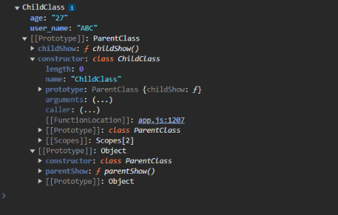

- If you observe carefully, parent class (`ParentClass`) becomes the prototype of child class (`ChildClass`) but still it has child class methods (`childShow`) and its constructor function. Why so? **because JS perform optimization**.
- The idea here is that when we create instances of `ChildClass`, we may or may not have different property values. Now methods on the other hand typically are the same across all objects. The properties which in turn might hold dynamic data but your method logic typically does not changes from instances to instances of object.
- Lets create another object and compare it prototypes.

```
const cc = new ChildClass()

const cc1 = new ChildClass()
console.log(cc.__proto__===cc1.__proto__) //Output: true
```

- **So the method logic typically does not change from object to object, it typically is the same and therefore Javascript adds a little optimization for us here. By adding the method to a prototype, it makes sure that when ever we create a new person object, we use the same prototype fallback object**.
- It's a little optimization which leads to less objects being created, which means less memory usage an of course less performance impact. When you build enterprise applications you will be dealing with tons of object, thus JS provides class methods inside the prototype rather on individual objects.
- Even if you see the `ParentClass` method `parentShow` is under Parent class prototype which is Object.
- Consider below code.

```
function ChildClass(){
  this.age="27",
  this.name="ABC"
}

ChildClass.prototype.childShow=function(){
  console.log("Inside ChildClass")
}

const cc = new ChildClass()
console.dir(cc)

const cc1 = new ChildClass()
console.log(cc.__proto__===cc1.__proto__) //Output: true

The Above Code is Equivalent to Below code

class ChildClass{
  user_name ="ABC"
  constructor(){
    super()
    this.age="27"
    /**
     * user_name="ABC" is same as this.name="ABC" inside constructor
     */
  }

  childShow(){
    console.log("Inside ChildClass")
  }
}

const cc = new ChildClass()
console.dir(cc)

const cc1 = new ChildClass()
console.log(cc.__proto__===cc1.__proto__) //Output: true
```

- Using construction function name and prototype we can create prototype method which will be share among all the instance of that construction function. This is equivalent with the code written in class format definition, then whats the difference? whenever we create a new object instance in case of constructor function only below block is executed

```
function ChildClass(){
  this.age="27",
  this.name="ABC"
}
```

- The method is still part of prototype and is shared among all objects. Whereas in case of classes the whole class definition is executed, thus construction function gives us slightly more performance than class.
- Now consider below code

```
class ChildClass{
  constructor(){
    this.name="ABC",
    this.age="27"
  }

  greet=function(){
    console.log("The greet function is not part of prototype it is present in each object instance")
  }
}

const cc = new ChildClass()
console.dir(cc)
```

- On browser console


- If you see now the `greet()` method is part of `ChildClass` instance and not part of prototype. This means for each instance the `greet()` method is present. This may cause slightly performance and memory consumption impact.
- The same logic is equivalent when you use arrow function instead of normal function

```
class ChildClass{
  constructor(){
    this.name="ABC",
    this.age="27"
  }

  greet = () => {
    console.log("The greet function is not part of prototype it is present in each object instance")
  }
}

const cc = new ChildClass()
console.dir(cc)
```

- On browser console

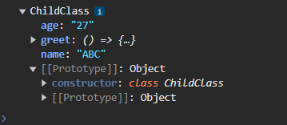


### Prototype Getters and Setters

- Consider below code

```
const animalVar = {
  species: 'Mammal',
};

const dog = Object.create(animalVar);  // Create an object with `animal` as its prototype
dog.breed = 'Golden Retriever';

// Retrieve the prototype of `dog`
const proto = Object.getPrototypeOf(dog);

console.log(proto);  // Outputs: { species: 'Mammal' }
console.log(proto === animalVar);  // true, because `animal` is the prototype of `dog`
```

- Here the `Object.getPrototypeOf` is same as `__proto__` gives info of prototype. `Object.getPrototypeOf()` is a clean, standard way to inspect an object's prototype, instead of using the older `__proto__` property.

- Consider below code for setting prototype

```
const bird = {
  canFly: true,
};

const penguin = {
  canFly: false,
};

// Set `bird` as the prototype of `penguin`
Object.setPrototypeOf(penguin, bird);

console.log(penguin.canFly);  // Outputs: false, because `penguin` overrides the `canFly` property

// Now, change the `penguin` object to no longer override `canFly`
delete penguin.canFly;  // Remove the `canFly` property from `penguin`

console.log(penguin.canFly);  // Outputs: true, because it's now inherited from `bird`
```

- `Object.setPrototypeOf()` lets you change an object's inheritance dynamically, which can be useful in scenarios where you need to adjust the behavior of objects at runtime

## Dataset

- In JavaScript, the `dataset` property allows you to interact with custom data attributes on HTML elements. These attributes start with `data-`, and you can use them to store small pieces of extra information directly in HTML, which JavaScript can easily read or update. 
- Consider below HTML snip for `div`

```
  <div id="myDivDataset" data-name="John" data-age="30"></div>
```

- On browser, when we inspect elements tab


- Now to access `data-name` and `data-age` we will use `dataset` in JS.

```
const div = document.getElementById("myDivDataset");
console.log(div.dataset.name); // Output: John
console.log(div.dataset.age);  // Output: 30
```

- We can update, add or delete these `data-` attributes

```
//updating
div.dataset.name = "Jane";
console.log(div.dataset.name); // Output: Jane

//adding
div.dataset.city = "New York";
console.log(div.dataset.city); // Output: New York

//Deleting
delete div.dataset.age;
console.log(div.dataset.age); // Output: undefined
```

- On browser, when we inspect elements tab


- You can add multiple `-` (dash) in your attributes in HTML tag which can be access via camel case. Consider below HTML snip 

```
  <div id="myDivDataset" data-extra-info="extra" data-name="John" data-age="30"></div>
```

- JS script

```
console.log(div.dataset.extraInfo) // Output: extra
```

### What the need of Dataset attribute in HTML?

- HTML data attributes are used to store extra information about an HTML element that may not be visible on the page. This information can be used by developers to perform specific actions or apply styling based on the attribute value.
- Examples

```
<ul>
        <li onclick="showDetails(this)" 
            data-director-name="Christopher Nolan" 
            data-released-year="2008">
            The Dark Knight
        </li>

        <li onclick="showDetails(this)" 
            data-director-name="Christopher Nolan" 
            data-released-year="2010">
            Inception
        </li>

        <li onclick="showDetails(this)" 
            data-director-name="James Cameron" 
            data-released-year="2009">
            Avatar
        </li>
    </ul>


<ul>
  <li data-animal-type="bird">Owl</li>
  <li data-animal-type="fish">Salmon</li>
  <li data-animal-type="spider">Tarantula</li>
</ul>
```

## Template 

- The `<template>` tag in HTML is a special tag that defines a block of HTML code that you can prepare in advance but doesn’t display directly on the page. Instead, it holds content in the DOM (Document Object Model) that can later be accessed and added to the page as needed using JavaScript.
- Consider below HTML code

```
<!DOCTYPE html>
<html lang="en">
  <head>
    <meta charset="UTF-8" />
    <meta name="viewport" content="width=device-width, initial-scale=1.0" />
    <meta http-equiv="X-UA-Compatible" content="ie=edge" />
    <title>DOM</title>
  </head>
  <body>
    <header>DOM Traversal VS Query Selectors</header>
    <script src="app.js" defer></script>
  <!-- Template Definition -->
  <template id="cardTemplate">
    <div class="card">
        <h2 class="title"></h2>
        <p class="description"></p>
    </div>
</template>
  </body>
</html>
```

- View


- Now using JS we can add content into the `template` tag

```
//Template Tag
const template = document.getElementById("cardTemplate");

// Clone the content of the template
const cardContent = template.content.cloneNode(true);

// Modify content if needed
cardContent.querySelector(".title").textContent = "Template Example";
cardContent.querySelector(".description").textContent = "This is a description in a reusable card.";

// Append to an element in the DOM
document.body.appendChild(cardContent);
```

- View


- Instead of creating HTML elements from scratch with JavaScript (e.g., `document.createElement`), you can define reusable HTML structures ahead of time and insert them as needed. Useful when rendering dynamic content like lists, cards, or repeated elements where you need a structured layout but want to fill in data later. Keeps the structure organized and easy to maintain, separating template HTML from actual rendered HTML.
- The `<template>` tag is used to store chunks of HTML markup you might want to reuse multiple times. The content inside `<template>` is not visible on the page until you programmatically insert it using JavaScript. This makes it different from regular HTML, which renders as soon as the page loads.

## Creating JS Scripts using JS

- Lets say during your code, you wanna create a JS script not manually by using your existing JS code.
- Consider below JS Code.

```
App.js

//Creating JS
const createNewJSScript=document.createElement("script");
createNewJSScript.textContent="alert('this is dynamically added')";
document.head.append(createNewJSScript);
```

- The existing **app.js** creates a JS scripts insert that script into the head of the document and it gets executed.

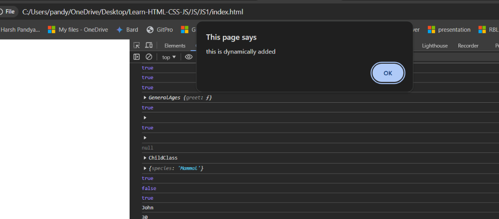


- You can also call any other existing JS file script via code using the same approach.

```
const insertingNewJSScript=document.createElement("script")
insertingNewJSScript.src="newJs.js";
insertingNewJSScript.defer=true
document.head.append(insertingNewJSScript);

newJs.js 
alert("Hello This is a new JS Script file");
```

- On browser


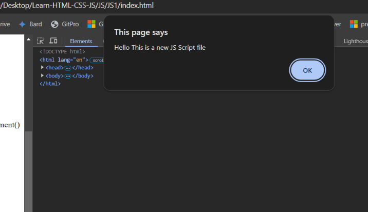


## Setting/Stopping Timers & Intervals

- In JavaScript, `setTimeout`, `setInterval`, `clearTimeout`, and `clearInterval` are functions used to control the timing of when code runs.
- `setTimeout` is used to run a piece of code once after a specified delay (in milliseconds). It’s like a one-time timer.
- `setInterval` is used to run a piece of code repeatedly at a specified interval. The code keeps running every `X` milliseconds until you stop it.
- `clearTimeout` stops a setTimeout before it completes. It’s like canceling a scheduled one-time task.
- `clearInterval` stops a setInterval so that the code stops repeating.

- Lets see example of `setTimeout`.

```
setTimeout(() => {
  console.log("Hello after 2 seconds");
}, 2000); // This code runs after 2 seconds
```

- In this example, `Hello after 2 seconds` will display in the console after 2 seconds (`2000` milliseconds).
- On browser console.


<video controls src="Images/js1/2024-4.mp4" title="Title"></video>


- Lets see example of `setInterval`.

```
setInterval(() => {
  console.log("Hello every 3 seconds");
}, 3000); // This code runs every 3 seconds
```

- In this example, `Hello every 3 seconds` will display in the console every 3 seconds until it’s stopped.
- On browser console


<video controls src="Images/js1/2024-5.mp4" title="Title"></video>


- Lets see example of `clearTimeout`.

```
let timer = setTimeout(() => {
    console.log("This won't display if we clearTimeout");
}, 5000);

clearTimeout(timer); // Cancels the timer, so the message won't appear
```

- Here we cancelled or stopped the `setTimeout` function provided for the interval given.
- Similarly like `clearTimeout` we have `clearInterval` to stop or cancel interval.

```
let interval = setInterval(() => {
    console.log("Repeating...");
}, 2000);

setTimeout(() => {
    clearInterval(interval); // Stops the interval after 6 seconds
    console.log("Interval stopped");
}, 6000);
```

- These timing functions are helpful for managing delays, animations, repeated updates, or any situation where precise timing is needed in JavaScript.

## Location and History

- In JavaScript, the `window` object has one of these two properties, location and history, that help control the browser's URL, navigate between pages, and track browsing history.
- `window.history`: The history object allows you to interact with the user’s browsing history, like moving back and forth between visited pages or manipulating the history stack.

```
// Go back to the previous page
history.back();

// Go forward to the next page
history.forward();

// Jump two pages back
history.go(-2);

// Push a new state with a different URL
history.pushState({}, "New Page", "/new-page");

// Replace the current state with a new URL
history.replaceState({}, "Updated Page", "/updated-page");
```

- `window.location`: The location object provides details about the URL of the current page and methods for navigating to new pages, reloading, or modifying the URL.
- Below are some common examples used

```
// Get the current page URL
console.log(location.href); // e.g., "https://example.com/about?id=123"

// Navigate to a new URL
location.href = "https://example.com/contact";

// Reload the page
location.reload();

// Change URL without adding to history (backward <- will be disable since re-directed to the new url https://example.com/home)
location.replace("https://example.com/home");
```

## Date

- The `Date` constructor is used to create a Date object, representing a specific point in time. With this object, you can easily manipulate dates, get current dates and times, calculate differences, format dates, and more.

```
const currentDate = new Date();
console.log(currentDate); // Outputs: Sun Oct 27 2024 17:26:49 GMT+0530 (India Standard Time)

//Parses a date string and creates a date.
const dateFromString = new Date("2023-10-27");
console.log(dateFromString); // Example: Fri Oct 27 2023 05:30:00 GMT+0530 (India Standard Time)

//Pass individual components as numbers (Month is zero-indexed, where January is 0, so 11 -> December).
const specificDate = new Date(2023, 11, 27, 15, 30, 0);
console.log(specificDate); // Example: Wed Dec 27 2023 15:30:00 GMT+0530 (India Standard Time)

//Provide the time in milliseconds since January 1, 1970 (UTC)
const dateFromTimestamp = new Date(1698422400000);
console.log(dateFromTimestamp); // Example date based on the timestamp (Fri Oct 27 2023 21:30:00 GMT+0530 (India Standard Time))
```

- JavaScript’s Date constructor can parse a wide range of date formats, such as:
  - ISO Format: `YYYY-MM-DDTHH:MM:SSZ`
  - Short Date Format: `YYYY-MM-DD`
  - Date-Time Format: `Month DD, YYYY HH:MM:SS`

```
const validDate = new Date("October 27, 2023 15:30:00");
console.log(validDate); // Example: Fri Oct 27 2023 15:30:00 GMT+0530 (India Standard Time)

const invalidDate = new Date("Not a Date");
console.log(invalidDate); // Invalid Date
```

- Calculating difference in days

```
const date1 = new Date("2024-10-27");
const date2 = new Date("2023-10-27");

const diffInMs = date1 - date2;
const diffInDays = diffInMs / (1000 * 60 * 60 * 24); // Convert milliseconds to days

console.log(`Difference in days: ${diffInDays}`); // Output: 366 (for leap year)
```

- The `Date` constructor provides some in-built methods to get or set date units (`getFullYear(), getMonth(), getDate(), getHours(), getMinutes(), setFullYear(), setMonth(), setDate(), setHours(), etc.`)

```
const date = new Date("2023-10-27");
date.setDate(date.getDate() + 5); // Add 5 days
console.log(date); // Wed Nov 01 2023 05:30:00 GMT+0530 (India Standard Time)

//Formatting dates
const datef = new Date("2023-10-27");
console.log(datef.toLocaleDateString()); // "10/27/2023" (based on locale)
console.log(datef.toLocaleTimeString()); // "5:30:00 AM" (based on locale)
```

## Error

- In JavaScript, the `Error` object represents an error that occurs during the execution of a program. It provides information about what went wrong, allowing you to handle errors more effectively. The `Error` object contains properties like `message` and `name`, which give details about the error, and it can be used to create custom error messages.

```
const error = new Error("Something went wrong!");
console.log(error.message); // "Something went wrong!"
console.log(error.name);    // "Error"
```

- You can throw error from a function using `throw` keyword

```
function checkAge(age) {
  if (age < 18) {
    throw new Error("Age must be 18 or older.");
  }
  return "Access granted.";
}

try {
  console.log(checkAge(15));
} catch (error) {
  console.log(error.message); // "Age must be 18 or older."
}
```

- Using `try-catch` you can print the message or stack trace

```
try {
  throw new Error("Custom error occurred.");
} catch (error) {
  console.log(error.stack); // Shows the sequence of function calls that led to the error
}
```

- Creating custom error 

```
class ValidationError extends Error {
  constructor(message) {
    super(message);
    this.name = "ValidationError";
  }
}

try {
  throw new ValidationError("Invalid input provided.");
} catch (error) {
  console.log(error.name);    // "ValidationError"
  console.log(error.message); // "Invalid input provided."
}
```
