# JavaScript Concepts

## Events 

- Up till now we have used major times the `click` event, but what are actually events? in JavaScript, events are actions or occurrences that happen in the browser, which can be detected and responded to using code. Think of events as things that users or the system might do, like clicking a button, pressing a key, or loading a webpage. JavaScript can listen for these events and react by running specific functions, often called event handlers.
- Events can be triggered by various user interactions or by the browser itself.
- Lets see some examples of Events

### click Event

- We use click event with `addEventListener()`, but there are other approaches. When we create a button tag we can see multiple attributes based on `on` events.

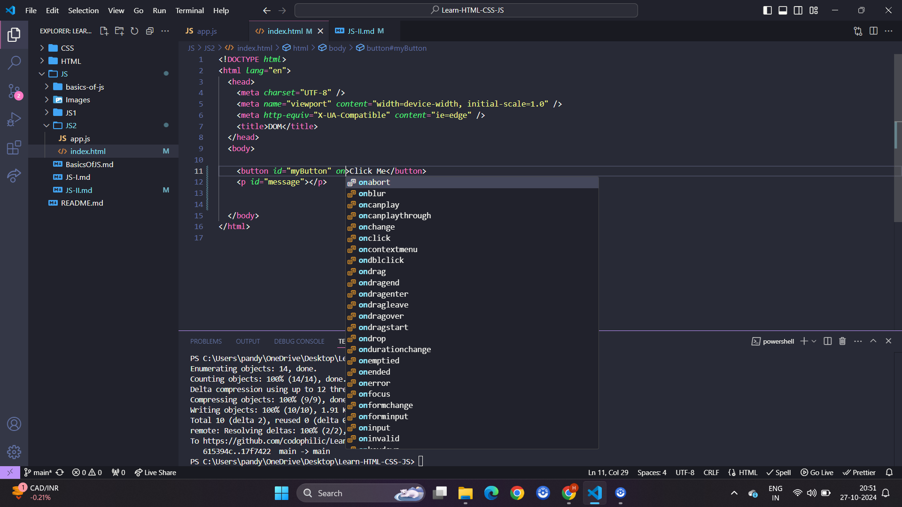

- Below is example of using these event.

```
<!doctype html>
<html>

<head>
    <script>
        function hiThere() {
            alert('Hi there!');
        }
    </script>
</head>

<body>
    <button type="button" 
            onclick="hiThere()" 
            style="margin-left: 50%;">
            Click me event
    </button>
</body>

</html>
```

- On browser

<video controls src="2024-1.mp4" title="Title"></video>

- Another approach is using `onclick` or any `on` based events inside the JS script code.

```
const btn=document.getElementById("myButton");
const btnhandlerApproach2= () => {
    alert("Clicked");
};
btn.onclick = btnhandlerApproach2
```


>[!IMPORTANT]
> - The first approach is not recommended as we are adding JS code into the attribute (`onclick`) of HTML snip
> - The second approach is also not recommended as the commended is tightly coupled with one of the function only, we cannot define multiple functions on it (`btn.onclick = btnhandlerApproach2`)

- So using `addEventListener()` is always the best approach as you can add multiple functions to it.

```
<!DOCTYPE html>
<html lang="en">
<head>
    <meta charset="UTF-8">
    <title>Click Event Example</title>
</head>
<body>
    <button id="myButton">Click Me</button>
    <p id="message"></p>

    <script>
        const btn=document.getElementById("myButton")
        btn.addEventListener("click", function() {
            document.getElementById("message").textContent = "Button was clicked!";
        });
        btn.addEventListener("click", function(){
            console.log("Button was clicked")
        })
    </script>
</body>
</html>
```

- On browser

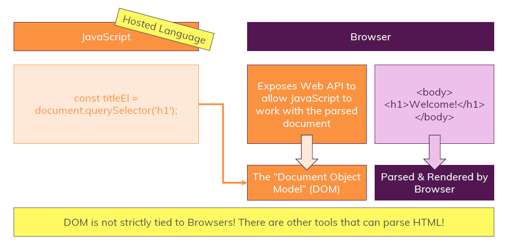

### mouseover Event

- The `mouseover` event occurs when the user hovers over an element, like an image or a link. This can be useful for showing tooltips or changing styles on hover

```
<!DOCTYPE html>
<html lang="en">
<head>
    <meta charset="UTF-8">
    <title>Mouseover Event Example</title>
</head>
<body>
    <button id="hoverButton">Hover over me</button>
    <p id="hoverMessage"></p>

    <script>
        document.getElementById("hoverButton").addEventListener("mouseover", function() {
            document.getElementById("hoverMessage").textContent = "You hovered over the button!";
        });
    </script>
</body>
</html>
```

- On browser

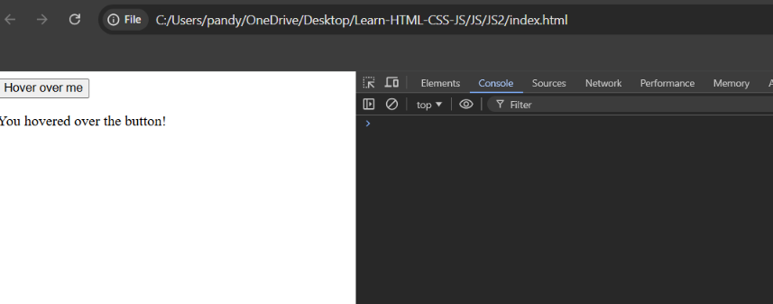

- When the mouse hovers over the button, the paragraph text changes to display a message.

### keyup Event

- The `keyup` event is fired when a key is released on the keyboard. It’s helpful for capturing user input in real time, like searching as the user types.

```
<!DOCTYPE html>
<html lang="en">
<head>
    <meta charset="UTF-8">
    <title>Keyup Event Example</title>
</head>
<body>
    <input type="text" id="nameInput" placeholder="Type your name">
    <p id="output"></p>

    <script>
        document.getElementById("nameInput").addEventListener("keyup", function() {
            const name = document.getElementById("nameInput").value;
            document.getElementById("output").textContent = "Hello, " + name;
        });
    </script>
</body>
</html>
```

- On browser

<video controls src="2024-2.mp4" title="Title"></video>

- As the user types, the paragraph text is updated in real time with the entered name.

### submit Event

- The `submit` event is used on forms and is triggered when the form is submitted. It’s typically used to validate form data before sending it.

```
<!DOCTYPE html>
<html lang="en">
<head>
    <meta charset="UTF-8">
    <title>Submit Event Example</title>
</head>
<body>
    <form id="myForm">
        <input type="text" id="username" placeholder="Enter username">
        <button type="submit">Submit</button>
    </form>
    <p id="formMessage"></p>

    <script>
        document.getElementById("myForm").addEventListener("submit", function(event) {
            event.preventDefault(); // Prevent form from actually submitting
            const username = document.getElementById("username").value;
            document.getElementById("formMessage").textContent = "Form submitted with username: " + username;
        });
    </script>
</body>
</html>
```

- On page

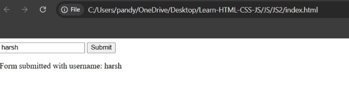

### change Event

- The `change` event is triggered when the value of an input element (like a dropdown or checkbox) changes. It’s useful for responding to user choices.

```
<!DOCTYPE html>
<html lang="en">
<head>
    <meta charset="UTF-8">
    <title>Change Event Example</title>
</head>
<body>
    <label for="colorSelect">Choose a color:</label>
    <select id="colorSelect">
        <option value="">Select</option>
        <option value="Red">Red</option>
        <option value="Blue">Blue</option>
        <option value="Green">Green</option>
    </select>
    <p id="colorMessage"></p>

    <script>
        document.getElementById("colorSelect").addEventListener("change", function() {
            const color = document.getElementById("colorSelect").value;
            document.getElementById("colorMessage").textContent = "You selected: " + color;
        });
    </script>
</body>
</html>
```

- On browser

<video controls src="2024-3.mp4" title="Title"></video>

- When the user selects a color, the paragraph text updates to show the selected color.

### dblclick Event

- The `dblclick` event triggers when an element is double-clicked. This can be useful for specific actions that need a second confirmation, like expanding a card or image.

```
<!DOCTYPE html>
<html lang="en">
<head>
    <meta charset="UTF-8">
    <title>Double Click Event Example</title>
</head>
<body>
    <button id="dblClickButton">Double-click Me</button>
    <p id="dblClickMessage"></p>

    <script>
        document.getElementById("dblClickButton").addEventListener("dblclick", function() {
            document.getElementById("dblClickMessage").textContent = "Button was double-clicked!";
        });
    </script>
</body>
</html>
```

- On browser

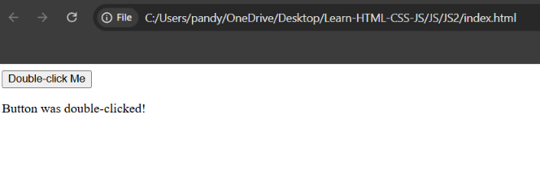

### focus and blur Events

- The `focus` event triggers when an input field gains focus. The `blur` event triggers when an input field loses focus.

```
<!DOCTYPE html>
<html lang="en">
<head>
    <meta charset="UTF-8">
    <title>Focus and Blur Event Example</title>
</head>
<body>
    <input type="text" id="focusInput" placeholder="Focus on me">
    <p id="focusMessage"></p>

    <script>
        const inputField = document.getElementById("focusInput");
        const message = document.getElementById("focusMessage");

        inputField.addEventListener("focus", function() {
            message.textContent = "Input field is in focus!";
        });

        inputField.addEventListener("blur", function() {
            message.textContent = "Input field lost focus!";
        });
    </script>
</body>
</html>
```

- On browser

<video controls src="2024-4.mp4" title="Title"></video>

### input Event

- The `input` event triggers whenever the value of an input field changes, and it’s great for real-time data binding.

```
<!DOCTYPE html>
<html lang="en">
<head>
    <meta charset="UTF-8">
    <title>Input Event Example</title>
</head>
<body>
    <input type="text" id="inputField" placeholder="Start typing...">
    <p>Live Output: <span id="liveOutput"></span></p>

    <script>
        document.getElementById("inputField").addEventListener("input", function() {
            document.getElementById("liveOutput").textContent = this.value;
        });
    </script>
</body>
</html>
```

- On browser

<video controls src="2024-5.mp4" title="Title"></video>

### resize Event

- The `resize` event triggers when the window is resized. This can be useful for adjusting layout or content based on window size.

```
<!DOCTYPE html>
<html lang="en">
<head>
    <meta charset="UTF-8">
    <title>Resize Event Example</title>
</head>
<body>
    <p id="resizeMessage">Resize the window to see changes.</p>

    <script>
        window.addEventListener("resize", function() {
            document.getElementById("resizeMessage").textContent = "Window width: " + window.innerWidth + "px";
        });
    </script>
</body>
</html>
```

- On browser

<video controls src="2024-6.mp4" title="Title"></video>


### scroll Event

- The `scroll` event triggers when the user scrolls through a page. This is useful for creating effects like sticky headers or infinite scrolling.

```
<!DOCTYPE html>
<html lang="en">
<head>
    <meta charset="UTF-8">
    <title>Scroll Event Example</title>
    <style>
        body {
            height: 2000px; /* Create scrollable page */
        }
        #scrollMessage {
            position: fixed;
            top: 10px;
            left: 10px;
        }
    </style>
</head>
<body>
    <p id="scrollMessage">Scroll down the page...</p>

    <script>
        window.addEventListener("scroll", function() {
            const scrollY = window.scrollY;
            document.getElementById("scrollMessage").textContent = "Scroll position: " + scrollY + "px";
        });
    </script>
</body>
</html>
```

- On browser 

<video controls src="2024-7.mp4" title="Title"></video>

### load Event

- The `load` event is triggered when the whole page (including images and other resources) has finished loading.

```
<!DOCTYPE html>
<html lang="en">
<head>
    <meta charset="UTF-8">
    <title>Load Event Example</title>
</head>
<body>
    <p id="loadMessage">Page is loading...</p>

    <script>
        window.addEventListener("load", function() {
            document.getElementById("loadMessage").textContent = "Page has fully loaded!";
        });
    </script>
</body>
</html>
```

- On browser

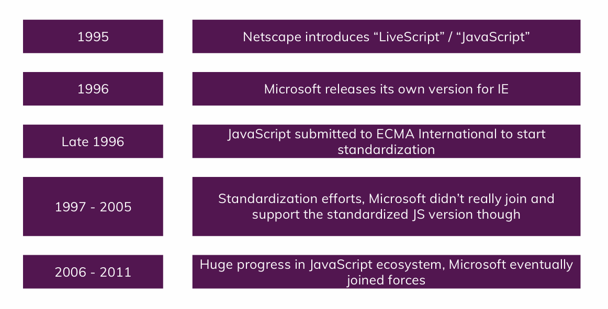

### error Event

- The `error` event triggers when an image fails to load or a script has an error. It’s useful for handling failed resource loads.

```
<!DOCTYPE html>
<html lang="en">
<head>
    <meta charset="UTF-8">
    <title>Error Event Example</title>
</head>
<body>
    
    <p id="errorMessage"></p>

    <script>
        document.getElementById("brokenImage").addEventListener("error", function() {
            document.getElementById("errorMessage").textContent = "Image failed to load.";
        });
    </script>
</body>
</html>
```

- On browser

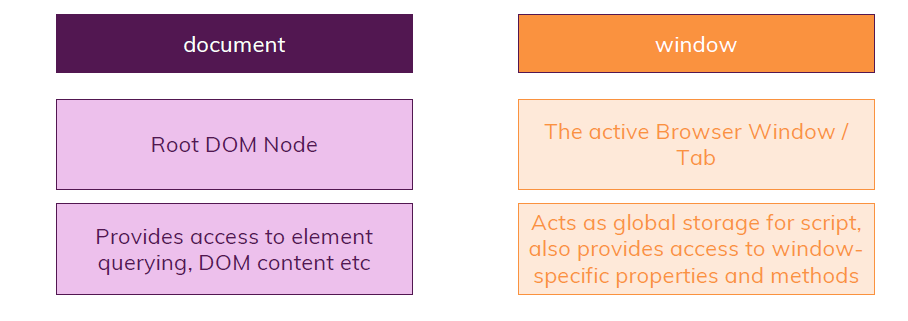

### copy Event

- The `copy` event triggers when text is copied from an element. It’s useful for showing custom messages when copying.

```
<!DOCTYPE html>
<html lang="en">
<head>
    <meta charset="UTF-8">
    <title>Copy Event Example</title>
</head>
<body>
    <p id="copyText">Copy this text!</p>
    <p id="copyMessage"></p>

    <script>
        document.getElementById("copyText").addEventListener("copy", function() {
            document.getElementById("copyMessage").textContent = "Text copied!";
        });
    </script>
</body>
</html>
```

- On browser

<video controls src="2024-8.mp4" title="Title"></video>


- So using keyboard when we try to copy by selecting text (`Control+C`) , the event `copy` is triggered.

### Remove Event Listener

- The `removeEventListener` method in JavaScript removes an event listener that was previously added to an element with addEventListener. This is useful when you no longer want an element to respond to a specific event, which can help improve performance and prevent unintended actions.

```
<!DOCTYPE html>
<html lang="en">
<head>
    <meta charset="UTF-8">
    <title>Click Event Example</title>
</head>
<body>
    <button id="myButton">Click Me</button>
    <p id="message"></p>

    <script>
        const btnClick = function(){
            alert("Button was clicked");
        }
        const btn=document.getElementById("myButton")
        btn.addEventListener("click",btnClick);

        setTimeout(()=>{
            btn.removeEventListener("click",btnClick);
        },2000) //after 2 seconds btn click handler is removed

    </script>
</body>
</html>
```

- On browser

<video controls src="2024-9.mp4" title="Title"></video>

- After 2 seconds the `removeEventListener` removes the `btnClick` handler.

>[!NOTE]
> - If you use anonymous function or any `bind` method in your `addEventListener` like 
> `btn.addEventListener("click",()=> alert("Button was clicked"));` or `btn.addEventListener("click",btnClick.bind(this));`, the `removeEventListener` won't work as it requires the same memory address reference of the anonymous function or the bind method you are using.
> - So **always create a constant and store your function address and use that later to remove listener**.

### preventDefault

- In JavaScript, `event.preventDefault()` is used to stop the default action of an event from happening. For example, when you click on a link (`<a>`), it usually takes you to a new URL, or when you submit a form, it reloads the page by default. By using `event.preventDefault()`, you can stop these actions and do something else instead.
- Lets see an example of `button`

```
<!DOCTYPE html>
<html lang="en">
<head>
    <meta charset="UTF-8">
    <title>Click Event Example</title>
</head>
<body>
    <form id="myForm">
        <label for="name">Name:</label>
        <input type="text" id="name" name="name">
        <button type="submit">Submit</button>
      </form>
      
    <script>
        const form = document.getElementById("myForm");

        form.addEventListener("submit", function(event) {
        console.log("Form submission prevented!");
        });

    </script>
</body>
</html>
```

- Now on the page, if we zoom the page for checking out details , the page gets loaded and the view gets set to default . Also on the console, we can see that whatever we are trying to logged, it gets disappeared when page is loaded when clicked on button. Page loading is default action. 


<video controls src="2024-10.mp4" title="title"></video>


- Now to prevent this we need to use `event.preventDefault()`.

```
<!DOCTYPE html>
<html lang="en">
<head>
    <meta charset="UTF-8">
    <title>Click Event Example</title>
</head>
<body>

    <form id="myForm">
        <label for="name">Name:</label>
        <input type="text" id="name" name="name">
        <button type="submit">Submit</button>
      </form>
      
    <script>
        const form = document.getElementById("myForm");

        form.addEventListener("submit", function(event) {
        event.preventDefault(); // Prevents the form from submitting
        console.log("Form submission prevented! and performing validation or operation on form before submitting");
        });

    </script>
</body>
</html>
```

- On page


<video controls src="2024-1.mp4" title="title"></video>

- Inside the listener, `event.preventDefault()` stops the form’s default submit action (so the page doesn't reload). `preventDefault()` can be useful to perform some validation before submitting the data to server incase of button. Similarly for button event, for all other event which has default behaviors, those can be prevent.
- For Event `click` the default behavior the navigates to the URL specified in the `href` attribute of the link. Using `preventDefault()` will prevent navigation and maybe open a modal window or handle the click in a custom way.
- For Event `contextmenu` the default behavior is to opens the browser's context menu (right-click menu). Using `preventDefault()` will prevent the context menu and display a custom menu or message.

### Bubbling and Capturing Events (Event propagation)

- In JavaScript, event bubbling and event capturing are two ways that events `propagate` or move through the Document Object Model (DOM) when an event occurs on a nested element (an element inside another element). This helps manage complex interactions when multiple elements can respond to the same event.
- **Event Capturing** *(Less common)*:
    - Here, the event is captured from the top of the DOM tree and moves down to the target element.
    - It starts from the root element (like `document`), then goes down to `<html>`, `<body>`, and so on until it reaches the target element.
- **Event Bubbling** *(Default behavior)*:
    - The event starts from the target element (the element that was clicked or interacted with) and bubbles up to its parents, grandparents, and so on, all the way up to the root of the document.
    - For example, if you click on a button inside a `div`, the click event will first trigger on the button, then on the parent `div`, and then any other parent elements up to the `<body>` and `<html>`.
- Capturing occurs during the event’s capture phase, where the event travels from the root of the DOM tree towards the target element. On the other hand, bubbling happens during the bubbling phase, where the event moves from the target element back up to the root

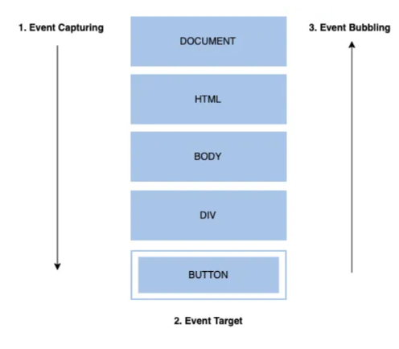

- For example, we have a simple HTML document with a DOM tree, for the anchor element. Let’s see what happens with an event when someone clicks on that link.

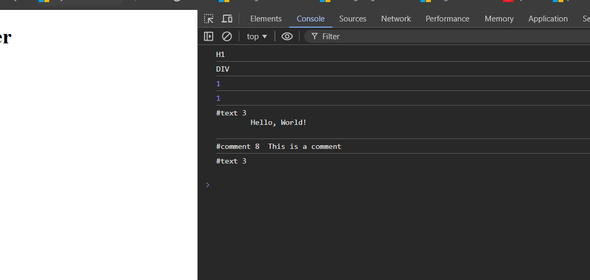

- When a click happens on the link, the DOM generates a click event. However, this event is not generated at the target element (the anchor element in this case), instead, the event is generated at the root of the document, which is the top of the DOM tree. Subsequently, **the capturing phase commences**, where the event travels down from the document root to the target element. As the event travels down the tree, it passes through each parent element of the target element.

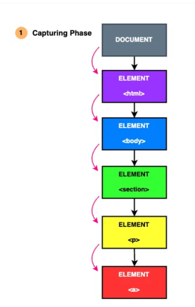

- After reaching the target, the event travels upwards toward the document root, called the bubbling phase. This bubbling behavior entails events moving from the target back up to the document root. Similar to the capturing phase, the event traverses through all parent elements during the bubbling phase as well.

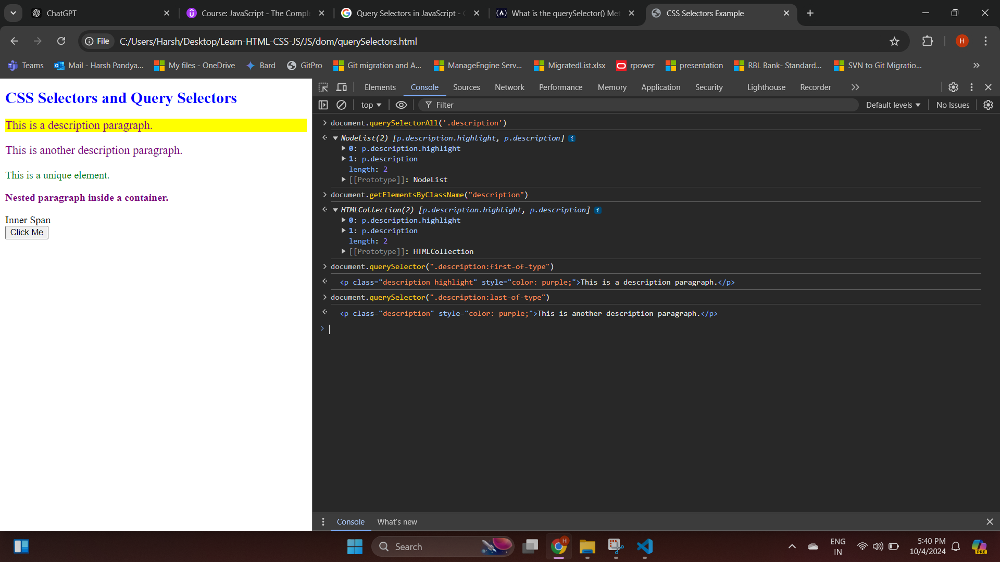

- By default, events can only be handled in the target, and the bubbling phase. However, we can configure event listeners to capture events in the capturing phase instead. Additionally, certain event types do not involve capturing and bubbling phases; they are directly created on the target element, limiting event handling to that specific location.
- Consider below HTML JS code

```
<!DOCTYPE html>
<html lang="en">
<head>
    <meta charset="UTF-8">
    <title>Click Event Example</title>
</head>
<body>
      <div id="parent">
        <button id="child">Click Me</button>
      </div>

    <script>
        // Default Bubbling Phase
        // Adding event listeners to both parent and child elements
        document.getElementById("parent").addEventListener("click", function() {
        console.log("Parent Div Clicked - Bubbling Phase");
        });

        document.getElementById("child").addEventListener("click", function() {
        console.log("Button Clicked");
        });
    </script>
</body>
</html>
```

- On browser console, we can observer default phase as bubbling phase

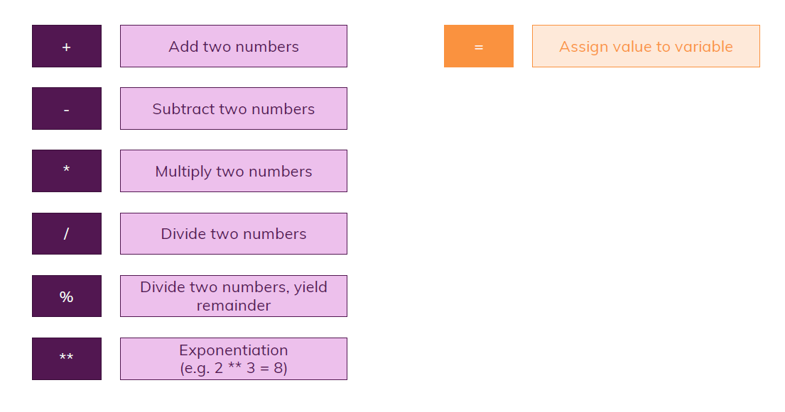

- **The event occur for child element will be same event for the parent element**
- To enable, capturing phase we need to set flag as `true` in event listener

```
JS Snip
        document.getElementById("parent").addEventListener("click", function() {
        console.log("Parent Div Clicked - Bubbling Phase");
        },true);
```

- On browser console

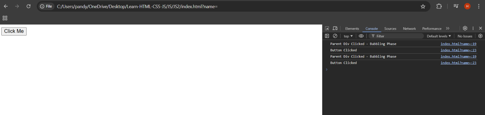

- In JavaScript, the `stopPropagation()` method is used to prevent an event from bubbling up the DOM tree. This means that if an event occurs on an element, and that element has a parent element with an event handler for the same event, the parent element's event handler will not be triggered.
- Consider below HTML & JS Code

```
<!DOCTYPE html>
<html lang="en">
<head>
    <meta charset="UTF-8">
    <title>Click Event Example</title>
</head>
<body>

      <div id="parent">
        <button id="child">Click Me</button>
      </div>

    <script>


        // Default Bubbling Phase
        // Adding event listeners to both parent and child elements
        document.getElementById("parent").addEventListener("click", function() {
        console.log("Parent Div Clicked - Bubbling Phase");
        });

        document.getElementById("child").addEventListener("click", function() {
        event.stopPropagation();
        console.log("Button Clicked");
        });

    </script>
</body>
</html>
```

- On browser console


- Now consider below HTML and JS Code

```
<!DOCTYPE html>
<html lang="en">
<head>
    <meta charset="UTF-8">
    <title>Click Event Example</title>
</head>
<body>      
      <div id="parent">
        <button id="child">Click Me</button>
      </div>

    <script>


        // Default Bubbling Phase
        // Adding event listeners to both parent and child elements
        document.getElementById("parent").addEventListener("click", function() {
        console.log("Parent Div Clicked - Bubbling Phase");
        });

        const childElement=document.getElementById("child")
        childElement.addEventListener("click", function() {
        event.stopPropagation();
        console.log("Button Clicked");
        });

        childElement.addEventListener("click", function() {
        console.log("Button Clicked-1");
        });

    </script>
</body>
</html>
```

- When we execute this, now the same button event has multiple handlers, so we get below output

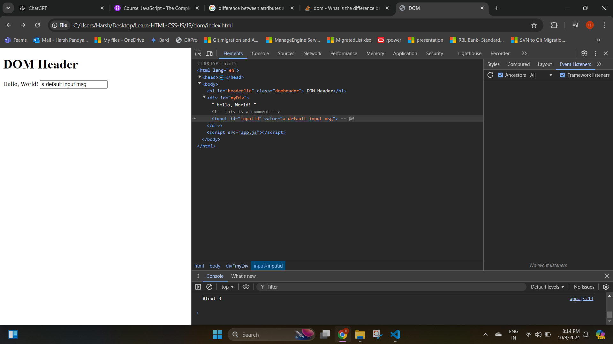

- Lets use `event.stopImmediatePropagation()` instead of `event.stopPropagation()`

```
JS Snip

        document.getElementById("parent").addEventListener("click", function() {
        console.log("Parent Div Clicked - Bubbling Phase");
        });

        const childElement=document.getElementById("child")
        childElement.addEventListener("click", function() {
        event.stopImmediatePropagation();
        console.log("Button Clicked");
        });

        childElement.addEventListener("click", function() {
        console.log("Button Clicked-1"); // Now this won't execute
        });
```

- On browser console

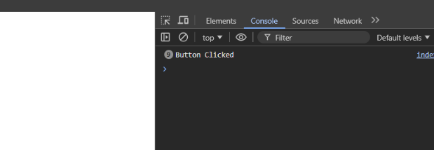


- `stopImmediatePropagation` prevents any further event listeners on the same element from executing. `stopPropagation` will prevent any parent handlers from being executed whereas `stopImmediatePropagation` will prevent any parent handlers and also any other handlers from executing for the same element.

>[!NOTE]
> - If you call `stopImmediatePropagation` within an event handler, it will prevent all other event handlers attached to the same element from being executed, regardless of their order of registration, meaning only the first handler that calls `stopImmediatePropagation` will run; the subsequent handlers will be skipped.
> - If there are several handlers for the corresponding event registered and if `stopImmediatePropagation` is programmed in second, or third or any nth order of the handler, then the previous subsequent registered handlers will get execute. Consider below code
> ```
> const childElement=document.getElementById("child")
> childElement.addEventListener("click", function() {
> console.log("Button Clicked");
> });
> 
> childElement.addEventListener("click", function() {
> event.stopImmediatePropagation();
> console.log("Button Clicked-1");
> });
> ```
> 
> - On browser
> 
> 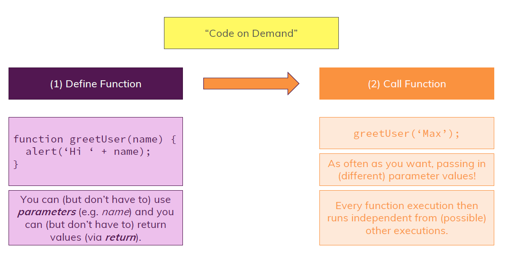
> 
> - The `Button Clicked-1` consist of `stopImmediatePropagation` but before that for the same event there is another handler defined (`Button Clicked`) which got executed.

### Event Delegation

- Lets say, whenever user click on any listed item, we need to console log the item details, so we need to use event handlers

```
<!DOCTYPE html>
<html lang="en">
<head>
    <meta charset="UTF-8">
    <title>Click Event Example</title>
</head>
<body>

      <ul id="itemList">
        <li>Item 1</li>
        <li>Item 2</li>
        <li>Item 3</li>
      </ul>
    <script>

    //Calling Event handler on all the list items
    const listitems=document.querySelectorAll("li");
    listitems.forEach(i=>{
        i.addEventListener("click",event=>{
            console.log(event.target.textContent);
        })
    });

    </script>
</body>
</html>
```

- So we can apply `click` event listener on each of the list items. 

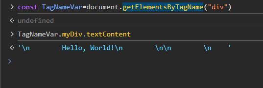

- In above example the list items are few incase of many list items, this code logic will give us memory and performance issue. So **Event delegation is a technique in JavaScript where you add a single event listener to a parent element instead of adding multiple event listeners to each child element**. This parent event listener can handle events triggered by all child elements, thanks to event bubbling (where events move up from the target element to its parent elements).
- Now consider below code

```
<!DOCTYPE html>
<html lang="en">
<head>
    <meta charset="UTF-8">
    <title>Click Event Example</title>
</head>
<body>

      <ul id="itemList">
        <li>Item 1</li>
        <li>Item 2</li>
        <li>Item 3</li>
      </ul>
    <script>

    // Select the parent element (the <ul>)
    const itemList = document.getElementById("itemList");

    // Add one event listener to the <ul>
    itemList.addEventListener("click", function(event) {
      // Check if the clicked element is an <li>
      if (event.target && event.target.nodeName === "LI") {
        console.log("You clicked:", event.target.textContent);
      }
    });
    </script>
</body>
</html>
```

- On browser console

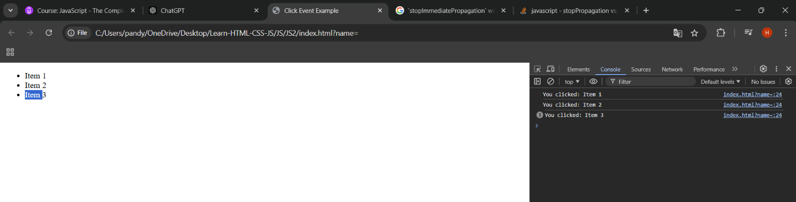


### Trigger DOM events using JS

- In JavaScript, you can trigger DOM events programmatically using methods like `click()`, `submit()`, `focus()`, or `dispatchEvent()`. This is useful when you want to simulate a user interaction (like a `click`) or `focus` on an element without requiring actual user input.
- Example

```
<!DOCTYPE html>
<html lang="en">
<head>
  <meta charset="UTF-8">
  <meta name="viewport" content="width=device-width, initial-scale=1.0">
  <title>Programmatically Trigger Event</title>
</head>
<body>
  <button id="myButton">Click Me</button>

  <script>
    const button = document.getElementById("myButton");

    // Event listener for the button
    button.addEventListener("click", function() {
      console.log("Button was clicked!");
    });

    // Programmatically trigger the click event
    button.click(); //Outputs: Button was clicked!
  </script>
</body>
</html>
```

### EVent Handler and `this`

- In JavaScript, this in an event handler refers to the element that the event listener is attached to or the target element.
- Consider below code

```
<!DOCTYPE html>
<html lang="en">
<head>
    <meta charset="UTF-8">
    <title>Click Event Example</title>
</head>
<body>

      <div id="parent">
        <button id="child">Click Me</button>
      </div>

    <script>
        const childElement=document.getElementById("child")
        childElement.addEventListener("click", function() {
        console.log(this)
        console.log("Button Clicked");
        });

    </script>
</body>
</html>
```

- On browser console

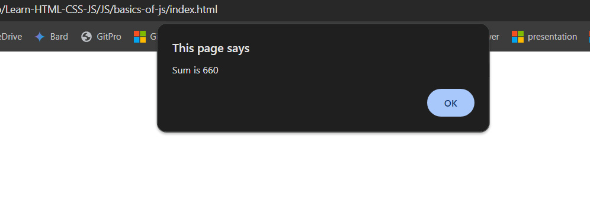

### Drag and Drop

- To implement drag-and-drop functionality in JavaScript, we use the `draggable` and `droppable` attributes, as well as several event listeners like `dragstart`, `dragover`, `dragleave`, and `drop`.
- It begins with the `draggable` HTML attribute. Setting this to `true` on an element allows it to be clicked and dragged around the screen.
- So consider below HTML snip

```
<div class="draggable" draggable="true" id="drag-item">Drag me</div>
```

- `<div class="draggable" draggable="true" id="drag-item">`:
    - This `div` is the draggable element.
    - Setting `draggable="true"` makes this element draggable. Without this attribute, the element cannot be dragged by default.
    - The `id="drag-item"` gives it a unique identifier so we can reference it later in JavaScript.
- Now to start the dragging and move the element consider below JS snip

```
dragItem.addEventListener('dragstart', (event) => {
  event.dataTransfer.effectAllowed = 'move'; // Allow "move" action
  event.dataTransfer.setData('text/plain', event.target.id); // Store item ID
});
```

- `dragstart` fires when we begin dragging the dragItem. `event.dataTransfer` object allows us to store data and control the drag behavior. `effectAllowed` controls what happens to the dragged item. Here we set it to `'move'`, which means the item will be moved to the drop target. `setData` is used to store the dragItem's id (`drag-item`). This allows us to know which item is being dragged when we handle the drop later.
- Lets define a drop target area

```
<div class="droppable" id="drop-target">Drop here</div>
```

- `<div class="droppable" id="drop-target">`:
    - This `div` is the drop target, where we want to drop the draggable element.
    - **It doesn’t have any special attribute to make it `droppable`**, but we treat it as a drop zone in the JavaScript code by attaching specific event listeners.
- Now to place the dragged item over the drop area we require `dragover`

```
dropTarget.addEventListener('dragover', (event) => {
  event.preventDefault(); // Necessary for allowing drop
  dropTarget.classList.add('hover'); // Add hover effect
});
```

- `dragover` fires when we drag an item over the `dropTarget`. `event.preventDefault()` is necessary because by default, most elements don’t allow drops. Calling `event.preventDefault()` tells the browser we want this element to accept dropped items.
- We add a `"hover"` effect by applying a new class (`hover`) to `dropTarget`. This class (defined in CSS) changes the background color of `dropTarget`, making it visually clear that this is a valid drop area.
- Post moving when the item is ready to be leave , we need to use `dragleave`.

```
dropTarget.addEventListener('dragleave', () => {
  dropTarget.classList.remove('hover'); // Remove hover effect
});
```

- `dragleave` fires when the dragged item leaves the `dropTarget`. We remove the "hover" effect by removing the hover class from `dropTarget`.
- Now at the end we require a drop event.

```
dropTarget.addEventListener('drop', (event) => {
  event.preventDefault(); // Prevent default behavior
  const data = event.dataTransfer.getData('text'); // Get stored data (item ID)
  const draggedElement = document.getElementById(data); // Find dragged item
  dropTarget.appendChild(draggedElement); // Move item to drop target
  dropTarget.classList.remove('hover'); // Remove hover effect
});
```

- `drop` fires when we release the dragged item over the `dropTarget`. We call `event.preventDefault()` again, as this is necessary to properly handle the drop. `getData` retrieves the data we set during `dragstart` using `setData`. Here, it retrieves the id of the dragged item (`drag-item`).
- `document.getElementById(data)` , using the ID retrieved, we get a reference to the actual dragged element in the DOM. `dropTarget.appendChild(draggedElement)` physically moves the dragged item into the `dropTarget` element, completing the `"move"` operation. We remove the hover effect, as the drag-and-drop operation is now complete.
- Complete code

```
<!DOCTYPE html>
<html lang="en">
<head>
<meta charset="UTF-8">
<meta name="viewport" content="width=device-width, initial-scale=1.0">
<title>Drag and Drop Example</title>
<style>
  .draggable {
    width: 100px;
    height: 100px;
    background-color: lightblue;
    margin: 20px;
    cursor: grab;
  }
  
  .droppable {
    width: 150px;
    height: 150px;
    background-color: lightgray;
    border: 2px dashed gray;
    margin: 20px;
  }
  
  .hover {
    background-color: lightgreen; /* Highlight the drop target */
  }
</style>
</head>
<body>

<div class="draggable" draggable="true" id="drag-item">Drag me</div>
<div class="droppable" id="drop-target">Drop here</div>

<script>
  // Selecting elements
  const dragItem = document.getElementById('drag-item');
  const dropTarget = document.getElementById('drop-target');

  // Handle drag start
  dragItem.addEventListener('dragstart', (event) => {
    event.dataTransfer.effectAllowed = 'move'; // Allow "move" action
    event.dataTransfer.setData('text/plain', event.target.id); // Store item ID
  });

  // Handle drag over - must prevent default to allow drop
  dropTarget.addEventListener('dragover', (event) => {
    event.preventDefault(); // Necessary for allowing drop
    dropTarget.classList.add('hover'); // Add hover effect
  });

  // Handle drag leave - when the item leaves the droppable area
  dropTarget.addEventListener('dragleave', () => {
    dropTarget.classList.remove('hover'); // Remove hover effect
  });

  // Handle drop
  dropTarget.addEventListener('drop', (event) => {
    event.preventDefault(); // Prevent default behavior
    const data = event.dataTransfer.getData('text'); // Get stored data (item ID)
    const draggedElement = document.getElementById(data); // Find dragged item
    dropTarget.appendChild(draggedElement); // Move item to drop target
    dropTarget.classList.remove('hover'); // Remove hover effect
  });
</script>

</body>
</html>
```

- On page

<video controls src="2024-12.mp4" title="title"></video>

## Advance Concept in Functions

### Pure vs Impure Functions

- In JavaScript, a **pure function** is a function that which always returns the same output for the same input No matter how many times you call the function with the same arguments, it will always return the same result. It has no side effects meaning it doesn't modify any variables outside its scope, such as global variables or the properties of objects passed as arguments.

```
function add(x, y) {
    return x + y;
}

console.log(add(5,4)) // 9
console.log(add(1,2)) //3
```

- Whereas Impure functions, on the other hand, are functions that which may have side effects like they can modify global variables, update object properties, arrays, perform I/O operations (like reading from a file or making a network request), or interact with the DOM.
- Impure functions may return different outputs for the same input. Their behavior can depend on external state, leading to unpredictable results.

```
let globalVar=0;

//Impure Functions
function addWithRandom(x,y){
    globalVar=Math.random()+x+y;
    return globalVar;
}
console.log(addWithRandom(10,20)) //30.840642363022475 (Randomness)
console.log(globalVar) //30.840642363022475 (Side effect)
```

- On every reload of the page we will get different output.
- **It is always recommended to make your function pure, incase where side effects are require like lets say you wanna make some HTTP request or db connection logging , DOM manipulation etc... requires external resources in such scenario creating impure function is a valid choice**.
- In general, prefer pure functions whenever possible. They make your code more reliable, maintainable, and testable. Use impure functions only when necessary for performing side effects or interacting with the outside world.
- Consider below example of impure function

```
let defaultValue = 10;
function addNumber(num) {
    return num + defaultValue;
}
```

- `defaultValue` is an external variable and hence the function is not guaranteed to always yield the same result.

### Factory Functions

- Think of a pizza shop. Instead of creating each pizza by hand every time, the shop has a pizza-making machine where you can order a specific kind of pizza with your choice of toppings.
    - Order Pizza: You tell the pizza-making machine what kind of pizza you want.
    - Get Your Pizza: The pizza-making machine takes your order and makes the pizza with the ingredients specified.
    - Serve Pizza: You get your pizza ready to eat, with all toppings and customizations.
- Considering same analogy, the pizza-making machine is a factory function which creates object and returns you the object (pizzas) based on your given input (toppings and size). Consider below code

```

function createPizza(size, topping) {
    return {
      size: size,
      topping: topping,
      bake() {
        console.log(`Baking a ${size} pizza with ${topping}!`);
      },
    };
  }
  
const myPizza = createPizza("large", "pepperoni");
myPizza.bake(); // Output: Baking a large pizza with pepperoni!
console.log(myPizza.size); // large
console.log(myPizza.topping); //pepperoni
```

- A factory function in JavaScript is a function that creates and returns an object. It’s called a "factory" because it makes objects in a way similar to how a factory makes products. **You don't use `new` (like in a constructor), but instead, just call the function to get a new object**.
- **When you use a factory function to create an object, the values you pass to the function (like `size` and `topping` in the pizza example) are stored as properties in the returned object. You can easily access these properties later**.
- Each object created with the factory function keeps track of its own unique values that were passed as inputs.

#### Why Use a Factory Function?

- Simplifies Object Creation: A factory function makes it easy to create multiple objects that are similar but might have slight differences.
- Encapsulation: Factory functions can keep data private and provide only the methods and properties you want accessible, which helps with organizing code and controlling access.
- No Need for `new`: It doesn't need the new keyword, so it’s simpler and avoids some common pitfalls that can happen with JavaScript’s new operator.
- A factory function is helpful in situations where:
    - You need to create multiple instances of a similar kind of object.
    - You want more control over how the object is created, like adding default values or specific properties.  

### Closure

- In JavaScript, a closure is a feature where an inner function remembers the variables from the outer function in which it was created, even after that outer function has finished running. Closures allow a function to "close over" its surrounding state, giving it access to variables and parameters from its outer scope even after that scope is gone.
- Consider below JS

```
function outerFunction(num) {
    let outerVariable = 'I am from outer function';
  
    function innerFunction() {
      console.log(outerVariable);
      console.log("Number sent: "+num)
    }
  
    return innerFunction;
}
  
const closure = outerFunction(10);
closure(); 

Output:
I am from outer function
Number sent: 10
```

- `outerFunction` defines a variable `outerVariable` and also accepts the input `num`. It also defines an `innerFunction` that accesses outer variable `outerVariable` and `num`. `outerFunction` returns `innerFunction`. We assign the result of `outerFunction` (which is `innerFunction`) to the **variable closure**. We call `closure` variable, which executes `innerFunction`.
- Even though `outerFunction` has finished executing, `innerFunction` still has access to `outerVariable` through the closure. This is because the inner function's lexical environment (scope) forms a closure, preserving the variables it needs from its outer function.
- Closures are essential for various JavaScript patterns, such as data encapsulation and creating private variables.
- Even though `outerFunction` has finished executing, `innerFunction` still has access to `outerVariable` through the closure.
- This is because the inner function's lexical environment (scope) forms a closure, preserving the variables it needs from its outer function.
- Closures are essential for various JavaScript patterns, such as data encapsulation and creating private variables.
- **Almost all functions in JavaScript have closures**. A closure is created when a function is defined, not when it's executed.
It allows the function to access variables from its surrounding lexical environment, even after the outer function has finished executing. In JavaScript, functions are first-class citizens, meaning they can be treated like any other variable. This enables them to be nested within other functions.
- Lets see an another example of closure

```
function createMultiplier(multiplier) {
  return function(number) {
    return number * multiplier;
  };
}

const double = createMultiplier(2);
const triple = createMultiplier(3);

console.log(double(5)); // Output: 10
console.log(triple(5)); // Output: 15
```

- `createMultiplier` accepts a `multiplier` and returns a function. **Each returned function "remembers" its specific multiplier value**. `double` and `triple` are functions that apply their unique `multiplier` to a number.
- **So in JavaScript, the closure is the combination of the inner function and its lexical environment (the surrounding state, or variables, it "remembers")**. Inner Function has access to the outer function’s variables, creating the closure. Lexical Environment includes the variables from the outer function that the inner function can access.


### IIFE

- In JavaScript - especially in older scripts - you sometimes find a pattern described as IIFEs. IIFE stands for **Immediately Invoked Function Expression** and the pattern you might find looks like this.

```
(function() {
  console.log("This is an IIFE!");
})();
```

- An IIFE (Immediately Invoked Function Expression) is a function in JavaScript that runs as soon as it is defined. You don't need to call it separately; it "self-executes" as soon as the code interpreter reaches it.
- If the function takes parameter

```
(function(name) {
  console.log(`Hello, ${name}!`);
})("Alice");
```

- IIFEs are useful for code that needs to run once, such as initializing a configuration or setting up event listeners.

```
const app = (function() {
  const config = { theme: "dark", language: "en" };
  console.log("App initialized with config:", config);

  // The IIFE returns an object with only public methods or properties
  return {
    getConfig: function() {
      return config;
    },
  };
})();

console.log(app.getConfig()); 
// Output: App initialized with config: { theme: 'dark', language: 'en' }
// { theme: "dark", language: "en" }
```

### Recursive Functions

- A recursive function in JavaScript (or any programming language) is a function that calls itself in order to solve a problem. Recursion is often used to solve problems that can be broken down into smaller, similar sub-problems, such as traversing nested structures (like trees) or performing repetitive tasks with a changing state.
- To avoid an infinite loop, a recursive function needs a base case, which is a condition that tells the function to stop calling itself. Without a base case, the recursion would continue forever and result in a **stack overflow error**.

```
function factorial(n) {
  // Base case: if n is 0, return 1
  if (n === 0) {
    return 1;
  }
  // Recursive case: multiply n by factorial of (n - 1)
  return n * factorial(n - 1);
}

console.log(factorial(5)); // Output: 120
```

- Recursion is very powerful for navigating complex, nested data structures.

```
const nestedObject = {
  name: "root",
  children: [
    {
      name: "child1",
      children: [
        { name: "child1.1", children: [] },
        { name: "child1.2", children: [] },
      ],
    },
    {
      name: "child2",
      children: [
        { name: "child2.1", children: [] },
      ],
    },
  ],
};

function printNames(node) {
  console.log(node.name);
  // Recursively print names of all children
  for (const child of node.children) {
    printNames(child);
  }
}

printNames(nestedObject);

Output:
root
child1
child1.1
child1.2
child2
child2.1
```

## Synchronous & Asynchronous


### Synchronous 

- In synchronous execution, code runs sequentially, meaning each line is executed one after the other. The program waits for a line to complete before moving on to the next one. This can lead to blocking behavior if a particular task takes a long time (e.g., a heavy calculation or data fetching), as the subsequent lines of code will wait until the current line completes. As Javascript code execution runs on one single thread

```
console.log("First Task");
let data = fetchData();  // This could take time if it's synchronous
console.log("Second Task");
```

- In this example, `Second Task` won’t print until `fetchData()` is done executing.

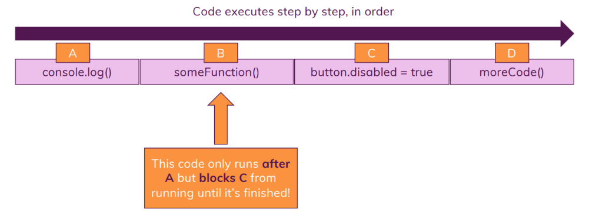

### Asynchronous

- Asynchronous execution allows code to run without waiting for other tasks to complete, thus enabling non-blocking behavior. Instead of halting execution, JavaScript can "hand off" certain tasks, allowing the rest of the code to run while waiting for these tasks to complete.
- Asynchronous behavior is common with I/O operations like fetching data, reading files, or making network requests.
- Without Asynchronous behavior

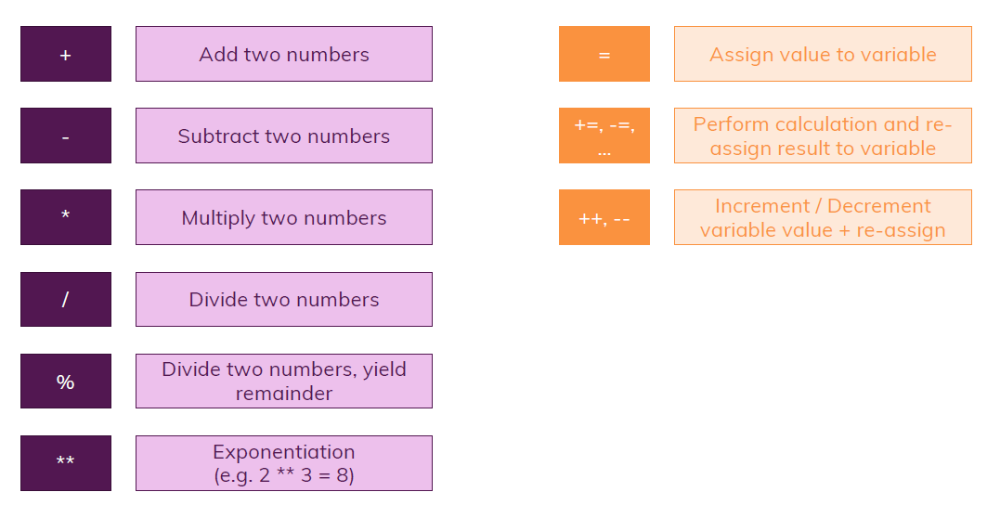

- With Asynchronous behavior (the `setTimeout` function is running on another thread)


#### Callback

- Callbacks are often used in asynchronous code, where tasks take time (like loading data), allowing JavaScript to keep running without stopping. A callback function is simply a function that is passed as an argument to another function, with the expectation that it will be "called back" (executed) at a later time.
- You define a callback function and give it to another function to use. The function you passed the callback to will decide when to call it back, usually after some task is completed.

```
function greet(name) {
  console.log("Hello, " + name + "!");
}

function getUserInput(callback) {
  let name = "Alice"; // Pretend we got this from user input
  callback(name); // Call the callback function with the user's name
}

// Here we pass `greet` as a callback
getUserInput(greet);
```

- `greet` is a **callback function**. `getUserInput` takes a function (`callback`) as an argument. Inside `getUserInput`, `callback(name)` calls greet(`name`), which prints `Hello, Alice!`.

#### Event Loop

- JavaScript is single-threaded, meaning it can only do one thing at a time. But, thanks to the event loop, JavaScript can appear to do multiple things at once.
- **The event loop is a mechanism in JavaScript that manages how tasks are executed, particularly when dealing with asynchronous code. It’s part of JavaScript's environment (usually provided by the browser or Node.js), not the JavaScript engine itself (like V8, which just executes JavaScript code). The event loop’s job is to keep JavaScript running smoothly by deciding which tasks should run and when.**


- In the end, the event loop helps us deal with async code you could say, it helps us deal with callback functions which typically are used in such async code scenarios.
- The stack and heap are part of the Javascript engine. The browser kind of gives us a bridge where we can talk to certain browser APIs from inside our Javascript code.
- Lets understand how event loop works with an example using `setTimeout` which is an asynchronous function

```
console.log('Start script...');

setTimeout(() => {
    task('Download a file.');
}, 1000);

console.log('Done!');
```

- When we run the code, we get below output

```
Start script...
Done!
Download a file.
```

- When you call the `setTimeout()` function, make a fetch request to the web browser which can do these activities concurrently (execute parallel without blocking) and asynchronously. 
- In our example, when calling the `setTimeout()` function, the JavaScript engine places the `setTimeout` on the call stack, and the Web API creates a timer that expires in 1 second.

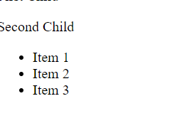

- Then JavaScript engine places the `task()` (`task('Download a file.')`) function into a queue called a **callback queue/task queue/ message queue after 1 seconds**. When JavaScript runs code, each function goes to the call stack to be processed. If it’s an asynchronous task (like a `setTimeout` or a `fetch` request), JavaScript doesn’t block. Instead, it offloads that task and keeps going, putting it in the callback queue when it’s done.


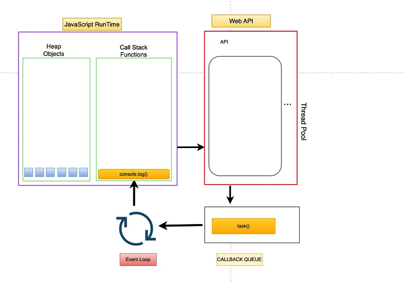

- The event loop is a constantly running process that monitors both the callback queue and the call stack. If the call stack is not empty, the event loop waits until it is empty and places the next function from the callback queue to the call stack. If the callback queue is empty, nothing will happen. This cycle keeps repeating, so JavaScript can handle new tasks, finish old ones, and manage asynchronous operations without blocking.

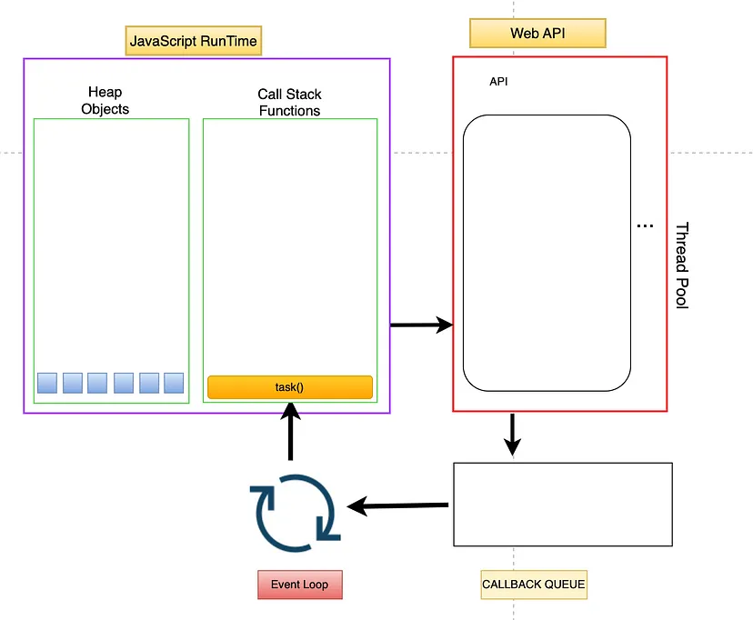

- The event loop is the orchestrator that ties the call stack, callback queue or message queue, and Web APIs together. Its primary role is to constantly check whether the call stack is empty. If it is, the event loop takes the first function from the Callback Queue and pushes it onto the call stack for execution
  - Check the Call Stack: Is it empty?
  - If Yes: Move a function from the Callback Queue to the Call Stack.
  - If No: Keep checking
- Now consider below code

```
console.log('Start');

setTimeout(() => {
  console.log('Inside setTimeout');
}, 0);

console.log('End');
```

- We get output as

```
Start
End
Inside setTimeout
```

- In this example, the `console.log('Start')` and `console.log('End')` statements are executed immediately pushed into call stack, while the `setTimeout` function is pushed to the Web API environment. **After the specified timeout (even if it's 0 milliseconds), the callback function inside `setTimeout` is placed in the callback Queue when it timeout is completed**. When the call stack is empty ,the `setTimeout` is pushed into call stack from callback queue by event loop.

#### Callback hell

- Callback hell refers to a situation in JavaScript where multiple nested callback functions create deeply indented, hard-to-read, and hard-to-maintain code. This often occurs when handling complex asynchronous tasks that depend on each other. As a result, the code structure looks like a pyramid or "ladder" of nested callbacks, making it confusing and challenging to debug.
- Lets consider a scenario where you need to fetch `data1`, based on `data1` you need to retrieve `data2` and based on `data2` you need to retrieve `data3`. (Real case is like for any social media account you need to first fetch user name (`data1`) if it exists then fetch its password (`data2`)).

```
function getData(dataid,timeTakenToFetch,nextData){
    console.log(`data ${dataid} fetching...`)
    setTimeout(()=>{
        console.log(`data ${dataid} fetched`)
        if(nextData){
            nextData()
        }
    },timeTakenToFetch)
}

getData(1,3000,()=>{ //fetch data3 in 3 seconds
    getData(2,4000,()=>{ //fetch data2 in 4 seconds
        getData(3,3000) //fetch data3 in 3 seconds
    })
})
```

- On browser


<video controls src="2024-13.mp4" title="title"></video>

##### Issues with Callback Hell
- **Readability**: The code becomes difficult to read due to excessive nesting, making it hard to understand the flow.
- **Error Handling**: Managing errors across multiple levels of nested callbacks can be confusing and error-prone. Handling errors within each callback and passing them back up the chain can make the code even messier.
- **Maintainability**: Code in callback hell is harder to modify or extend. If requirements change, it becomes challenging to adjust nested callbacks without introducing bugs.
- **Scalability**: As more asynchronous tasks depend on each other, the nested structure only grows, making it unsustainable for larger applications.

#### Promises

- The solution to the callback hell is promises. A promise in JavaScript is an object that allows you to handle asynchronous tasks without deeply nested callbacks, making the code more readable and easier to maintain.
- Syntax

```
const promise = new Promise((resolve, reject) => {
  // Perform asynchronous operation
  if (/* operation is successful */) {
    resolve(value); // Pass the result to the 'then' method
  } else {
    reject(error); // Pass the error to the 'catch' method
  }
});

promise
  .then((value) => {
    // Handle the successful result
  })
  .catch((error) => {
    // Handle the error
  });
```

- You create a promise by calling `new Promise`, passing it a function with two parameters, `resolve` and `reject`. Inside the promise, you perform your asynchronous task. If it’s successful, you call `resolve` with the result. If it fails, you call `reject` with an error.
- When an asynchronous task completes successfully, you call `resolve()` to fulfill the promise also you can pass some value into it which will be returned to the caller function. If there’s an error, you call `reject()` to reject the promise.
- You can attach `.then()` to handle the result of a promise when it’s resolved. Use `.catch()` to handle errors when the promise is rejected.
- Lets see an simple example

```
// Creating a promise that resolves after 1 second
const promise = new Promise((resolve, reject) => {
  setTimeout(() => {
    resolve('Data fetched successfully!'); 
  }, 1000);
});

// Using the promise
promise
  .then(data => {
    console.log(data); // Output: Data fetched successfully!
  })
  .catch(error => {
    console.error(error); // Handle any errors
  });
```

- In case of rejection

```
// Creating a promise that resolves after 1 second
const promise = new Promise((resolve, reject) => {
  setTimeout(() => {
    reject('Data cannot be fetch!'); 
  }, 1000);
});

// Using the promise
promise
  .then(data => {
    console.log(data); 
  })
  .catch(error => {
    console.log("Error")
    console.error(error); 
  });

Output:
Error
Data cannot be fetch!
```

- There are 3 states of promises, a promises is fulfilled (resolve) , pending , rejected. When we print `promise` variable on console. We can see it.
- Considering same code

```
// Creating a promise that resolves after 1 second
const promise = new Promise((resolve, reject) => {
  setTimeout(() => {
    resolve('Data fetched successfully!'); 
  }, 6000);
});

// Using the promise
promise
  .then(data => {
    console.log(data); // Output: Data fetched successfully!
  })
  .catch(error => {
    console.error(error); // Handle any errors
  });
```

- On browser

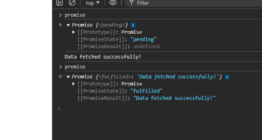

- Similarly when we replace `resolve` by `reject`

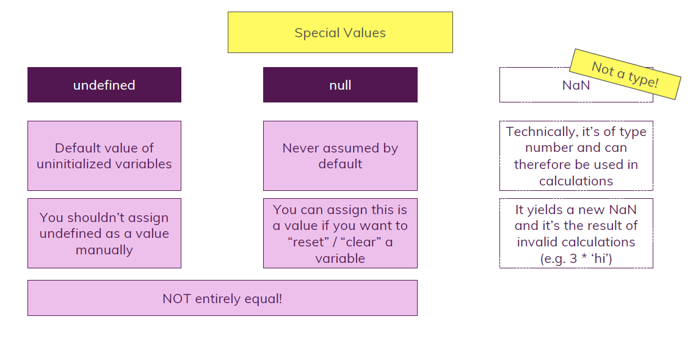

- We catch the error. The `PromiseResult` returns the value which is provided in the `reject` or `resolve` function which is useful for any indication require for further code execution.

- You can have multiple `.then()` blocks in a promise chain, and each `.then()` block can handle the result or error from the previous step in the chain. Consider below example

```
const myPromise = new Promise((resolve, reject) => {
    setTimeout(() => {
        resolve('Timer completed!');
    }, 1000);
})
    .then((text) => { throw new Error('Failed!') })
    .catch(err => console.log(err))
    .then(() => console.log('Does that execute?'));


Output:
Error: Failed!
    at /tmp/aCrhNIEgNO.js:6:29
Does that execute?
```

- Why so? `.then((text) => { throw new Error('Failed!') })` block runs after the promise is resolved, receiving the `Timer completed!` message as the text argument. Instead of doing something with text, it throws an error using `throw new Error('Failed!')`. This error is not handled in this `.then()` block, so it propagates down to the nearest `.catch()` block `.catch(err => console.log(err))`. Since the previous `.then()` threw an error, this `.catch()` block catches it. The `err` argument in this block represents the error created in the previous `.then()`, which is `Failed!`. This `.catch()` block then logs the error message to the console. `.then(() => console.log('Does that execute?'));` block is added after the `.catch()` block. Regardless of whether the promise was resolved or an error was thrown, the `.catch()` block catches the error and continues the chain. So, last final `.then()` block will execute after the `.catch()` finishes.
- Each `.then()` block represents a step in the chain, and each one operates based on the outcome of the previous block. If an error occurs at any point in the chain, the `.catch()` block will handle it. You can place additional `.then()` blocks after a `.catch()` to continue executing code, even after an error.
- You can have multiple `.catch()` blocks but it is **useless** because promise chaining, only the first `.catch()` block in a chain will handle any errors that occur in the chain. Once an error is caught by a `.catch()`, it doesn’t propagate to any other `.catch()` blocks that might follow.

##### Promises Methods

###### `Promise.all()` 

- `Promise.all()` takes an array (or any iterable) of promises and returns a single promise. This returned promise resolves when all the promises in the array resolve, or rejects if any one of them rejects. `Promise.all()` when you need to wait for multiple asynchronous operations to complete and want them to all succeed.

```
const promise1 = new Promise((resolve) => setTimeout(resolve, 1000, "Data 1"));
const promise2 = new Promise((resolve) => setTimeout(resolve, 2000, "Data 2"));
const promise3 = new Promise((resolve,reject) => setTimeout(resolve, 1500, "Data 3"));

Promise.all([promise1, promise2, promise3])
  .then((results) => {
    console.log(results); // ["Data 1", "Data 2", "Data 3"]
  })
  .catch((error) => {
    console.error("Error: "+error); // Will catch if any promise is rejected
  });
```

- The `Promise.all()` method returns a single Promise from a list of promises, when **all promises fulfill**. If any promises are failed then we we can get that from error.

```
const promise1 = new Promise((resolve) => setTimeout(resolve, 1000, "Data 1"));
const promise2 = new Promise((resolve) => setTimeout(resolve, 2000, "Data 2"));
const promise3 = new Promise((resolve,reject) => setTimeout(reject, 1500, "Data 3"));

Promise.all([promise1, promise2, promise3])
  .then((results) => {
    console.log(results); 
  })
  .catch((error) => {
    console.error("Error: "+error); // Error: Data 3
  });
```

- `Promise.all([promise1, promise2, promise3])` waits for all promises to resolve. It returns an array of results when all promises resolve successfully. If any one of the promises rejects, the entire `Promise.all()` will reject with that error, and the `catch()` block will run.
- **All the promises in the arrays are executed at the same time**
- Promises chaining is alternative of it.

###### `Promise.race()`

- `Promise.race()` takes an array (or any iterable) of promises and returns a promise that resolves or rejects as soon as the first promise in the array resolves or rejects. The result is based on the first settled promise (either resolved or rejected). **All the promises in the arrays are executed at the same time**.

```
const promise1 = new Promise((resolve) => setTimeout(resolve, 2000, "Data 1"));
const promise2 = new Promise((resolve) => setTimeout(resolve, 1000, "Data 2"));
const promise3 = new Promise((resolve) => setTimeout(resolve, 1500, "Data 3"));

Promise.race([promise1, promise2, promise3])
  .then((result) => {
    console.log(result); // "Data 2" (because it resolves first)
  })
  .catch((error) => {
    console.error(error);
  });
```

- It choses the first available result from multiple promises sources. `Promise.race()` resolves as soon as the first promise resolves, so the result will be `Data 2` because promise2 resolves first. If the first promise rejects, `Promise.race()` rejects with that error.

###### `Promise.allSettled()`

- `Promise.allSettled()` waits for all promises to settle (either resolve or reject), and returns an array of objects describing the outcome of each promise (resolved or rejected).
- Use this when you want to know the outcome of all promises, even if some of them reject, without having them stop the entire process.

```
const promise1 = new Promise((resolve) => setTimeout(resolve, 1000, "Data 1"));
const promise2 = new Promise((resolve, reject) => setTimeout(reject, 2000, "Error in Data 2"));
const promise3 = new Promise((resolve) => setTimeout(resolve, 1500, "Data 3"));

Promise.allSettled([promise1, promise2, promise3])
  .then((results) => {
    console.log(results);
    /*
    [
      { status: 'fulfilled', value: 'Data 1' },
      { status: 'rejected', reason: 'Error in Data 2' },
      { status: 'fulfilled', value: 'Data 3' }
    ]
    */
  });
```

- It doesn't matter if some promises reject; it waits for all promises to settle.

###### `Promise.resolve()`

- `Promise.resolve()` returns a resolved promise with a given value. It's useful when you want to create a promise that is immediately resolved. You can use `Promise.resolve()` to ensure that you always have a promise to work with, whether you're dealing with a value or an actual promise.

```
Promise.resolve("Resolved value")
  .then((result) => {
    console.log(result); // "Resolved value"
  });
```

###### `Promise.reject()`

- `Promise.reject()` returns a rejected promise with a given reason or error. It’s useful when you want to create a promise that immediately rejects. You can use `Promise.reject()` to return a promise that fails right away.

```
Promise.reject("Something went wrong")
  .catch((error) => {
    console.log(error); // "Something went wrong"
  });
```

##### Promises Chaining

- Considering the same callback hell code, we can apply that in promise chaining.

```
function getDataFromPromise(dataid,timeTakenToFetch){
  return new Promise((resolve,reject)=>{
    console.log(`data ${dataid} fetching...`)
    setTimeout(()=>{
        console.log(`data ${dataid} fetched`)
        resolve("data was returned")
    },timeTakenToFetch)
  })
}

let r1=getDataFromPromise(1,3000)
r1.then((data=>{
    console.log(data);
    let r2=getDataFromPromise(2,4000)
    r2.then((data=>{
        console.log(data)
        let r3=getDataFromPromise(3,3000)
        r3.then((data=>{
            console.log(data)
        }))
    }))
}))
```

- On browser console


- Promise chaining can sometimes make code a bit harder to read, especially if the chain gets long or if there are many operations involved. Although chaining is cleaner than deeply nested callbacks, reading through multiple `.then()` statements can still feel somewhat "step-by-step" and harder to scan.
- To overcome the promise chaining problem we have **Async-await**

#### Async-Await

- `async` and `await` are alternatives to promise chaining that make asynchronous code look more like synchronous code. This can make it easier to read and understand.
- `async`: When you declare a function with `async`, it automatically returns a promise, even if you don’t explicitly return one. This means the function can contain asynchronous code that uses `await` **to pause execution until a promise resolves**. In the below snip, when we declared `getDataAsyncAwait` function we can see that it returns a `Promise<void>`.

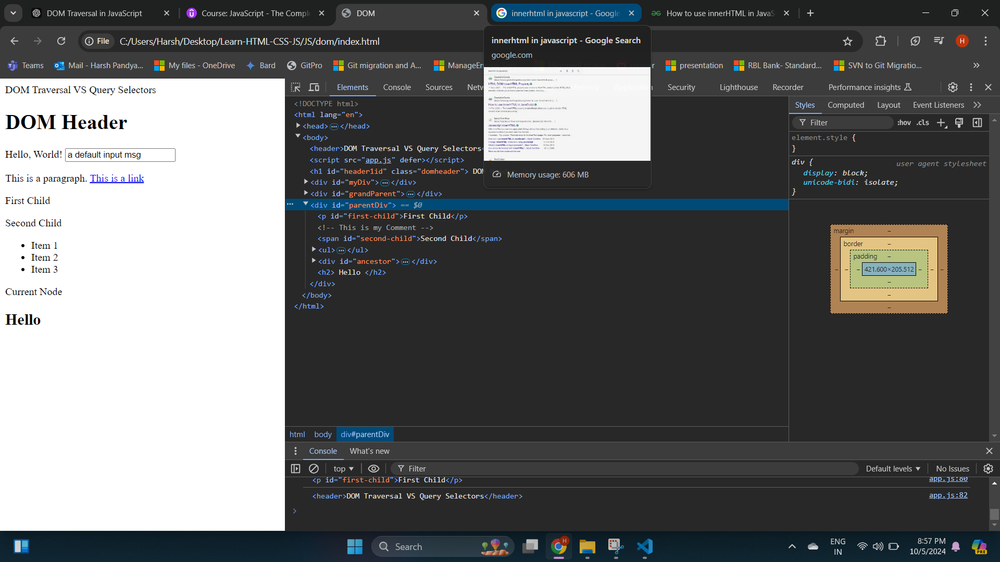


- `await`: **`await` is used inside an `async` function only** to pause the function’s execution until the specified promise resolves. This makes the code appear to run step-by-step, just like synchronous code, but without blocking the main thread. To use `await`, you first need to declare the function as `async`. This tells JavaScript that this function may contain asynchronous code.
- The promises chaining code will look like below using `async-await`.

```
function getDataAsyncAwait(dataid, timeTakenToFetch) {
    console.log(`data ${dataid} fetching...`);
    return new Promise((resolve) => {
        setTimeout(() => {
            console.log(`data ${dataid} fetched`);
            resolve();
        }, timeTakenToFetch);
    });
}

async function fetchDataInSequence() {
    await getDataAsyncAwait(1, 3000); // Wait for data 1 to fetch
    await getDataAsyncAwait(2, 4000); // Wait for data 2 to fetch
    await getDataAsyncAwait(3, 3000); // Wait for data 3 to fetch
    
    /*
    The Above lines are same as using nested .then
    */
}

fetchDataInSequence();
```

- On browser console

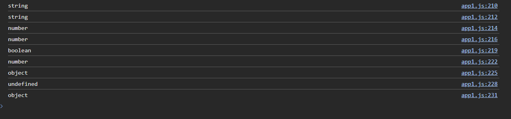

- **For `await` to work, the function you're calling must return a promise. If the function doesn’t return a promise, `await` won’t pause the code—it’ll just treat it as a regular synchronous function and move on immediately. `await` only knows how to "wait" for a `promise` to resolve. If the function you’re calling doesn’t return a `promise`, `await` has nothing to wait for, and it will simply move to the next line. This is why, when using `async`/`await`, any asynchronous function you want to `await` should return a `promise`.**
- Below code is invalid

```
let p1=await setTimer(1000)
```

- Async-await basically transform the promise chaining code making it readable.
- In the above code, we were able to handle `.then` nested structure what about `.catch` when promises are rejected? for that in the `async` function we can use `try-catch`.

```
function getDataAsyncAwait(dataid, timeTakenToFetch) {
  console.log(`data ${dataid} fetching...`);
  return new Promise((resolve,reject) => {
      setTimeout(() => {
          console.log(`data ${dataid} fetched`);
          if(dataid==2){
            reject("Data Not Found");
          }
          resolve();
      }, timeTakenToFetch);
  });
}

async function fetchDataInSequence() {
  let r1;
  let r2;
  let r3;
  try{
    r1=await getDataAsyncAwait(1, 3000); // Wait for data 1 to fetch
    r2=await getDataAsyncAwait(2, 4000); // Wait for data 2 to fetch
    r3=await getDataAsyncAwait(3, 3000); // Wait for data 3 to fetch
    /*
    The Above lines are same as using nested .then
    */
  }catch(Error){
    console.log(`Error - ${Error}`); // handles all the .catch block of promises
  }

}

fetchDataInSequence();
```

- On browser console

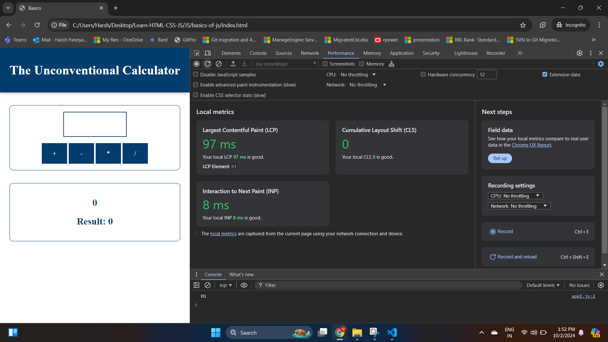

- `await` stops all the further execution when encountered any promise got reject. If the promise is rejected (i.e., it fails), `await` will throw an error. This will cause the `async` function to terminate at that point, and the rest of the code will not be executed unless you handle the rejection with a `try/catch `block.

## How the Web Works?

- No matter if you check your e-mails on your mobile phone or if you're sending a tweet - you are using the internet (i.e. "the web"). How does all that work? 
- Let's understand with an example. Suppose you visit a website like [academind.com](academind.com). The moment you enter this address in your browser and you hit `ENTER`, a lot of different things happen:
  - The URL gets resolved
  - A Request is sent to the server of the website
  - The response of the server is parsed
  - The page is rendered and displayed


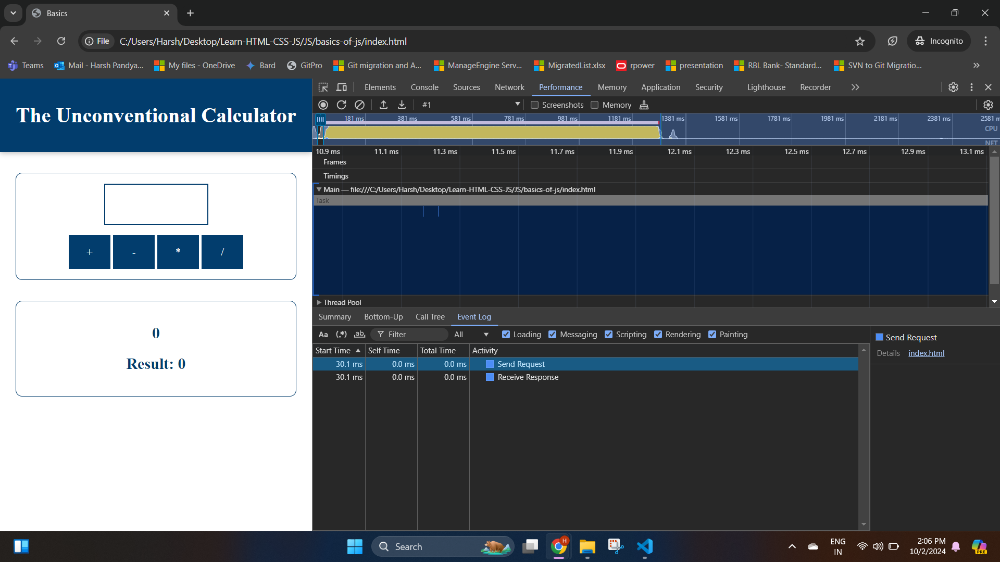

### Step 1 (Resolving URL)

- The [academind.com](academind.com) website code is obviously not stored on your machine and hence needs to be fetched from another computer where it is stored. This "another computer" is called a "server". Because it serves some purpose, in our case, it serves the website. You enter `academind.com` (that is called "a domain") but actually, the server which hosts the source code of a website, is identified via `IP` (= Internet Protocol) addresses. The browser sends a "request" (see step 2) to the server with the IP address you entered (indirectly - you of course entered `academind.com`).
- An IP address typically looks like this `172.56.180.5` (IPv4 example). The modern browser uses IPv6 type of addresses. But how is the domain `academind.com` translated to its IP address? there's a special type of server out there in the internet - not just one but many servers of that type. A so called "name server" or "DNS server" (where DNS = "Domain Name System").
- The job of these DNS servers is to translate domains to IP addresses. You can imagine those servers as huge dictionaries that store translation tables: `Domain => IP address`. When you enter "academind.com", the browser therefore first fetches the IP address from such a DNS server.

>[!NOTE]
> - In reality, you also often enter `academind.com/learn` or anything like that. `academind.com` is the domain, `/learn` is the so-called path. Together, they make up the "URL" ("Uniform Resource Locator").
> - In addition, you can visit most websites via `www.academind.com` or just `academind.com`. Technically, `www` is a subdomain but most websites simply redirect traffic to `www` to the main page.

### Step 2 (Request Is Sent)

- With the IP address resolved, the browser goes ahead and makes a request to the server with that IP address. "A request" is not just a term. It really is a technical thing that happens behind the scenes. The browser bundles up a bunch of information (What's the exact URL? Which kind of request should be made? Should metadata be attached) and sends that data package to the IP address. You can see this in the developer tools. 

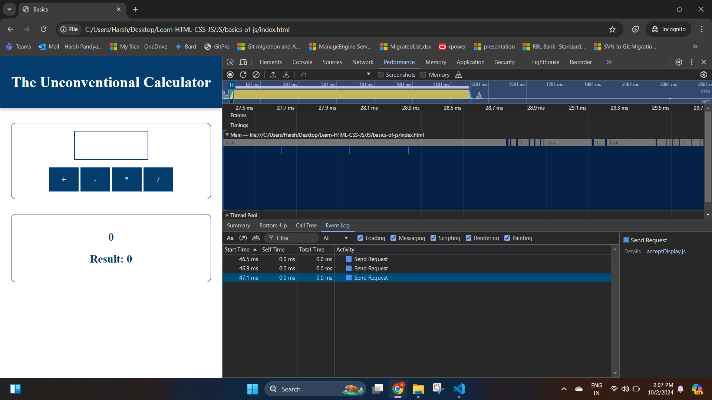

- The data is sent via the "HyperText Transfer Protocol" (known as "HTTP") - a standardized protocol which defines what a request (and response) has to look like, which data may be included (and in which form) and how the request will be submitted. Because HTTP is used, a full URL actually looks like this `http://academind.com`. The browser auto-completes it for you.
- And there also is HTTPS - it's like HTTP but encrypted. Most modern pages use that instead of HTTP. A full URL then becomes `https://academind.com`
- Since the whole process and format is standardized, there is no guessing about how that request has to be read by the server. The server then handles the request appropriately and returns a so called "response". Again, a "response" is a technical thing and kind of similar to a "request". You could say it's basically a "request" in the opposite direction.
- Like a request, a response can contain data, metadata etc. When requesting a page like `academind.com`, the response will contain the code that is required to render the page onto the screen.

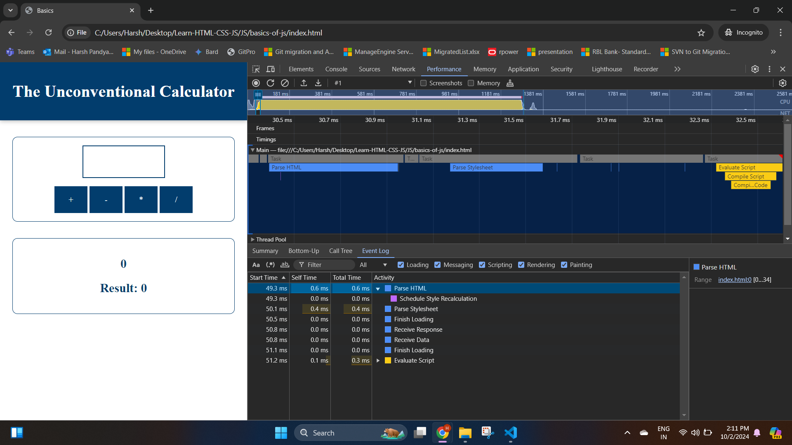

- What happens on the server? that's defined by web developers. In the end, a response has to be sent. That response doesn't have to contain "a website". It can contain any data - including files or images.
- Some servers are programmed to generate websites dynamically based on the request (e.g. a profile page that contains your personal data), other servers return pre-generated HTML pages (e.g. a news page). Or both is done - for different parts of a webpage. There also is a third alternative: Websites that are pre-generated but that change their appearance and data in the browser.

### Step 3 (Response Is Parsed)

- The browser receives the response sent by the server. This alone, doesn't display anything on the screen though. Instead, the next step is that the browser parses the response. Just as the server did it with the request. Again, the standardization enforced by HTTP helps of course. The browser checks the data and metadata that's enclosed in the response. And based on that, it decides what to do. You might've had cases where a PDF opened in your browser. That happened because the response informed the browser that the data is not a website but a PDF document instead. And the browser tries to pick the best handling mechanism for any data type it detects.
- Depending upon the request, the response would contain a specific piece of metadata, that tells the browser that the response data is of type `text/html`.

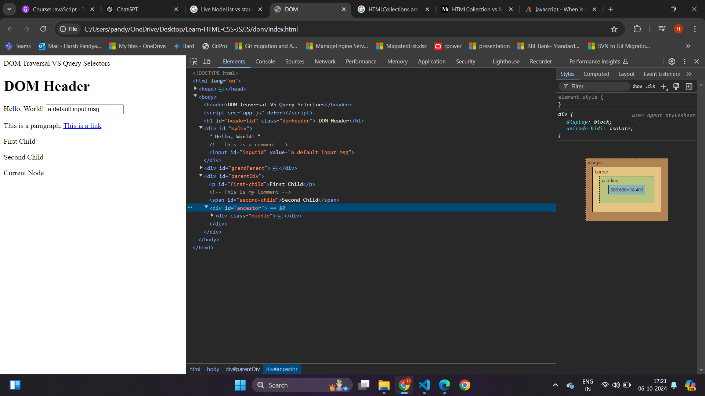

- This allows the browser to then parse the actual data that's attached to the response as HTML code.

### Step 4 (Page Is Displayed)

- The browser goes through the HTML data returned by the server and builds a website based on that. Though it is important to know, that HTML does not include any instructions regarding what the site should look like (i.e. how it should be styled). It really only defines the structure and tells the browser which content is a heading, which content is an image, which content is a paragraph etc. To beautify your page, the HTML has a instructions to fetch more data via new requests - and the browser understands these instructions

```
<link rel="stylesheet" href="/page-styles.css" />
```

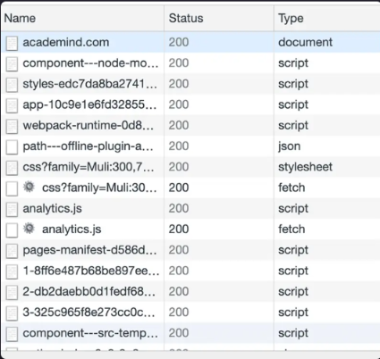

- This is your CSS. Together with CSS, the browser is able to display webpages. The JavaScript does not reloads the page on each user action. It's not always visible but all dynamic content you find on a website (e.g. tabs, overlays etc.) is actually only possible because of JavaScript. It allows web developers to define code that runs in the browser (not on the server), hence JavaScript can be used to change the website whilst the user is viewing it.

### Server-side vs Browser-side

- Server-Side: The server handles complex tasks, data storage and manipulation, and security. The server side programming languages are `Node.js`, `PHP` and etc.. these languages that don't work in the browser but that can run on a normal computer (a server is in the end just a normal computer).
- Browser-side: In the browser, there are exactly three languages/ technologies you need to learn (`HTML`,`CSS` and `JS`). It is the tasks executed on the user's device, usually a computer or smartphone. The browser interprets and displays the information sent back from the server.


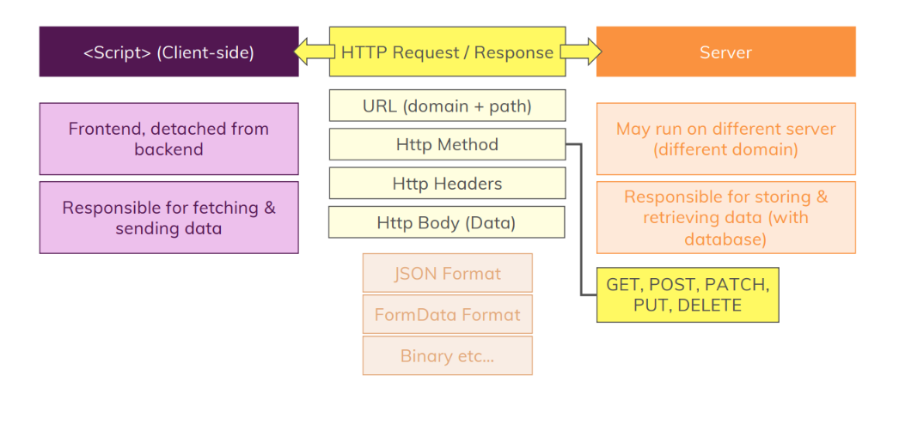

- Now the communication between the client side and the server side happens with the help of **Http Requests and Responses** and these requests and responses have to be configured and set up in a certain way, following a certain structure (like `JSON`,`XML`, `YAML` formats etc..). When you're sending a request to the server, it needs to know the address, so it needs to know the URL made up of the domain and the path. Each Http request has a HTTP method that is assigned to it.
- A couple of available HTTP methods, you have for example `GET`, `POST`, `PATCH`, `PUT` and `DELETE`. Based on the method the server perform operation on server side. The server just exposes different endpoints and for example might support a `POST` request to `/posts` whereas it maybe might not support a `PATCH` request to `/posts`, it's up to the developer writing the server side code to decide which HTTP method URL combinations are supported.
- `GET` requests typically are there to get data, `POST` requests are there to create data on the server or create data on the server which might be stored in a database there, `PATCH` and `PUT` are there to modify the data, `PATCH` in the sense of updating the existing data, `PUT` in the sense of overriding it and `DELETE` is there to delete data. It's the server side that decides which HTTP method URL combinations are supported, on the client side, you then can send requests to these combinations. If you use a combination that is not supported by the server side, you'll simply get a HTTP error as a response.
- Now other parts of a Http request are potential headers, that is extra metadata which can be attached to Http requests and some requests, for example a `POST` request, also hold a request body or extra data which is attached to a request. Suppose you wanna `GET` list of data, you can get it from the response body or suppose you wanna `POST` list of data you can sent it in a request body.
- Now that data then can be sent in different formats and again, it's the server that tells you which formats it expects or supports. The most common format is `JSON` data, secondly used is `FormData` which is supported in Javascript and which is fairly popular and you could also send binary files or other formats.
- For demonstration purpose, we will implement http request where our host or computer will act as a client side and server side will be [A placeholder website](https://jsonplaceholder.typicode.com/) which processes request and sends our dummy responses. JSONPlaceholder is a free online REST API that you can use whenever you need some fake data.

#### `XMLHttpRequest` 

- In JavaScript, there are multiple ways to send HTTP requests. One of the older ways is using the `XMLHttpRequest` object. It allows you to interact with servers, send data, and fetch data without refreshing the page. `XMLHttpRequest` is an object provided by JavaScript to send HTTP requests. It can handle requests like `GET`, `POST`, `PUT`, `PATCH`, and `DELETE` to communicate with a server.
- Key Methods in XMLHttpRequest:
  - `open(method, url)`: Prepares the request. You specify the HTTP method (`GET`, `POST`, etc.) and the URL.
  - `send(data)`: Sends the request. You can include optional data for `POST`/`PUT` requests.
  - `setRequestHeader(name, value)`: Sets custom headers (e.g., for content type).
  - `onreadystatechange` or `onload`: Defines a callback to handle the server response.

- Lets take a simple `GET` request example. Consider below code added in **app.js**

```
const xhr = new XMLHttpRequest();
xhr.open("GET", "https://jsonplaceholder.typicode.com/posts");
xhr.send();
```

- We won't see anything on console as we are not logging anything, but under the `Network` tab we can see a `GET` request is been sent to the server `https://jsonplaceholder.typicode.com/posts`. 


<video controls src="2024-14.mp4" title="title"></video>

- In the response we got dummy values which was expose by the endpoint `posts` provides the above 100 of data. `jsonplaceholder.typicode.com` provides other endpoints on its page.

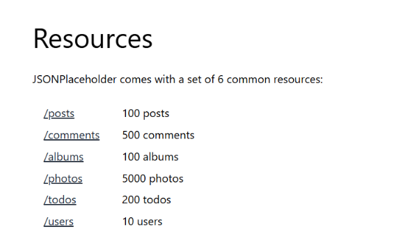

- Lets users `users`

```
const xhr = new XMLHttpRequest();
xhr.open("GET", "https://jsonplaceholder.typicode.com/users");
xhr.send();
```

- On network tab we get 10 data.

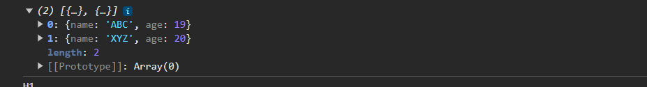

- If you see, there is an `index.html`, `app.js` and `users`. The `index.html` and `app.js` is our code whereas `users` are the endpoint of the `jsonplaceholder` website.
- Now can store this data into a variable? and use it? for that you need to use `onload` function. The `onload` function is an event handler that is triggered when the request completes successfully. It allows you to define what to do with the server's response.

```
const xhr = new XMLHttpRequest();
xhr.open("GET", "https://jsonplaceholder.typicode.com/users");
xhr.onload = function () {
  if (xhr.status === 200) { // Check if the request was successful
    console.log(xhr.responseText); // Handle the server response
  }
};
xhr.send();
```

- On console

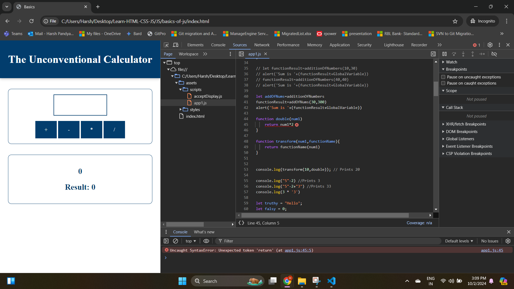

- The `xhr.status` property provides the HTTP status code of the response. Common status codes:
  - `200`: OK (Success)
  - `201`: Created (Resource created successfully)
  - `400`: Bad Request
  - `404`: Not Found
  - `500`: Internal Server Error
- The `xhr.responseTex`t property provides the raw text or string of the server's response. It’s typically used when the response type is plain text or JSON in string format. Now to convert this into JSON format or to parse this into JSON format we need to use `JSON.parse()`.

```
const xhr = new XMLHttpRequest();
xhr.open("GET", "https://jsonplaceholder.typicode.com/users");
xhr.onload = function () {
  if (xhr.status === 200) { // Check if the request was successful
    const jsonResponse=JSON.parse(xhr.responseText); // Handle the server response and converting into JSON
    console.log(jsonResponse)
  }
};
xhr.send();
```

- On browser console

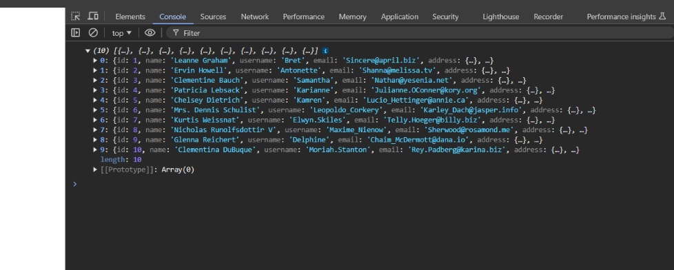

- If you are sure that your incoming response will be a JSON, you can set `xhr.responseType = 'json'`. You don't need to parse it. But instead of `responseText` you need to use `response`

```
const xhr = new XMLHttpRequest();
xhr.responseType='json' // Default is String plain text
xhr.open("GET", "https://jsonplaceholder.typicode.com/users");
xhr.onload = function () {
  if (xhr.status === 200) { // Check if the request was successful
    const jsonResponse=xhr.response;
    console.log(jsonResponse)
  }
};
xhr.send();
```

- The `xhr.response` property gives the response based on the `responseType` you set where you don't need to parse. If `responseType` is `json`, it returns a parsed JavaScript object. If `responseType` is not set, it defaults to a string (like `responseText`). Other responseType values include `arraybuffer`, `blob`, and `document`
- Lets create a resource or use `POST` method to create our own data on `jsonplaceholder`. To do so first we need to check what kind of data does the `jsonplaceholder` requires?


- So to create a resource they require JSON object which consist of `title`,`body` and `userId`.

```
const xhr = new XMLHttpRequest();
const myData={
  title: "This is a dummy title",
  body: "This is a dummy body",
  userId: 101
}
xhr.open('POST','https://jsonplaceholder.typicode.com/posts');
xhr.send(JSON.stringify(myData));
```

- On network tab we can see we got `201` (resource created successfully) as status. 


<video controls src="2024-15.mp4" title="title"></video>


>[!NOTE]
> - Here we need to send data in string format so we use `JSON.stringify` method.

- Lets say you wanna delete an item, you need to use `DELETE` method.

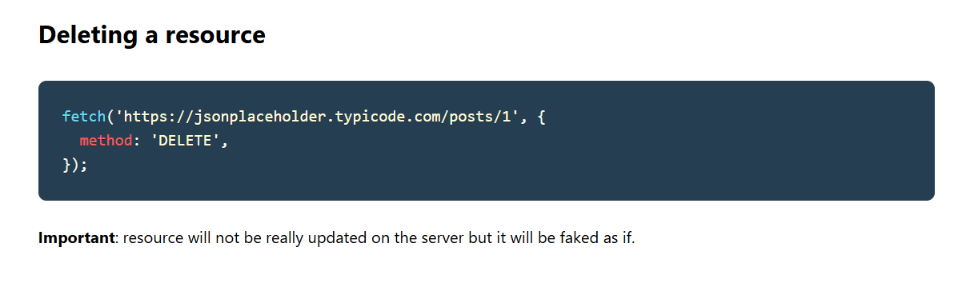

- Below is code to delete via HTTP request `DELETE` method. So to delete anything we require a identifier of data or any `id` , when you enter the url `https://jsonplaceholder.typicode.com/posts/1`, on browser you can see data for the id `1`. `/posts/1` tells request that we need to delete item for id `1`, to delete any other id we will have `/posts/{id}`. 

<video controls src="2024-16.mp4" title="title"></video>

- Below is the code

```
const xhr = new XMLHttpRequest();
xhr.open('DELETE','https://jsonplaceholder.typicode.com/posts/1')
xhr.send();
```

- On browser network tab you can see

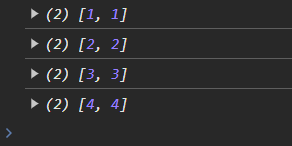

- Lets say you are using `GET` method and wanted to perform some operations when you get the data. Normally you can think of like this.

```
const xhr = new XMLHttpRequest();
xhr.open("GET", "https://jsonplaceholder.typicode.com/users");
xhr.responseType='json' // Default is String plain text
xhr.onload = function () {
  if (xhr.status === 200) { // Check if the request was successful
    const jsonResponse=xhr.response; // Handle the server response and converting into JSON
    console.log(jsonResponse)
  }
};
xhr.send();
console.log('Process Data')
```

- But on browser console we get below as an output

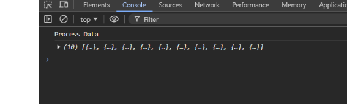

- It seems that both the operation run asynchronously. So now to work such situation we have `async-await`.

```
const xhr = new XMLHttpRequest();

function GetData(){
  return new Promise((resolve,reject)=>{
    xhr.open("GET", "https://jsonplaceholder.typicode.com/users");
    xhr.responseType='json' // Default is String plain text
    xhr.onload = function () {
      if (xhr.status === 200) { // Check if the request was successful
        resolve(xhr.response);
      }
      else{
        console.log("Request was unsuccessful");
      }
    };
    xhr.send();
  })
}

async function performOperationOnGetData(){
  let getResult;
  try{
    getResult=await GetData();
    for(const i of getResult){
      console.log(`Item - id ${i.id} , name ${i.name}`);
    }
  }catch(e){
    console.error(e)
  }
}

performOperationOnGetData()
```

- On browser console

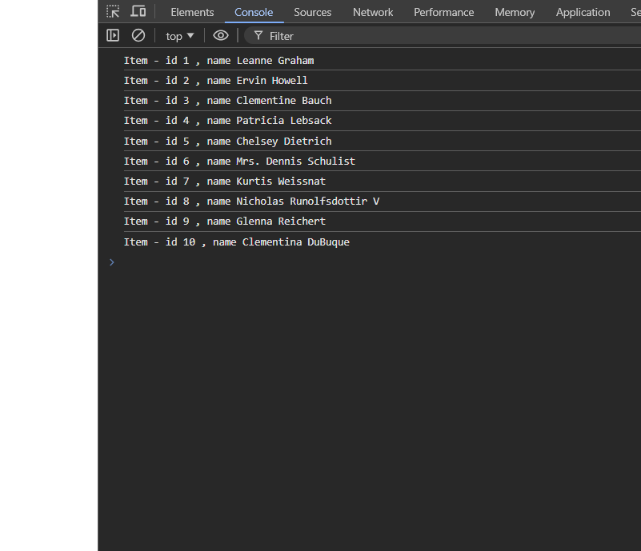

- Lets say you entered a invalid url like `https://jsonplaceholder.typicode.com/u`, in such case you will get a status of `404` something. So just changing the url in the above code.
- On browser console

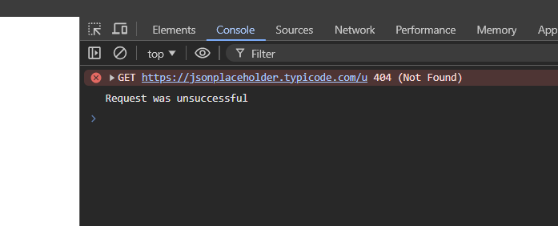

- In such case, you wanted to throw some custom error message, you need to use `reject` method of promise.

```
const xhr = new XMLHttpRequest();

function GetData(){
  return new Promise((resolve,reject)=>{
    xhr.open("GET", "https://jsonplaceholder.typicode.com/u");
    xhr.responseType='json' // Default is String plain text
    xhr.onload = function () {
      if (xhr.status === 200) { // Check if the request was successful
        resolve(xhr.response);
      }
      else{
        reject( new Error("Request was unsuccessful URL is invalid"));
      }
    };
    xhr.send();
  })
}

async function performOperationOnGetData(){
  let getResult;
  try{
    getResult=await GetData();
    for(const i of getResult){
      console.log(`Item - id ${i.id} , name ${i.name}`);
    }
  }catch(e){ // Handling ERROR
    console.error("ERROR FOUND: "+e)
  }
}

performOperationOnGetData()
```

- On browser console

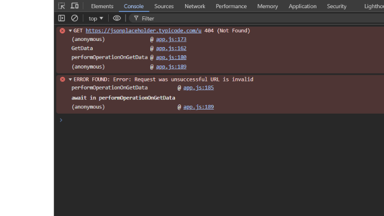

- Lets say server side , server is not functioning or as a client your host or your computer is not connected to internet. To handle such network level error we have a `onerror` handler. The `onerror` function in `XMLHttpRequest` is used to handle network errors or other issues that prevent the request from completing successfully. It gets triggered if the request cannot reach the server or if there's an issue like a timeout.

```

const xhr = new XMLHttpRequest();

function GetData(){
  return new Promise((resolve,reject)=>{
    xhr.open("GET", "https://jsonplaceholder.typicode.com/u");
    xhr.responseType='json' // Default is String plain text
    xhr.onload = function () {
      if (xhr.status === 200) { // Check if the request was successful
        resolve(xhr.response);
      }
      else{
        reject( new Error("Request was unsuccessful URL is invalid"));
      }
    };
    xhr.onerror=function(){
      reject(new Error("You are not connected to Internet"))
    }
    xhr.send();
  })
}

async function performOperationOnGetData(){
  let getResult;
  try{
    getResult=await GetData();
    for(const i of getResult){
      console.log(`Item - id ${i.id} , name ${i.name}`);
    }
  }catch(e){ // Handling ERROR
    console.error("ERROR FOUND: "+e)
  }
}

performOperationOnGetData()
```

- On browser console

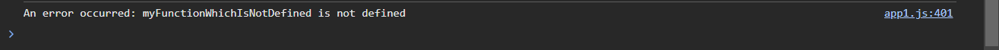

- `xhr.status` in `onload` is to distinguish between successful (e.g., `200`) and unsuccessful (e.g., `404`) responses. Use `onerror` for handling network errors, such as, the server is down, No internet connection etc...
- Suppose you wanted to add some headers in your request. Request headers are like providing extra information to server about your request like what sort of content type your are sending or expecting etc.. So to do so you have `setRequestHeader`.

```

const xhr = new XMLHttpRequest();

function GetData(){
  return new Promise((resolve,reject)=>{
    xhr.open("GET", "https://jsonplaceholder.typicode.com/users");
    xhr.responseType='json' // Default is String plain text
    xhr.setRequestHeader("Content-Type","JSON Content");
    xhr.onload = function () {
      if (xhr.status === 200) { // Check if the request was successful
        resolve(xhr.response);
      }
      else{
        reject( new Error("Request was unsuccessful URL is invalid"));
      }
    };
    xhr.onerror=function(){
      reject(new Error("You are not connected to Internet"))
    }
    xhr.send();
  })
}

async function performOperationOnGetData(){
  let getResult;
  try{
    getResult=await GetData();
    for(const i of getResult){
      console.log(`Item - id ${i.id} , name ${i.name}`);
    }
  }catch(e){ // Handling ERROR
    console.error("ERROR FOUND: "+e)
  }
}

performOperationOnGetData()
```

- On network tab

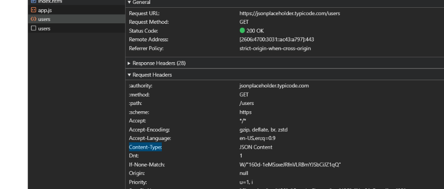

#### Fetch API

- The Fetch API (`fetch()`) is a modern, more powerful, and easier-to-use alternative to `XMLHttpRequest` for making HTTP requests in JavaScript. It’s widely used today because of its cleaner syntax and built-in support for promises. `XMLHttpRequest` was originally designed to work with XML data but can handle JSON and other formats. It became less favored due to its clunky syntax.
- **Fetch API returns a promise by itself**. Lets see an example

```
function GetData(){
  return fetch("https://jsonplaceholder.typicode.com/users").then((response=> response.json()
  ));
}

async function performOperationOnGetData(){
  let getResult;
  try{
    getResult=await GetData();
    for(const i of getResult){
      console.log(`Item - id ${i.id} , name ${i.name}`);
    }
  }catch(e){ // Handling ERROR
    console.error("ERROR FOUND: "+e)
  }
}
```

- On browser console

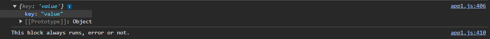

- The `fetch()` function returns a Promise that resolves to a Response object. **This Response object represents the data returned by the server, but the data is not immediately available as plain text or JSON**.
- When `fetch()` makes a request to a server, the response data doesn't come all at once. Instead, it comes in **small pieces called streams**. Think of it like downloading a large file, you receive the file in small chunks, bit by bit, instead of all at once.
- A stream is like a pipeline of data that flows from the server to your browser. Instead of waiting for the entire response to be downloaded, the browser processes the data piece by piece. This is especially useful for large files like videos, images, or large JSON objects because you can start using part of the data while the rest is still downloading.
- Initially, the data from the server is in its raw binary form (0's and 1's). This is why it needs to be processed or "decoded" into a format that JavaScript can work with, such as like Text (`response.text()`), JSON (`response.json()`), Binary data like blobs (`response.blob()`)or Stream (`response.body`)
- When you call methods like `response.text()` or `response.json()`, these methods read the stream and convert the binary data into a usable format (like a string or JavaScript object).
- Streams allow you to handle large amounts of data without waiting for the entire response. For example, video streaming websites can play the beginning of the video before the entire file is downloaded. You can process the data as it arrives instead of waiting for everything to be loaded.
- The `catch` block is similarly to `xhr.onerror` which deals with network level errors.
- Lets implement `POST` and `DELETE`

```
// Post Example
function OtherOperationData(methodName,url,body=null){
  return fetch(url,{
    method: methodName,
    body:JSON.stringify(body)
  }).then(response => {
    if (!response.ok) {
      throw new Error("Failed to POST: " + response.status);
    }
    return response.json();
  })
  .then(data => {
    console.log("POST Response:", data);
  })
  .catch(error => {
    console.error("Fetch POST Error:", error);
  });
}

async function performOperationOtherOperationsData(){
  try{
    const myData={
      title: "This is a dummy title",
      body: "This is a dummy body",
      userId: 101
    }
    let result=OtherOperationData('POST','https://jsonplaceholder.typicode.com/posts',myData);
  }catch(e){ // Handling ERROR
    console.error("ERROR FOUND: "+e)
  }
}

performOperationOtherOperationsData()
```

- On browser console

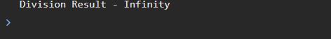
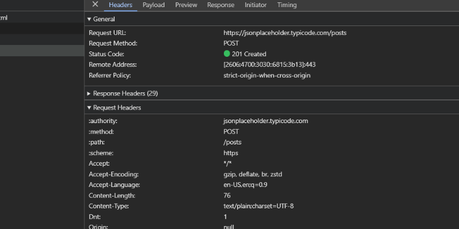

- `DELETE` example

```
function OtherOperationData(methodName,url,body=null){
  return fetch(url,{
    method: methodName,
    body:JSON.stringify(body)
  }).then(response => {
    if (!response.ok) {
      throw new Error("Failed to POST: " + response.status);
    }
    return response.json();
  })
  .then(data => {
    console.log("POST Response:", data);
  })
  .catch(error => {
    console.error("Fetch POST Error:", error);
  });
}

async function performOperationOtherOperationsData(){
  try{
    const myData={
      title: "This is a dummy title",
      body: "This is a dummy body",
      userId: 101
    }
    let result=OtherOperationData('DELETE','https://jsonplaceholder.typicode.com/posts/2');
  }catch(e){ // Handling ERROR
    console.error("ERROR FOUND: "+e)
  }
}

performOperationOtherOperationsData()
```

- On browser console


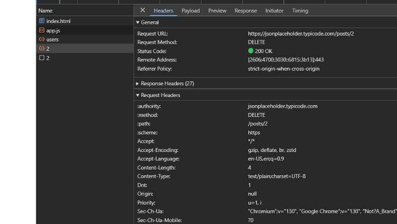

- You can also add request headers in fetch api

```

function OtherOperationData(methodName,url,body=null){
  return fetch(url,{
    method: methodName,
    headers:{
      "Content-Type": "JSON Content",
      "JSON-Length": 20
    },
    body:JSON.stringify(body)
  }).then(response => {
    if (!response.ok) {
      throw new Error("Failed to POST: " + response.status);
    }
    return response.json();
  })
  .then(data => {
    console.log("POST Response:", data);
  })
  .catch(error => {
    console.error("Fetch POST Error:", error);
  });
}

async function performOperationOtherOperationsData(){
  try{
    const myData={
      title: "This is a dummy title",
      body: "This is a dummy body",
      userId: 101
    }
    let result=OtherOperationData('DELETE','https://jsonplaceholder.typicode.com/posts/2');
  }catch(e){ // Handling ERROR
    console.error("ERROR FOUND: "+e)
  }
}

performOperationOtherOperationsData()
```

- On network tab

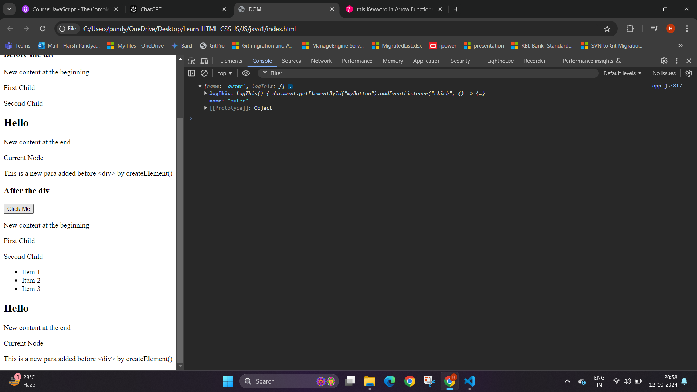

- Now how can we handle response error? the `catch` block handles network level error but how to handle response error like `400`?. Consider below code.

```

function GetData(){
  return fetch("https://jsonplaceholder.typicode.com/u").
  then(response=> {
    if(response.status==200){
      return response.json()
    }
    else{
      return response.json().then(err=>{
        console.log(err)
        throw new Error("Invalid URL")
      })
    }
  }
  ).
  catch((error)=>{
    throw new Error(error);
  });
}

async function performOperationOnGetData(){
  let getResult;
  try{
    getResult=await GetData();
    console.log(getResult)
    for(const i of getResult){
      console.log(`Item - id ${i.id} , name ${i.name}`);
    }
  }catch(e){ // Handling ERROR
    console.error("ERROR FOUND: "+e)
  }
}

performOperationOnGetData()
```

- Here the URL is invalid and on the browser console we get

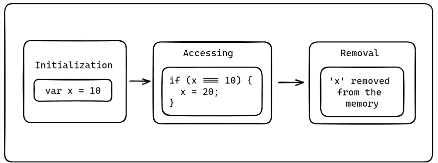

- In below snip of above code

```
then(response=> {
    if(response.status==200){
      return response.json()
    }
    else{
      return response.json().then(data=>{
        console.log(data)
        throw new Error("Invalid URL")
      })
    }
  }
  ).
  catch((error)=>{
    throw new Error(error);
  });
```

- The `response` is a object which consist of all the response header and body contents. When we do `console.log(response)`.

```
then(response=> {
    if(response.status==200){
      return response.json()
    }
    else{
      return response.json().then(data=>{
        console.log(data)
        console.log(response)
        throw new Error("Invalid URL")
      })
    }
  }
  ).
  catch((error)=>{
    throw new Error(error);
  });
```

- On browser console

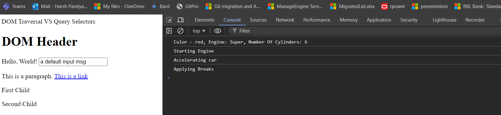

- Now based on the status if it is a `200` that is handle in the `if` block which returns `response.json()` (which is a promise object).


- To catch the response status in the else block we need to return `response.json()` with a promise of chaining using `then(data)`. This will check that if the response status is `400` or not and `throw new Error`. That error is catch by `catch((error))`, which in return throws the same error which is caught by `performOperationOnGetData` catch block.


## Third Party Libraries

- Lets say you have two arrays, where you need to find out which is the common data in the two arrays.

```
const arr=[1,2]
const arr1=[2,3]

common element is -> [2]
```

- So you can write your own logic to find out the common elements but what is there is already code written by other developer which is free to use? third-party libraries are pre-built collections of code, functions, and tools created by developers outside of your own team or organization. These libraries are used to simplify and accelerate the development process by providing reusable solutions for common tasks or more specialized functionalities.

### Lodash

- [Lodash](https://lodash.com/docs/4.17.15#difference) is a JavaScript utility library that provides a wide range of functions for working with:
  - Arrays
  - Objects
  - Strings
  - Numbers
  - Collections
- It simplifies common programming tasks, such as:
  - Manipulating arrays and objects: Sorting, filtering, finding unique elements, etc.
  - Deep cloning: Copying objects without reference issues.
  - Working with functions: Throttling, debouncing, and memoizing.
  - String manipulation: Changing cases, padding, etc.

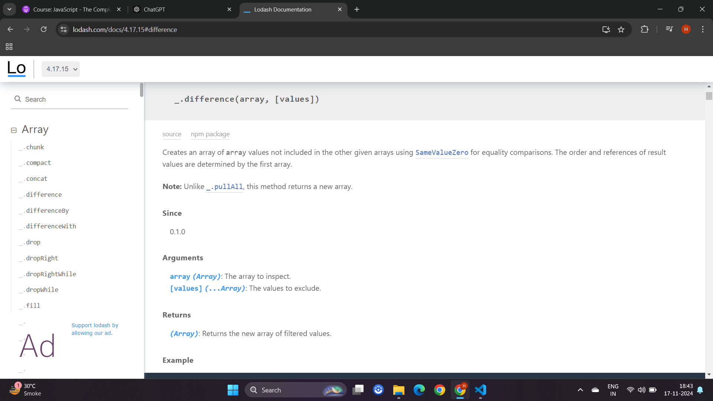

- Now to use third-party library we can directly add it as a script in our HTML file.

```
<script src="https://cdn.jsdelivr.net/npm/lodash@4.17.21/lodash.min.js"></script>
```

- Lodash provides a method called [`intersection`](https://lodash.com/docs/4.17.15#intersection) which gives common element between arrays. To use the method it exposes a global object `_`.

```
const arr=[3,2]
const arr1=[2,3]
console.log(_.intersection(arr,arr1))
```

- On browser console

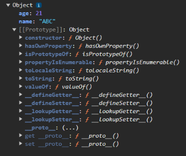

- Similarly there are bunch of methods which is provided by Lodash library.

### jQuery

- jQuery is a lightweight, fast, and feature-rich JavaScript library. It simplifies HTML document traversal, manipulation, event handling, and animations. Before modern JavaScript (ES6+), jQuery was widely used to make tasks simpler and more cross-browser compatible.
- It is useful for 
  - Simplify DOM manipulation.
  - Handle events more easily.
  - Simplify AJAX requests.

- Example without JS (Vanilla JS)

```
<!DOCTYPE html>
<html>
<head>
  <title>Vanilla JS Example</title>
</head>
<body>
  <button id="myButton">Click me</button>
  <div id="myDiv">Hello</div>
  
  <script>
    const button = document.getElementById('myButton');
    const div = document.getElementById('myDiv');
    
    button.addEventListener('click', () => {
      div.textContent = 'You clicked the button!';
    });
  </script>
</body>
</html>
```

- With jQuery

```
<!DOCTYPE html>
<html>
<head>
  <title>jQuery Example</title>
  <script src="https://code.jquery.com/jquery-3.6.0.min.js"></script>
</head>
<body>
  <button id="myButton">Click me</button>
  <div id="myDiv">Hello</div>
  
  <script>
    $('#myButton').click(() => {
      $('#myDiv').text('You clicked the button!');
    });
  </script>
</body>
</html>
```

- Here we import the library in the `script` tag.`$` is jQuery's shorthand to access elements like `document.querySelector`. `$('#myButton')` this selects the element with the `id="myButton"`. `.click(() => { ... })` this adds a click event listener to the selected element `(#myButton)`. When the button is clicked, the function inside click is executed. `$('#myDiv')` this selects the element with `id="myDiv"`. `.text('You clicked the button!')` this changes the text content of the `#myDiv` element to `'You clicked the button!'`.

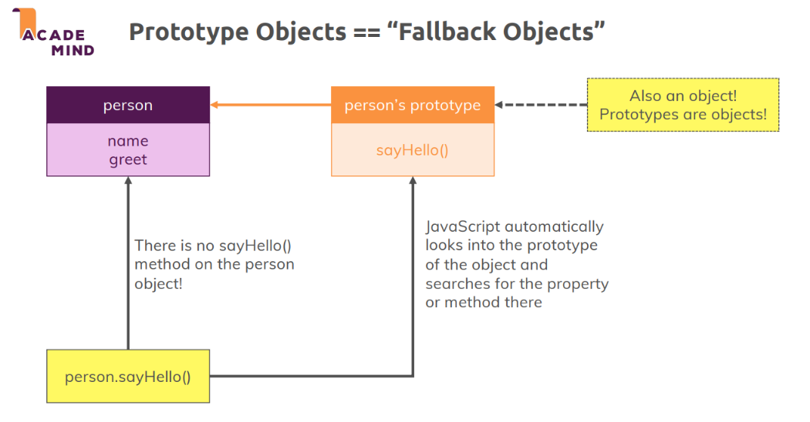

- Some other examples of it

```
<!DOCTYPE html>
<html>
<head>
  <title>Change Style</title>
  <script src="https://code.jquery.com/jquery-3.6.0.min.js"></script>
</head>
<body>
  <button id="styleButton">Change Style</button>
  <div id="styledDiv">Watch me change!</div>
  
  <script>
    $('#styleButton').click(() => {
      $('#styledDiv').css('color', 'red'); // Change text color to red
    });
  </script>
</body>
</html>
```

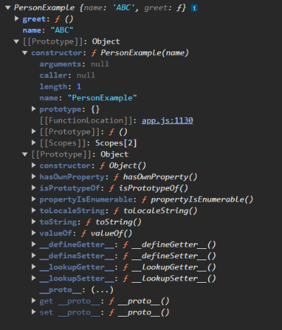


- Another example

```
<!DOCTYPE html>
<html>
<head>
  <title>Change Style</title>
  <script src="https://code.jquery.com/jquery-3.6.0.min.js"></script>
</head>
<body>
  <button id="styleButton">Change Style</button>
  <div id="styledDiv">Watch me change!</div>
  
  <script>
    $('#styleButton').click(() => {
      $('#styledDiv').css('color', 'red'); // Change text color to red
    });
  </script>
</body>
</html>
```


### Axios

- Axios is a modern JavaScript library used to make HTTP requests. It simplifies sending data to and receiving data from servers. It's similar to fetch in modern JavaScript but comes with additional features like:
  - Automatic JSON data transformation.
  - Simpler error handling.
  - Support for request timeouts and interceptors.
- Make AJAX requests (`GET`, `POST`, `PUT`, `DELETE`, etc.).
- Without Axios

```
fetch('https://jsonplaceholder.typicode.com/posts')
  .then(response => {
    if (!response.ok) {
      throw new Error('Network response was not ok');
    }
    return response.json();
  })
  .then(data => console.log(data))
  .catch(error => console.error('There was a problem with the fetch operation:', error));
```

- With Axios, first import the library in `script` tag

```
<script src="https://cdnjs.cloudflare.com/ajax/libs/axios/1.7.7/axios.min.js" integrity="sha512-DdX/YwF5e41Ok+AI81HI8f5/5UsoxCVT9GKYZRIzpLxb8Twz4ZwPPX+jQMwMhNQ9b5+zDEefc+dcvQoPWGNZ3g==" crossorigin="anonymous" referrerpolicy="no-referrer"></script>
```

- In **app.js**

```
axios.get('https://jsonplaceholder.typicode.com/users')
  .then(response => console.log(response.data))
  .catch(error => console.error('There was a problem with the Axios request:', error));
```

- Axios has a more straightforward syntax and automatically parses the JSON response. Axios simplifies error handling.

>[!IMPORTANT]
> - All third-party libraries added under the `script` must be loaded before your javascript file. Example is below
>
> ```
> <!DOCTYPE html>
> <html lang="en">
> <head>
>     <meta charset="UTF-8">
>     <title>Click Event Example</title>
> </head>
> <body>
>
> <h1> Load All the Libraries before executing App.js file , as it as a dependency on these libraries </h1>
> <script src="https://cdn.jsdelivr.net/npm/lodash@4.17.21/lodash.min.js"></script>
> <script src="https://cdnjs.cloudflare.com/ajax/libs/axios/1.7.7/axios.min.js" integrity="sha512-DdX/YwF5e41Ok+AI81HI8f5/5UsoxCVT9GKYZRIzpLxb8Twz4ZwPPX+jQMwMhNQ9b5+zDEefc+dcvQoPWGNZ3g==" crossorigin="anonymous" referrerpolicy="no-referrer"></script>
> <script src="app.js" defer></script>
>   </body>
> </html>
> ```


## Modules

- JavaScript modules allow you to break up your code into separate files. This makes it easier to maintain a code-base. Consider example


