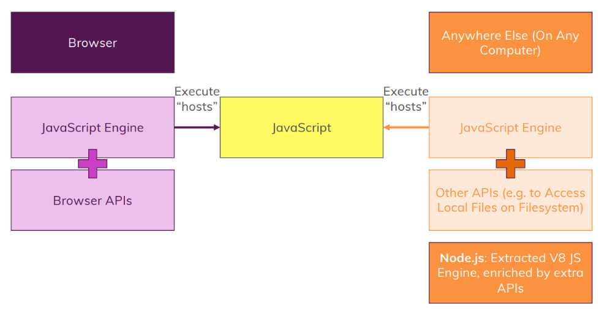
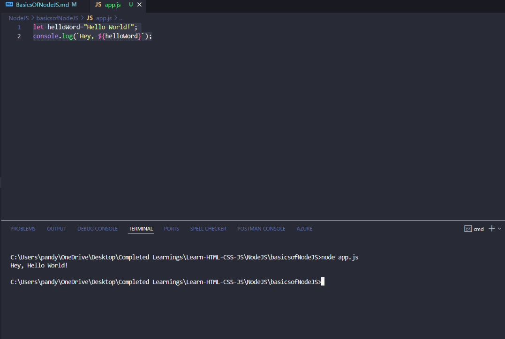
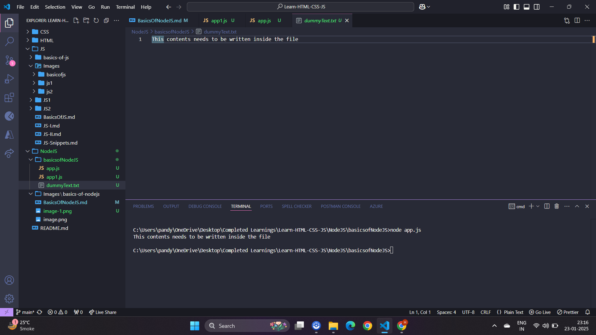
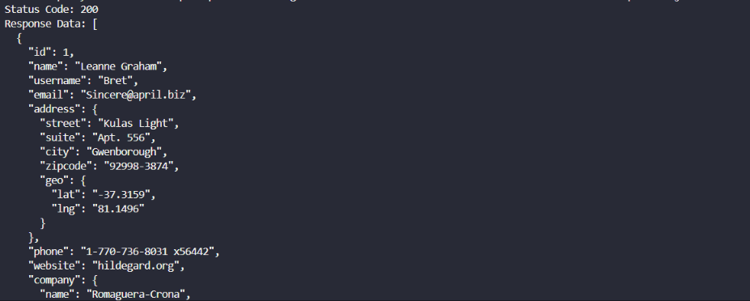
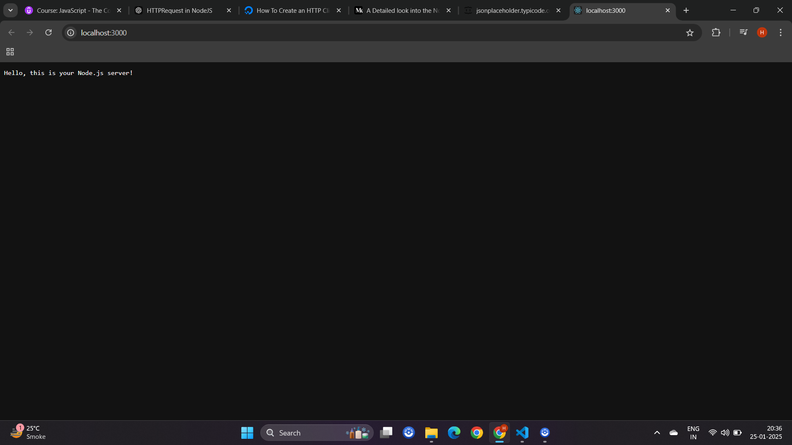
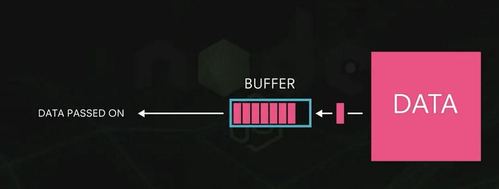

# About NodeJS





- Javascript is a hosted language, that means Javascript itself, the definition of the language can be implemented in different browser environments. All you need in the end is a Javascript engine that parses the code and executes it in the end in browser. Browsers have their own Javascript engines, like the V8 engine in the case of Chrome and this in the end hosts and executes the Javascript code therefore. Now within the browser APIs we learned about, like the DOM or the browser storage or the fetch API and so on, so we got tools to build rich client-side applications where you utilize the language and all its key features and keywords and so on combined with the browser APIs to provide the user experience you want to provide, all of that then runs in the browser.

>[!NOTE]
> - In the context of web development, a **client-side application** essentially refers to an application that runs within a user's web browser, making the browser itself the "client" in this scenario; therefore, a client-side application is considered to be **browser-based** or simply **browser** in this context. 

- We can execute Javascript anywhere else we want by simply taking the Javascript engine and taking it out of the browser basically and that's it. We can then add our own APIs if we want to, not APIs to work with the DOM for example because if the browser environment is detached from the web page, there is no DOM right, there is no HTML code which we could parse.
- APIs which don't exist in the browser, for example to work with the local file system which is not possible in the browser due to security reasons and that's exactly what `Node.js` does to run Javascript. `Node.js` is essentially the extracted V8 engine Chrome offers enriched by extra APIs, so its that engine you know from the browser but basically instead of the browser APIs, it has access to other APIs and it runs outside of the browser, this is `Node.js`.
- Lets create a simple **app.js** file and add below javascript code

```
let helloWord="Hello World!";
console.log(`Hey, ${helloWord}`);
```

- Now to execute your javascript file you need to run the command `node filename.js`



## Import and Exports

- `Node.js` and browser environments handle module imports and exports differently.
- Originally, `Node.js` used the CommonJS module system, which relies on the `require()` function to `import` modules and `module.exports` or `exports` to export them.
- Lets create another file **app1.js**

```
export function add(a,b){
    return a+b;
}
```

- In **app.js**

```
let helloWord="Hello World!";
console.log(`Hey, ${helloWord}`);

// Importing Local module
const app1JS=require('./app1.js');
console.log(app1JS.add(6,10));
```

- Output

```
Hey, Hello World!
16
```

- Lets add a `subtract` function as well, so in **app1.js**

```
export function add(a,b){
    return a+b;
}

export function sub(a,b){
    return a-b;
}
```

- In **app.js**

```
let helloWord="Hello World!";
console.log(`Hey, ${helloWord}`);

// Importing Local module
const app1JS=require('./app1.js');
console.log(app1JS.add(6,10));

const {add,sub} = require('./app1.js');
console.log(add(10,5));
console.log(sub(10,5));
```

- Output

```
Hey, Hello World!
16
15
5
```

- Lets see example of `module.export`, so in **app1.js**

```
// Filename: func.js

function add(x, y) {
  return x + y;
}

function sub(x, y) {
  return x - y;
}

module.exports = { add, sub};


OR


module.exports = {
    add: function (x, y) {
        return x + y;
    },

    sub: function (x, y) {
        return x - y;
    },
};
```

- In **app.js**

```
const {add,sub} = require('./app1.js');
console.log(add(10,5));
console.log(sub(10,5));
```

- Output

```
15
5
```

- `Node.js` also consist of some built in modules, like for file system we have `fs` module.

```
const fileSys=require('fs');

// Writing data ('This contents needs to be written inside the file') into file dummyText.txt, if any error occurred , will get printed out
fileSys.writeFile("dummyText.txt","This contents needs to be written inside the file",(ifAnyError)=>{
    if(ifAnyError) console.log(ifAnyError)
})

//Reading data from file
fileSys.readFile("dummyText.txt",(error,filedata)=>{
    if(error){
        console.log(error);
        return; //Stopped reading further contents from file
    }
    console.log(filedata.toString());
})
```





## HTTP Calls

- In `Node.js`, the `http` module is used to make HTTP requests and handle responses. This is a built-in module provided by `Node.js`.
- The `http` module in` Node.js` allows you to create both HTTP servers and clients. This means you can use it to build web servers that respond to requests, as well as to make HTTP requests to other servers from your `Node.js` applications. It's a fundamental module for building web applications and APIs with `Node.js`.

### Client-Side Scripting

- Lets send a simple `GET` method request and get response from the [JSON fake API](https://jsonplaceholder.typicode.com/). Lets understand below code.

```
const http = require('http');

// GET Request Details
const RequestDetails = {
  hostname: 'jsonplaceholder.typicode.com', // Server address
  path: '/users',                        // Resource path
  method: 'GET',                           // HTTP method
};

// Sending the request
const req = http.request(RequestDetails, (res) => {
  console.log(`Status Code: ${res.statusCode}`); // Log the status code

  // Collect response data
  let data = '';
  res.on('data', (chunk) => {
    data += chunk; // Add each chunk of data to the 'data' variable
  });

  // When the entire response is received
  res.on('end', () => {
    console.log('Response Data:', data); // Log the complete response
  });
});

// Handle errors
req.on('error', (error) => {
  console.error(`Error: ${error.message}`);
});

// End the request (important for POST/PUT)
req.end();
```

- Output




- `http.request` is a method in `Node.js`'s `http` module. It’s used to make HTTP requests (e.g., `GET`, `POST`) to a server.
- It takes two main arguments:

    1. Request Details (`RequestDetails`) - Specifies the details of the request like:
        - `hostname` (e.g., `jsonplaceholder.typicode.com`): The server address.
        - `path` (e.g., `/users`): The specific resource you are requesting from the server.
        - `method` (e.g., `GET`): The HTTP method (e.g., `GET`, `POST`, `PUT`, etc.).

    2. Callback (`(res) => { ... }`): A function that handles the server’s response based on the request you as a client sent to the server  (`jsonplaceholder.typicode.com`).

- `http.request` returns a `ClientRequest` object (assigned to `req` in your code). This object is used to:
    - Send the actual request.
    - Attach event listeners (e.g., handle errors or send data in `POST` requests).
- The callback function `(res) => { ... }` is triggered when the server sends back a response. The `res` parameter is the response object, and you can use it to process the response data.

```
  console.log(`Status Code: ${res.statusCode}`);
```

- `res.statusCode`: Logs the HTTP status code of the response (e.g., 200 for success, 404 for not found).

```
  let data = '';
  res.on('data', (chunk) => {
    data += chunk; // Collect the response data chunks
  });
```

- `res.on` is an event listener for the response object. The `'data'` event is triggered each time a chunk of data is received from the server. The chunk is a small piece of the data (because the response might be too large to be sent all at once). The `data` variable is used to combine all chunks into a complete response.

```
  res.on('end', () => {
    console.log('Response Data:', data);
  });
```

- The `'end'` event is triggered when the entire response has been received. At this point, all chunks of data have been combined, and the full response is logged.

```
req.on('error', (error) => {
  console.error(`Error: ${error.message}`);
});
```

- `req.on`: Attaches an event listener to the request object for the `'error'` event. This will handle issues like network errors or invalid server addresses.

```
req.end();
```

- `req.end()` indicates that you have added all the details of request and now its time to sent it, calling `req.end()` signals that you are done setting up the request and it should now be sent to the server.
- For HTTP requests like `POST` or `PUT`, you can send data in the request body (e.g., with `req.write()`).
- Lets see an example to send a `POST` request

```
const http = require('http');

// POST Request Details
const postData = JSON.stringify({ title: 'foo', body: 'bar', userId: 1 });

const postReqDetails = {
  hostname: 'jsonplaceholder.typicode.com',
  path: '/posts',
  method: 'POST',
  headers: {
    'Content-Type': 'application/json',
    'Content-Length': Buffer.byteLength(postData),
  },
};

const postreq = http.request(postReqDetails, (res) => {
  let data = '';
  res.on('data', (chunk) => {
    data += chunk;
  });
  res.on('end', () => {
    console.log('Response:', data);
  });
});

postreq.on('error', (error) => {
  console.error(`Error: ${error.message}`);
});

// Write data to request body
postreq.write(postData,()=>{
    console.log("POST Request Sent");
});
postreq.end();
```

- Output


### Server-Side Scripting

- As we saw above the client-side scripting part using `Node.js` where `Node.js` acts as a client that sends an HTTP request to an external server (e.g., the `jsonplaceholder.typicode.com` API) and processes the response it receives.
- In the code above, we are only sending a request and receiving a response from an external server. We haven't created a server. Now, let's learn how to create a server-side application using `Node.js` with the `http` module.
- Here we as a server will be sending responses to the request received from client. Lets see an simple example

```
const http = require('http');

// Create the server
const server = http.createServer((req, res) => {
  // `req` is the request from the client
  // `res` is the response we send back to the client

  // Log the request method and URL
  console.log(`Request method: ${req.method}, URL: ${req.url}`);

  // Send a response
  res.statusCode = 200; // HTTP status code for "OK"
  res.setHeader('Content-Type', 'text/plain'); // Set response type
  res.end('Hello, this is your Node.js server!'); // Send response body
});

// Make the server listen on a port (e.g., 3000)
server.listen(3000, () => {
  console.log('Server is running on http://localhost:3000');
});
```

- Output




- `http.createServer` creates a server. Every time someone sends a request to this server, the callback function (with `req` and `res`) will run.
    - `req` (Request Object):
        - Contains details about the request, like the method (`GET`, `POST`) and URL.
        - Example: If the browser requests `http://localhost:3000/about`, `req.url` will be `/about`.
    - `res` (Response Object):
        - Used to send a response back to the client.
        - `res.statusCode`: Set the status code (e.g., 200 for success).
        - `res.setHeader`: Set headers like Content-Type.
        - `res.end`: Send the response and end it.
- `server.listen` tells the server to start listening on a specific port (like 3000). Now, you can open `http://localhost:3000` in your browser to see the response.
- When implementing server-side scripting in `Node.js`, the server needs to accept data from client requests, parse it, and then respond with a content. Lets see an example

```
const http = require('http');


// Create the server
const server = http.createServer((req, res) => {
    // `req` is the request from the client
    // `res` is the response we send back to the client

    let clientdata=[]
    req.on('data',(contents)=>{
        clientdata.push(contents);
    });


    req.on('end', () => {
        console.log(clientdata);
        clientdata = Buffer.concat(clientdata).toString();
        let userName = 'Unknown User';
        if (clientdata) {
          userName = clientdata.split('=')[1];
        }
        res.setHeader('Content-Type', 'text/html');
        res.write(
          `<h1>Hi ${userName}</h1><form method="POST" action="/"><input name="username" type="text"><button type="submit">Send</button></form>`
        );
        res.end();
      });
  });
  
  // Make the server listen on a port (e.g., 3000)
  server.listen(3000, () => {
    console.log('Server is running on http://localhost:3000');
  });
```

- Output

<video controls src="Images/basics-of-nodejs/2024-1.mp4" title="Title"></video>


- On console

```
[]

[]

[ <Buffer 75 73 65 72 6e 61 6d 65 3d 48 61 72 73 68> ]
username=Harsh
[]

```

- Here we accepts `POST` requests with data sent from a form. Parses the received data and extracts the user's name from it and respond with an HTML page that displays a greeting with the user's name and contains a form to send another request with the entered input.
- The `req` (request) object contains data sent by the client. Collecting Data with `req.on('data')`

```
let clientdata = [];
req.on('data', (contents) => {
    clientdata.push(contents);
});
```

- The `'data'` event fires whenever the server receives a chunk of data from the client. Each chunk is added to the `clientdata` array.

```
req.on('end', () => {
    console.log(clientdata);
    clientdata = Buffer.concat(clientdata).toString();
    console.log(clientdata);
});
```

- The `'end'` event is triggered when all chunks of data have been received. `Buffer.concat(clientdata)` combines all the chunks into a single buffer. `.toString()` converts the buffer into a readable string


<details> 

<summary> What is Buffer ? </summary>


- A Buffer in Node.js is a temporary storage area for binary data. It is designed to handle raw binary data streams, which means it works with bytes (not characters or text). Buffers are often used in scenarios where data is received in chunks, such as HTTP requests, file I/O, or streams.




- The internet works in a streamed manner. Sending all the data in one go could overload systems or cause delays for large amounts of data. Using chunks (or streams) is more memory-efficient than loading the entire request into memory at once. Streams allow `Node.js` to process data as it arrives, rather than waiting for the entire payload.
- So on the browser when we entered name as **Harsh**, the data got converted into buffered stream 

```
[ <Buffer 75 73 65 72 6e 61 6d 65 3d 48 61 72 73 68> ]
```

- The buffer contains the raw bytes representing the data sent by the client:
    - The data is: `username=Harsh`.
    - Each pair of hexadecimal numbers in the buffer represents one byte (8 bits).

| **Hexadecimal** | **ASCII Character** |
|-----------------|---------------------|
| 75              | u                   |
| 73              | s                   |
| 65              | e                   |
| 72              | r                   |
| 6e              | n                   |
| 61              | a                   |
| 6d              | m                   |
| 65              | e                   |
| 3d              | =                   |
| 48              | H                   |
| 61              | a                   |
| 72              | r                   |
| 73              | s                   |
| 68              | h                   |


- Buffers are binary, but they are displayed in a hexadecimal format for readability:
    - Each byte (8 bits) is represented as two hexadecimal characters.
    - For example:
        - Binary: `0111` and `0101` (`01110101`) (8 bits)
        - Hexadecimal: 75 (2 characters), so 7 -> `0111` and 5 -> `0101`

- Buffers are used to handle raw, binary data streams in `Node.js`. Data in HTTP requests is sent as a stream of chunks. Buffers are necessary to process these chunks. Buffers display data in hexadecimal format, but it represents binary data. Streaming data in chunks reduces memory usage and improves performance, especially for large requests

</details>


- The `form` tag creates an HTML form for user input.

```
<form method="POST" action="/">
    <input name="username" type="text">
    <button type="submit">Send</button>
</form>
```

- `method="POST"` specifies that the form will send its data using the HTTP `POST` method. This data will appear in the body of the request.
`action="/"` indicates where the form data should be sent. Here, it's sent to the root route (`/`).
- When the user visits the server (e.g., `http://localhost:3000`), the server responds with the default form and `"Hi Unknown User"`.
- When the user submits the form:
    - The server collects the data from the request body (`username=Harsh`).
    - The buffer is used to combine the chunks and parse the data.
    - The server extracts the username and sends back an updated HTML response with the user's name.
- The new name is passed in the response with form tag elements.

