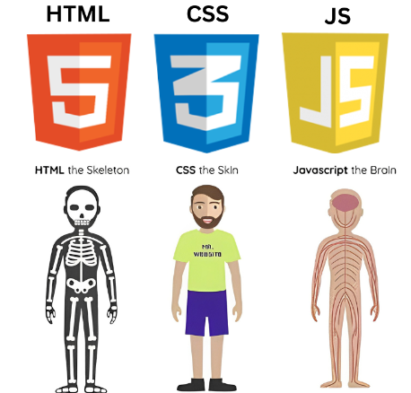

# Learn-HTML-CSS-JS-NodeJS-TS

> [!IMPORTANT]
> 📌 **Clone this repository and use [Visual Studio Code](https://code.visualstudio.com/download) to preview all the Markdown files during your learning process.**
>
> 📹 **Some videos may be lengthy and might not be supported in the GitHub web version.**

 

- Learn about [HTML](https://github.com/codophilic/Learn-HTML-CSS-JS/blob/main/HTML/Theory.md)

 
 

  

 
 
 
 

- Learn about [NodeJS](/NodeJS/BasicsOfNodeJS.md)

  

- Learn about [TypeScript](/TS/BasicsOfTypeScript.md)

  

