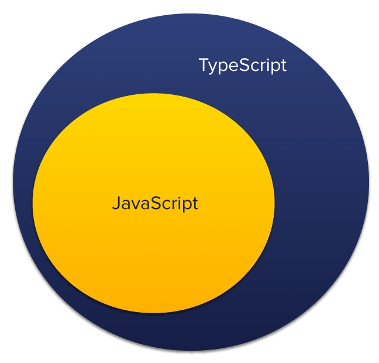
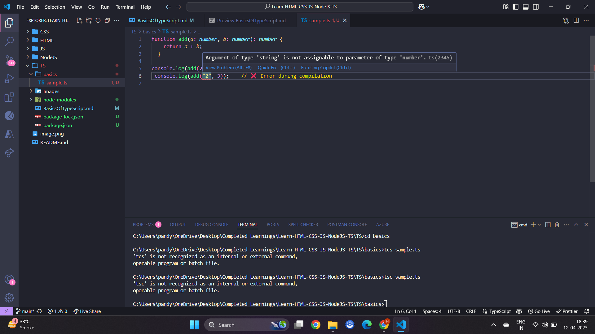
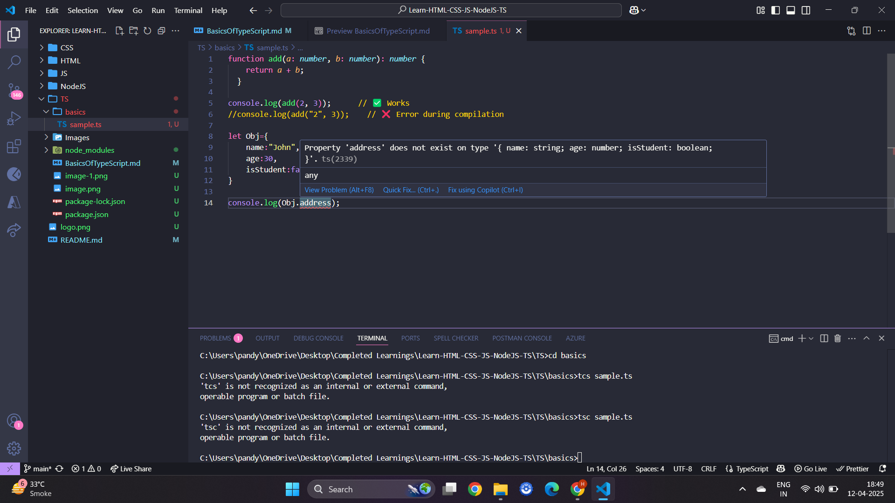
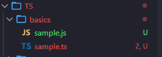
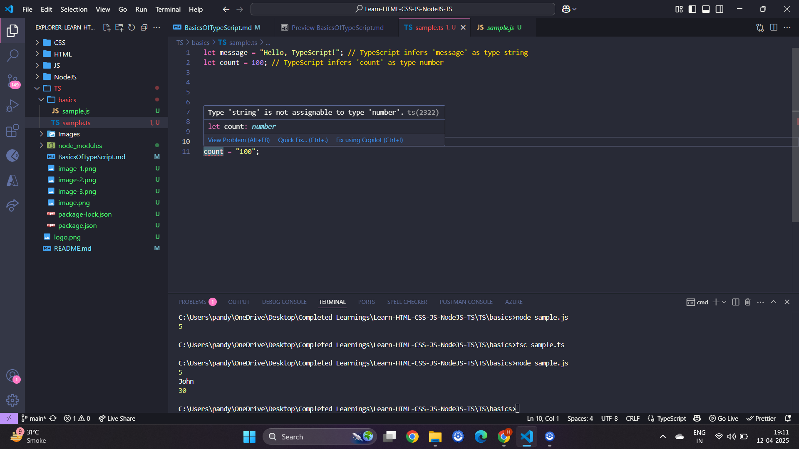
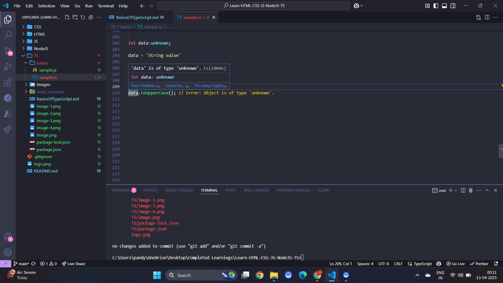

# About TypeScript

- TypeScript is a superset of JavaScript that introduces static typing, meaning you can define the types of variables, function parameters, and return values. This helps catch errors early in the development process, leading to more robust and maintainable code, especially in large projects. 
- It's developed by Microsoft. TypeScript code gets compiled (transpiled) to regular JavaScript, which browsers understand.
- TypeScript files use `.ts` extension.
- TypeScript provides extra capabilities by adding **type** to JavaScript.

<p align="center">
  
</p>


## 🤔 Why TypeScript? What's the Problem with JavaScript?

### JavaScript limitations

#### No Type Safety

- Consider below code

```
function add(a, b) {
  return a + b;
}

console.log(add(2, 3)); // 5
console.log(add("2", 3)); // "23" — unexpected!
```

- JS doesn't stop you from passing wrong data types.

#### No Compile-Time Error Checks

- Consider below code

```
let user = { name: "Alex" };
console.log(user.age(25)); // Runtime error!

Output:
ERROR!
/tmp/SINf75RlXo/main.js:2
console.log(user.age(25)); // Runtime error!
                 ^

TypeError: user.age is not a function
```

#### Difficult to Scale for Large Projects

- Without types, it's harder to refactor and maintain code.

### TypeScript Overcoming JS Limitations

- Type Safety
- Better Autocompletion and IntelliSense
- Compile-time error checking
- Helps with large codebases and team projects
- Consider below example




<br/>

- TypeScript's static typing helps catch type-related errors during development, preventing runtime errors. By explicitly defining types, code becomes easier to understand and maintain, especially in larger projects. 
- TypeScript uses compile time checking which means it checks if the specified type matches or the object consist of required attributes before running the code.



## Run TypeScript File in your System

>[!NOTE]
> - Before installing `TypeScript` ensure you have installed `node.js`

- Run the below command to install TypeScript

```
npm install -g typescript  
```

- Verify the version

```
tsc -v
```

- Let's script a `.ts` file.

```
function add(a: number, b: number): number {
    return a + b;
  }
  
console.log(add(2, 3));      // ✅ Works
//console.log(add("2", 3));    // ❌ Error during compilation , TypeScript will warn: Argument of type 'string' is not assignable to parameter of type 'number'.

let Obj={
    name:"John",
    age:30,
    isStudent:false
}

console.log(Obj.name);      // ✅ Work
console.log(Obj.age);  
```

- Now we need to compile the `.ts` file, this will generate a new javascript file with same name.



- Let's run the `sample.js` using node using `node sample.js` or via browser by creating a HTML file.

```
// sample.js
function add(a, b) {
    return a + b;
}
console.log(add(2, 3)); // ✅ Works
//console.log(add("2", 3));    // ❌ Error during compilation
var Obj = {
    name: "John",
    age: 30,
    isStudent: false
};
console.log(Obj.name); // ✅ Work
console.log(Obj.age);

Output:
5
John
30
```

## Assign Type in TypeScript


- TypeScript offers explicit and implicit ways to assign types to variables. 

### Explicit Type Assignment

- This method involves writing the type explicitly after the variable name, using a colon `:`

```
let variableName: type = value;
```

- Example

```
let firstName: string = "John";
```

### Implicit Type Assignment (Type Inference)

- If a type is not explicitly specified, TypeScript attempts to infer the type based on the assigned value

```
let message = "Hello, TypeScript!"; // TypeScript infers 'message' as type string
let count = 100; // TypeScript infers 'count' as type number
```

- If we try to change the value of variable to a different type. It shows compilation error.



- If TypeScript cannot infer the type, it defaults to `any`, which disables type checking for that variable.

```
let count;  // Type is implicitly any

count = 10;
count = "abc"
console.log(count);

Output:
abc
```

## Types of TypeScript

- In TypeScript, **types** are the building blocks that help you describe what kind of data you're working with.


###  Primitive Types

- These are the basic types just like in JavaScript but with explicit typing.

```

let username: string = "Alice";
let age: number = 25;
let floatValues: number = 1.45;
let isActive: boolean = true;
let greeting: string = `Hello, ${username}! You are ${age} years old.`;
let nothing: null = null;
let notDefined: undefined = undefined;
let justInitialize;

console.log(typeof username); // string
console.log(typeof age); // number
console.log(typeof isActive); // boolean
console.log(typeof greeting); // string
console.log(typeof floatValues); // number
console.log(typeof nothing); // object (this is a quirk in JavaScript)

/*
The output object when using typeof null in JavaScript is a well-known quirk and considered a historical bug. 
In the initial implementation of JavaScript, values were stored with a type tag. 
The value null was represented with all bits set to zero, which, by a flaw in the type-checking logic, 
was interpreted as the object type tag. 
*/
console.log(typeof notDefined); // undefined
console.log(typeof justInitialize); // undefined
```

- `any` skips the type checking. 

```
let anyType: any = "This can be anything";
anyType = 42; // Now it's a number
anyType = true; // Now it's a boolean
anyType = { name: "Alice" }; // Now it's an object
console.log(typeof anyType); // object
if(anyType){
    console.log("anyType is truthy");
}
```

- `null` represents the intentional absence of any object value. It's a value you can explicitly assign to a variable to signify that it currently holds no object reference. In TypeScript, `null` is considered falsy. 
- `undefined` represents the absence of a value, especially when a variable has been declared but not yet assigned a value. It can also be the return value of a function that doesn't explicitly return a value. In TypeScript, `undefined` is considered falsy. 
- `any` it is a type that disables type checking in TypeScript, allowing a variable to hold any value, including primitives, objects, or even other types. It's a way to bypass the static type checking features of TypeScript. `any` is truthy.

>![WARNING]
> - Avoid using using `any` as type, because your code changes will act like normal javascript.

### Array Types

- In TypeScript, array types define the structure of an array, specifying the same type of elements it can hold.
- There are two main ways to declare array types

1. Using square brackets `[]`

```
let arr_numbers: number[] = [1, 2, 3];
let arr_strings: string[] = ["hello", "world"];
let arr_booleans: boolean[] = [true, false, true];

console.log(typeof arr_numbers); // object (arrays are objects in JavaScript)
console.log(arr_numbers.length); // 3
console.log(arr_strings[0]); // "hello"
console.log(arr_booleans[1]); // false
console.log(arr_numbers[1]); // 2
arr_numbers.push(4); // Adding a number to the array
console.log(arr_numbers); // [1, 2, 3, 4]
```

2. Using the `Array<T>` generic type - This approach uses the built-in Array interface with a type parameter T to specify the element type.

```
let numbers: Array<number> = [1, 2, 3];
let strings: Array<string> = ["hello", "world"];
let booleans: Array<boolean> = [true, false, true];
```

*We will learn about interface later*


- One can delete element using following ways.
- `splice()` modifies the original array by removing or replacing elements. It takes the index of the element to be removed and the number of elements to remove as arguments.

```
let arr: number[] = [1, 2, 3, 4, 5];
arr.splice(2, 1); // Removes 1 element at index 2 (value 3)
console.log(arr); // Output: [1, 2, 4, 5]
```

- `filter()` creates a new array containing elements that pass a test implemented by a provided function. It's useful for removing elements based on a condition.

```
    let arr: number[] = [1, 2, 3, 4, 5];
    let newArr = arr.filter(item => item !== 3); // Creates a new array without the value 3
    console.log(newArr); // Output: [1, 2, 4, 5]
    console.log(arr); // Output: [1, 2, 3, 4, 5] (original array unchanged)
```

- `slice()` returns a shallow copy of a portion of an array into a new array object selected from start to end (end not included) where start and end represent the index of items in that array. The original array will not be modified.

```
     let arr: number[] = [1, 2, 3, 4, 5];
     let newArr = arr.slice(0,2).concat(arr.slice(3));
     console.log(newArr) // Output: [1, 2, 4, 5]
```

- `delete` while `delete arr[index]` can remove an element, it leaves a "hole" (undefined value) in the array and does not update the array's length, which is generally not desirable.

```
    let arr: number[] = [1, 2, 3];
    delete arr[1]; // Removes the element at index 1
    console.log(arr); // Output: [1, <1 empty item>, 3]
```

#### Multi-dimensional arrays

- These are arrays of arrays, and their types are defined by nesting array type declarations. It's used to represent data structures with more than one dimension, such as matrices or tables. Each nested array represents a row, and the elements within those arrays represent columns

```
// Declaring a 2D array (matrix) of numbers
let matrix: number[][] = [
  [1, 2, 3],
  [4, 5, 6],
  [7, 8, 9],
];

// Accessing elements in a 2D array
let element = matrix[1][2]; // Accesses the element at row 1, column 2 (value: 6)

// Declaring a 3D array
let cube: number[][][] = [
  [
    [1, 2],
    [3, 4],
  ],
  [
    [5, 6],
    [7, 8],
  ],
];
```

#### Readonly arrays

- In TypeScript, a `readonly` array is an array whose elements cannot be modified after it's created. This means you cannot add, remove, or change elements of the array. It's useful for ensuring data immutability and preventing unintended modifications.

```
const readonly_names: readonly string[] = ["Alice", "Bob"];
// readonly_names[0] = "Charlie"; // Error: Index signature in type 'readonly string[]' only permits reading.


const readonly_numbers: ReadonlyArray<number> = [1, 2, 3];
// readonly_numbers.push(4); // Error: Property 'push' does not exist on type 'readonly number[]'

// Using as const assertion
const data = [10, 20, 30] as const;
data.push(40); // Error: Property 'push' does not exist on type 'readonly [10, 20, 30]'
```

- In TypeScript, a `readonly` array with a `const` assertion ensures that the array's elements and the array itself cannot be modified after initialization. `const` assertion tells the compiler to infer the most specific type possible, including making the array readonly and inferring literal types for its elements.
- When you declare an array with as `const`, TypeScript infers a `tuple` type with `readonly` modifiers for each element. This means you cannot use methods that would modify the array, such as push, pop, or assigning new values to existing indexes.

```
const numbers = [1, 2, 3] as const;
// numbers.push(4); // Error: Property 'push' does not exist on type 'readonly [1, 2, 3]'.
// numbers[0] = 10; // Error: Cannot assign to '0' because it is a read-only property.

// Correct way to use the array
const firstNumber = numbers[0]; // Accessing elements is allowed
```

### Tuple Types

- These define arrays with a fixed number of elements, where each element can have a different type. Tuples are fixed number of elements with known types.

```
let person: [string, number] = ["Alice", 30];
console.log(person[0]); // "Alice"
console.log(person[1]); // 30
person[0] = "Bob"; // Changing the name
person[1] = 35; // Changing the age
console.log(person); // ["Bob", 35]
```

- If we add elements in tuple like below

```
person.push("extra"); // This will won't cause an error
console.log(person); // ["Bob", 35, "extra"]
```

- While it appears possible to use the `.push()` method on a TypeScript tuple, it's generally not recommended due to the nature of tuples. 
- Tuples are designed to have a fixed length and specific types at each index, and using `.push()` can bypass these constraints. If you use the `.push()` method on a tuple, TypeScript won't throw a compile-time error, but it can lead to unexpected behavior and type inconsistencies. 
- The added element won't be type-checked and will effectively make the tuple behave like a regular array.
- To maintain the integrity of tuples, it's better to avoid using `.push()`. If you need to add elements, consider creating a new tuple with the desired elements or using an array if the fixed-length constraint is not necessary.

### `type` Type

- In TypeScript, the type keyword serves to define the shape of data, acting as a way to create aliases for data types. The `type` keyword in TypeScript is used to define a custom name for a type. `type` lets you create a reusable label for a complex or frequently used type.
- Without `type`, you'd have to rewrite long type annotations everywhere. That gets messy.

```
let person_name_age: [string, number] = ["John Doe", 30];
let person_name_age2: [string, number] = ["Jane Doe", 25];
let person_name_age3: [string, number] = ["Alice", 28];
let person_name_age4: [string, number] = ["Bob", 35];
let person_name_age5: [string, number] = ["Charlie", 40];
let person_name_age6: [string, number] = ["Dave", 45];
let person_name_age7: [string, number] = ["Eve", 50];
```

- This is repetitive and hard to maintain.
- Now using `type` we can reuse, maintain clean code and can update easily

```
type personDetails = [string, number];

let person_name_age: personDetails = ["John Doe", 30];
let person_name_age1: personDetails = ["Harsh", 25];
let person_name_age2: personDetails = ["Alice", 28];
let person_name_age3: personDetails = ["Bob", 35];
let person_name_age4: personDetails = ["Charlie", 22];
let person_name_age5: personDetails = ["David", 40];
let person_name_age6: personDetails = ["Eve", 29];
let person_name_age7: personDetails = ["Frank", 33];
```

- We can give alias to primitive types, function, object etc..

```
type UserID = string;
let id: UserID = "abc123";

type Person = {
    name: string;
    age: number;
};

let person: Person = { name: "Jane Doe", age: 25 };

type Point = {
    x: number;
    y: number;
};

let point: Point = { x: 10, y: 20 };

type MathOp = (a: number, b: number) => number;

const add: MathOp = (a, b) => a + b;
```

### Function Type

- In TypeScript, a function type defines the types of parameters a function accepts and the type of value it returns. It ensures that functions are called with the correct arguments and produce the expected output, contributing to type safety.

```
function greet(name: string): string {
    return "Hello " + name;
  }
  
let add: (a: number, b: number) => number = (a, b) => a + b;
  
console.log(greet("Harsh"))
console.log(add(5,6))

Output:
Hello Harsh
11
```

- You can also pass function as a parameter

```
// Define a function type: takes two numbers and returns a number
let add: (a: number, b: number) => number = (x, y) => x + y;
let multiply: (a: number, b: number) => number = (x, y) => x * y;

// This function accepts another function as a parameter
function calculate(
  operation: (a: number, b: number) => number,
  x: number,
  y: number
): number {
  return operation(x, y);
}

// Use it
console.log(calculate(add, 5, 3));      // ➝ 8
console.log(calculate(multiply, 5, 3)); // ➝ 15
```

- You can make it cleaner by defining a `type` for the function or providing alias making it reusable.

```
type BinaryOperation = (a: number, b: number) => number;

let subtract: BinaryOperation = (a, b) => a - b;

function calculate(operation: BinaryOperation, x: number, y: number): number {
  return operation(x, y);
}

console.log(calculate(subtract, 10, 4)); // ➝ 6
```

- You can also pass a function inline or anonymous function (no need to define `add/subtract/multiply` separately).

```
function calculate(operation: (a: number, b: number) => number, x: number, y: number): number {
  return operation(x, y);
}
console.log(
  calculate((a, b) => a / b, 10, 2) // ➝ 5
);
```

- TypeScript also allows you to return a function from a function

```
type returnedFunction = (a: number, b: number) => number; // Define Return Function arguments and return type

function getOperation(type: string): returnedFunction {
    if (type === "add") return (a, b) => a + b;
    return (a, b) => a - b;
  }
  
  const op = getOperation("add");
  console.log(op(7, 2)); // ➝ 9
```

#### Void Type

- In TypeScript, `void` is a keyword that represents the absence of a return value from a function. It's used to indicate that a function does not return any meaningful data. When a function is declared with a `void` return type, it means that the function performs some actions or side effects but doesn't produce a value that needs to be returned to the caller.

```
function greet(name: string): void {
    console.log(`Hello, ${name}!`);
}

greet("World"); // This function doesn't return anything
```

- It's important to note that while a `void` function doesn't explicitly return a value, it might still implicitly return `undefined` in JavaScript. However, TypeScript treats void as distinct from `undefined` in the context of function return types.

```
function logMessage(message: string): void {
  console.log(message);
  // return undefined; // Optional, but redundant
}

function getValue(): undefined {
  return undefined; // Explicitly returns undefined
}

let myVariable: undefined = undefined;
```

- `void` is used to denote that a function does not return any value. It indicates the absence of a return value. However, a function declared as `void` can still technically return a value, but that value will be ignored. Even if you add `return;` or `return undefined;`, it still counts as `void`. You're saying - *I’m not expecting any value when I call this function.*

```
function logMessage(message: string): void {
  console.log(message);
  return;
}

console.log(logMessage("Hi"));

Output:
Hi
undefined
```

- `undefined` — a real value that means "nothing is set". You use it when you expect a variable to possibly have no value.

```
let name: undefined = undefined; // ✅ valid

function getNothing(): undefined {
  return undefined;
}
```

- You are saying - *I will return something, and that something is undefined.*

```
// Function that returns nothing (void)
function logSomething(msg: string): void {
  console.log(msg);
  // return;         // ✅ allowed
  // return undefined; // ✅ also allowed, but not needed
}

// Function that MUST return undefined
function returnNothing(): undefined {
  return undefined;   // ✅ MUST return undefined explicitly
}
```

- Another example of `void` using anonymous function. 

```
let logMessage: (message: string) => void = (msg) => console.log(msg);
```

#### Optional Parameters

- In TypeScript, you can have optional parameters in functions — they let you call a function without passing every single argument. Use a `?` after the parameter name.

```
function greetAll(name: string, age?: number) {
    if (age) {
      console.log(`Hello ${name}, you are ${age} years old.`);
    } else {
      console.log(`Hello ${name}!`);
    }
  }


  greetAll("Alice", 25); // Hello Alice, you are 25 years old.
  greetAll("Bob");       // Hello Bob!
```

- `age` is optional. You can call the function with or without it.
- Behind the Scenes when a parameter is marked optional, TypeScript treats it as

```
age?: number // same as → age: number | undefined
```

- So you can check like this inside the function

```
if (age !== undefined) { ... }
```

- **Optional parameters must come after required ones**

```
function doSomething(a: string, b?: string) {} // ✅ OK
function doSomethingWrong(a?: string, b: string) {} // ❌ Error
```

- You can also give default values (acts like optional too)

```
function greet(name: string, age: number = 18) {
  console.log(`${name} is ${age} years old.`);
}

greet("Tom"); // Tom is 18 years old
```

### Rest Parameters

- Rest parameters allow a function to accept any number of arguments as an array.

```
function sum(...numbers: number[]): number {
  return numbers.reduce((acc, n) => acc + n, 0);
}

console.log(sum(5, 10, 15)); // 30
```

- When you don’t know how many arguments will be passed. When you want to collect multiple values into one variable. If a function will have required, optional, default and rest parameters then
    - ✅ Required parameters come first
    - ✅ Then optional parameters (`?`)
    - ✅ Then default parameters (`=`)
    - ✅ Finally, rest parameters (`...args`) — it must be last.

```
function example(
  id: number,                     // required
  name?: string,                  // optional
  city: string = "Unknown",       // default
  ...hobbies: string[]            // rest
): void {
  console.log("ID:", id);
  console.log("Name:", name);
  console.log("City:", city);
  console.log("Hobbies:", hobbies);
}


example(1);
// Output:
// ID: 1
// Name: undefined
// City: Unknown
// Hobbies: []

example(2, "Alice");
// ID: 2
// Name: Alice
// City: Unknown
// Hobbies: []

example(3, "Bob", "Pune", "Reading", "Gaming");
// ID: 3
// Name: Bob
// City: Pune
// Hobbies: ['Reading', 'Gaming']
```

#### Type Inference

- TypeScript tries to "guess" the return type of a function if you don’t tell it what the return type should be. This is called **type inference** — TypeScript infers the return type based on the `return` statements inside the function.
- Consider below example

```
function add(a: number, b: number) {
  return a + b;
}
```

- TypeScript infers `number`. Here, `a + b` is a `number`. So, TypeScript understands, `add` returns a `number`. So inferred return type is `number`.
- Consider below example

```
function greet(name: string) {
  return `Hello, ${name}!`;
}
```

- Return value is a `string`. So, `greet` is understood to return a `string`. So inferred return type is `string`.
- Consider below example

```
function logMessage(message: string) {
  console.log(message);
}
```

- No `return` statement here. So TypeScript says ➤ *Okay, this function doesn’t return anything useful*. Inferred return type is `void`.
- **`void` is the default return type if the function does not have `return` keyword specified**.
- Consider below example

```
function mixedTypes(flag: boolean) {
  if (flag) {
    return "Hello";
  } else {
    return 123;
  }
}
```

- One return is a `string`. One return is a `number`. So TypeScript makes a union type `string | number`. Inferred return type is `string | number`
- Consider below example

```
function noReturnType() {
  // nothing returned
}
```

- No return and no type. So TypeScript says *I don't know what this is* → gives it the `any` type
- This means it can be anything — ❌ not safe & ⚠️ not good!
- Even though TypeScript is smart, it's a good habit to explicitly add return types, especially for bigger or important functions.

```
function add(a: number, b: number): number {
  return a + b;
}
```


### Object Type

- In TypeScript, object types let you define the shape of an object. Alongside `string`, `number` and `boolean`, it's one of the most commonly used annotations in a TypeScript codebase.

```
let user: { name: string; age: number } = {
  name: "Alice",
  age: 25
};

console.log(user.name); // ✅ "Alice"
```

- You can use object type into function as well

```
type User = {
    name: string;
    isActive: boolean;
};
  
function greetings(user: User): string {
    return `Hello ${user.name}, active: ${user.isActive}`;
}
  
console.log(greetings({ name: "Alice", isActive: true }));

Output:
Hello Alice, active: true
```

### Union Type

- In TypeScript, a union type allows a variable to hold values of multiple types. Essentially, it expresses that a value could be one of several types. 
- Union types are created using the vertical bar (`|`) to separate the types. For example, `string | number` means a variable can hold either a string or a number.
- Consider below example

```
let id: string | number;

id = 123;      // ✅ number
id = "ABC123"; // ✅ string
id = true;     // ❌ Error: boolean not allowed
```

- You can use union with functions, `type`, arrays etc..

```
function printId(id: string | number): void | string {
  console.log("Your ID is:", id);
}

printId(101);       // ✅
printId("A102");    // ✅
printId(true);      // ❌

type Status = "success" | "error" | "loading";

let currentStatus: Status;

currentStatus = "success"; // ✅
currentStatus = "error";   // ✅
currentStatus = "pending"; // ❌ Not part of union


// These arrays can hold elements of different types, specified using a union type.
let mixed: (number | string)[] = [1, "hello", 2, "world"];
```

- You can union:

    - primitive types (`string` | `number`)
    - custom types (`User` | `Admin`)
    - literal values (`yes` | `no`)
    - `null` / `undefined` for optional-like behavior
- Some more examples

```
let userName: string | null;

userName = "Alice"; // ✅
userName = null;    // ✅

// Define custom types
type Admin = {
    name: string;
    role: "admin";
    accessLevel: number;
  };
  
  type Customer = {
    name: string;
    role: "customer";
    loyaltyPoints: number;
  };
  
  // Union type of Admin or Customer
  type AnyUser = Admin | Customer;
  
  // Example function
  function getUserInfo(user: AnyUser) {
    console.log("Name:", user.name);
    
    if (user.role === "admin") {
      console.log("Access Level:", user.accessLevel);
    } else {
      console.log("Loyalty Points:", user.loyaltyPoints);
    }
  }
  
  // ✅ Sample usage
  const adminUser: AnyUser = {
    name: "Alice",
    role: "admin",
    accessLevel: 5
  };
  
  const customerUser: AnyUser = {
    name: "Bob",
    role: "customer",
    loyaltyPoints: 120
  };
  
getUserInfo(adminUser);
getUserInfo(customerUser);
```

- Example of union in multi-dimensional array

```
let multiArr: (string | number)[][] = [
  ["apple", 1],
  ["banana", 2],
  ["cherry", 3]
];
```

- In this example, `multiArr` is a 2D array where each element can be either a string or a number.
- Example of union with tuples

```
let multiArr2: ([string, number] | [boolean, string])[] = [
  ["apple", 1],
  [true, "banana"],
  ["cherry", 3]
];
```

- Here, `multiArr2` is a 1D array where each element is either a tuple of `[string, number]` or `[boolean, string]`.
- **Be careful, when using union types, TypeScript doesn't know which one you're using unless you check.**.

```
function format(value: string | number):void {
  // TypeScript doesn't know if it's string or number
  if (typeof value === "string") {
    console.log(value.toUpperCase()); // ✅ ok
  } else {
    console.log(value.toFixed(2));    // ✅ ok
  }
}
```

### Intersection Types

- In TypeScript, intersection types allow you to combine multiple types into a single type. This resulting type has all the properties of the constituent types.
- It is denoted using the `&` operator.
- Let's see an example

```
type Person = { name: string };
type Employee = { employeeId: number };

type Staff = Person & Employee;

let staffMember: Staff = {
  name: "Alice",
  employeeId: 101
};
```

- An intersection type combines multiple types into one. It means, the final value must satisfy all types joined with `&`.

```
let invalidPerson: Staff = {
  name: "Bob"
  // Missing age ❌
};
```

- More example

```
type Location = { city: string };
type Contact = { phone: string };

type Employee = HasName & HasAge & Location & Contact;

const emp: Employee = {
  name: "John",
  age: 30,
  city: "Mumbai",
  phone: "1234567890"
};
```

- Example of union and intersection

```
// Union (either/or)
type A = { name: string };
type B = { age: number };
type C = A | B;

let val: C = { name: "Alice" };      // ✅ okay
val = { age: 22 };                   // ✅ okay
val = { name: "Bob", age: 22 };      // ✅ okay


// Intersection (both)
type D = A & B;

let val2: D = { name: "Alice", age: 22 }; // ✅ must have both
```

### Literal Type

- In TypeScript, a literal type is a type that represents a specific, fixed value. It allows you to specify that a variable or parameter must have one particular value, instead of a broader type like `string` or `number` or `boolean`
- It basically restrict a variable to exact values.

```
// String literal type
let greeting: "hello" = "hello";
// greeting = "hi"; // Error: Type '"hi"' is not assignable to type '"hello"'

// Numeric literal type
let magicNumber: 42 = 42;
// magicNumber = 43; // Error: Type '43' is not assignable to type '42'

// Boolean literal type
let isEnabled: true = true;
// isEnabled = false; // Error: Type 'false' is not assignable to type 'true'

// Union of literal types
type Status = "success" | "error" | "pending";
let requestStatus: Status = "success";
requestStatus = "error";
// requestStatus = "failed"; // Error: Type '"failed"' is not assignable to type '"success" | "error" | "pending"'

let direction: "left" | "right" | "up" | "down";
direction = "left";    // ✅
direction = "forward"; // ❌ Error
```

- Other example

```
type EmailLocaleIDs = "welcome_email" | "email_heading";
type FooterLocaleIDs = "footer_title" | "footer_sendoff";
 
type AllLocaleIDs = `${EmailLocaleIDs | FooterLocaleIDs}_id`;
          
// type AllLocaleIDs = "welcome_email_id" | "email_heading_id" | "footer_title_id" | "footer_sendoff_id"
```

### `never` type

- A function or expression that never returns or can’t ever happen.
- 🚫 Use when:
    - A function throws an error or

    - A function has an infinite loop

    - A variable can never have a value

- If we don't define anything, the function may return `any` or `void`. So `never` helps TypeScript catch impossible code paths, and ensures your function doesn’t accidentally return something.

```
function error(message: string): never {
    throw new Error(message);
  }

  function infiniteLoop(): never {
    while (true) {}
  }
```

- Functions that always throw an error or enter an infinite loop never produce a return value. In these cases, never is the appropriate return type.
- Now consider below code.

```
type Shape = 'circle' | 'square';

  function getArea(shape: Shape): number {
    switch (shape) {
      case 'circle':
        return Math.PI;
      case 'square':
        return 10;
      default:
        const _exhaustiveCheck: never = shape;
        return _exhaustiveCheck;
    }
  }
```
- In this example, if a new `Shape` type is added (like `rectangle`) and the `switch` statement isn't updated, TypeScript will produce an error because the `_exhaustiveCheck` variable will receive a value that isn't of type `never`. This helps catch potential bugs.
- `never` enhances type safety by allowing TypeScript to enforce constraints on code that should never be reached or functions that should never return.
- It helps catch potential errors and ensures that all possible cases are handled in conditional logic.

### `unknown` type

- The `unknown` type in TypeScript is a type-safe counterpart to the `any` type. It represents any value, just like `any`, but with stricter type checking.
- Let's consider an example of `any`.

```
let data: any;

data = "hello";
data.toUpperCase(); // ✅ Works

data = 123;
data.toUpperCase(); // ❌ Runtime error! Because numbers don’t have toUpperCase
```

- Here, ➡️ TypeScript won’t warn you, but your app will crash at runtime 😱
- Now let's see an example of `unknown`

```
let data: unknown;

data = "hello";

// ❌ Error: Object is of type 'unknown'
// data.toUpperCase();

if (typeof data === "string") {
  // ✅ Safe: TypeScript now knows it's a string
  console.log(data.toUpperCase());
}

data = 123;

if (typeof data === "number") {
  console.log(data + 10); // ✅ Safe
}
```

- **TypeScript forces you to check the type** — which avoids runtime crashes 🔐



- This, can be really helpful suppose you are fetching a data from an API.

```
function fetchData(): unknown {
  // Simulate API response
  return JSON.parse('{ "name": "Alice", "age": 30 }');
}

let result = fetchData();

// ❌ Not allowed: result.name (because it's unknown)

if (typeof result === "object" && result !== null && "name" in result) {
  // ✅ Now we can safely access
  console.log((result as { name: string }).name);
}
```

- If this were `any`, you might write

```
let result: any = fetchData();
console.log(result.name.toUpperCase()); // Might crash if name doesn't exist
```

- `any` = 🤷‍♂️ *Trust me, I know what I’m doing* — no checks
- `unknown` = 🔐 *I don't know what this is yet, let's check before using it*
- TypeScript’s goal = catch bugs before they happen — and `unknown` supports that
- `unknown` provides flexibility without losing type safety. Forces you to check the type first before using it. Perfect for handling user inputs, external data, etc.

### `enum` type

- An `enum` (short for enumeration) is a special type in TypeScript used to define a set of named constants. It helps you write readable and organized code when you have a known list of values.
- Let's see an example

```
enum Direction {
  North,
  East,
  South,
  West
}

let dir: Direction = Direction.North;
console.log(Direction[0]); // Output: North
console.log(dir); // Output: 0 (by default, enums start at 0)
```

- Lets say you wanted to assign api error codes.

```
enum StatusCode {
  Success = 200,
  NotFound = 404,
  ServerError = 500
}

let code = StatusCode.Success;
console.log(code); // 200
```

- You can also use enums in functions

```
enum Role {
  Admin,
  User,
  Guest
}

function checkAccess(role: Role) {
  if (role === Role.Admin) {
    console.log("Full access");
  } else {
    console.log("Limited access");
  }
}

checkAccess(Role.User); // Output: Limited access
```

- Enums group related constants. It improve readability. Avoid repetition. Get autocompletion + type safety.

### Interface type

- An interface in TypeScript is a way to describe the shape of an object — meaning what properties and types it should have.
- It’s like saying - *Any object of this type must have these properties.*
- Let's see an example

```
interface Person {
  name: string;
  age: number;
}

let p: Person = {
  name: "Alice",
  age: 25
};
```

- Here, the `Person` interface. Every `Person` object must have a `name` (string) and an `age` (number).
- You can pass optional parameters as well

```
interface Product {
  name: string;
  price: number;
  discount?: number; // optional
}

let item: Product = {
  name: "Shoes",
  price: 1200
};
```

- You can extend interface as well

```
interface Animal {
  name: string;
}

interface Dog extends Animal {
  breed: string;
}

const myDog: Dog = {
  name: "Max",
  breed: "Labrador"
};
```

https://chatgpt.com/c/67fa61ed-9614-8009-a9f5-1a691d12e8f0

